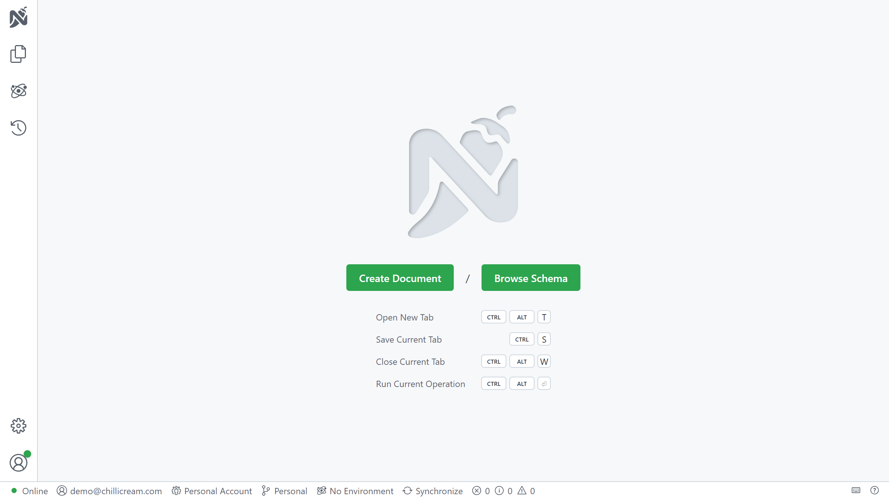

import { InputChoiceTabs } from "../../../components/mdx/input-choice-tabs"

# Setup

## Install the Hot Chocolate templates

Hot Chocolate provides templates to help you get started quickly. Install them with:

```bash
dotnet new install HotChocolate.Templates
```

These templates are kept up to date with the latest .NET and Hot Chocolate features.

## Create a new Hot Chocolate GraphQL server project

Once you have installed the templates, you can use them to bootstrap your next ASP.NET Core project with Hot Chocolate.

<InputChoiceTabs>
<InputChoiceTabs.CLI>

```bash
dotnet new graphql --name GettingStarted
```

This will create a new directory named `GettingStarted` containing your project's files. You can open the directory or the `GettingStarted.csproj` file in your favorite code editor.

</InputChoiceTabs.CLI>
<InputChoiceTabs.VisualStudio>

Create a new project from within Visual Studio using the `GraphQL Server` template.

[Learn how you can create a new project within Visual Studio](https://docs.microsoft.com/visualstudio/ide/create-new-project)

</InputChoiceTabs.VisualStudio>
</InputChoiceTabs>

# Exploring the GraphQL server files

## Types

The `Types` directory in the generated project defines the types that your GraphQL schema should contain. These types and their fields define what consumers can query from your GraphQL server. In other words, this schema defines the shape of your GraphQL API that clients can query.

It already includes two entities called `Book` and `Author`.

```csharp
public record Author(string Name);
```

```csharp
public record Book(string Title, Author Author);
```

The template also includes a `Query` class, which defines the **root type** for read operations in your GraphQL server. In GraphQL, this type is called the **query type**, and every public method or property in this class becomes a **field** that clients can query.

```csharp
[QueryType]
public static partial class Query
{
    public static Book GetBook()
        => new Book("C# in depth.", new Author("Jon Skeet"));
}
```

> Note: The `Query` class is declared as `partial` so that the Hot Chocolate source generator can generate the resolvers at build time, instead of relying on reflection and runtime compilation.

The field in question is named `GetBook`, but the name will be shortened to just `book` in the resulting schema.

The `QueryType` attribute marks a class as an extension of the `query` operation type.

## Program

In the generated `Program.cs` file, the template has already added Hot Chocolate to your `WebApplicationBuilder`.

```csharp
builder.AddGraphQL()
```

AddGraphQL returns an IRequestExecutorBuilder with extension methods for configuring your GraphQL server.

The template also calls AddTypes, a source-generated extension method that automatically registers all GraphQL types in the current assembly. The source generator looks for types that inherit Hot Chocolate base classes or are decorated with attributes such as [QueryType].

> Note: The name of the `AddTypes` method is based on the assembly name by default, but can be set using the `[Module]` assembly attribute, as seen in `ModuleInfo.cs`.

It also calls `app.MapGraphQL()` to expose your GraphQL server at an endpoint with the default path `/graphql`. Hot Chocolate comes with an ASP.NET Core middleware that is used to serve up the GraphQL server.

Finally, the template includes `app.RunWithGraphQLCommands(args)` to start the server.

`RunWithGraphQLCommands(args)` works like `Run()`, but also adds handy developer commands. For example, you can export your schema as SDL with:

<InputChoiceTabs>
<InputChoiceTabs.CLI>

```bash
dotnet run -- schema export
```

</InputChoiceTabs.CLI>
</InputChoiceTabs>

This command will dump a file called `schema.graphqls` into your project folder which represents the GraphQL schema.

And that is it – you have successfully set up a Hot Chocolate GraphQL server! 🚀

# Executing a query

First, run the generated project.

<InputChoiceTabs>
<InputChoiceTabs.CLI>

```bash
dotnet run
```

</InputChoiceTabs.CLI>
<InputChoiceTabs.VisualStudio>

You can start the project by either pressing `Ctrl + F5` or clicking the green `Debug` button in the Visual Studio toolbar.

</InputChoiceTabs.VisualStudio>
</InputChoiceTabs>

If you have set everything up correctly, you should be able to open <a href="http://localhost:5095/graphql" target="_blank" rel="noopener noreferrer">http://localhost:5095/graphql</a> in your browser and be greeted by the GraphQL IDE [Nitro](/products/nitro).



Click Create Document, check that the HTTP Endpoint matches your server URL, then click Apply.


Now you should be seeing an editor like the one pictured below. If your GraphQL server has been correctly set up, you should see `Schema available` at the bottom right of the editor.


The view is split into five panes.

1. `Builder`
    - This is where you build operations with a visual editor.
1. `Request`
    - This is where you enter operations to send to the GraphQL server.
1. `Response`
    - This is where results will be displayed.
1. `GraphQL Variables / HTTP Headers`
    - This is where you edit variables and headers.
1. `Responses`
    - This shows your recent queries.

Paste the following query into the `Request` pane of the editor:

```graphql
{
  book {
    title
    author {
      name
    }
  }
}
```

To execute the query, press the `Run` button. The result should be displayed as JSON in the `Response` pane as shown below:


You can also view and browse the GraphQL schema from within Nitro. Click on the `Schema` tab next to `Operation` in order to browse the schema. There's also a `Schema Definition` tab, pictured below, which shows the schema using the raw SDL (Schema Definition Language).


🎉 Congratulations! You’ve built your first Hot Chocolate GraphQL server and run your first query with the Nitro GraphQL IDE. 🚀

# Additional resources

Now that your GraphQL server is running, here are some next steps:

If this is your first time using GraphQL, it is recommended to read [this guide](https://graphql.org/learn/) that walks you through the basic concepts of GraphQL.

If you want to get an overview of Hot Chocolate's features, read the _Overview_ pages in each section of the documentation. They can be found in the sidebar to your left.

For a guided tutorial that explains how you can set up your GraphQL server beyond this basic example, check out [our workshop](https://github.com/ChilliCream/graphql-workshop). This workshop dives deeper into several topics around Hot Chocolate and GraphQL in general.

You can also jump straight into the documentation and learn more about [Defining a schema](/docs/hotchocolate/v16/defining-a-schema).
