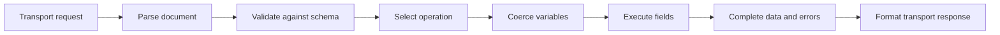
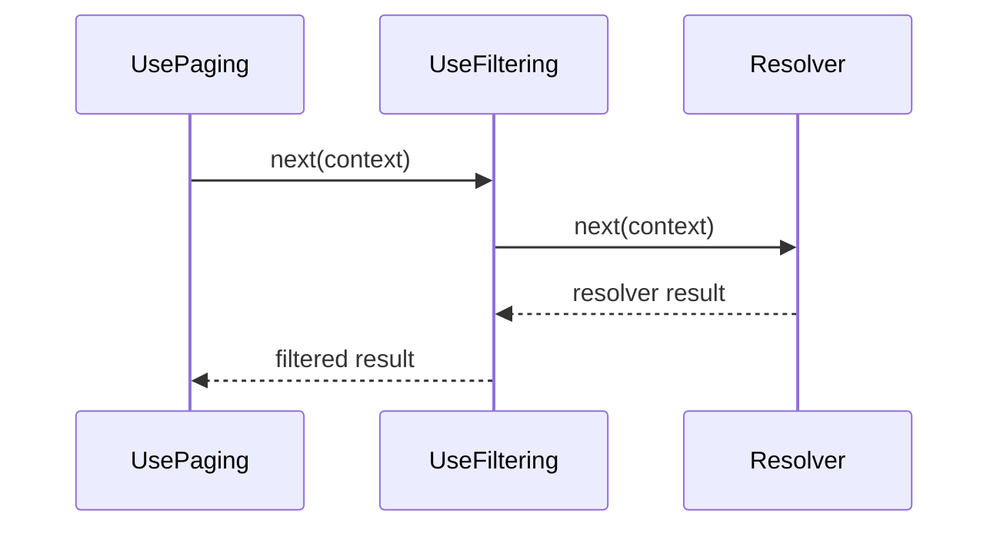

When a client sends a GraphQL request, it expects a result, not an explanation of which server component runs first. But when you debug a Hot Chocolate API, understanding the server-side execution order is essential.

This page provides a mental model for how Hot Chocolate processes a GraphQL request. It complements the [execution engine reference](/docs/hotchocolate/v16/execution-engine/), the [resolver documentation](/docs/hotchocolate/v16/resolvers-and-data/resolvers/), and the [HTTP transport documentation](/docs/hotchocolate/v16/server/http-transport/). Use this guide to identify where an issue belongs before changing schema code, resolver logic, middleware, or client requests.

# What happens when a client sends GraphQL to Hot Chocolate?

Suppose a client requests the current user:

```graphql
query GetMe {
  me {
    name
  }
}
```

Over HTTP, this operation is sent in a transport request. A typical JSON request body looks like:

```json
{
  "query": "query GetMe { me { name } }",
  "variables": {},
  "operationName": "GetMe"
}
```

The `query` field contains the GraphQL document. `variables` and `operationName` specify which operation to run and what runtime input values to use. HTTP headers, the URL, authentication state, and the `Accept` header are part of the transport envelope.

Hot Chocolate receives the request through a transport such as HTTP. The GraphQL execution engine then works to produce a result. For most queries and mutations, this results in a single response. Subscriptions or incrementally delivered operations may produce a stream of results, depending on the operation and transport.

Keep these two layers distinct:

| Layer                 | Examples                                         | Main question                                                      |
|-----------------------|--------------------------------------------------|--------------------------------------------------------------------|
| Transport envelope    | HTTP method, headers, status code, content type, request body | Can the server receive and format the request for this client?      |
| GraphQL execution result | `data`, `errors`, `extensions`                 | What happened when the selected operation ran against the schema?   |

The path from request to response involves these steps:

1. Receive the transport request.
2. Parse the GraphQL document.
3. Validate the document against the schema.
4. Choose the operation.
5. Coerce variables and arguments to GraphQL input types.
6. Execute selected fields by invoking resolvers and field middleware.
7. Complete resolver values into GraphQL result values.
8. Format the result for the selected transport.

# Following the request through the execution pipeline

Work at the request level happens before any field resolvers run. Hot Chocolate uses request middleware for these stages, and some stages may use caches for parsed documents or prepared operations. These caches are optimizations; conceptually, Hot Chocolate must always understand, validate, prepare, and execute the selected operation.



If a failure occurs early in the pipeline, later stages do not run.

| Stage                | What Hot Chocolate knows                        | If this stage fails                                              |
|----------------------|-------------------------------------------------|------------------------------------------------------------------|
| Parse                | Whether the `query` text is valid GraphQL syntax| No operation can be selected, and no resolver runs                |
| Validate             | Whether the document is valid for your schema   | No resolver runs for that invalid document                        |
| Operation selection  | Which operation definition to execute           | Execution cannot start until the operation is known               |
| Variable coercion    | Whether variable values match declared input types | Field execution does not start for invalid variable input      |
| Field execution      | Which selected fields need values               | Resolver, middleware, data access, authorization, and cancellation behavior can affect the result |
| Result completion    | How returned values fit GraphQL output types    | Nullability and errors decide the final `data` shape              |
| Transport formatting | Which response format the client negotiated     | HTTP metadata and streaming format are chosen for the result      |

If the query contains invalid syntax, no resolver runs. The response will include errors describing the request failure. Start debugging at the `errors` entry in the response before inspecting resolver code.

# Parsing the document

The `query` text is parsed into a GraphQL document. The [GraphQL specification](https://spec.graphql.org/October2021/#sec-Language.Document) defines a document as a set of executable definitions (operations and fragments) and, in schema contexts, type-system definitions. In a request, you typically send executable definitions.

A document can include:

- One anonymous operation
- One or more named operations
- Fragment definitions used by those operations

Parsing answers a single question: is the text valid GraphQL syntax?

For example, this document is incomplete because the selection set is not closed:

```graphql
query GetMe {
  me {
    name
```

Hot Chocolate reports a syntax error at this stage. Parsing does not check whether `me` exists in your schema, whether `name` is a valid field, or whether variable values are correct. Those checks come later.

Use this distinction when reading errors:

| Error kind             | Example                                 | Resolver behavior                  |
|------------------------|-----------------------------------------|------------------------------------|
| Syntax error           | Missing `}` or an invalid token         | No resolver runs                   |
| Schema validation error| Selecting `fullName` when only `name` exists | No resolver runs for the invalid document |

# Validating the document against your schema

After parsing, Hot Chocolate validates the document against the schema. The schema defines root operation types, types, fields, arguments, directives, and nullability. Validation checks operations and fragments against this contract.

Validation catches requests that cannot be executed:

- Unknown fields
- Unknown arguments
- Missing required arguments
- Invalid variable usage
- Fragment spreads that do not apply to the selected type
- Selection sets that do not match GraphQL output type rules

Suppose your schema exposes `name`:

```graphql
type User {
  id: ID!
  name: String!
}
```

This client document fails validation:

```graphql
query GetUser {
  user(id: "1") {
    fullName
  }
}
```

Hot Chocolate rejects this document before calling the `user` resolver, because `fullName` is not part of the schema. A clear schema allows validation to protect resolvers from impossible requests. For schema design guidance, see [Schema design principles](/docs/hotchocolate/v16/learn/3-thinking-in-graphql/schema-design-principles/) and [Object types](/docs/hotchocolate/v16/building-a-schema/object-types/).

A validated document is ready for execution, but this does not guarantee resolver logic will succeed. A resolver may throw, report an error, return `null`, encounter a canceled request, or receive an error from a downstream system.

# Choosing the operation and preparing variables

A GraphQL document may contain one or more operations:

```graphql
query GetUser($id: ID!) {
  user(id: $id) {
    name
  }
}

query Search($term: String!) {
  search(term: $term) {
    title
  }
}
```

If the document contains only one operation, the request does not need an `operationName`. If there are multiple operations, the request must specify which one to execute:

```json
{
  "query": "query GetUser($id: ID!) { user(id: $id) { name } } query Search($term: String!) { search(term: $term) { title } }",
  "operationName": "GetUser",
  "variables": {
    "id": "1"
  }
}
```

Variables are coerced to the declared GraphQL input types before resolvers receive them. This follows the [GraphQL variable coercion rules](https://spec.graphql.org/October2021/#sec-Coercing-Variable-Values). Missing required variables, invalid enum values, or incorrect input object shapes will cause execution to fail before any fields are executed.

For example, `$id: ID!` means the variable is required. If the request omits `id` or passes `null`, execution does not start for that operation.

For more on documents, operation names, variables, aliases, fragments, and persisted operation workflows, see [Operations](/docs/hotchocolate/v16/learn/3-thinking-in-graphql/operations/).

# Executing fields by calling resolvers

GraphQL execution follows the selection set of the chosen operation. Each selected field maps to a resolver, or to a default property or member binding that Hot Chocolate can use as a resolver.

```graphql
query GetUser {
  user(id: "1") {
    name
    address {
      city
    }
  }
}
```

Think of execution as walking a tree:

1. The `user` field resolver produces a `User` object, or `null`, or an error.
2. If a `User` object exists, the `name` field resolver reads or computes the user name.
3. The `address` field resolver receives the `User` object as its parent and produces an `Address`.
4. The `city` field resolver receives the `Address` object as its parent.

The client chooses which fields to select, but the schema defines what those fields mean. Fields not selected by the client are not included in the response, and their resolvers are not part of the execution tree for that operation.

Hot Chocolate can resolve independent query fields in parallel where GraphQL semantics allow. Mutation root fields run in the order required by the [GraphQL execution rules](https://spec.graphql.org/October2021/#sec-Executing-Operations). Nested fields depend on the parent value produced by earlier execution.

This model explains two common data behaviors:

- A nested field resolver may run once for each parent object in a list.
- A DataLoader can batch repeated key lookups during execution, reducing the number of calls to the data source.

For details on resolver APIs, parent values, dependency injection, and cancellation tokens, see [Resolvers](/docs/hotchocolate/v16/resolvers-and-data/resolvers/). For batching and N+1 behavior, see [DataLoader](/docs/hotchocolate/v16/resolvers-and-data/dataloader/). When a client disconnects or a request times out, Hot Chocolate signals cancellation through the request cancellation token. Resolvers and DataLoaders that accept a `CancellationToken` should pass it to downstream work.

# Understanding middleware layers

"Middleware" can refer to different layers. Identify the relevant layer before debugging ordering or side effects.

| Layer                        | Runs around         | Use it for                                   | Read next                                                      |
|------------------------------|--------------------|----------------------------------------------|----------------------------------------------------------------|
| ASP.NET Core middleware      | The HTTP request before it reaches the GraphQL endpoint | Routing, authentication, CORS, HTTP concerns | [ASP.NET Core middleware](https://learn.microsoft.com/aspnet/core/fundamentals/middleware/) |
| Hot Chocolate request middleware | GraphQL request stages such as parsing, validation, operation preparation, and execution | Request-level policies, diagnostics, persisted operations, execution customization | [Execution engine](/docs/hotchocolate/v16/execution-engine/) |
| Hot Chocolate field middleware   | Resolver execution for schema fields | Paging, filtering, sorting, authorization, instrumentation, custom field behavior | [Field middleware](/docs/hotchocolate/v16/execution-engine/field-middleware/) |

Field middleware wraps a resolver. It runs in declaration order as the request enters. Result processing flows back through the chain after the resolver or later middleware returns.

```csharp
descriptor
    .Field("products")
    .UsePaging()
    .UseFiltering()
    .Resolve(context =>
    {
        return context.Service<ProductRepository>().GetProducts();
    });
```

The invocation path looks like this:



If behavior appears before any resolver runs, inspect the transport layer or request middleware. If behavior appears around a single field result, inspect field middleware and the resolver for that field.

# Completing results, nulls, and errors into the GraphQL response

A resolver's return value is not the final JSON response. Hot Chocolate completes each resolver result according to the field's GraphQL output type.

Result completion determines:

- Whether a value can be represented by the field type
- How lists and objects are shaped
- Whether `null` is allowed
- Which error path points to a failing field
- Whether a parent value must become `null` because a non-null child could not complete

Consider this response, where `name` is nullable. The response is valid even though it contains both `data` and `errors`:

```json
{
  "data": {
    "user": {
      "name": null
    }
  },
  "errors": [
    {
      "message": "The name service did not respond.",
      "path": ["user", "name"]
    }
  ]
}
```

The `path` indicates which selected field failed. Other fields may still complete.

Nullability controls how far a failure propagates in `data`. If `name` is nullable, the field can become `null` while `user` remains. If `name` is non-null and cannot complete, GraphQL propagates that null to the nearest nullable parent. This is a common reason a parent object becomes `null` after a child field fails.

Treat non-null fields as promises in your schema. If a downstream dependency can be absent or fail independently, model that behavior intentionally. For schema design, see [Nullability](/docs/hotchocolate/v16/learn/3-thinking-in-graphql/nullability/). For response behavior, see [Errors](/docs/hotchocolate/v16/learn/3-thinking-in-graphql/errors/). For the specification rules, see the [GraphQL response format](https://spec.graphql.org/October2021/#sec-Response-Format).

# Formatting the GraphQL result for the selected transport

After execution, the transport formats the GraphQL result for the client. For HTTP, the `Accept` header and operation shape influence the content type and wire format.

Standard queries and mutations usually return a single JSON result. Hot Chocolate's HTTP transport supports `application/graphql-response+json` for GraphQL over HTTP responses. It can also use multipart, Server-Sent Events, or JSON Lines for streaming scenarios such as subscriptions or incremental delivery when negotiated.

```http
HTTP/1.1 200 OK
Content-Type: application/graphql-response+json

{
  "data": {
    "me": {
      "name": "Ada"
    }
  }
}
```

Do not assume HTTP status code and field-level success are equivalent. A GraphQL response may contain execution errors in the `errors` array even if the HTTP transport returned a successful response. A different status code usually means the transport could not process the request as an HTTP GraphQL request, authentication failed at the HTTP layer, or a formatter policy changed the status.

For details on request formats, response formats, content negotiation, streaming formats, and status code customization, see [HTTP Transport](/docs/hotchocolate/v16/server/http-transport/).

# Using the model to debug execution problems

Map the symptom to a stage before changing code.

| Symptom                                 | Where to look first                                              | Useful next page                                                  |
|------------------------------------------|------------------------------------------------------------------|-------------------------------------------------------------------|
| Resolver breakpoint is never hit         | Response `errors`, syntax, validation, operation name, variables, request authorization, request middleware | [Execution engine](/docs/hotchocolate/v16/execution-engine/)      |
| Resolver runs but response is `null`     | Resolver return value, field middleware, non-null propagation, error path | [Nullability](/docs/hotchocolate/v16/learn/3-thinking-in-graphql/nullability/) |
| Response contains `data` and `errors`    | Error path, resolver logs, reported field errors, nullable fields that still completed | [Errors](/docs/hotchocolate/v16/learn/3-thinking-in-graphql/errors/) |
| Response shape differs from expectations | Actual selected fields, aliases, fragments, skipped fields, schema binding | [Operations](/docs/hotchocolate/v16/learn/3-thinking-in-graphql/operations/) |
| Middleware order feels reversed          | Whether it is ASP.NET Core, request middleware, or field middleware, then the layer's ordering rules | [Field middleware](/docs/hotchocolate/v16/execution-engine/field-middleware/) |
| HTTP status or content type is surprising| `Accept` header, response formatter configuration, GraphQL over HTTP format | [HTTP Transport](/docs/hotchocolate/v16/server/http-transport/)   |
| Streaming or multipart appears instead of one JSON object | Subscription or incremental delivery behavior, operation directives, `Accept` header | [Subscriptions and realtime](/docs/hotchocolate/v16/learn/3-thinking-in-graphql/subscriptions-and-realtime/) |
| Changing a resolver does not change the response | Actual operation document, selected field, alias or fragment, field binding, persisted document cache | [Resolvers](/docs/hotchocolate/v16/resolvers-and-data/resolvers/) |

Use this diagnostic process:

1. Inspect the response body. Check `errors`, `path`, `data`, and `extensions`.
2. Confirm the actual document, variables, operation name, and headers sent by the client.
3. Decide whether the symptom occurred before execution, during resolver execution, during result completion, or during transport formatting.
4. Add logging, diagnostics, or breakpoints at the relevant stage, not everywhere.
5. Check field middleware and DataLoader behavior only after confirming a selected field ran.

Nitro can help you see the request and response exactly as the server received and returned them. Use [Nitro operations](/docs/nitro/documents/operations/) to inspect the document, variables, and headers. Use [Nitro response inspection](/docs/nitro/documents/response/) to compare `data`, `errors`, `extensions`, timing, logs, and traces with the stage you are debugging.

For production observation, see [Instrumentation](/docs/hotchocolate/v16/server/instrumentation/) to connect diagnostic events, logs, and OpenTelemetry to the execution stages.

# Where to go next

Choose your next page based on your current task:

- See [Operations](/docs/hotchocolate/v16/learn/3-thinking-in-graphql/operations/) to learn about documents, operation names, variables, fragments, aliases, or persisted operations.
- See [Resolvers](/docs/hotchocolate/v16/resolvers-and-data/resolvers/) to understand field behavior, parent values, dependency injection, async work, or cancellation.
- See [Resolver and data middleware model](/docs/hotchocolate/v16/learn/3-thinking-in-graphql/resolver-and-data-middleware-model/) and [DataLoader](/docs/hotchocolate/v16/resolvers-and-data/dataloader/) for repeated data access in nested selections.
- See [Nullability](/docs/hotchocolate/v16/learn/3-thinking-in-graphql/nullability/) if a parent becomes `null` or a field promise is unclear.
- See [Errors](/docs/hotchocolate/v16/learn/3-thinking-in-graphql/errors/) if a response contains `errors`, partial `data`, or a resolver exception.
- See [Field middleware](/docs/hotchocolate/v16/execution-engine/field-middleware/) for behavior that wraps a specific resolver.
- See [HTTP Transport](/docs/hotchocolate/v16/server/http-transport/) for issues involving HTTP methods, content negotiation, status codes, or streaming formats.
- See [Instrumentation](/docs/hotchocolate/v16/server/instrumentation/) for traces, logs, timings, or resolver-level diagnostics.
- Return to [Thinking in GraphQL](/docs/hotchocolate/v16/learn/3-thinking-in-graphql/) if your question is about design decisions rather than execution symptoms.
