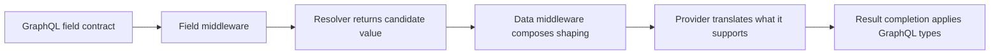
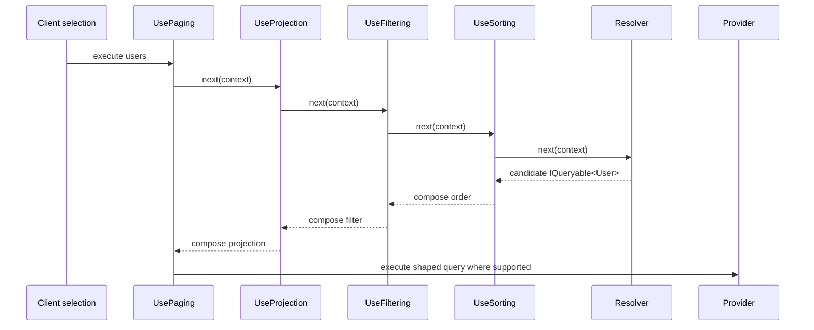
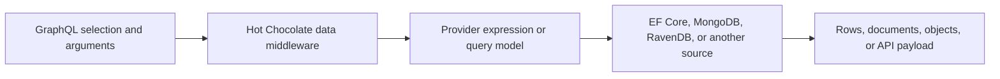

Once you have defined what a field represents, the next step is to determine how Hot Chocolate should execute it.

This page traces a single data field as it moves through resolver execution, field middleware, provider translation, DataLoader batching, and result completion. Refer to this guide when designing fields that require paging, projection, filtering, sorting, authorization, batching, or precise database handling.

For in-depth details on specific features, see the reference pages for [Resolvers](/docs/hotchocolate/v16/resolvers-and-data/resolvers/), [Pagination](/docs/hotchocolate/v16/resolvers-and-data/pagination/), [Projections](/docs/hotchocolate/v16/resolvers-and-data/projections/), [Filtering](/docs/hotchocolate/v16/resolvers-and-data/filtering/), [Sorting](/docs/hotchocolate/v16/resolvers-and-data/sorting/), and [DataLoader](/docs/hotchocolate/v16/resolvers-and-data/dataloader/). This page provides the conceptual model that ties those features together and helps you predict their behavior.

# Start with the field contract, then design the data path

Imagine your schema defines a `users` field:

```graphql
query FindUsers {
  users(
    first: 10
    where: { name: { contains: "ada" } }
    order: [{ name: ASC }]
  ) {
    nodes {
      id
      name
    }
  }
}
```

Before implementing data access, clarify the contract for this field:

| Contract part | Example | Owned by |
| --- | --- | --- |
| Field name | `users` | Schema design |
| Return type and nullability | `UsersConnection`, `[User!]!`, `User` fields | Schema design and result completion |
| Server-owned rules | Current tenant, active-only records, ownership | Resolver, application service, authorization |
| Client-controlled shaping | `first`, `after`, `where`, `order`, selected fields | Data middleware |
| Runtime data source | EF Core, MongoDB, REST, in-memory collection | Resolver and provider |

The resolver initiates the data path for the field. Data middleware can layer on standardized, client-driven operations around the resolver’s result. The provider determines how much of this composed work is translated into a native database or source query.



# Let the resolver produce the candidate value

A resolver is responsible for producing the value of a single schema field. In Hot Chocolate, this value can come from a property, a method, an explicit resolver delegate, or a source-generated resolver method.

For fields that return lists, the resolver typically yields a candidate set, not the final response list:

```csharp
// Types/UserQueries.cs
[QueryType]
public static partial class UserQueries
{
    public static IQueryable<User> GetUsers(CatalogContext db)
        => db.Users.Where(u => u.IsActive);
}
```

Here, the resolver enforces application-specific rules. Inactive users are excluded from the candidate set. If you add filtering or sorting middleware, clients can further shape the active users, but the rule about active-only users remains server-owned.

Resolvers may use:

- GraphQL arguments
- Services from dependency injection
- Parent values for child fields
- Scoped or global state when needed
- `CancellationToken` to halt downstream work if the request is aborted

Keep resolvers focused. Accept GraphQL input, invoke application or data-access logic, and map the result to the schema’s shape. Do not use the resolver context as a scratchpad for sibling fields. Sibling fields may execute independently, so one should not depend on another having run first. For more on execution order, see [How GraphQL executes](/docs/hotchocolate/v16/learn/3-thinking-in-graphql/how-graphql-executes/).

Batch resolvers are a variant that resolve the same field for a group of sibling parent objects in one call. Use batch resolvers for fields that naturally group together. For repeated key-based loads that benefit from batching and caching, use [DataLoader](/docs/hotchocolate/v16/resolvers-and-data/dataloader/).

# Return a shape that middleware can build on

The return type of your resolver is a key implementation choice for a data field.

| Resolver return shape | Good fit | What to expect |
| --- | --- | --- |
| `IQueryable<T>` from EF Core or another LINQ provider | Provider-backed paging, projection, filtering, and sorting | Middleware can compose expression trees before data is loaded. Provider support still determines what is translated. |
| `IEnumerable<T>` or `List<T>` | Small or already loaded data | Middleware can operate functionally, but shaping may occur in memory. |
| `QueryContext<T>` | v16 projection, filtering, and sorting through a unified return type | Use this instead of projection middleware on the same field. Do not combine with `[UseProjection]`. |
| `Connection<T>` | External APIs or custom cursor logic | Resolver manages page slicing, cursors, and page info. |
| DataLoader result | Repeated key lookup | DataLoader batches and caches by key within the request. |
| Batch resolver result | Same child field across sibling parents | One resolver call receives the group of parent values. |

`IQueryable<T>` marks a capability boundary, not a performance guarantee. It enables middleware to compose operations before enumeration, but does not ensure the provider can translate every .NET method, custom computed field, or expression.

This resolver keeps provider-backed composition intact:

```csharp
public static IQueryable<User> GetUsers(CatalogContext db)
    => db.Users.Where(u => u.IsActive);
```

This resolver materializes data before middleware can compose against the provider:

```csharp
public static async Task<List<User>> GetUsersAsync(
    CatalogContext db,
    CancellationToken ct)
    => await db.Users.Where(u => u.IsActive).ToListAsync(ct);
```

Both approaches yield valid GraphQL responses. However, the second form may shift filtering, sorting, paging, or projection into memory, since the provider query has already executed.

# Use data middleware for standard client-driven shaping

Data middleware modifies both the schema and runtime behavior of a field.

| Middleware | Client question | Schema effect | Runtime effect |
| --- | --- | --- | --- |
| Paging | "Which page do I need?" | Adds pagination arguments and returns a connection or segment shape as configured | Slices the result and builds cursors or page metadata |
| Projection | "Which fields did I select?" | Uses the selection set from the GraphQL operation | Reduces fetched fields when supported by the provider and field shape |
| Filtering | "Which items match this predicate?" | Adds a `where` argument | Composes a filter operation |
| Sorting | "What order should the list use?" | Adds an `order` argument | Composes one or more ordering operations |

When all four are applied, a typical v16 implementation-first field looks like this:

```csharp
// Types/UserQueries.cs
[QueryType]
public static partial class UserQueries
{
    [UsePaging]
    [UseProjection]
    [UseFiltering]
    [UseSorting]
    public static IQueryable<User> GetUsers(CatalogContext db)
        => db.Users.Where(u => u.IsActive);
}
```

Be sure to register the data middleware you use:

```csharp
// Program.cs
builder
    .AddGraphQL()
    .AddTypes()
    .AddProjections()
    .AddFiltering()
    .AddSorting();
```

The generated schema will expose the arguments and shapes owned by middleware. For example, a paged field may expose a connection type:

```graphql
type Query {
  users(
    first: Int
    after: String
    last: Int
    before: String
    where: UserFilterInput
    order: [UserSortInput!]
  ): UsersConnection
}
```

Do not rely on data middleware to enforce domain rules, tenant scoping, ownership checks, or authorization. Middleware provides controlled shaping for clients, but security and business logic remain server responsibilities. Use [Authorization](/docs/hotchocolate/v16/securing-your-api/authorization/) for access rules, and keep shared invariants in application or domain services that other entry points can reuse.

# Understand the field as a middleware chain

Field middleware wraps the execution of a schema field’s resolver. This is distinct from ASP.NET Core middleware and from Hot Chocolate request middleware.



When data middleware owns arguments like `first`, `after`, `where`, or `order`, the resolver does not need to handle them. If the resolver and middleware both implement the same concern, you end up with two owners for one behavior, which can make the schema harder to reason about and may cause duplicate or conflicting work.

Field middleware operates around the result of a single field. After the resolver and middleware finish, result completion applies the field’s GraphQL type, nullability, list shape, and error handling. For more on these topics, see [Nullability](/docs/hotchocolate/v16/learn/3-thinking-in-graphql/nullability/) and [Errors](/docs/hotchocolate/v16/learn/3-thinking-in-graphql/errors/).

# Apply data middleware in the correct order

When combining data middleware in v16, always apply it in this sequence:

```text
UsePaging > UseProjection > UseFiltering > UseSorting
```

If you use attributes, list them in this order:

```csharp
[UsePaging]
[UseProjection]
[UseFiltering]
[UseSorting]
public static IQueryable<User> GetUsers(CatalogContext db)
    => db.Users;
```

If you use descriptor configuration, call the middleware in this order:

```csharp
descriptor
    .Field("users")
    .UsePaging()
    .UseProjection()
    .UseFiltering()
    .UseSorting()
    .Resolve(context =>
    {
        var db = context.Service<CatalogContext>();
        return db.Users;
    });
```

This order ensures each middleware receives the data shape it expects:

- Projection needs the selected fields and a projectable data shape
- Filtering and sorting must compose before data is materialized
- Paging works with the shaped set and produces the configured page shape
- Stable pagination typically requires deterministic ordering, especially when data may change between page requests

Avoid combining mutually exclusive patterns. In v16, `QueryContext<T>` is an alternative to projection middleware for fields that need projection, filtering, and sorting through that return type. If an analyzer warns about a conflict between `QueryContext<T>` and `[UseProjection]`, select one pattern for the field. For more, see [Projections](/docs/hotchocolate/v16/resolvers-and-data/projections/).

# Know what the provider translates

Hot Chocolate data middleware can compose operations, but the underlying provider only translates what it supports.



For an EF Core-backed `IQueryable<User>`, filtering and sorting may become SQL `WHERE` and `ORDER BY` clauses. Projection can reduce selected columns or joined relationships if the provider and projected members support it. Paging may be translated into provider-level slicing.

A valid GraphQL operation may still include work that the provider cannot translate. Common reasons include:

- Unsupported .NET methods in a filter or sort expression
- Custom computed fields that run through a resolver
- A resolver that materializes data before middleware can compose
- Provider-specific limits for nested collections, projections, or cursor behavior
- Missing model shape requirements for projection, such as public setters required by the projection provider

Selecting child fields can optimize fetching, but should not alter the business meaning of the parent field. For example, if `users` means active users in the current tenant, that meaning should not change based on which child fields the client selects.

Provider logs are the definitive source for what is actually translated. Nitro can display the GraphQL operation, schema, response, timing, and errors. EF Core SQL logs, MongoDB command logs, or other data-source logs reveal what the provider sent.

# Keep domain rules and client shaping separate

Before adding arguments or middleware, consider where each piece of logic belongs.

| Requirement | Put it here | Why |
| --- | --- | --- |
| Only active users should ever be visible | Resolver base query or data-access service, plus authorization where appropriate | This is server-owned behavior |
| Current user can see only their tenant | Authorization, resolver base query, or application service | Clients must not bypass this by changing filters |
| Invariant must also hold in REST endpoints and jobs | Application or domain service behind the resolver | The GraphQL layer should not be the only owner |
| Client can search by name | Filtering middleware | This is controlled client shaping |
| Client needs a first page and next cursor | Paging middleware | This is standard pagination behavior |
| Client chooses name ascending or created date descending | Sorting middleware | This is standard ordering behavior |
| Selected fields should reduce database columns | Projection middleware or `QueryContext<T>` | This is selection-driven provider optimization |
| Nested field causes repeated key lookups | DataLoader | It batches and caches by key across the request |
| Same computed child field runs for many sibling parents | Batch resolver | One grouped field invocation can handle the sibling set |
| External API already returns cursor pages | Manual `Connection<T>` or provider-specific pattern | The external source owns its paging model |

Query resolvers should not have side effects. Use top-level mutation fields for ordered side effects. The GraphQL specification requires serial execution for top-level mutation fields, while query field execution may be concurrent. For more, see [Operations](/docs/hotchocolate/v16/learn/3-thinking-in-graphql/operations/) and the [GraphQL execution rules](https://spec.graphql.org/October2021/#sec-Executing-Operations) when execution order is important.

# Predict behavior from common field shapes

Refer to this table during field design or code review.

| Field shape | Good fit for data middleware? | What clients see | What may translate | Watch for |
| --- | --- | --- | --- | --- |
| Plain scalar or object field | Usually no | The field value selected by the client | Resolver-specific data access | Nullability, errors, authorization |
| `IQueryable<T>` list with paging, projection, filtering, and sorting | Yes | Pagination, `where`, `order`, and selected fields | Provider-backed filtering, sorting, projection, and slicing | Provider limits, middleware order, stable ordering |
| Already materialized collection | Sometimes | Same schema arguments if middleware is applied | Often in-memory shaping | Large memory use, late filtering, late sorting |
| Field with custom child resolvers | Mixed | Child fields selected by the client | Parent projection may not include custom resolver work | Missing data needed by child resolvers, use `[IsProjected]` where appropriate |
| Batch resolver | No for the batch behavior itself | Same field result, resolved for many parents | Whatever grouped data access performs | Results must match the parent keys and shape required by the batch API |
| DataLoader-backed field | No for the lookup itself | Same field result | Batched key lookup in the loader | Missing cancellation, per-request cache assumptions |
| External service or manual connection | Usually manual | Connection or custom field shape | External API-specific behavior | Duplicate paging logic, cursor semantics, remote limits |

# Debug data middleware surprises

Begin with the generated schema and the specific operation. Then work inward, checking the resolver return type, middleware order, provider translation, and batching.

| Symptom | Inspect first | Likely cause | Fix direction |
| --- | --- | --- | --- |
| Field does not show `first`, `after`, `where`, or `order` | Nitro Schema Reference or SDL | Middleware not registered, not applied to the field, or schema explorer is stale | Verify registration, field configuration, rebuild, restart, and refresh |
| Resolver breakpoint runs but filtering or sorting appears ignored | Resolver return type | Resolver materialized data or returned an in-memory collection | Preserve a provider-backed shape where appropriate |
| Filtering, sorting, or projection fails at runtime | Provider logs and response `errors` | Provider cannot translate part of the composed operation | Simplify the expression or use provider-specific guidance |
| Pagination repeats or skips items | Sort order and cursors | Unstable ordering, changing data, cursor from another field, or provider limitation | Add deterministic ordering and use cursors from the same field response |
| Projection does not include a custom-resolved field | Projection docs and selected fields | Custom resolver runs outside the provider projection | Move computation to a projectable member or resolve it separately |
| Batch resolver receives a group you did not expect | Selected operation and parent list | Execution grouped the field by the current sibling set | Verify the selected parents and do not assume a business workflow |
| Analyzer warns about middleware order or `QueryContext<T>` | Field attributes or descriptor calls | Unsupported order or conflicting patterns | Reorder middleware or choose one projection pattern |
| Response contains `data` and `errors` | Error path and nullability | Resolver, middleware, or provider reported an execution error | Use the path to find the selected field and review field nullability |

Follow this diagnostic process:

1. Inspect the generated field in [Nitro Schema Reference](/docs/nitro/documents/schema-reference/) or [Schema Definition](/docs/nitro/documents/schema-definition/).
2. Confirm middleware is registered and applied to the intended field.
3. Check the resolver return shape.
4. Check middleware order.
5. Run a focused operation in [Nitro Operations](/docs/nitro/documents/operations/).
6. Inspect the [Nitro response](/docs/nitro/documents/response/) for `data`, `errors`, duration, and history.
7. Review provider translation logs.
8. Inspect DataLoader behavior, batch resolver inputs, or [operation monitoring](/docs/nitro/open-telemetry/operation-monitoring/) if telemetry is enabled.

# Next steps

Choose your next page based on your current implementation task:

- Add or bind a field resolver: [Resolvers](/docs/hotchocolate/v16/resolvers-and-data/resolvers/)
- Fetch from a database: [Fetching from Databases](/docs/hotchocolate/v16/resolvers-and-data/fetching-from-databases/)
- Fetch from REST or another external API: [Fetching from REST](/docs/hotchocolate/v16/resolvers-and-data/fetching-from-rest/)
- Page a collection: [Pagination](/docs/hotchocolate/v16/resolvers-and-data/pagination/)
- Let clients filter: [Filtering](/docs/hotchocolate/v16/resolvers-and-data/filtering/)
- Let clients sort: [Sorting](/docs/hotchocolate/v16/resolvers-and-data/sorting/)
- Project selected fields: [Projections](/docs/hotchocolate/v16/resolvers-and-data/projections/)
- Fix N+1 data loading: [DataLoader](/docs/hotchocolate/v16/resolvers-and-data/dataloader/)
- Consider performance trade-offs: [Performance mental model](/docs/hotchocolate/v16/learn/3-thinking-in-graphql/performance-mental-model/)
- Review response nulls and errors: [Nullability](/docs/hotchocolate/v16/learn/3-thinking-in-graphql/nullability/) and [Errors](/docs/hotchocolate/v16/learn/3-thinking-in-graphql/errors/)
