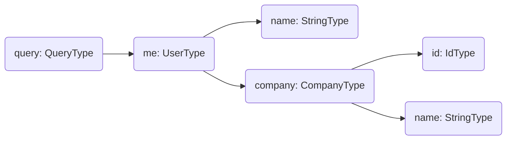

Every field in a GraphQL schema is backed by a resolver function that produces the field's value. Understanding how resolvers compose into a tree is the key mental model for building efficient GraphQL APIs with Hot Chocolate.

# The Resolver Tree

When Hot Chocolate receives a query, it builds a resolver tree that mirrors the shape of the request. Consider this query:

```graphql
query {
  me {
    name
    company {
      id
      name
    }
  }
}
```

This produces the following resolver tree:



The execution engine traverses this tree starting from root resolvers. A child resolver can only execute after its parent has produced a value. Sibling resolvers at the same level run in parallel. Because of this parallel execution, resolvers (except top-level mutation fields) must be free of side effects.

Execution completes when every resolver in the tree has produced a result.

# Resolvers

Resolvers are the building blocks of data fetching. A resolver can call a database, a REST API, a gRPC service, or any other data source. In Hot Chocolate v16, the source generator is the primary way to define resolvers. You write plain C# methods and the generator wires them into the schema.

[Learn more about resolvers](/docs/hotchocolate/v16/resolvers-and-data/resolvers)

# DataLoader

DataLoaders deduplicate and batch requests to data sources. When multiple resolvers request the same entity in a single request, a DataLoader ensures only one call goes to the backing store. DataLoaders can significantly reduce the load on your databases and services.

[Learn more about DataLoaders](/docs/hotchocolate/v16/resolvers-and-data/dataloader)

# Pagination

Hot Chocolate provides cursor-based connection pagination out of the box. Connections follow the [Relay Cursor Connections Specification](https://relay.dev/graphql/connections.htm), giving clients a standardized way to page through large datasets. When backed by `IQueryable`, pagination translates directly to native database queries.

[Learn more about pagination](/docs/hotchocolate/v16/resolvers-and-data/pagination)

# Filtering

When you return a list of entities, clients often need to filter them by operations like `equals`, `contains`, or `startsWith`. Hot Chocolate generates the necessary filter input types from your .NET models and translates applied filters into native database queries.

[Learn more about filtering](/docs/hotchocolate/v16/resolvers-and-data/filtering)

# Sorting

Hot Chocolate generates sort input types from your .NET models, allowing clients to specify which fields to sort by and in which direction. Like filtering, sort operations translate to native database queries when backed by `IQueryable`.

[Learn more about sorting](/docs/hotchocolate/v16/resolvers-and-data/sorting)

# Projections

Projections optimize database queries by selecting only the columns that match the fields requested in the GraphQL query. If a client requests `name` and `id`, Hot Chocolate queries only those columns from the database.

[Learn more about projections](/docs/hotchocolate/v16/resolvers-and-data/projections)

# Data Sources

Hot Chocolate is not bound to a specific database or architecture. You can fetch data from any source in your resolvers. We provide specific guidance for the most common patterns:

- [Fetching from databases](/docs/hotchocolate/v16/resolvers-and-data/fetching-from-databases)
- [Fetching from REST APIs](/docs/hotchocolate/v16/resolvers-and-data/fetching-from-rest)

# Troubleshooting

## Resolver returns null unexpectedly

Verify that your resolver returns the correct type. If it returns `Task<T>`, ensure you `await` the result. Check that any injected services are registered in the DI container.

## N+1 query problem

If you see one database query per item in a list, you are likely missing a DataLoader. Use a [DataLoader](/docs/hotchocolate/v16/resolvers-and-data/dataloader) to batch and deduplicate requests.

# Next Steps

- **New to resolvers?** Start with [Resolvers](/docs/hotchocolate/v16/resolvers-and-data/resolvers).
- **Need to batch data access?** See [DataLoader](/docs/hotchocolate/v16/resolvers-and-data/dataloader).
- **Need to page through lists?** See [Pagination](/docs/hotchocolate/v16/resolvers-and-data/pagination).
- **Need to filter or sort?** See [Filtering](/docs/hotchocolate/v16/resolvers-and-data/filtering) and [Sorting](/docs/hotchocolate/v16/resolvers-and-data/sorting).
