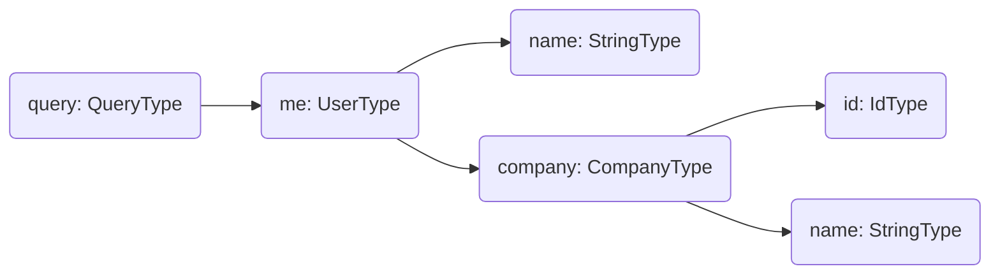

Every field in a GraphQL schema is backed by a resolver function that produces the field's value. Understanding how resolvers compose into a tree is the key mental model for building efficient GraphQL APIs with Hot Chocolate.

# The Resolver Tree

When Hot Chocolate receives a query, it builds a resolver tree that mirrors the shape of the request. Consider this query:

```graphql
query {
  me {
    name
    company {
      id
      name
    }
  }
}
```

This produces the following resolver tree:



The execution engine traverses this tree starting from root resolvers. A child resolver can only execute after its parent has produced a value. Sibling resolvers at the same level run in parallel. Because of this parallel execution, resolvers (except top-level mutation fields) must be free of side effects.

Execution completes when every resolver in the tree has produced a result.

# What's in This Section

- [Resolvers](/docs/hotchocolate/v16/resolvers/resolvers) covers how to define resolvers, handle arguments, access parent values, and work with async operations.
- [Dependency Injection](/docs/hotchocolate/v16/resolvers/dependency-injection) explains how services are injected into resolvers, scoping behavior, keyed services, and switching the service provider.
- [Errors](/docs/hotchocolate/v16/resolvers/errors) covers how exceptions become GraphQL errors, error filters for mapping domain exceptions, and throwing `GraphQLException` for explicit errors.
- [Field Middleware](/docs/hotchocolate/v16/resolvers/field-middleware) shows how to build reusable middleware that runs before or after resolvers, including ordering, class-based middleware, and attribute-based middleware.
