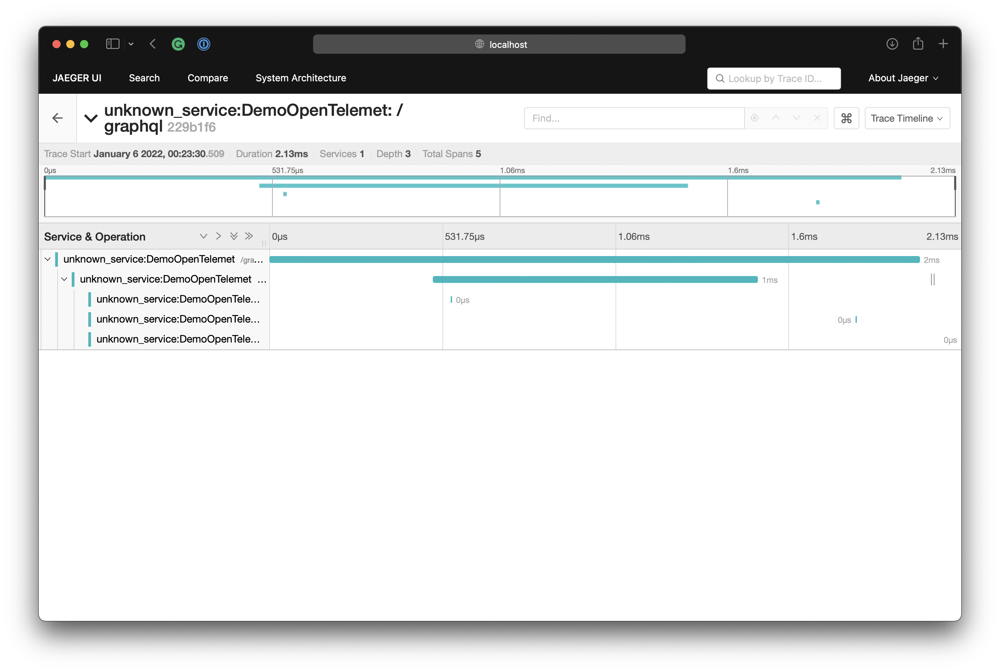
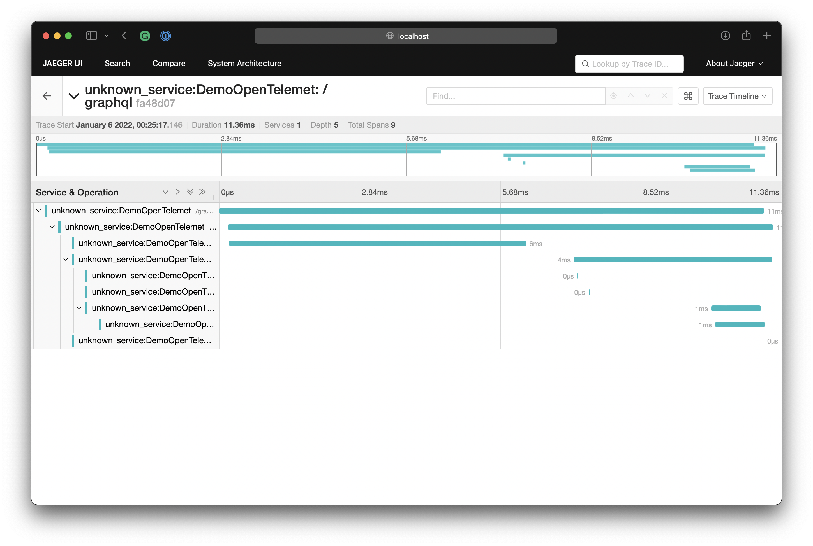
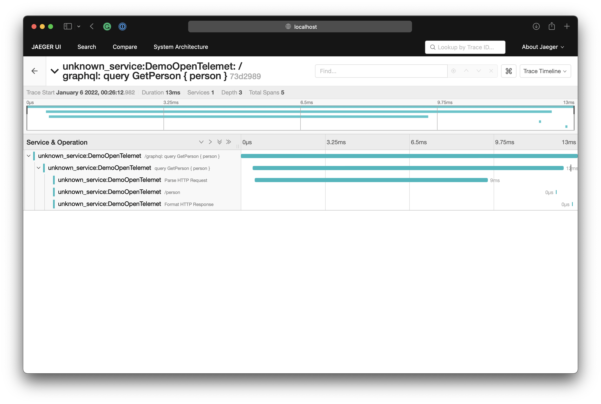
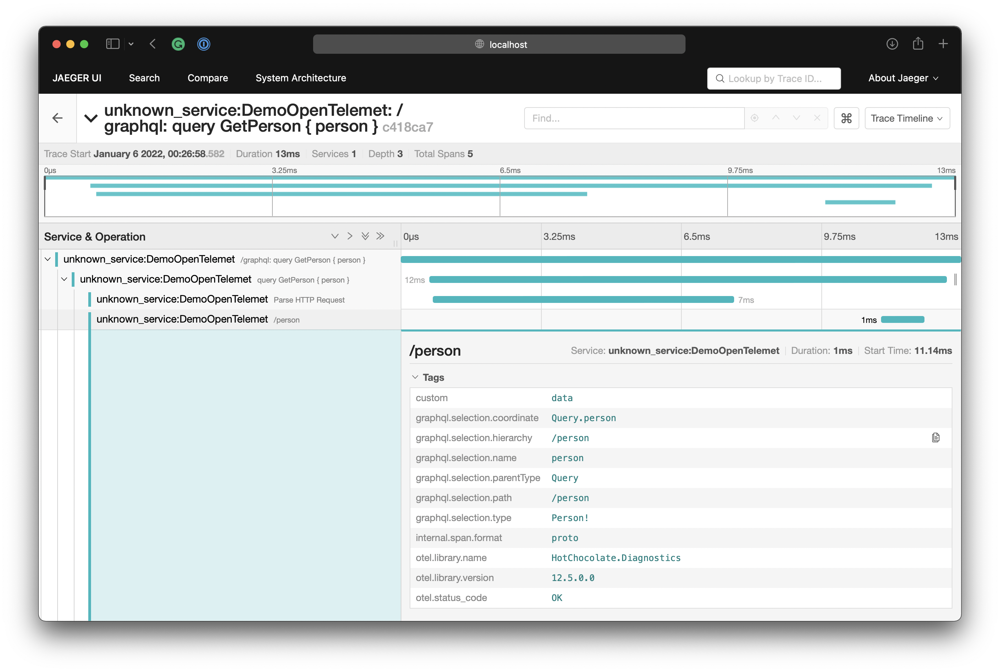

Hot Chocolate lets you create diagnostic event listeners that tap into internal instrumentation events. You can use any logging or tracing infrastructure you prefer. Hot Chocolate also ships with a built-in OpenTelemetry integration aligned with the [proposed GraphQL semantic conventions](https://github.com/graphql/otel-wg/blob/main/spec).

# Diagnostic Events

You can implement diagnostic event listeners for the following event types:

- [Server events](#server-events)
- [Execution events](#execution-events)
- [DataLoader events](#dataloader-events)

After creating a diagnostic event listener, register it by calling `AddDiagnosticEventListener` on the `IRequestExecutorBuilder`:

```csharp
builder.Services
    .AddGraphQLServer()
    .AddDiagnosticEventListener<MyExecutionEventListener>();
```

If you need to access services within your event handlers, inject them through the constructor. Injected services are effectively singletons because the diagnostic event listener is instantiated once.

```csharp
public class MyExecutionEventListener : ExecutionDiagnosticEventListener
{
    private readonly ILogger<MyExecutionEventListener> _logger;

    public MyExecutionEventListener(ILogger<MyExecutionEventListener> logger)
        => _logger = logger;

    public override void RequestError(RequestContext context,
        Exception exception)
    {
        _logger.LogError(exception, "A request error occurred!");
    }
}
```

> Warning: Diagnostic event handlers execute synchronously as part of the GraphQL request. Long-running operations inside a handler negatively impact query performance. Enqueue expensive work from within the handler and process it in a background service.

## Scopes

Most diagnostic event handlers return `void`, but some return an `IDisposable`. These handlers enclose a specific operation as a scope. The scope is created at the start of the operation and disposed at the end.

Create a class implementing `IDisposable` to define a scope:

```csharp
public class MyExecutionEventListener : ExecutionDiagnosticEventListener
{
    private readonly ILogger<MyExecutionEventListener> _logger;

    public MyExecutionEventListener(ILogger<MyExecutionEventListener> logger)
        => _logger = logger;

    // Invoked at the start of the ExecuteRequest operation
    public override IDisposable ExecuteRequest(RequestContext context)
    {
        var start = DateTime.UtcNow;

        return new RequestScope(start, _logger);
    }
}

public class RequestScope : IDisposable
{
    private readonly ILogger _logger;
    private readonly DateTime _start;

    public RequestScope(DateTime start, ILogger logger)
    {
        _start = start;
        _logger = logger;
    }

    // Invoked at the end of the ExecuteRequest operation
    public void Dispose()
    {
        var end = DateTime.UtcNow;
        var elapsed = end - _start;

        _logger.LogInformation("Request finished after {Ticks} ticks",
            elapsed.Ticks);
    }
}
```

If you do not need to track a span for a specific event, return an `EmptyScope`. This reduces the performance impact of triggering the event.

```csharp
public override IDisposable ExecuteRequest(RequestContext context)
{
    _logger.LogInformation("Request execution started!");

    return EmptyScope;
}
```

## Server Events

Instrument server events of the Hot Chocolate transport layer by creating a class that inherits from `ServerDiagnosticEventListener`:

```csharp
public class MyServerEventListener : ServerDiagnosticEventListener
{
    public override IDisposable ExecuteHttpRequest(RequestContext context)
    {
        // Omitted code for brevity
    }
}
```

| Method name                | Description                                                                                                  |
| -------------------------- | ------------------------------------------------------------------------------------------------------------ |
| ExecuteHttpRequest         | Called when starting to execute a GraphQL over HTTP request in the transport layer.                          |
| StartSingleRequest         | Called within the ExecuteHttpRequest scope, signals that a single GraphQL request will be executed.          |
| StartBatchRequest          | Called within the ExecuteHttpRequest scope, signals that a GraphQL batch request will be executed.           |
| StartOperationBatchRequest | Called within the ExecuteHttpRequest scope, signals that an operation batch request will be executed.        |
| HttpRequestError           | Called within the ExecuteHttpRequest scope, signals an error while processing the GraphQL over HTTP request. |
| ParseHttpRequest           | Called when starting to parse a GraphQL HTTP request.                                                        |
| ParserErrors               | Called within the ParseHttpRequest scope, signals an error while parsing the GraphQL request.                |
| FormatHttpResponse         | Called when starting to format a GraphQL query result.                                                       |
| WebSocketSession           | Called when starting to establish a GraphQL WebSocket session.                                               |
| WebSocketSessionError      | Called within the WebSocketSession scope, signals an error that terminated the session.                      |

## Execution Events

Hook into execution events of the Hot Chocolate execution engine by creating a class that inherits from `ExecutionDiagnosticEventListener`:

```csharp
public class MyExecutionEventListener : ExecutionDiagnosticEventListener
{
    public override IDisposable ExecuteRequest(RequestContext context)
    {
        // Omitted code for brevity
    }
}
```

The following methods can be overridden:

| Method name                         | Description                                                                                                                          |
| ----------------------------------- | ------------------------------------------------------------------------------------------------------------------------------------ |
| ExecuteRequest                      | Scope that encloses the entire GraphQL request execution. Also the first diagnostic event raised during a request.                   |
| RequestError                        | Called if the GraphQL request produced an error. Called immediately before the scope of `ExecuteRequest` is disposed.                |
| ExecuteSubscription                 | Scope that encloses the execution of a subscription query. Created when a client subscribes and disposed when the subscription ends. |
| ParseDocument                       | Scope that encloses the parsing of a document.                                                                                       |
| SyntaxError                         | Called if a document could not be parsed due to a syntax error.                                                                      |
| ValidateDocument                    | Scope that encloses the validation of a document.                                                                                    |
| ValidationErrors                    | Called if errors occurred during document validation.                                                                                |
| AnalyzeOperationComplexity          | Called when starting to analyze operation complexity.                                                                                |
| OperationComplexityAnalyzerCompiled | Called within AnalyzeOperationComplexity scope when an analyzer is compiled.                                                         |
| OperationComplexityResult           | Called within AnalyzeOperationComplexity scope, reports the outcome of the analyzer.                                                 |
| CoerceVariables                     | Called when starting to coerce variables for a request.                                                                              |
| CompileOperation                    | Called when starting to compile the GraphQL operation from the syntax tree.                                                          |
| ExecuteOperation                    | Called when starting to execute the GraphQL operation and its resolvers.                                                             |
| StartProcessing                     | Scope that encloses the scheduling of work, such as invoking a DataLoader or starting execution tasks.                               |
| StopProcessing                      | Called if the execution engine has to wait for resolvers to complete or whenever execution has completed.                            |
| RunTask                             | Scope that encloses the execution of an execution task. A `ResolverExecutionTask` uses the `ResolveFieldValue` event instead.        |
| TaskError                           | Called if an execution task produced an error.                                                                                       |
| ResolveFieldValue                   | Scope that encloses the execution of a specific field resolver. (\*)                                                                 |
| ResolverError                       | Called if a specific field resolver produces an error.                                                                               |
| OnSubscriptionEvent                 | Scope that encloses the computation of a subscription result once the event stream yields a new payload.                             |
| SubscriptionEventError              | Called if the computation of the subscription result produced an error.                                                              |
| AddedDocumentToCache                | Called once a document has been added to `DocumentCache`.                                                                            |
| RetrievedDocumentFromCache          | Called once a document has been retrieved from the `DocumentCache`.                                                                  |
| AddedOperationToCache               | Called once an operation has been added to the `OperationCache`.                                                                     |
| RetrievedOperationFromCache         | Called once an operation has been retrieved from the `OperationCache`.                                                               |
| RetrievedDocumentFromStorage        | Called once a document has been retrieved from an operation document storage.                                                        |
| ExecutorCreated                     | Called once a request executor has been created. Executors are created once per schema during the first request.                     |
| ExecutorEvicted                     | Called once a request executor is evicted, which can happen if the schema or executor configuration changes.                         |

(\*): The `ResolveFieldValue` event is not invoked by default because it would add too much overhead for each resolver in a query. Override the `EnableResolveFieldValue` property to enable it:

```csharp
public class MyExecutionEventListener : ExecutionDiagnosticEventListener
{
    public override bool EnableResolveFieldValue => true;

    public override IDisposable ResolveFieldValue(IMiddlewareContext context)
    {
        // Omitted code for brevity
    }
}
```

## DataLoader Events

Hook into DataLoader events by creating a class that inherits from `DataLoaderDiagnosticEventListener`:

```csharp
public class MyDataLoaderEventListener : DataLoaderDiagnosticEventListener
{
    public override IDisposable ExecuteBatch<TKey>(IDataLoader dataLoader,
        IReadOnlyList<TKey> keys)
    {
        // Omitted code for brevity
    }
}
```

The following methods can be overridden:

| Method name           | Description                                                                                              |
| --------------------- | -------------------------------------------------------------------------------------------------------- |
| ExecuteBatch          | Scope that encloses a batch operation, resolving a specific set of keys.                                 |
| BatchResults          | Called once a batch operation has completed and all items for a specific set of keys have been resolved. |
| BatchError            | Called if a batch operation has failed.                                                                  |
| BatchItemError        | Called for a specific item that contained an error within a batch operation.                             |
| ResolvedTaskFromCache | Called once a task to resolve an item by its key has been added or retrieved from the `TaskCache`.       |

# OpenTelemetry

OpenTelemetry is an open-source, vendor-neutral standard for collecting telemetry data. Sponsored by the Cloud Native Computing Foundation (CNCF), it replaces OpenTracing and OpenCensus.

Hot Chocolate provides an OpenTelemetry integration that aligns with the [proposed GraphQL semantic conventions](https://github.com/graphql/otel-wg/blob/main/spec).

<Video videoId="nCLSfJMihsg" />

## Setup

Add the `HotChocolate.Diagnostics` package to your project:

<PackageInstallation packageName="HotChocolate.Diagnostics" />

Add `AddInstrumentation` to your GraphQL configuration:

```csharp
builder.Services
    .AddGraphQLServer()
    .AddQueryType<Query>()
    .AddInstrumentation();
```

Next, add OpenTelemetry to your project. In this example, you will use it with an OTLP exporter:

```bash
dotnet add package OpenTelemetry.Extensions.Hosting
dotnet add package OpenTelemetry.Instrumentation.AspNetCore
dotnet add package OpenTelemetry.Instrumentation.Http
dotnet add package OpenTelemetry.Exporter.OpenTelemetryProtocol
```

Add the OpenTelemetry setup code to your `Program.cs`:

```csharp
builder.Logging.AddOpenTelemetry(
    b =>
    {
        b.IncludeFormattedMessage = true;
        b.IncludeScopes = true;
        b.ParseStateValues = true;
        b.SetResourceBuilder(ResourceBuilder.CreateDefault().AddService("Demo"));
    });

builder.Services
    .AddOpenTelemetry()
    .WithTracing(
      b =>
      {
          b.AddHttpClientInstrumentation();
          b.AddAspNetCoreInstrumentation();
          b.AddHotChocolateInstrumentation();
          b.AddOtlpExporter();
      });
```

`AddHotChocolateInstrumentation` registers the Hot Chocolate instrumentation events with OpenTelemetry.

Your complete `Program.cs` should look like this:

```csharp
using OpenTelemetry.Resources;
using OpenTelemetry.Trace;

var builder = WebApplication.CreateBuilder(args);

builder.Services
    .AddGraphQLServer()
    .AddQueryType<Query>()
    .AddInstrumentation();

builder.Logging.AddOpenTelemetry(
    b => b.SetResourceBuilder(ResourceBuilder.CreateDefault().AddService("Demo")));

builder.Services
    .AddOpenTelemetry()
    .WithTracing(
      b =>
      {
          b.AddHttpClientInstrumentation();
          b.AddAspNetCoreInstrumentation();
          b.AddHotChocolateInstrumentation();
          b.AddOtlpExporter();
      });

var app = builder.Build();
app.MapGraphQL();
app.Run();
```

When running GraphQL requests, you can inspect in your tracing backend how each request performed and examine the various parts of the execution telemetry.



## Span Attributes

Hot Chocolate emits span attributes that follow the [proposed OpenTelemetry semantic conventions for GraphQL](https://github.com/graphql/otel-wg/blob/main/spec). The root GraphQL span name contains the operation type (`query`, `mutation`, or `subscription`) to keep cardinality low. The operation name is available as the `graphql.operation.name` span attribute.

Key attributes emitted on the root span:

| Attribute                | Description                                                               |
| ------------------------ | ------------------------------------------------------------------------- |
| `graphql.operation.type` | The operation type: `query`, `mutation`, or `subscription`.               |
| `graphql.operation.name` | The operation name, if provided.                                          |
| `graphql.document`       | The GraphQL document string.                                              |
| `graphql.document.hash`  | The document hash, formatted as `<algorithm>:<hash>` (e.g. `md5:<hash>`). |
| `graphql.document.id`    | The document ID. Only set if the document is a trusted document.          |

Additional attributes on field-level spans (when enabled):

| Attribute                             | Description                          |
| ------------------------------------- | ------------------------------------ |
| `graphql.selection.field.name`        | The name of the resolved field.      |
| `graphql.selection.field.parent_type` | The parent type declaring the field. |

DataLoader spans:

| Attribute                       | Description                  |
| ------------------------------- | ---------------------------- |
| `graphql.dataloader.batch.size` | Number of keys in the batch. |
| `graphql.dataloader.batch.keys` | The keys in the batch.       |

## Options

By default, Hot Chocolate does not instrument all execution events. You can increase the level of detail by enabling more instrumentation scopes:

```csharp
builder.Services
    .AddGraphQLServer()
    .AddQueryType<Query>()
    .AddInstrumentation(o =>
    {
        o.Scopes = ActivityScopes.All;
    });
```

> Warning: Adding more instrumentation scopes is not free and adds performance overhead.



You can also include the operation details in the root activity:

```csharp
builder.Services
    .AddGraphQLServer()
    .AddQueryType<Query>()
    .AddInstrumentation(o =>
    {
        o.RequestDetails = RequestDetails.OperationName | RequestDetails.Document;
    });
```



## Enriching Activities

You can inherit from `ActivityEnricher` and override enrich methods to add custom data or remove default data from activities.

In v16, the `ActivityEnricher` constructor no longer requires an `ObjectPool<StringBuilder>`:

```csharp
public class CustomActivityEnricher : ActivityEnricher
{
    public CustomActivityEnricher(InstrumentationOptions options)
        : base(options)
    {
    }

    public override void EnrichResolveFieldValue(
        IMiddlewareContext context, Activity activity)
    {
        base.EnrichResolveFieldValue(context, activity);

        activity.SetTag("custom", "data");
    }
}
```

Register the custom activity enricher as a singleton and make it available to the schema services using `AddApplicationService`:

```csharp
builder.Services.AddSingleton<ActivityEnricher, CustomActivityEnricher>();

builder.Services
    .AddGraphQLServer()
    .AddApplicationService<ActivityEnricher>();
```

The following enricher methods are available:

| Method                                                                    | Description                                     |
| ------------------------------------------------------------------------- | ----------------------------------------------- |
| `EnrichExecuteRequest(RequestContext, Activity)`                          | Enrich the root request execution span.         |
| `EnrichParserErrors(HttpContext, IReadOnlyList<IError>, Activity)`        | Enrich when parser errors occur.                |
| `EnrichRequestError(RequestContext, Exception, Activity)`                 | Enrich when a request error occurs (exception). |
| `EnrichRequestError(RequestContext, IError, Activity)`                    | Enrich when a request error occurs (IError).    |
| `EnrichValidationErrors(RequestContext, IReadOnlyList<IError>, Activity)` | Enrich when validation errors occur.            |
| `EnrichAnalyzeOperationCost(RequestContext, Activity)`                    | Enrich the operation cost analysis span.        |
| `EnrichParseDocument(RequestContext, Activity)`                           | Enrich the document parsing span.               |
| `EnrichValidateDocument(RequestContext, Activity)`                        | Enrich the document validation span.            |
| `EnrichResolveFieldValue(IMiddlewareContext, Activity)`                   | Enrich an individual field resolver span.       |
| `EnrichResolverError(IMiddlewareContext, IError, Activity)`               | Enrich when a field resolver error occurs.      |
| `EnrichExecuteBatch<TKey>(IDataLoader, IReadOnlyList<TKey>, Activity)`    | Enrich a DataLoader batch span.                 |

> Note: Overriding enricher methods without calling `base` no longer prevents the standard span attributes from being emitted. The semantic convention attributes are applied by the instrumentation itself. Custom enrichers only add extra information.



# Next Steps

- [HTTP Transport](/docs/hotchocolate/v16/server/http-transport) for details on streaming transports and response formatting.
- [Warmup](/docs/hotchocolate/v16/server/warmup) for pre-populating caches at startup.
- [Migrate from v15 to v16](/docs/hotchocolate/v16/migrating/migrate-from-15-to-16) for the full list of renamed and removed instrumentation attributes.
