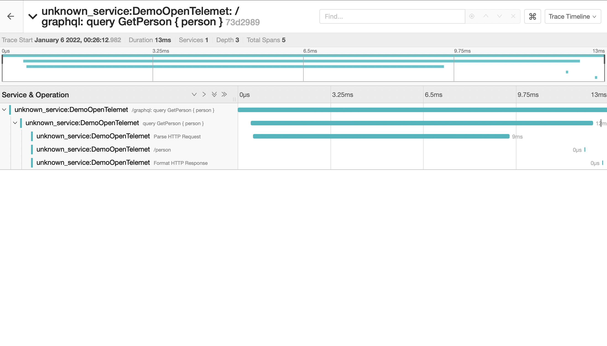
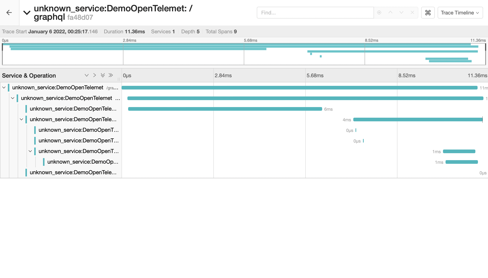
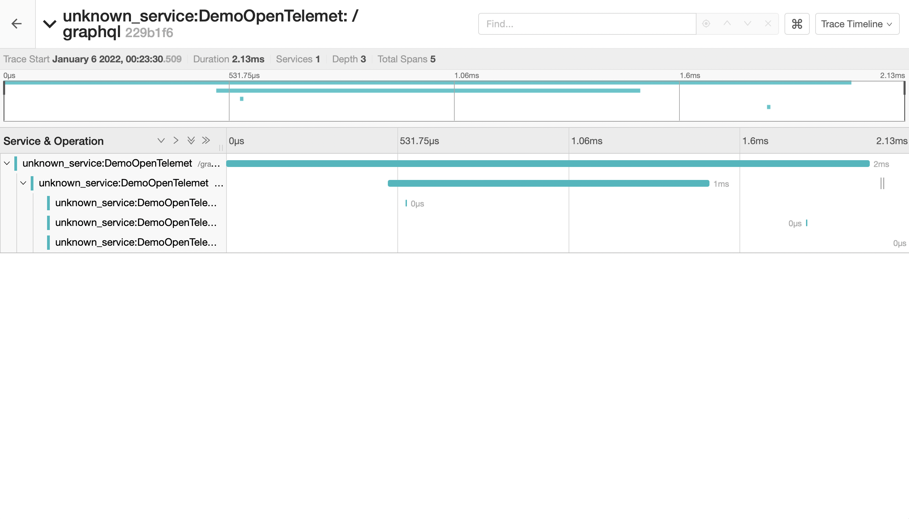
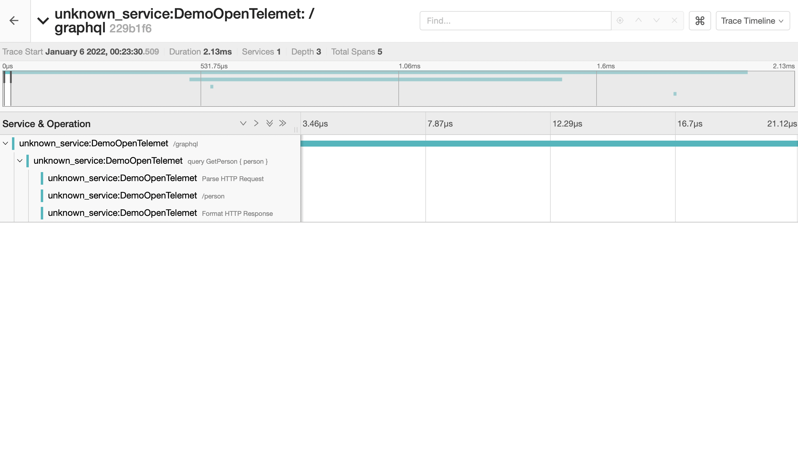

Hot Chocolate allows us to create custom diagnostic event listeners, tapping into internal instrumentation events and further processing them. This abstraction allows us to use the logging or tracing infrastructure that we want to use. Further, we provide a default implementation for open telemetry.

# Diagnostic events

Currently, we can implement diagnostic event listeners for the following event types:

- [Server events](#server-events)
- [Execution events](#execution-events)
- [DataLoader events](#dataloader-events)

We will learn more about creating diagnostic event listeners for these event types in their respective sections.

After creating a diagnostic event listener for any event type, we can register it by calling `AddDiagnosticEventListener` on the `IRequestExecutorBuilder`, specifying the newly developed diagnostic event listener as the generic type parameter.

```csharp
builder.Services
    .AddGraphQLServer()
    .AddDiagnosticEventListener<MyExecutionEventListener>();
```

If we need to access services within our event handlers, we can inject them using the constructor. Please note that injected services are effectively singleton since the diagnostic event listener is instantiated once.

```csharp
public class MyExecutionEventListener : ExecutionDiagnosticEventListener
{
    private readonly ILogger<MyExecutionEventListener> _logger;

    public MyExecutionEventListener(ILogger<MyExecutionEventListener> logger)
        => _logger = logger;

    public override void RequestError(IRequestContext context,
        Exception exception)
    {
        _logger.LogError(exception, "A request error occurred!");
    }
}
```

> Warning: Diagnostic event handlers are executed synchronously as part of the GraphQL request. Long-running operations inside a diagnostic event handler will negatively impact the query performance. Expensive operations should only be enqueued from within the handler and processed by a background service.

## Scopes

Most diagnostic event handlers have a return type of `void`, but some return an `IDisposable`. These event handlers enclose a specific operation, sort of like a scope. This scope is instantiated at the start of the operation and disposed of at the end of the operation.

We can simply create a class implementing `IDisposable` to create a scope.

```csharp
public class MyExecutionEventListener : ExecutionDiagnosticEventListener
{
    private readonly ILogger<MyExecutionEventListener> _logger;

    public MyExecutionEventListener(ILogger<MyExecutionEventListener> logger)
        => _logger = logger;

    // this is invoked at the start of the `ExecuteRequest` operation
    public override IDisposable ExecuteRequest(IRequestContext context)
    {
        var start = DateTime.UtcNow;

        return new RequestScope(start, _logger);
    }
}

public class RequestScope : IDisposable
{
    private readonly ILogger _logger;
    private readonly DateTime _start;

    public RequestScope(DateTime start, ILogger logger)
    {
        _start = start;
        _logger = logger;
    }

    // this is invoked at the end of the `ExecuteRequest` operation
    public void Dispose()
    {
        var end = DateTime.UtcNow;
        var elapsed = end - _start;

        _logger.LogInformation("Request finished after {Ticks} ticks",
            elapsed.Ticks);
    }
}
```

If we are not interested in the scope of a specific diagnostic event handler, we can return an `EmptyScope`. Returning an empty scope where we do not need to track a span will reduce the performance impact of triggering your event.

```csharp
public override IDisposable ExecuteRequest(IRequestContext context)
{
    _logger.LogInformation("Request execution started!");

    return EmptyScope;
}
```

## Server Events

We can instrument server events of the Hot Chocolate transport layer by creating a class inheriting from `ServerDiagnosticEventListener`.

```csharp
public class MyServerEventListener : ServerDiagnosticEventListener
{
    public override IDisposable ExecuteHttpRequest(IRequestContext context)
    {
        // Omitted code for brevity
    }
}
```

| Method name                | Description                                                                                                                  |
| -------------------------- | ---------------------------------------------------------------------------------------------------------------------------- |
| ExecuteHttpRequest         | Called when starting to execute a GraphQL over HTTP request in the transport layer.                                          |
| StartSingleRequest         | Called within the ExecuteHttpRequest scope and signals that a single GraphQL request will be executed.                       |
| StartBatchRequest          | Called within the ExecuteHttpRequest scope and signals that a GraphQL batch request will be executed.                        |
| StartOperationBatchRequest | Called within the ExecuteHttpRequest scope and signals that a GraphQL batch request will be executed.                        |
| HttpRequestError           | Called within the ExecuteHttpRequest scope and signals that a error occurred while processing the GraphQL over HTTP request. |
| ParseHttpRequest           | Called when starting to parse a GraphQL HTTP request.                                                                        |
| ParserErrors               | Called within the ParseHttpRequest scope and signals that a error occurred while parsing the GraphQL request.                |
| FormatHttpResponse         | Called when starting to format a GraphQL query result.                                                                       |
| WebSocketSession           | Called when starting to establish a GraphQL WebSocket session.                                                               |
| WebSocketSessionError      | Called within the WebSocketSession scope and signals that a error occurred that terminated the session.                      |

## Execution Events

We can hook into execution events of the Hot Chocolate execution engine by creating a class inheriting from `ExecutionDiagnosticEventListener`.

```csharp
public class MyExecutionEventListener : ExecutionDiagnosticEventListener
{
    public override IDisposable ExecuteRequest(IRequestContext context)
    {
        // Omitted code for brevity
    }
}
```

The following methods can be overridden.

| Method name                         | Description                                                                                                                                    |
| ----------------------------------- | ---------------------------------------------------------------------------------------------------------------------------------------------- |
| ExecuteRequest                      | Scope that encloses the entire GraphQL request execution. Also the first diagnostic event raised during a GraphQL request.                     |
| RequestError                        | Called if the GraphQL request produced an error. Called immediately before the scope of `ExecuteRequest` is disposed.                          |
| ExecuteSubscription                 | Scope that encloses the execution of a subscription query. Scope is created once a client subscribes and disposed once the subscription ends.  |
| ParseDocument                       | Scope that encloses the parsing of a document.                                                                                                 |
| SyntaxError                         | Called if a document could not be parsed due to a syntax error.                                                                                |
| ValidateDocument                    | Scope that encloses the validation of a document.                                                                                              |
| ValidationErrors                    | Called if errors occurred during the validation of the document.                                                                               |
| AnalyzeOperationComplexity          | Called when starting to analyze the operation complexity.                                                                                      |
| OperationComplexityAnalyzerCompiled | Called within AnalyzeOperationComplexity scope and reports that an analyzer was compiled.                                                      |
| OperationComplexityResult           | Called within AnalyzeOperationComplexity scope and reports the outcome of the analyzer.                                                        |
| CoerceVariables                     | Called when starting to coerce variables for a request.                                                                                        |
| CompileOperation                    | Called when starting to compile the GraphQL operation from the syntax tree.                                                                    |
| ExecuteOperation                    | Called when starting to execute the GraphQL operation and its resolvers.                                                                       |
| ExecuteStream                       | Called within the execute operation scope if the result is a streamed result.                                                                  |
| ExecuteDeferredTask                 | Called when starting to execute a deferred part an operation within the ExecuteStream scope or within the ExecuteSubscription scope.           |
| StartProcessing                     | Scope that encloses the scheduling of some work, e.g. invoking a DataLoader or starting execution tasks.                                       |
| StopProcessing                      | Called if the execution engine has to wait for resolvers to complete or whenever the execution has completed.                                  |
| RunTask                             | Scope that encloses the execution of an execution task. A `ResolverExecutionTask` uses the `ResolveFieldValue` event instead.                  |
| TaskError                           | Called if an execution task produced an error.                                                                                                 |
| ResolveFieldValue                   | Scope that encloses the execution of a specific field resolver. (\*)                                                                           |
| ResolverError                       | Called if a specific field resolver produces an error.                                                                                         |
| OnSubscriptionEvent                 | Scope that encloses the computation of a subscription result, once the event stream has yielded a new payload.                                 |
| SubscriptionEventResult             | Called once the subscription result has been successfully computed.                                                                            |
| SubscriptionEventError              | Called if the computation of the subscription result produced an error.                                                                        |
| SubscriptionTransportError          | Called if a subscription result could not be delivered to a client due to a transport issue.                                                   |
| AddedDocumentToCache                | Called once a document has been added to `DocumentCache`.                                                                                      |
| RetrievedDocumentFromCache          | Called once a document has been retrieved from the `DocumentCache`.                                                                            |
| AddedOperationToCache               | Called once an operation has been added to the `OperationCache`.                                                                               |
| RetrievedOperationFromCache         | Called once an operation has been retrieved from the `OperationCache`.                                                                         |
| RetrievedDocumentFromStorage        | Called once a document has been retrieved from an operation document storage.                                                                  |
| ExecutorCreated                     | Called once a request executor has been created. Executors are created once for a schema (includes stitched schemas) during the first request. |
| ExecutorEvicted                     | Called once a request executor is evicted. This can happen if the schema or the configuration of the executor changes.                         |

(\*): The `ResolveFieldValue` event is not invoked per default, as it would be too much overhead to execute the event for each resolver used within a query. We have to override the `EnableResolveFieldValue` property for the execution engine to invoke the event handler.

```csharp
public class MyExecutionEventListener : ExecutionDiagnosticEventListener
{
    public override bool EnableResolveFieldValue => true;

    public override IDisposable ResolveFieldValue(IMiddlewareContext context)
    {
        // Omitted code for brevity
    }
}
```

## DataLoader Events

We can hook into DataLoader events by creating a class inheriting from `DataLoaderDiagnosticEventListener`.

```csharp
public class MyDataLoaderEventListener : DataLoaderDiagnosticEventListener
{
    public override IDisposable ExecuteBatch<TKey>(IDataLoader dataLoader,
        IReadOnlyList<TKey> keys)
    {
        // Omitted code for brevity
    }
}
```

The following methods can be overridden.

| Method name           | Description                                                                                                     |
| --------------------- | --------------------------------------------------------------------------------------------------------------- |
| ExecuteBatch          | Scope that encloses a batch operation, i.e. the resolution of a specific set of keys.                           |
| BatchResults          | Called once a batch operation has been completed, i.e. all items for a specific set of keys have been resolved. |
| BatchError            | Called if a batch operation has failed.                                                                         |
| BatchItemError        | Called for a specific item that contained an error within a batch operation.                                    |
| ResolvedTaskFromCache | Called once a task to resolve an item by its key has been added or retrieved from the `TaskCache`.              |

# OpenTelemetry

OpenTelemetry is an open-source project and unified standard for service instrumentation or a way of measuring performance. Sponsored by the Cloud Native Computing Foundation (CNCF), it replaces OpenTracing and OpenCensus. The goal is to standardize how you collect and send telemetry data to a backend platform.

Hot Chocolate has implemented an OpenTelemetry integration, and you can easily opt into it instead of building a custom tracing integration.

<Video videoId="nCLSfJMihsg" />

## Setup

To get started, add the `HotChocolate.Diagnostics` package to your project.

<PackageInstallation packageName="HotChocolate.Diagnostics" />

Next, head over to your `Program.cs` and add `AddInstrumentation` to your GraphQL configuration.

```csharp
builder.Services
    .AddGraphQLServer()
    .AddQueryType<Query>()
    .AddInstrumentation();
```

Now, we need to add OpenTelemetry to our project, and in the example here, we will use it with a _Jaeger_ exporter.

Let's first add the needed packages:

```bash
dotnet add package OpenTelemetry.Extensions.Hosting --version 1.0.0-rc8
dotnet add package OpenTelemetry.Instrumentation.AspNetCore --version 1.0.0-rc8
dotnet add package OpenTelemetry.Instrumentation.Http --version 1.0.0-rc8
dotnet add package OpenTelemetry.Exporter.Jaeger --version 1.1.0
```

Now add the OpenTelemetry setup code to the `Program.cs`:

```csharp
builder.Logging.AddOpenTelemetry(
    b =>
    {
        b.IncludeFormattedMessage = true;
        b.IncludeScopes = true;
        b.ParseStateValues = true;
        b.SetResourceBuilder(ResourceBuilder.CreateDefault().AddService("Demo"));
    });

builder.Services
    .AddOpenTelemetryTracing()
    .WithTracing(
      b =>
      {
          b.AddHttpClientInstrumentation();
          b.AddAspNetCoreInstrumentation();
          b.AddHotChocolateInstrumentation();
          b.AddJaegerExporter();
      });
```

`AddHotChocolateInstrumentation` will register the Hot Chocolate instrumentation events with OpenTelemetry.

Your `Program.cs` should look like the following:

```csharp
using OpenTelemetry.Resources;
using OpenTelemetry.Trace;

var builder = WebApplication.CreateBuilder(args);

builder.Services
    .AddGraphQLServer()
    .AddQueryType<Query>()
    .AddInstrumentation();

builder.Logging.AddOpenTelemetry(
    b => b.SetResourceBuilder(ResourceBuilder.CreateDefault().AddService("Demo")));

builder.Services
    .AddOpenTelemetryTracing()
    .WithTracing(
      b =>
      {
          b.AddHttpClientInstrumentation();
          b.AddAspNetCoreInstrumentation();
          b.AddHotChocolateInstrumentation();
          b.AddJaegerExporter();
      });

var app = builder.Build();
app.MapGraphQL();
app.Run();
```

When running GraphQL requests, you can now inspect in _Jaeger_ how the request performed and look into the various parts of the execution telemetry.



## Options

By default, we have not instrumented all of our execution events. You can drill deeper into the execution telemetry by adding more instrumentation scopes.

```csharp
builder.Services
    .AddGraphQLServer()
    .AddQueryType<Query>()
    .AddInstrumentation(o =>
    {
        o.Scopes = ActivityScopes.All;
    });
```

> Beware, adding more instrumentation scopes is not free and will add more performance overhead.



Further, if you work with elastic and you want to give your root activity a name that is associated with the executed operation, you can quickly just tell the instrumentation to do just that for you.

```csharp
builder.Services
    .AddGraphQLServer()
    .AddQueryType<Query>()
    .AddInstrumentation(o =>
    {
        o.RenameRootActivity = true;
    });
```



## Enriching Activities

You can inherit from `ActivityEnricher` and override the enrich method for an Activity to add custom data or remove default data.

```csharp
public class CustomActivityEnricher : ActivityEnricher
{
    public CustomActivityEnricher(
        ObjectPool<StringBuilder> stringBuilderPoolPool,
        InstrumentationOptions options)
        : base(stringBuilderPoolPool, options)
    {
    }

    public override void EnrichResolveFieldValue(IMiddlewareContext context, Activity activity)
    {
        base.EnrichResolveFieldValue(context, activity);

        activity.SetTag("custom", "data");
    }
}
```

Register the custom activity enricher as a singleton:

```csharp
builder.Services.AddSingleton<ActivityEnricher, CustomActivityEnricher>();
```


