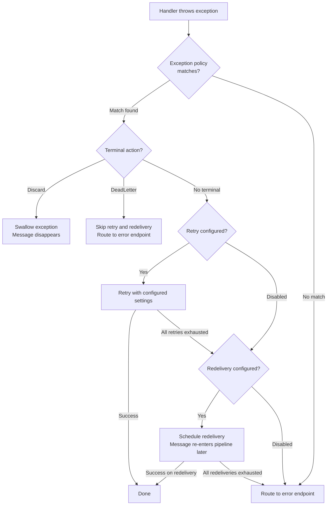

Not every exception deserves the same treatment. A database deadlock might resolve on immediate retry. A downstream service outage needs minutes to recover. A validation error will never succeed no matter how many times you retry. Exception policies let you define per-exception handling strategies - retry, redeliver, dead-letter, or discard - as composable escalation chains in a single `AddResilience` call.

```csharp
builder.Services
    .AddMessageBus()
    .AddResilience(policy =>
    {
        // Validation errors are permanent - route straight to the error endpoint
        policy.On<ValidationException>().DeadLetter();

        // Duplicate messages are safe to drop
        policy.On<DuplicateMessageException>().Discard();

        // Database deadlocks resolve quickly - retry then redeliver
        policy.On<NpgsqlException>(ex => ex.IsTransient)
            .Retry(5, TimeSpan.FromMilliseconds(200))
            .ThenRedeliver();

        // Everything else: retry 3 times, then redeliver on a schedule, then dead-letter
        policy.Default()
            .Retry()
            .ThenRedeliver()
            .ThenDeadLetter();
    })
    .AddEventHandler<OrderPlacedHandler>()
    .AddRabbitMQ();
```

# How exception handling works

When a handler throws an exception, Mocha evaluates exception policies to determine what happens next. The decision flows through two pipeline stages - retry in the consumer pipeline and redelivery in the receive pipeline - before reaching the fault middleware as a last resort.



Each exception policy rule targets a specific exception type and defines an escalation chain. The chain controls which stages the message passes through and with what settings.

Exception matching respects inheritance. A policy on `NpgsqlException` also matches any subclass. When multiple rules could match, the most specific type wins - the same precedence as C# `catch` blocks.

# Configure exception policies

`AddResilience` is the single entry point for all exception handling configuration. There is no separate `AddRetry` or `AddRedelivery` call - retry and redelivery settings are configured per-exception within the policy.

:::note Replacement semantics
Calling `On<T>()` for the same exception type replaces the previous rule for that type - last write wins. If you call `On<HttpRequestException>()` twice without a predicate, the second call overwrites the first. The same applies to `Default()`: calling it again replaces the previous default rule. For example, the parameterless `AddResilience()` registers `Default().Retry().ThenRedeliver()`. If you later call `AddResilience(p => p.Default().Retry(5))`, the new default replaces the one registered by the parameterless overload.
:::

## Parameterless defaults

The parameterless overload registers a catch-all `Default()` rule with both retry and redelivery enabled using built-in defaults:

```csharp
builder.Services
    .AddMessageBus()
    .AddResilience()
    .AddEventHandler<OrderPlacedHandler>()
    .AddRabbitMQ();
```

This is equivalent to:

```csharp
.AddResilience(policy =>
{
    policy.Default().Retry().ThenRedeliver();
})
```

## Default() and On&lt;T&gt;()

`ExceptionPolicyOptions` exposes two methods for creating rules:

- **`Default()`** - shorthand for `On<Exception>()`. Configures the catch-all behavior for any exception that does not match a more specific rule.
- **`On<TException>()`** - configures behavior for a specific exception type.
- **`On<TException>(predicate)`** - configures behavior for a specific exception type when a predicate matches.

```csharp
.AddResilience(policy =>
{
    policy.On<NpgsqlException>().Retry(5).ThenRedeliver();
    policy.On<HttpRequestException>().Retry(3);
    policy.Default().Retry().ThenRedeliver();
})
```

## Bus-level policies

Bus-level policies apply to all endpoints and all consumers across the entire message bus.

```csharp
builder.Services
    .AddMessageBus()
    .AddResilience(policy =>
    {
        policy.On<ValidationException>().DeadLetter();
        policy.On<DuplicateMessageException>().Discard();
        policy.Default().Retry().ThenRedeliver();
    })
    .AddEventHandler<OrderPlacedHandler>()
    .AddRabbitMQ();
```

## Transport-level policies

Override bus-level policies for a specific transport. Transport-level policies replace the bus-level policies entirely for all endpoints on that transport - they are not merged.

```csharp
builder.Services
    .AddMessageBus()
    .AddResilience(policy =>
    {
        policy.Default().Retry().ThenRedeliver();
    })
    .AddRabbitMQ(transport =>
    {
        transport.AddResilience(policy =>
        {
            policy.On<Exception>().DeadLetter();
        });
    });
```

## Consumer-level policies

Override policies for a specific consumer. Consumer-level policies replace the bus-level and transport-level policies for that consumer.

```csharp
builder.Services
    .AddMessageBus()
    .AddResilience(policy =>
    {
        policy.On<Exception>()
            .Retry(2, TimeSpan.FromMilliseconds(100), RetryBackoffType.Constant);
    });

builder.Services.ConfigureMessageBus(bus =>
{
    bus.AddHandler<PaymentHandler>(consumer =>
    {
        consumer.AddResilience(policy =>
        {
            policy.On<Exception>()
                .Retry(5, TimeSpan.FromMilliseconds(500), RetryBackoffType.Exponential);
        });
    });
});
```

The `PaymentHandler` gets 5 retries with exponential backoff. All other consumers get the bus-level policy of 2 retries.

## Scope hierarchy

Exception policies resolve at four levels. The most specific scope wins, and replacement is atomic - the entire set of rules is replaced, not individual rules.

| Scope     | Applies to                            | Configured on                |
| --------- | ------------------------------------- | ---------------------------- |
| Bus       | All endpoints and consumers           | `IMessageBusBuilder`         |
| Host      | All message buses on the host         | `IMessageBusHostBuilder`     |
| Transport | All endpoints on a specific transport | `IReceiveMiddlewareProvider` |
| Consumer  | A single consumer                     | `IConsumerDescriptor`        |

```text
Consumer policies  →  Transport policies  →  Bus policies  →  Host policies
   (highest priority)                                        (lowest priority)
```

If a consumer defines exception policies, the bus-level and transport-level policies are ignored for that consumer. If you need a bus-level rule to also apply at the consumer level, include it in the consumer-level configuration.

# Terminal actions

Terminal actions end the message's lifecycle immediately. No retry, no redelivery - the message is either routed to the error endpoint or discarded.

## DeadLetter

`DeadLetter()` routes the message to the error endpoint, skipping both retry and redelivery. Use this for exceptions that are permanent - retrying will never succeed and you want the message preserved for inspection.

```csharp
policy.On<ValidationException>().DeadLetter();
policy.On<JsonException>().DeadLetter();
policy.On<UnauthorizedAccessException>().DeadLetter();
```

**When to use:** Malformed messages, authorization failures, schema violations, business rule violations that require manual intervention.

## Discard

`Discard()` swallows the exception and the message disappears. No error endpoint, no fault headers, no trace beyond logging.

```csharp
policy.On<DuplicateMessageException>().Discard();
policy.On<MessageExpiredException>().Discard();
```

**When to use:** Messages that are safe to lose - duplicates you have already processed, stale events that no longer matter. Use with caution: discarded messages leave no audit trail in the error endpoint.

# Retry policies

Retry re-runs the handler in-process using immediate retries. The message stays in memory, the concurrency slot is held, and the handler is invoked again after a short delay. Use retry for transient failures that resolve in milliseconds to seconds.

When you call `.Retry()` without chaining `.ThenRedeliver()`, redelivery is disabled for that exception type. If all retries are exhausted, the message routes to the error endpoint.

## Retry with defaults

```csharp
policy.On<TimeoutException>().Retry();
```

| Setting   | Default value |
| --------- | ------------- |
| Attempts  | 3             |
| Delay     | 200 ms        |
| Backoff   | Exponential   |
| Jitter    | Enabled       |
| Max delay | 30 seconds    |

## Retry with custom attempts

```csharp
policy.On<NpgsqlException>(ex => ex.IsTransient).Retry(5);
```

Overrides the number of retry attempts. Delay, backoff strategy, jitter, and max delay use the built-in defaults.

## Retry with full configuration

```csharp
policy.On<HttpRequestException>()
    .Retry(3, TimeSpan.FromMilliseconds(500), RetryBackoffType.Exponential);
```

Overrides attempts, base delay, and backoff strategy for this exception type.

## Retry with explicit intervals

```csharp
policy.On<SocketException>().Retry(
[
    TimeSpan.FromMilliseconds(100),
    TimeSpan.FromMilliseconds(500),
    TimeSpan.FromSeconds(2)
]);
```

Specifies the exact delay before each retry attempt. The array length determines the number of retries.

## Backoff strategies

| Strategy      | Behavior                            |
| ------------- | ----------------------------------- |
| `Constant`    | Same delay every attempt            |
| `Linear`      | `delay * attempt`                   |
| `Exponential` | `delay * 2^(attempt-1)` _(default)_ |

All strategies apply jitter by default to prevent thundering herd effects.

# Redelivery policies

Redelivery schedules the message for later delivery through the transport. The concurrency slot is released, the message re-enters the full receive pipeline on each redelivery attempt, and fresh retry cycles run on each delivery. Use redelivery for failures that need minutes or hours to resolve - a downstream service recovering from an outage, a rate limit resetting, or a database completing a failover.

When you call `.Redeliver()` directly (without `.Retry()` first), retry is disabled for that exception type. The handler failure goes straight to redelivery scheduling.

## Redeliver with defaults

```csharp
policy.On<ExternalServiceException>().Redeliver();
```

| Setting   | Default value         |
| --------- | --------------------- |
| Intervals | 5 min, 15 min, 30 min |
| Jitter    | Enabled               |
| Max delay | 1 hour                |

## Redeliver with custom attempts and delay

```csharp
policy.On<RateLimitException>().Redeliver(5, TimeSpan.FromMinutes(2));
```

Overrides the number of attempts and base delay.

## Redeliver with explicit intervals

```csharp
policy.On<ServiceUnavailableException>().Redeliver(
[
    TimeSpan.FromSeconds(30),
    TimeSpan.FromMinutes(5),
    TimeSpan.FromMinutes(30)
]);
```

Specifies the exact delay before each redelivery attempt. The array length determines the number of redelivery attempts.

# Escalation chains

The fluent API composes retry, redelivery, and terminal actions into escalation chains. The interface design enforces valid chains at compile time - you cannot chain `.ThenRedeliver()` after `.Redeliver()`, or `.Retry()` after `.ThenRedeliver()`.

## Retry then redeliver

```csharp
policy.On<NpgsqlException>(ex => ex.IsTransient)
    .Retry(3)
    .ThenRedeliver();
```

Try 3 immediate retries. If all fail, schedule redelivery with defaults (5, 15, 30 minutes). Each redelivery attempt runs a fresh cycle of 3 retries.

## Retry then redeliver with custom settings

```csharp
policy.On<PaymentGatewayException>()
    .Retry(5, TimeSpan.FromMilliseconds(500))
    .ThenRedeliver(
    [
        TimeSpan.FromMinutes(5),
        TimeSpan.FromMinutes(15),
        TimeSpan.FromMinutes(30)
    ])
    .ThenDeadLetter();
```

Try 5 immediate retries with 500 ms exponential backoff. If exhausted, schedule redeliveries at 5, 15, and 30 minutes. If all redeliveries are exhausted, route to the error endpoint.

## Retry then dead-letter

```csharp
policy.On<ConcurrencyException>()
    .Retry(3)
    .ThenDeadLetter();
```

Try 3 immediate retries. If all fail, skip redelivery and route to the error endpoint immediately.

## Chain behavior reference

| Chain                                        | Retry      | Redelivery | Terminal   |
| -------------------------------------------- | ---------- | ---------- | ---------- |
| `.Discard()`                                 | -          | -          | Discard    |
| `.DeadLetter()`                              | -          | -          | DeadLetter |
| `.Retry()`                                   | Enabled    | Disabled   | Default    |
| `.Retry(3)`                                  | 3 attempts | Disabled   | Default    |
| `.Redeliver()`                               | Disabled   | Enabled    | Default    |
| `.Retry(3).ThenRedeliver()`                  | 3 attempts | Enabled    | Default    |
| `.Retry(3).ThenDeadLetter()`                 | 3 attempts | Disabled   | DeadLetter |
| `.Retry(3).ThenRedeliver().ThenDeadLetter()` | 3 attempts | Enabled    | DeadLetter |

**Default terminal behavior:** When no terminal action is specified, exhausted messages route to the error endpoint through the fault middleware. `.ThenDeadLetter()` makes this intent explicit but does not change the behavior.

**Disabled vs. default:** "Disabled" means that tier is skipped for this exception type. A dash (-) means the tier is not configured and does not apply.

# Conditional policies

Use predicate overloads to apply policies only when an exception matches specific conditions. The predicate receives the typed exception instance.

## Filter by exception property

```csharp
// Only retry transient database errors
policy.On<NpgsqlException>(ex => ex.IsTransient)
    .Retry(5);

// Dead-letter non-transient database errors
policy.On<NpgsqlException>(ex => !ex.IsTransient)
    .DeadLetter();
```

## Filter by HTTP status code

```csharp
policy.On<HttpRequestException>(ex =>
    ex.StatusCode == System.Net.HttpStatusCode.TooManyRequests)
    .Redeliver(
    [
        TimeSpan.FromSeconds(30),
        TimeSpan.FromMinutes(2),
        TimeSpan.FromMinutes(10)
    ]);

policy.On<HttpRequestException>(ex =>
    ex.StatusCode == System.Net.HttpStatusCode.BadRequest)
    .DeadLetter();
```

## Filter by inner exception

```csharp
policy.On<AggregateException>(ex =>
    ex.InnerException is TimeoutException)
    .Retry(3);
```

## Multiple rules for the same type

You can define multiple rules for the same exception type with different predicates. When an exception is thrown, the first matching rule wins.

```csharp
policy.On<HttpRequestException>(ex =>
    ex.StatusCode == System.Net.HttpStatusCode.ServiceUnavailable)
    .Retry(3).ThenRedeliver();

policy.On<HttpRequestException>(ex =>
    ex.StatusCode == System.Net.HttpStatusCode.BadRequest)
    .DeadLetter();

// Catch-all for other HTTP errors
policy.On<HttpRequestException>().Retry(3);
```

# API reference

## ExceptionPolicyOptions

| Method                      | Parameters                | Returns                               | Description                                                                |
| --------------------------- | ------------------------- | ------------------------------------- | -------------------------------------------------------------------------- |
| `Default()`                 | -                         | `IExceptionPolicyBuilder<Exception>`  | Configure the catch-all default behavior. Equivalent to `On<Exception>()`. |
| `On<TException>()`          | -                         | `IExceptionPolicyBuilder<TException>` | Configure behavior for an exception type                                   |
| `On<TException>(predicate)` | `Func<TException, bool>?` | `IExceptionPolicyBuilder<TException>` | Configure behavior for an exception type matching a condition              |

## IExceptionPolicyBuilder&lt;TException&gt;

| Method                            | Parameters                            | Returns                   | Description                                                               |
| --------------------------------- | ------------------------------------- | ------------------------- | ------------------------------------------------------------------------- |
| `Discard()`                       | -                                     | `void`                    | Swallow the exception, discard the message                                |
| `DeadLetter()`                    | -                                     | `void`                    | Route to error endpoint, skip retry and redelivery                        |
| `Retry()`                         | -                                     | `IAfterRetryBuilder`      | Retry with defaults (3 attempts, 200 ms, exponential), disable redelivery |
| `Retry(attempts)`                 | `int`                                 | `IAfterRetryBuilder`      | Retry with custom attempts, disable redelivery                            |
| `Retry(attempts, delay, backoff)` | `int`, `TimeSpan`, `RetryBackoffType` | `IAfterRetryBuilder`      | Retry with full configuration, disable redelivery                         |
| `Retry(intervals)`                | `TimeSpan[]`                          | `IAfterRetryBuilder`      | Retry with explicit intervals, disable redelivery                         |
| `Redeliver()`                     | -                                     | `IAfterRedeliveryBuilder` | Redeliver with defaults (5, 15, 30 min), disable retry                    |
| `Redeliver(attempts, baseDelay)`  | `int`, `TimeSpan`                     | `IAfterRedeliveryBuilder` | Redeliver with custom attempts and delay, disable retry                   |
| `Redeliver(intervals)`            | `TimeSpan[]`                          | `IAfterRedeliveryBuilder` | Redeliver with explicit intervals, disable retry                          |

## IAfterRetryBuilder

| Method                               | Parameters        | Returns                   | Description                                                     |
| ------------------------------------ | ----------------- | ------------------------- | --------------------------------------------------------------- |
| `ThenRedeliver()`                    | -                 | `IAfterRedeliveryBuilder` | Chain redelivery with defaults after retry exhaustion           |
| `ThenRedeliver(attempts, baseDelay)` | `int`, `TimeSpan` | `IAfterRedeliveryBuilder` | Chain redelivery with custom settings after retry exhaustion    |
| `ThenRedeliver(intervals)`           | `TimeSpan[]`      | `IAfterRedeliveryBuilder` | Chain redelivery with explicit intervals after retry exhaustion |
| `ThenDeadLetter()`                   | -                 | `void`                    | Route to error endpoint after retry exhaustion                  |

## IAfterRedeliveryBuilder

| Method             | Parameters | Returns | Description                                         |
| ------------------ | ---------- | ------- | --------------------------------------------------- |
| `ThenDeadLetter()` | -          | `void`  | Route to error endpoint after redelivery exhaustion |

## AddResilience extensions

| Target                       | Method                                          | Description                                                            |
| ---------------------------- | ----------------------------------------------- | ---------------------------------------------------------------------- |
| `IMessageBusBuilder`         | `AddResilience()`                               | Register default exception policies at the bus level                   |
| `IMessageBusBuilder`         | `AddResilience(Action<ExceptionPolicyOptions>)` | Configure exception policies at the bus level                          |
| `IMessageBusHostBuilder`     | `AddResilience()`                               | Register default exception policies at the host level                  |
| `IMessageBusHostBuilder`     | `AddResilience(Action<ExceptionPolicyOptions>)` | Configure exception policies at the host level                         |
| `IReceiveMiddlewareProvider` | `AddResilience()`                               | Register default exception policies at the transport or endpoint level |
| `IReceiveMiddlewareProvider` | `AddResilience(Action<ExceptionPolicyOptions>)` | Configure exception policies at the transport or endpoint level        |
| `IConsumerDescriptor`        | `AddResilience()`                               | Register default exception policies at the consumer level              |
| `IConsumerDescriptor`        | `AddResilience(Action<ExceptionPolicyOptions>)` | Configure exception policies at the consumer level                     |
