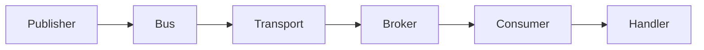

```csharp
builder.Services
    .AddMessageBus()
    .AddEventHandler<OrderPlacedHandler>()
    .AddRabbitMQ();
```

That is a complete bus configuration. Register the bus, add your handlers, pick a transport. Mocha handles routing, serialization, endpoint topology, and handler lifecycle.

# What Mocha is

Mocha is a messaging framework for .NET. It gives your services a structured way to communicate through messages -- publishing events, sending commands, and coordinating request/reply flows -- following the patterns described in [Enterprise Integration Patterns](https://www.enterpriseintegrationpatterns.com/patterns/messaging/Introduction.html). It integrates directly into ASP.NET Core's dependency injection and is designed for [event-driven architectures](https://learn.microsoft.com/en-us/azure/architecture/guide/architecture-styles/event-driven) where services communicate asynchronously rather than through direct method calls.

You implement handler interfaces. Mocha wraps your handlers into consumers, compiles the middleware pipeline, binds endpoints to the transport, and starts receiving messages. The framework is handler-first: you declare what you handle, and Mocha builds the infrastructure around that declaration.

# Terminology

These terms appear throughout the documentation. They are defined once here and used consistently everywhere.

| Term          | Definition                                                                                                          |
| ------------- | ------------------------------------------------------------------------------------------------------------------- |
| **Message**   | A plain C# record representing business data. The unit of communication between handlers and services.              |
| **Event**     | A message published via `PublishAsync`. Represents something that happened. Multiple handlers can receive an event. |
| **Command**   | A message sent via `SendAsync`. Represents an instruction. Delivered to exactly one endpoint.                       |
| **Request**   | A message sent via `RequestAsync` that expects a typed response from the handler.                                   |
| **Handler**   | A class implementing a Mocha handler interface that processes a specific message type.                              |
| **Endpoint**  | A transport address (queue or exchange) paired with a processing pipeline.                                          |
| **Transport** | The infrastructure layer connecting Mocha to a message broker, such as RabbitMQ or an in-process channel.           |
| **Pipeline**  | The chain of middleware that processes a message from the transport through to the handler.                         |
| **Saga**      | A long-running stateful workflow that coordinates multiple messages and transitions across services.                |

# Architecture

When you call `PublishAsync`, here is what happens:



Your code calls `PublishAsync` on `IMessageBus`. The bus serializes the message and hands it to the transport. The transport delivers it through the broker (for example, a RabbitMQ exchange). On the receive side, the consumer picks up the message, runs it through the pipeline, and calls `HandleAsync` on your handler. Middleware in the pipeline handles cross-cutting concerns -- tracing, retries, concurrency limits -- without touching your handler code.

# Core capabilities

## Handler-first design

You write handlers. That is the primary abstraction. Implement an interface, register it with the builder, and your handler runs when the matching message arrives.

```csharp
public class OrderPlacedHandler(AppDbContext db)
    : IEventHandler<OrderPlaced>
{
    public async ValueTask HandleAsync(
        OrderPlaced message,
        CancellationToken cancellationToken)
    {
        var invoice = new Invoice { OrderId = message.OrderId };
        db.Invoices.Add(invoice);
        await db.SaveChangesAsync(cancellationToken);
    }
}
```

Mocha provides handler interfaces for each messaging pattern:

| Interface                          | Pattern          | Bus method               |
| ---------------------------------- | ---------------- | ------------------------ |
| `IEventHandler<T>`                 | Pub/sub events   | `PublishAsync`           |
| `IEventRequestHandler<TReq, TRes>` | Request/reply    | `RequestAsync`           |
| `IEventRequestHandler<TReq>`       | Commands         | `SendAsync`              |
| `IBatchEventHandler<T>`            | Batch processing | `PublishAsync` (batched) |

## Three messaging patterns

Mocha supports the three core patterns for message-driven systems. Each pattern answers a different question:

- **Events (pub/sub):** Who needs to know? Publish once, all subscribers receive it. Use `PublishAsync` and `IEventHandler<T>`.
- **Commands (send):** Who should act? Deliver to one endpoint. Use `SendAsync` and `IEventRequestHandler<TRequest>`.
- **Request/reply:** What is the result? Send and await a typed response. Use `RequestAsync` and `IEventRequestHandler<TRequest, TResponse>`.

## Pluggable transports

Switch transports without changing your handler code. Use InMemory during development and testing, then switch to RabbitMQ for production:

```csharp
// Development
builder.Services
    .AddMessageBus()
    .AddEventHandler<OrderPlacedHandler>()
    .AddInMemory();

// Production
builder.Services
    .AddMessageBus()
    .AddEventHandler<OrderPlacedHandler>()
    .AddRabbitMQ();
```

## Compiled middleware pipelines

Mocha compiles your middleware pipelines at startup. There is no per-message dictionary lookup or dynamic dispatch at runtime. The dispatch, receive, and consumer pipelines are each compiled into an optimized chain.

## OpenTelemetry-native observability

Every message dispatch, receive, and handler execution produces structured traces and metrics through OpenTelemetry. Correlation IDs propagate across service boundaries automatically.

```csharp
builder.Services
    .AddMessageBus()
    .AddInstrumentation()
    .AddEventHandler<OrderPlacedHandler>()
    .AddRabbitMQ();
```

Connect your services to Nitro to introspect your messaging configuration visually -- examine exchanges and queues, trace message flows across services, and answer "what happens when this event is published?" through a visual interface.

## Transactional outbox

Guarantee that database writes and message dispatches succeed or fail together. Mocha's outbox integrates with Entity Framework Core to prevent lost messages during failures:

```csharp
builder.Services
    .AddMessageBus()
    .AddEventHandler<OrderPlacedHandler>()
    .AddEntityFramework<AppDbContext>(p =>
    {
        p.AddPostgresOutbox();
        p.UseTransaction();
    })
    .AddRabbitMQ();
```

## Saga orchestration

Sagas coordinate multi-step workflows that span multiple services and messages. Mocha persists saga state, manages transitions, and supports compensation when steps fail. See [Sagas](/docs/mocha/v1/sagas) for a full walkthrough.

# When not to use Mocha

Mocha is a messaging framework, not a low-level transport client. If you need direct control over AMQP channels, custom Kafka consumer group strategies, or raw protocol-level access, use the transport client libraries directly. Mocha abstracts the transport layer intentionally -- that abstraction is a feature when you want productivity and portability, but a constraint when you need protocol-level control.

# Learning paths

Choose an entry point based on how you learn best:

- **Get something running first:** [Quick Start](/docs/mocha/v1/quick-start) -- zero to a working message bus in under five minutes with the InMemory transport.
- **Understand the concepts first:** [Messages](/docs/mocha/v1/messages) then [Messaging Patterns](/docs/mocha/v1/messaging-patterns) -- learn what flows through the system and what patterns govern how it flows.
- **Evaluating Mocha for a specific broker:** [Transports](/docs/mocha/v1/transports) -- understand the transport abstraction and what is available.

Ready to build? Start with the [Quick Start](/docs/mocha/v1/quick-start).
