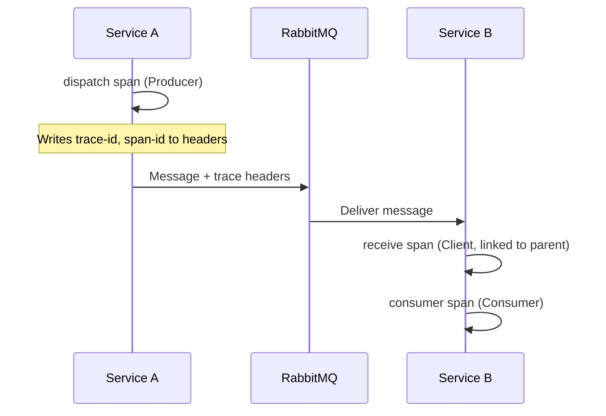

# Observability

Mocha integrates with OpenTelemetry to give you distributed traces, metrics, and structured logging across every stage of the messaging pipeline. When a message is dispatched, received, or consumed, Mocha emits spans and metrics that let you trace message flows end-to-end across services, measure throughput, and diagnose failures.

Observability is opt-in. Call `.AddInstrumentation()` on the bus builder to activate the built-in `OpenTelemetryDiagnosticObserver`. Without it, Mocha uses a no-op observer that adds zero overhead.

# Enable tracing and metrics

## Register instrumentation

```csharp
using Mocha;

var builder = WebApplication.CreateBuilder(args);

builder.Services
    .AddMessageBus()
    .AddInstrumentation() // Enables OpenTelemetry traces and metrics
    .AddEventHandler<OrderPlacedEventHandler>()
    .AddRabbitMQ();
```

`.AddInstrumentation()` registers the `OpenTelemetryDiagnosticObserver` as a singleton `IBusDiagnosticObserver`. This observer creates `Activity` spans for dispatch, receive, and consume operations, and records metrics via the `Mocha` meter.

## Subscribe to the Mocha activity source

The .NET OpenTelemetry SDK only collects spans from activity sources you explicitly subscribe to. Add the `"Mocha"` source to your tracing configuration:

```csharp
builder.Services
    .AddOpenTelemetry()
    .WithTracing(tracing =>
    {
        tracing
            .AddSource("Mocha") // Subscribe to Mocha spans
            .AddAspNetCoreInstrumentation()
            .AddHttpClientInstrumentation();
    })
    .WithMetrics(metrics =>
    {
        metrics
            .AddMeter("Mocha") // Subscribe to Mocha metrics
            .AddAspNetCoreInstrumentation();
    });
```

> **Note:** Mocha follows the [OpenTelemetry messaging semantic conventions](https://opentelemetry.io/docs/specs/semconv/messaging/messaging-spans/), which are currently in development status. Attribute names may change in future OTel releases.

# What you will see

After publishing a message, open your tracing backend (Aspire Dashboard, Jaeger, or an OTLP collector). For each message flow you should see three linked spans:

1. **`publish {destination}`** - Created by the dispatch pipeline when the message is sent. This span belongs to the publishing service.
2. **`receive {endpoint}`** - Created by the receive pipeline when the message arrives at an endpoint. This span belongs to the consuming service and links back to the publish span.
3. **`consumer {handler}`** - Created as a child of the receive span when your handler processes the message.

In the Aspire Dashboard, you will see the `publish` span from the publishing service linked to the `receive` span in the consumer service, with a child `consumer` span for the handler execution. The three spans appear as a single distributed trace that crosses service boundaries.

# How trace context propagates

When the dispatch instrumentation middleware runs, it writes the current `Activity`'s trace context into the outgoing message headers. The receive instrumentation middleware on the other side reads those headers and restores the parent context, linking the two spans into a single trace.



Tracing and metrics are injected by middleware in all three pipelines: `DispatchInstrumentation`, `ReceiveInstrumentation`, and `ConsumerInstrumentation`. See [Middleware and Pipelines](/docs/mocha/v1/middleware-and-pipelines) for how these fit into the pipeline architecture and how to reorder or replace them.

# How to implement a custom diagnostic observer

To collect custom telemetry or integrate with a non-OpenTelemetry backend, implement `IBusDiagnosticObserver`. Each method is called at the start of its pipeline stage and returns an `IDisposable` that the pipeline disposes when the operation completes. This pattern lets you measure duration, track in-flight operations, and clean up resources.

```csharp
using Mocha;
using Mocha.Middlewares;

public sealed class CustomDiagnosticObserver : IBusDiagnosticObserver
{
    public IDisposable Dispatch(IDispatchContext context)
    {
        var startTime = DateTimeOffset.UtcNow;
        Console.WriteLine($"Dispatching to {context.DestinationAddress}");

        return new Scope(() =>
        {
            var duration = DateTimeOffset.UtcNow - startTime;
            Console.WriteLine($"Dispatch completed in {duration.TotalMilliseconds}ms");
        });
    }

    public IDisposable Receive(IReceiveContext context)
    {
        Console.WriteLine($"Receiving from {context.Endpoint.Address}");
        return new Scope(() => Console.WriteLine("Receive completed"));
    }

    public IDisposable Consume(IConsumeContext context)
    {
        Console.WriteLine($"Consumer processing message {context.MessageId}");
        return new Scope(() => Console.WriteLine("Consumer completed"));
    }

    public void OnDispatchError(IDispatchContext context, Exception exception)
        => Console.WriteLine($"Dispatch error: {exception.Message}");

    public void OnReceiveError(IReceiveContext context, Exception exception)
        => Console.WriteLine($"Receive error: {exception.Message}");

    public void OnConsumeError(IConsumeContext context, Exception exception)
        => Console.WriteLine($"Consume error: {exception.Message}");

    private sealed class Scope(Action onDispose) : IDisposable
    {
        public void Dispose() => onDispose();
    }
}
```

Register your observer instead of (or alongside) the built-in one:

```csharp
builder.Services.AddSingleton<IBusDiagnosticObserver, CustomDiagnosticObserver>();
```

# Configure with Nitro

Nitro provides a managed telemetry backend for your Mocha services. Add the `ChilliCream.Nitro.Telemetry` package and configure the exporter:

```csharp
dotnet add package ChilliCream.Nitro.Telemetry
```

```csharp
builder.Services
    .AddOpenTelemetry()
    .WithTracing(tracing =>
    {
        tracing
            .AddSource("Mocha")
            .AddNitroExporter();
    })
    .WithMetrics(metrics =>
    {
        metrics
            .AddMeter("Mocha")
            .AddNitroExporter();
    });

builder.Logging.AddOpenTelemetry(logging =>
{
    logging.IncludeFormattedMessage = true;
    logging.IncludeScopes = true;
    logging.AddNitroExporter();
});

builder.Services.AddNitroTelemetry();
```

Configure credentials through environment variables:

| Variable        | Purpose                                          |
| --------------- | ------------------------------------------------ |
| `NITRO_API_KEY` | Authentication key for the Nitro API             |
| `NITRO_API_ID`  | Your Nitro API identifier                        |
| `NITRO_STAGE`   | Deployment stage (e.g., `production`, `staging`) |

Then register the bus with instrumentation:

```csharp
builder.Services
    .AddMessageBus()
    .AddInstrumentation()
    .AddEventHandler<OrderPlacedEventHandler>()
    .AddRabbitMQ();
```

# Log-trace correlation

When OpenTelemetry is configured with `AddOpenTelemetry().WithLogging()`, your `ILogger` structured log entries automatically include `TraceId` and `SpanId` fields. This means every log line written inside a handler or middleware is automatically correlated to the active span, making it possible to jump from a log entry in your logging backend directly to the corresponding trace.

The Aspire configuration block above already includes `builder.Logging.AddOpenTelemetry(...)`, which enables this behavior. No additional code is needed in your handlers.

For more detail on .NET distributed tracing concepts and how `Activity` maps to spans, see [.NET Distributed Tracing Concepts](https://learn.microsoft.com/en-us/dotnet/core/diagnostics/distributed-tracing-concepts).

# Next steps

- [Middleware and Pipelines](/docs/mocha/v1/middleware-and-pipelines) - Understand how `DispatchInstrumentation`, `ReceiveInstrumentation`, and `ConsumerInstrumentation` fit into each pipeline.
- [Reliability](/docs/mocha/v1/reliability) - Configure fault handling and circuit breakers that work alongside observability.
- [Sagas](/docs/mocha/v1/sagas) - For long-running workflows that span multiple messages, see Sagas.

> **Runnable example:** [OpenTelemetry](https://github.com/ChilliCream/graphql-platform/tree/main/src/Mocha/src/Examples/Observability/OpenTelemetry)
>
> **Full demo:** [Demo.ServiceDefaults](https://github.com/ChilliCream/graphql-platform/tree/main/src/Mocha/src/Demo/Demo.ServiceDefaults) shows how to configure OpenTelemetry tracing and metrics for all services in a shared project, including the `"Mocha"` activity source. The [Demo.AppHost](https://github.com/ChilliCream/graphql-platform/tree/main/src/Mocha/src/Demo/Demo.AppHost) orchestrates everything with .NET Aspire for end-to-end observability.
