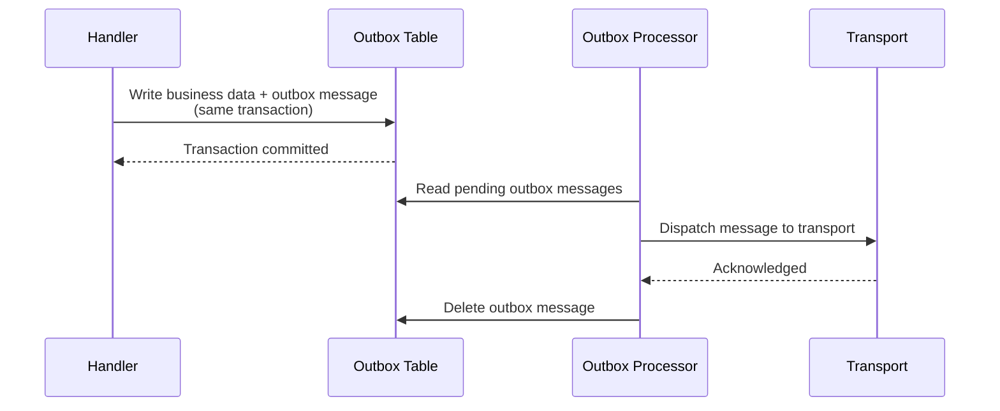

Messaging systems fail. Handlers throw exceptions, brokers go offline, databases lock up, and messages arrive faster than consumers can process them. Mocha's reliability features handle these failures at the infrastructure level so your handler code stays focused on business logic.

```csharp
builder.Services
    .AddMessageBus()
    .AddCircuitBreaker(opts =>
    {
        opts.FailureRatio = 0.5;
        opts.BreakDuration = TimeSpan.FromSeconds(30);
    })
    .AddConcurrencyLimiter(opts => opts.MaxConcurrency = 10)
    .AddEventHandler<OrderPlacedHandler>()
    .AddEntityFramework<AppDbContext>(p =>
    {
        p.AddPostgresOutbox();
        p.UseTransaction();
    })
    .AddRabbitMQ();
```

That configuration adds circuit breaking, concurrency limiting, transactional outbox, and database transaction wrapping - all as middleware in the receive and dispatch pipelines.

# Delivery guarantees

The outbox changes what delivery guarantee your system provides:

| Configuration  | Guarantee     | What it means                                                                                                                                  |
| -------------- | ------------- | ---------------------------------------------------------------------------------------------------------------------------------------------- |
| Without outbox | At-most-once  | A message may be lost if the broker or handler crashes after receipt but before processing completes.                                          |
| With outbox    | At-least-once | Every message is persisted before dispatch. Your handlers may be invoked more than once if a crash occurs between dispatch and acknowledgment. |

At-least-once delivery is the right default for most production systems. It shifts the burden from "did this message arrive?" to "is my handler safe to run twice?" Design handlers to be idempotent.

# The receive pipeline and failure flow

Mocha processes every inbound message through a compiled receive pipeline. The default middleware runs in this order:

```text
TransportCircuitBreaker
  -> ConcurrencyLimiter
    -> Instrumentation
      -> DeadLetter
        -> Fault
          -> CircuitBreaker
            -> Expiry
              -> MessageTypeSelection
                -> Routing
                  -> Consumer pipeline
                    -> Your handler
```

Each middleware can intercept failures from downstream, transform them, or short-circuit the pipeline. The reliability middlewares - dead-letter, fault, circuit breaker, expiry, and concurrency limiter - are all enabled by default with sensible defaults. You tune them when the defaults do not match your workload.

# Handle faults

When your handler throws an exception, Mocha's fault middleware catches it and takes one of two actions depending on the messaging pattern:

**Request/reply flows:** The fault middleware sends a `NotAcknowledgedEvent` back to the caller's response address. This gives the requester an explicit failure signal instead of a timeout.

**Pub/sub and send flows:** The fault middleware forwards the original message envelope to the endpoint's error endpoint with fault metadata in the headers. The headers include the exception type, message, stack trace, and timestamp:

| Header key             | Value                               |
| ---------------------- | ----------------------------------- |
| `fault-exception-type` | Fully qualified exception type name |
| `fault-message`        | Exception message string            |
| `fault-stack-trace`    | Stack trace of the exception        |
| `fault-timestamp`      | ISO 8601 timestamp of the fault     |

The fault middleware marks the message as consumed after handling, which prevents the dead-letter middleware from re-forwarding it.

The fault handler is implemented as the `Fault` middleware in the receive pipeline. See [Middleware and Pipelines](/docs/mocha/v1/middleware-and-pipelines) for positioning and customization.

## Verify fault behavior

Throw an exception in a handler and inspect the error queue. With RabbitMQ, the error endpoint writes faulted messages to an `_error` queue by convention.

```csharp
public class OrderPlacedHandler : IEventHandler<OrderPlacedEvent>
{
    public ValueTask HandleAsync(
        OrderPlacedEvent message,
        CancellationToken cancellationToken)
    {
        throw new InvalidOperationException("Simulated failure");
    }
}
```

Publish an `OrderPlacedEvent` and check your RabbitMQ management console. The message appears in the error queue with fault headers attached.

# Route unhandled messages to the dead-letter endpoint

The dead-letter middleware is the pipeline's safety net. It runs early in the pipeline (before the fault middleware) and catches any message that reaches the end of the pipeline without being consumed. This covers scenarios the fault middleware does not: messages with no matching consumer, messages that fail during routing, or messages that fall through all middleware without being handled.

When a message is not consumed, the dead-letter middleware forwards the original envelope to the endpoint's error endpoint, preserving all headers and payload for later inspection.

```text
info: Mocha.Middlewares.ReceiveDeadLetterMiddleware[0]
      An exception occurred while processing the message.
      The message will be moved to the error endpoint.
```

The dead-letter middleware logs at `Critical` level when it catches an exception, then forwards the message. If no error endpoint is configured for the receive endpoint, the dead-letter middleware is not activated.

See [Dead Letter Channel](https://www.enterpriseintegrationpatterns.com/patterns/messaging/DeadLetterChannel.html) for the canonical description of this pattern.

# Expire stale messages

Messages can carry a `DeliverBy` timestamp that marks when they become stale. The expiry middleware checks this timestamp before any deserialization or handler work runs. If the current time exceeds `DeliverBy`, the message is silently dropped and marked as consumed - no exception, no dead-letter, no handler invocation.

## Set message expiry on publish

```csharp
await bus.PublishAsync(
    new PriceQuoteEvent { Ticker = "MSFT", Price = 425.30m },
    new PublishOptions
    {
        ExpirationTime = DateTimeOffset.UtcNow.AddMinutes(5)
    },
    cancellationToken);
```

The `ExpirationTime` on `PublishOptions` maps to the `DeliverBy` envelope field. When the message sits in a queue longer than five minutes, the expiry middleware drops it on arrival.

## Set message expiry on send

```csharp
await bus.SendAsync(
    new ProcessPaymentCommand { OrderId = orderId, Amount = 99.99m },
    new SendOptions
    {
        ExpirationTime = DateTimeOffset.UtcNow.AddSeconds(30)
    },
    cancellationToken);
```

For time-sensitive commands, a short expiry prevents stale operations from executing after their validity window.

# Limit concurrency

The concurrency limiter middleware restricts how many messages a receive endpoint processes in parallel.

```csharp
builder.Services
    .AddMessageBus()
    .AddConcurrencyLimiter(opts => opts.MaxConcurrency = 10)
    .AddEventHandler<OrderPlacedHandler>()
    .AddRabbitMQ();
```

The default `MaxConcurrency` is `Environment.ProcessorCount * 2`. Set it lower when your handlers access shared resources with limited capacity (database connection pools, external APIs with rate limits), or higher when handlers are I/O-bound and the resource can handle more parallel work.

The concurrency limiter is enabled by default. To disable it for a specific scope, set `Enabled` to `false`:

```csharp
builder.Services
    .AddMessageBus()
    .AddConcurrencyLimiter(opts => opts.Enabled = false)
    .AddEventHandler<OrderPlacedHandler>()
    .AddRabbitMQ();
```

## Configuration scoping

Both the concurrency limiter and circuit breaker resolve configuration using scope precedence: **endpoint > transport > bus**. The most specific scope wins.

Configure at the bus level to set a global default:

```csharp
builder.Services
    .AddMessageBus()
    .AddConcurrencyLimiter(opts => opts.MaxConcurrency = 10)
    .AddRabbitMQ();
```

Override at the transport or endpoint level for more granular control. Transport and endpoint descriptors accept the same `.AddConcurrencyLimiter()` extension:

```csharp
builder.Services
    .AddMessageBus()
    .AddConcurrencyLimiter(opts => opts.MaxConcurrency = 20) // bus-level default
    .AddRabbitMQ(transport =>
    {
        transport.AddConcurrencyLimiter(opts => opts.MaxConcurrency = 5); // override for RabbitMQ
    });
```

# Configure the circuit breaker

The circuit breaker middleware stops processing messages when the failure rate exceeds a threshold. It uses [Polly](https://github.com/App-vNext/Polly) internally and follows the standard circuit breaker pattern: **closed** (normal), **open** (rejecting), **half-open** (testing recovery).

The circuit breaker is implemented as the `CircuitBreaker` middleware in the receive pipeline. See [Middleware and Pipelines](/docs/mocha/v1/middleware-and-pipelines) for positioning and customization.

```csharp
builder.Services
    .AddMessageBus()
    .AddCircuitBreaker(opts =>
    {
        opts.FailureRatio = 0.5;
        opts.MinimumThroughput = 10;
        opts.SamplingDuration = TimeSpan.FromSeconds(10);
        opts.BreakDuration = TimeSpan.FromSeconds(30);
    })
    .AddEventHandler<OrderPlacedHandler>()
    .AddRabbitMQ();
```

When the circuit opens, the middleware pauses message processing for `BreakDuration` before allowing a test message through. If the test succeeds, the circuit closes. If it fails, the circuit stays open for another break period.

## How the circuit breaker evaluates failures

1. During the `SamplingDuration` window, the breaker counts successes and failures.
2. After `MinimumThroughput` messages have been processed, it evaluates the `FailureRatio`.
3. If the ratio of failures to total messages exceeds `FailureRatio`, the circuit opens.
4. After `BreakDuration`, the circuit transitions to half-open and allows one message through.
5. If that message succeeds, the circuit closes. If it fails, the circuit reopens.

## Two circuit breaker scopes

Mocha includes two separate circuit breaker middlewares in the default pipeline:

**Receive-level circuit breaker** (`CircuitBreaker`): Runs inside the pipeline after the dead-letter and fault middlewares. It monitors handler-level failures. Configure it with `.AddCircuitBreaker()` on the host builder.

**Transport-level circuit breaker** (`TransportCircuitBreaker`): Runs at the very start of the pipeline, before the concurrency limiter. It monitors transport-level connectivity failures with a lower default failure ratio (10%). Configure it through the transport's options.

The transport breaker protects against cascading failures when the broker itself is degraded. The receive-level breaker protects against application-level handler failures. Both use Polly's `CircuitBreakerStrategyOptions` internally.

# Guarantee delivery with the transactional outbox

The transactional outbox solves the dual-write problem: when your handler writes to a database and publishes a message, either operation can fail independently.

- If the database commits but the publish fails, the event is lost - downstream consumers never see it.
- If the publish succeeds but the database rolls back, the event describes state that never existed.

The outbox writes messages to the same database transaction as your business data. A background processor picks up persisted messages and dispatches them to the transport, providing at-least-once delivery guarantees.



See [Transactional Outbox](https://microservices.io/patterns/data/transactional-outbox.html) and [Guaranteed Delivery](https://www.enterpriseintegrationpatterns.com/patterns/messaging/GuaranteedMessaging.html) for the canonical pattern descriptions.

## Set up the Postgres outbox

**1. Add the NuGet packages.**

```bash
dotnet add package Mocha.EntityFrameworkCore
dotnet add package Mocha.EntityFrameworkCore.Postgres
```

**2. Add the `OutboxMessage` entity to your DbContext.**

```csharp
using Microsoft.EntityFrameworkCore;
using Mocha.Outbox;

public class AppDbContext : DbContext
{
    public DbSet<OutboxMessage> OutboxMessages => Set<OutboxMessage>();

    // Your existing DbSets
    public DbSet<Order> Orders => Set<Order>();
}
```

`OutboxMessage` has four columns: `Id` (Guid), `Envelope` (JsonDocument), `TimesSent` (int), and `CreatedAt` (DateTime). EF Core discovers the table name, schema, and column mappings from your model automatically.

**3. Register the outbox and transaction middleware.**

```csharp
builder.Services
    .AddMessageBus()
    .AddEventHandler<OrderPlacedHandler>()
    .AddEntityFramework<AppDbContext>(p =>
    {
        p.AddPostgresOutbox();
        p.UseTransaction();
    })
    .AddRabbitMQ();
```

| Call                             | Purpose                                                                                            |
| -------------------------------- | -------------------------------------------------------------------------------------------------- |
| `AddEntityFramework<TContext>()` | Registers your DbContext with the bus for persistence features.                                    |
| `AddPostgresOutbox()`            | Registers the Postgres outbox processor, background worker, and `IMessageOutbox`.                  |
| `UseTransaction()`               | Wraps each consumer invocation in a database transaction (commit on success, rollback on failure). |

**4. Publish inside a transaction.**

With the outbox enabled, calls to `PublishAsync`, `SendAsync`, and `ReplyAsync` inside a handler persist the message envelope to the outbox table within the same database transaction. The outbox dispatch middleware intercepts these calls and writes to `IMessageOutbox` instead of the transport.

```csharp
public class OrderPlacedHandler(AppDbContext db, IMessageBus bus)
    : IEventHandler<OrderPlacedEvent>
{
    public async ValueTask HandleAsync(
        OrderPlacedEvent message,
        CancellationToken cancellationToken)
    {
        var invoice = new Invoice { OrderId = message.OrderId, Amount = message.Amount };
        db.Invoices.Add(invoice);

        // This write goes to the outbox table, not directly to the transport
        await bus.PublishAsync(
            new InvoiceCreatedEvent { InvoiceId = invoice.Id },
            cancellationToken);

        await db.SaveChangesAsync(cancellationToken);
        // Transaction commits both the invoice AND the outbox message atomically
    }
}
```

After the transaction commits, the outbox processor detects the new message (via EF Core interceptors that signal on save and transaction commit) and dispatches it to the transport.

:::note Idempotency requirement
The outbox guarantees at-least-once delivery. Your handlers may be invoked more than once for the same message if the outbox dispatches successfully but the transport acknowledgment is lost before the message is deleted from the outbox table. Design handlers to be idempotent. See the [Idempotent Consumer](https://microservices.io/patterns/communication-style/idempotent-consumer.html) pattern for strategies.
:::

## Use execution strategy resilience

For transient database failures such as connection drops or deadlocks, add execution strategy wrapping:

```csharp
builder.Services
    .AddMessageBus()
    .AddEventHandler<OrderPlacedHandler>()
    .AddEntityFramework<AppDbContext>(p =>
    {
        p.AddPostgresOutbox();
        p.UseResilience(); // Wraps consumer execution with the EF Core execution strategy
        p.UseTransaction();
    })
    .AddRabbitMQ();
```

`UseResilience()` wraps the consumer middleware pipeline in the DbContext's configured execution strategy, enabling automatic retries for transient database errors.

## How the outbox processor works

The outbox processor is a background hosted service (`IHostedService`). When the EF Core interceptors detect a `SaveChanges` or transaction commit, they signal the processor through `IOutboxSignal`. The processor reads pending `OutboxMessage` rows, deserializes the envelope, and dispatches each message through the bus's dispatch pipeline.

The `TimesSent` column tracks dispatch attempts. If dispatch fails, the processor retries on the next signal. Messages are deleted from the outbox table after successful dispatch.

## Skip the outbox for specific dispatches

Some messages - like internal system events or replies that do not need durability - can bypass the outbox. The outbox middleware checks for an `OutboxMiddlewareFeature` on the dispatch context. Messages with `SkipOutbox = true` pass straight through to the transport.

The outbox middleware also only intercepts messages of kind `Publish`, `Send`, `Reply`, or `Fault`. Other message kinds pass through without outbox persistence.

# Next steps

Your messaging pipeline now handles failures, limits concurrency, breaks circuits on sustained errors, and guarantees delivery through the outbox. To monitor your messaging system, see [Observability](/docs/mocha/v1/observability).

- [**Middleware and Pipelines**](/docs/mocha/v1/middleware-and-pipelines) - Write custom middleware, control pipeline ordering, and understand the three pipeline stages.
- [**Sagas**](/docs/mocha/v1/sagas) - Coordinate multi-step workflows with state machine sagas that use compensation when steps fail.
- [**Observability**](/docs/mocha/v1/observability) - Trace message flows across services and monitor pipeline health with OpenTelemetry.

> **Runnable examples:** [OutboxInbox](https://github.com/ChilliCream/graphql-platform/tree/main/src/Mocha/src/Examples/Reliability/OutboxInbox), [CircuitBreaker](https://github.com/ChilliCream/graphql-platform/tree/main/src/Mocha/src/Examples/Reliability/CircuitBreaker)
>
> **Full demo:** All three Demo services ([Catalog](https://github.com/ChilliCream/graphql-platform/tree/main/src/Mocha/src/Demo/Demo.Catalog), [Billing](https://github.com/ChilliCream/graphql-platform/tree/main/src/Mocha/src/Demo/Demo.Billing), [Shipping](https://github.com/ChilliCream/graphql-platform/tree/main/src/Mocha/src/Demo/Demo.Shipping)) use the PostgreSQL transactional outbox with `UseTransaction()` and `UseResilience()` for reliable message delivery.
