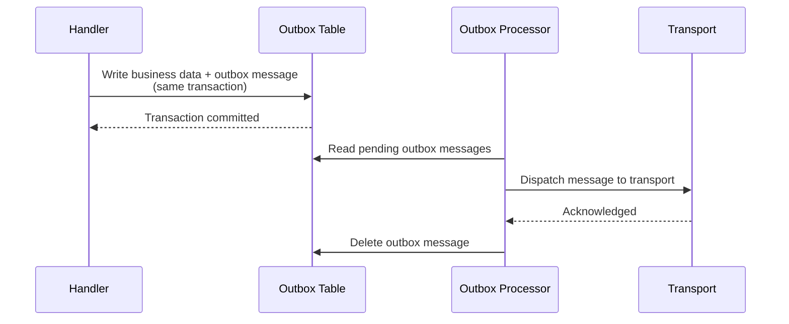
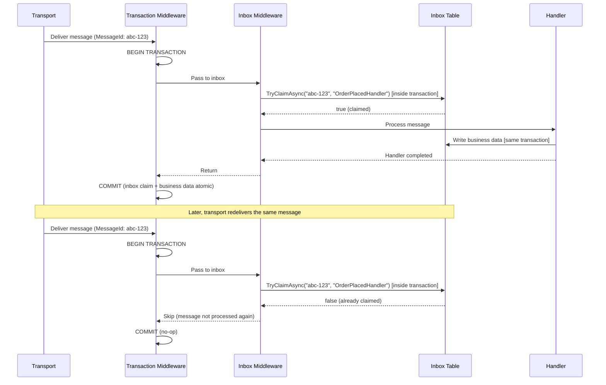

Messaging systems fail. Handlers throw exceptions, brokers go offline, databases lock up, and messages arrive faster than consumers can process them. Mocha's reliability features handle these failures at the infrastructure level so your handler code stays focused on business logic.

```csharp
builder.Services
    .AddMessageBus()
    .AddRetry()
    .AddRedelivery()
    .AddCircuitBreaker(opts =>
    {
        opts.FailureRatio = 0.5;
        opts.BreakDuration = TimeSpan.FromSeconds(30);
    })
    .AddConcurrencyLimiter(opts => opts.MaxConcurrency = 10)
    .AddEventHandler<OrderPlacedHandler>()
    .AddEntityFramework<AppDbContext>(p =>
    {
        p.UsePostgresOutbox();
        p.UseTransaction();
        p.UsePostgresInbox();
    })
    .AddRabbitMQ();
```

That configuration adds immediate retry, delayed redelivery, circuit breaking, concurrency limiting, transactional outbox, idempotent inbox, and database transaction wrapping - all as middleware in the receive and dispatch pipelines.

# Delivery guarantees

The outbox and inbox change what delivery guarantee your system provides:

| Configuration       | Guarantee                | What it means                                                                                                                                  |
| ------------------- | ------------------------ | ---------------------------------------------------------------------------------------------------------------------------------------------- |
| Without outbox      | At-most-once             | A message may be lost if the broker or handler crashes after receipt but before processing completes.                                          |
| With outbox         | At-least-once            | Every message is persisted before dispatch. Your handlers may be invoked more than once if a crash occurs between dispatch and acknowledgment. |
| With outbox + inbox | Effectively exactly-once | The outbox guarantees every message is delivered. The inbox deduplicates on the receiving side, so each message is processed exactly once.     |

At-least-once delivery is the right default for most production systems. Adding the inbox on the consumer side upgrades the guarantee to effectively exactly-once processing - the outbox ensures delivery and the inbox ensures your handler runs only once per message. If you use the outbox without the inbox, design handlers to be idempotent.

# The receive pipeline and failure flow

Mocha processes every inbound message through a compiled receive pipeline. The default middleware runs in this order:

```text
TransportCircuitBreaker
  -> ConcurrencyLimiter
    -> Instrumentation
      -> DeadLetter
        -> Fault
          -> Redelivery          ← schedules for later if retries exhausted
            -> CircuitBreaker
              -> Expiry
                -> MessageTypeSelection
                  -> Routing
                    -> Consumer pipeline
                      -> Retry   ← immediate in-process retries (Polly)
                        -> Transaction middleware (BEGIN)
                          -> Inbox (claim inside transaction)
                            -> Your handler
                        -> Transaction middleware (COMMIT/ROLLBACK)
```

Each middleware can intercept failures from downstream, transform them, or short-circuit the pipeline. The reliability middlewares - dead-letter, fault, circuit breaker, expiry, inbox, and concurrency limiter - are all enabled by default with sensible defaults. You tune them when the defaults do not match your workload.

# Handle faults

When your handler throws an exception, Mocha's fault middleware catches it and takes one of two actions depending on the messaging pattern:

**Request/reply flows:** The fault middleware sends a `NotAcknowledgedEvent` back to the caller's response address. This gives the requester an explicit failure signal instead of a timeout.

**Pub/sub and send flows:** The fault middleware forwards the original message envelope to the endpoint's error endpoint with fault metadata in the headers. The headers include the exception type, message, stack trace, and timestamp:

| Header key             | Value                               |
| ---------------------- | ----------------------------------- |
| `fault-exception-type` | Fully qualified exception type name |
| `fault-message`        | Exception message string            |
| `fault-stack-trace`    | Stack trace of the exception        |
| `fault-timestamp`      | ISO 8601 timestamp of the fault     |

The fault middleware marks the message as consumed after handling, which prevents the dead-letter middleware from re-forwarding it.

The fault handler is implemented as the `Fault` middleware in the receive pipeline. See [Middleware and Pipelines](/docs/mocha/v1/middleware-and-pipelines) for positioning and customization.

## Verify fault behavior

Throw an exception in a handler and inspect the error queue. With RabbitMQ, the error endpoint writes faulted messages to an `_error` queue by convention.

```csharp
public class OrderPlacedHandler : IEventHandler<OrderPlacedEvent>
{
    public ValueTask HandleAsync(
        OrderPlacedEvent message,
        CancellationToken cancellationToken)
    {
        throw new InvalidOperationException("Simulated failure");
    }
}
```

Publish an `OrderPlacedEvent` and check your RabbitMQ management console. The message appears in the error queue with fault headers attached.

# Route unhandled messages to the dead-letter endpoint

The dead-letter middleware is the pipeline's safety net. It runs early in the pipeline (before the fault middleware) and catches any message that reaches the end of the pipeline without being consumed. This covers scenarios the fault middleware does not: messages with no matching consumer, messages that fail during routing, or messages that fall through all middleware without being handled.

When a message is not consumed, the dead-letter middleware forwards the original envelope to the endpoint's error endpoint, preserving all headers and payload for later inspection.

```text
info: Mocha.Middlewares.ReceiveDeadLetterMiddleware[0]
      An exception occurred while processing the message.
      The message will be moved to the error endpoint.
```

The dead-letter middleware logs at `Critical` level when it catches an exception, then forwards the message. If no error endpoint is configured for the receive endpoint, the dead-letter middleware is not activated.

See [Dead Letter Channel](https://www.enterpriseintegrationpatterns.com/patterns/messaging/DeadLetterChannel.html) for the canonical description of this pattern.

# Expire stale messages

Messages can carry a `DeliverBy` timestamp that marks when they become stale. The expiry middleware checks this timestamp before any deserialization or handler work runs. If the current time exceeds `DeliverBy`, the message is silently dropped and marked as consumed - no exception, no dead-letter, no handler invocation.

## Set message expiry on publish

```csharp
await bus.PublishAsync(
    new PriceQuoteEvent { Ticker = "MSFT", Price = 425.30m },
    new PublishOptions
    {
        ExpirationTime = DateTimeOffset.UtcNow.AddMinutes(5)
    },
    cancellationToken);
```

The `ExpirationTime` on `PublishOptions` maps to the `DeliverBy` envelope field. When the message sits in a queue longer than five minutes, the expiry middleware drops it on arrival.

## Set message expiry on send

```csharp
await bus.SendAsync(
    new ProcessPaymentCommand { OrderId = orderId, Amount = 99.99m },
    new SendOptions
    {
        ExpirationTime = DateTimeOffset.UtcNow.AddSeconds(30)
    },
    cancellationToken);
```

For time-sensitive commands, a short expiry prevents stale operations from executing after their validity window.

# Retry failed messages

When a handler throws a transient exception - a database timeout, an HTTP 503, temporary lock contention - retrying the same operation a few hundred milliseconds later often succeeds. The retry middleware re-runs the handler in-process using [Polly](https://github.com/App-vNext/Polly) without releasing the concurrency slot or leaving the consumer pipeline.

Retry lives in the **consumer pipeline**, not the receive pipeline. This matters for two reasons:

1. **Only handler failures are retried.** Deserialization errors, unknown message types, and routing failures are almost always permanent. Retrying them wastes time.
2. **Multi-consumer correctness.** When one endpoint routes a message to multiple consumers, only the failing consumer retries. The others are unaffected.

## Add retry with defaults

```csharp
builder.Services
    .AddMessageBus()
    .AddRetry()
    .AddEventHandler<OrderPlacedHandler>()
    .AddRabbitMQ();
```

With no configuration, retry uses exponential backoff: 3 attempts, 200 ms base delay, jitter enabled, 30-second maximum delay. These defaults handle the majority of transient failures without tuning.

## Customize retry behavior

```csharp
builder.Services
    .AddMessageBus()
    .AddRetry(retry =>
    {
        retry.MaxRetryAttempts = 5;
        retry.Delay = TimeSpan.FromSeconds(1);
        retry.BackoffType = RetryBackoffType.Exponential;
        retry.UseJitter = true;
        retry.MaxDelay = TimeSpan.FromSeconds(60);
    })
    .AddEventHandler<OrderPlacedHandler>()
    .AddRabbitMQ();
```

## Use explicit retry intervals

When you need precise control over each delay, set `Intervals` directly. This overrides `Delay`, `BackoffType`, and `MaxRetryAttempts` - the array length becomes the number of retries.

```csharp
builder.Services
    .AddMessageBus()
    .AddRetry(retry =>
    {
        retry.Intervals =
        [
            TimeSpan.FromMilliseconds(100),
            TimeSpan.FromMilliseconds(500),
            TimeSpan.FromSeconds(2)
        ];
    })
    .AddEventHandler<OrderPlacedHandler>()
    .AddRabbitMQ();
```

## Filter exceptions

Not every exception should be retried. Validation errors, authorization failures, and other permanent errors waste retry budget. Use `On<T>().Ignore()` to exclude specific exception types from retry. The exception propagates immediately to the fault middleware.

```csharp
builder.Services
    .AddMessageBus()
    .AddRetry(retry =>
    {
        retry.MaxRetryAttempts = 3;

        // Never retry validation failures
        retry.On<ValidationException>().Ignore();

        // Never retry non-transient database errors
        retry.On<DbException>(ex => !ex.IsTransient).Ignore();
    })
    .AddEventHandler<OrderPlacedHandler>()
    .AddRabbitMQ();
```

Exception filtering respects inheritance. `On<DbException>().Ignore()` also ignores `NpgsqlException` and any other `DbException` subclass. When multiple rules match, the most specific type wins - the same precedence as C# `catch` blocks.

## Override retry per consumer

The bus-level retry configuration applies to all consumers. Override it for specific consumers that need different behavior. See [Handlers and Consumers](/docs/mocha/v1/handlers-and-consumers) for the full consumer configuration API.

```csharp
builder.Services
    .AddMessageBus()
    .AddRetry() // bus-level: 3 retries for all consumers
    .AddEventHandler<OrderHandler>(consumer =>
    {
        // This consumer: 10 retries with longer delay
        consumer.AddRetry(retry =>
        {
            retry.MaxRetryAttempts = 10;
            retry.Delay = TimeSpan.FromSeconds(2);
        });
    })
    .AddEventHandler<NotificationHandler>(consumer =>
    {
        // This consumer: no retries
        consumer.AddRetry(retry => retry.Enabled = false);
    })
    .AddRabbitMQ();
```

Properties cascade: consumer overrides bus, bus overrides defaults. Properties not set at the consumer level (like `BackoffType`) fall through to the bus configuration, then to `RetryOptions.Defaults`.

## Retry options reference

| Property           | Type                | Default       | Description                                                                                      |
| ------------------ | ------------------- | ------------- | ------------------------------------------------------------------------------------------------ |
| `Enabled`          | `bool?`             | `true`        | Set to `false` to disable retry at this scope. `null` inherits from parent.                      |
| `MaxRetryAttempts` | `int?`              | `3`           | Number of retries after the initial attempt. Total handler invocations = `MaxRetryAttempts + 1`. |
| `Delay`            | `TimeSpan?`         | 200 ms        | Base delay between retries. Interpretation depends on `BackoffType`.                             |
| `MaxDelay`         | `TimeSpan?`         | 30 s          | Upper bound on any single retry delay. Prevents exponential backoff from growing unbounded.      |
| `BackoffType`      | `RetryBackoffType?` | `Exponential` | Delay calculation strategy: `Constant`, `Linear`, or `Exponential`.                              |
| `UseJitter`        | `bool?`             | `true`        | Adds random variance to delays, preventing synchronized retry storms across consumers.           |
| `Intervals`        | `TimeSpan[]?`       | `null`        | Explicit delay per retry. When set, overrides `Delay`, `BackoffType`, and `MaxRetryAttempts`.    |

### RetryBackoffType values

| Value         | Formula                 | Example (Delay = 200 ms) |
| ------------- | ----------------------- | ------------------------ |
| `Constant`    | `Delay`                 | 200 ms, 200 ms, 200 ms   |
| `Linear`      | `Delay × (attempt + 1)` | 400 ms, 600 ms, 800 ms   |
| `Exponential` | `Delay × 2^attempt`     | 400 ms, 800 ms, 1600 ms  |

# Redeliver failed messages

Retry handles transient blips that resolve in milliseconds. Some failures take longer - a downstream service is deploying, a database is recovering from a failover, an external API is rate-limiting. For these, you need **redelivery**: reschedule the message for later delivery through the transport.

Redelivery lives in the **receive pipeline**, not the consumer pipeline. This matters for two reasons:

1. **Single decision point.** When an endpoint has multiple consumers, you want one redelivery decision per message, not one per consumer.
2. **Releases the concurrency slot.** Retry holds the slot while Polly waits. Redelivery returns the message to the transport and frees the slot for other messages.

Redelivery uses Mocha's [scheduling infrastructure](/docs/mocha/v1/scheduling) to schedule the message for future delivery. The message re-enters the full receive pipeline when it arrives - fresh routing, fresh consumer invocations, fresh retry attempts.

```text
Receive pipeline:

  Fault
    -> Redelivery
      -> CircuitBreaker
        -> ... (rest of pipeline)

All retries exhausted → exception propagates to Redelivery
  → redelivery attempts remaining → schedule for later delivery
  → redelivery exhausted → exception propagates to Fault → error endpoint
```

## Add redelivery with defaults

```csharp
builder.Services
    .AddMessageBus()
    .AddRedelivery()
    .AddEventHandler<OrderPlacedHandler>()
    .AddRabbitMQ();
```

The default redelivery schedule is three attempts at 5 minutes, 15 minutes, and 30 minutes with jitter enabled.

## Use custom redelivery intervals

```csharp
builder.Services
    .AddMessageBus()
    .AddRedelivery(redeliver =>
    {
        redeliver.Intervals =
        [
            TimeSpan.FromSeconds(30),
            TimeSpan.FromMinutes(5),
            TimeSpan.FromMinutes(30)
        ];
    })
    .AddEventHandler<OrderPlacedHandler>()
    .AddRabbitMQ();
```

The array length determines the number of redelivery attempts. Each element is the delay before that attempt.

## Use calculated redelivery delays

Instead of explicit intervals, configure a base delay and maximum. The actual delay for each attempt is `BaseDelay × (attempt + 1)`, capped at `MaxDelay`.

```csharp
builder.Services
    .AddMessageBus()
    .AddRedelivery(redeliver =>
    {
        redeliver.MaxAttempts = 5;
        redeliver.BaseDelay = TimeSpan.FromMinutes(2);
        redeliver.MaxDelay = TimeSpan.FromHours(1);
        redeliver.UseJitter = true;
    })
    .AddEventHandler<OrderPlacedHandler>()
    .AddRabbitMQ();
```

## Filter exceptions for redelivery

The same `On<T>().Ignore()` pattern applies to redelivery. Exceptions that match an ignore rule propagate immediately to the fault middleware without scheduling a redelivery.

```csharp
builder.Services
    .AddMessageBus()
    .AddRedelivery(redeliver =>
    {
        redeliver.Intervals =
        [
            TimeSpan.FromMinutes(5),
            TimeSpan.FromMinutes(15),
            TimeSpan.FromMinutes(30)
        ];

        // Validation failures are permanent - don't redeliver
        redeliver.On<ValidationException>().Ignore();

        // Missing configuration won't fix itself
        redeliver.On<ConfigurationException>().Ignore();
    })
    .AddEventHandler<OrderPlacedHandler>()
    .AddRabbitMQ();
```

## Override redelivery per endpoint

The bus-level redelivery configuration applies to all endpoints. Override it at the transport or endpoint level for more granular control.

```csharp
builder.Services
    .AddMessageBus()
    .AddRedelivery() // bus-level default
    .AddRabbitMQ(transport =>
    {
        transport.AddRedelivery(redeliver =>
        {
            // Override for this transport: longer intervals
            redeliver.Intervals =
            [
                TimeSpan.FromMinutes(10),
                TimeSpan.FromMinutes(30),
                TimeSpan.FromHours(1)
            ];
        });
    });
```

Disable redelivery for a specific transport or endpoint by setting `Enabled` to `false`:

```csharp
transport.AddRedelivery(redeliver => redeliver.Enabled = false);
```

Properties cascade: endpoint overrides transport, transport overrides bus, bus overrides defaults.

## Redelivery options reference

| Property      | Type          | Default                 | Description                                                                                                                                       |
| ------------- | ------------- | ----------------------- | ------------------------------------------------------------------------------------------------------------------------------------------------- |
| `Enabled`     | `bool?`       | `true`                  | Set to `false` to disable redelivery at this scope. `null` inherits from parent.                                                                  |
| `MaxAttempts` | `int?`        | -                       | Maximum redelivery attempts. Inferred from `Intervals.Length` when `Intervals` is set. Required when using calculated delays without `Intervals`. |
| `BaseDelay`   | `TimeSpan?`   | 5 min                   | Base delay for calculated backoff: `BaseDelay × (attempt + 1)`.                                                                                   |
| `MaxDelay`    | `TimeSpan?`   | 1 h                     | Upper bound on any single redelivery delay.                                                                                                       |
| `UseJitter`   | `bool?`       | `true`                  | Adds random variance to delays.                                                                                                                   |
| `Intervals`   | `TimeSpan[]?` | [5 min, 15 min, 30 min] | Explicit delay per redelivery attempt. When set, overrides `BaseDelay` and `MaxAttempts`.                                                         |

# Combine retry and redelivery

The two tiers compose naturally. When both are configured, a message goes through immediate retry first. If all retries are exhausted, the exception propagates up from the consumer pipeline to the receive pipeline, where redelivery catches it and schedules the message for later delivery. On the next delivery round, the full retry cycle runs again.

```text
Message arrives
  │
  ├─ Consumer pipeline: Retry (Polly)
  │    ├─ Attempt 1 → handler throws → retry
  │    ├─ Attempt 2 → handler throws → retry
  │    ├─ Attempt 3 → handler throws → retry
  │    └─ Attempt 4 → handler throws → retries exhausted, exception propagates
  │
  ├─ Receive pipeline: Redelivery
  │    └─ Schedule message for delivery in 5 minutes
  │
  ├─ ... 5 minutes later, message re-enters pipeline ...
  │
  ├─ Consumer pipeline: Retry (Polly)
  │    ├─ Attempt 1 → handler throws → retry
  │    ├─ ...
  │    └─ Attempt 4 → retries exhausted, exception propagates
  │
  ├─ Receive pipeline: Redelivery
  │    └─ Schedule message for delivery in 15 minutes
  │
  ├─ ... continues until redelivery attempts exhausted ...
  │
  └─ Fault middleware → error endpoint (dead letter)
```

The total number of handler invocations before a message reaches the error endpoint:

```
Total attempts = (MaxRetryAttempts + 1) × (redelivery attempts + 1)
```

With the defaults (3 retries, 3 redeliveries): `(3 + 1) × (3 + 1) = 16` total handler invocations.

```csharp
builder.Services
    .AddMessageBus()
    .AddRetry(retry =>
    {
        retry.MaxRetryAttempts = 5;
        retry.Delay = TimeSpan.FromSeconds(1);
        retry.BackoffType = RetryBackoffType.Exponential;
    })
    .AddRedelivery(redeliver =>
    {
        redeliver.Intervals =
        [
            TimeSpan.FromMinutes(5),
            TimeSpan.FromMinutes(15),
            TimeSpan.FromMinutes(30)
        ];
    })
    .AddEventHandler<OrderPlacedHandler>()
    .AddRabbitMQ();
```

With this configuration: `(5 + 1) × (3 + 1) = 24` total handler invocations before dead-letter.

:::note Request/reply messages skip redelivery
Redelivery does not apply to request/reply messages. The caller is waiting synchronously for a response - scheduling the message for delivery minutes later would cause a timeout. When a request/reply handler fails after retry exhaustion, the exception propagates directly to the fault middleware, which sends a `NotAcknowledgedEvent` back to the caller. Immediate retry still applies to request/reply handlers.
:::

# Inspect retry state in handlers

Handlers can access the current retry state through the context features. This is useful for graceful degradation - trying a primary path on the first attempt and falling back to an alternative on subsequent retries.

```csharp
public class PaymentConsumer(ILogger<PaymentConsumer> logger) : IConsumer<ProcessPayment>
{
    public async ValueTask ConsumeAsync(IConsumeContext<ProcessPayment> context)
    {
        var state = context.Features.Get<RetryState>();

        if (state is { ImmediateRetryCount: > 2 })
        {
            logger.LogWarning(
                "Primary gateway failed after {Retries} retries, using fallback",
                state.ImmediateRetryCount);
            await ProcessViaFallbackGatewayAsync(context.Message);
            return;
        }

        if (state is { DelayedRetryCount: > 0 })
        {
            logger.LogWarning(
                "Processing after {Redeliveries} redeliveries",
                state.DelayedRetryCount);
        }

        await ProcessPaymentAsync(context.Message);
    }
}
```

`RetryState` is `null` when `AddRetry()` is not configured. When present, it exposes two properties:

| Property              | Type  | Description                                                                                |
| --------------------- | ----- | ------------------------------------------------------------------------------------------ |
| `ImmediateRetryCount` | `int` | Number of immediate retries so far in this delivery round. `0` on the initial attempt.     |
| `DelayedRetryCount`   | `int` | Number of redelivery rounds completed. Read from the `delayed-retry-count` message header. |

## Retry and sagas

[Sagas](/docs/mocha/v1/sagas) are consumers, so retry and redelivery apply automatically — no special configuration needed. Each saga handler invocation runs inside a saga transaction. If the handler throws, the transaction is never committed and all state changes are discarded. On the next retry attempt, the saga state is loaded fresh from the store.

This means retry is safe for sagas by default. You do not need to worry about partial state mutations leaking between retry attempts.

Redelivery is also safe. When a redelivered message arrives, a new transaction starts and the saga state is loaded at whatever state the last successful commit left it.

# Troubleshoot retry and redelivery

## "My handler runs more times than expected"

Check both retry and redelivery. With both configured, the total handler invocations are `(MaxRetryAttempts + 1) × (redelivery attempts + 1)`. Three retries with three redeliveries means 16 total invocations, not 6. Use the [formula above](#combine-retry-and-redelivery) to calculate the exact count.

## "Retry does not work for my consumer"

`AddRetry()` must be called at the bus level (or on the specific consumer) to register the retry middleware in the consumer pipeline. Adding retry configuration to a consumer without a bus-level `AddRetry()` call has no effect - the middleware is not in the pipeline.

## "Redelivery fails at startup"

Redelivery uses Mocha's [scheduling infrastructure](/docs/mocha/v1/scheduling). If your transport does not support scheduling or the scheduling store is not configured, redelivery cannot schedule messages for later delivery. Check that your transport is configured with scheduling support.

## "Validation exceptions are being retried"

Use `On<T>().Ignore()` to exclude permanent failures from retry and redelivery:

```csharp
builder.Services
    .AddMessageBus()
    .AddRetry(retry =>
    {
        retry.On<ValidationException>().Ignore();
    })
    .AddRedelivery(redeliver =>
    {
        redeliver.On<ValidationException>().Ignore();
    })
    .AddEventHandler<OrderPlacedHandler>()
    .AddRabbitMQ();
```

## "Request/reply messages are not redelivered"

This is by design. Redelivery skips request/reply messages because the caller is waiting for a synchronous response. Immediate retry still applies. See the [note above](#combine-retry-and-redelivery) for details.

# Limit concurrency

The concurrency limiter middleware restricts how many messages a receive endpoint processes in parallel.

```csharp
builder.Services
    .AddMessageBus()
    .AddConcurrencyLimiter(opts => opts.MaxConcurrency = 10)
    .AddEventHandler<OrderPlacedHandler>()
    .AddRabbitMQ();
```

The default `MaxConcurrency` is `Environment.ProcessorCount * 2`. Set it lower when your handlers access shared resources with limited capacity (database connection pools, external APIs with rate limits), or higher when handlers are I/O-bound and the resource can handle more parallel work.

The concurrency limiter is enabled by default. To disable it for a specific scope, set `Enabled` to `false`:

```csharp
builder.Services
    .AddMessageBus()
    .AddConcurrencyLimiter(opts => opts.Enabled = false)
    .AddEventHandler<OrderPlacedHandler>()
    .AddRabbitMQ();
```

## Configuration scoping

Both the concurrency limiter and circuit breaker resolve configuration using scope precedence: **endpoint > transport > bus**. The most specific scope wins.

Configure at the bus level to set a global default:

```csharp
builder.Services
    .AddMessageBus()
    .AddConcurrencyLimiter(opts => opts.MaxConcurrency = 10)
    .AddRabbitMQ();
```

Override at the transport or endpoint level for more granular control. Transport and endpoint descriptors accept the same `.AddConcurrencyLimiter()` extension:

```csharp
builder.Services
    .AddMessageBus()
    .AddConcurrencyLimiter(opts => opts.MaxConcurrency = 20) // bus-level default
    .AddRabbitMQ(transport =>
    {
        transport.AddConcurrencyLimiter(opts => opts.MaxConcurrency = 5); // override for RabbitMQ
    });
```

# Configure the circuit breaker

The circuit breaker middleware stops processing messages when the failure rate exceeds a threshold. It uses [Polly](https://github.com/App-vNext/Polly) internally and follows the standard circuit breaker pattern: **closed** (normal), **open** (rejecting), **half-open** (testing recovery).

The circuit breaker is implemented as the `CircuitBreaker` middleware in the receive pipeline. See [Middleware and Pipelines](/docs/mocha/v1/middleware-and-pipelines) for positioning and customization.

```csharp
builder.Services
    .AddMessageBus()
    .AddCircuitBreaker(opts =>
    {
        opts.FailureRatio = 0.5;
        opts.MinimumThroughput = 10;
        opts.SamplingDuration = TimeSpan.FromSeconds(10);
        opts.BreakDuration = TimeSpan.FromSeconds(30);
    })
    .AddEventHandler<OrderPlacedHandler>()
    .AddRabbitMQ();
```

When the circuit opens, the middleware pauses message processing for `BreakDuration` before allowing a test message through. If the test succeeds, the circuit closes. If it fails, the circuit stays open for another break period.

## How the circuit breaker evaluates failures

1. During the `SamplingDuration` window, the breaker counts successes and failures.
2. After `MinimumThroughput` messages have been processed, it evaluates the `FailureRatio`.
3. If the ratio of failures to total messages exceeds `FailureRatio`, the circuit opens.
4. After `BreakDuration`, the circuit transitions to half-open and allows one message through.
5. If that message succeeds, the circuit closes. If it fails, the circuit reopens.

## Two circuit breaker scopes

Mocha includes two separate circuit breaker middlewares in the default pipeline:

**Receive-level circuit breaker** (`CircuitBreaker`): Runs inside the pipeline after the dead-letter and fault middlewares. It monitors handler-level failures. Configure it with `.AddCircuitBreaker()` on the host builder.

**Transport-level circuit breaker** (`TransportCircuitBreaker`): Runs at the very start of the pipeline, before the concurrency limiter. It monitors transport-level connectivity failures with a lower default failure ratio (10%). Configure it through the transport's options.

The transport breaker protects against cascading failures when the broker itself is degraded. The receive-level breaker protects against application-level handler failures. Both use Polly's `CircuitBreakerStrategyOptions` internally.

# Guarantee delivery with the transactional outbox

The transactional outbox solves the dual-write problem: when your handler writes to a database and publishes a message, either operation can fail independently.

- If the database commits but the publish fails, the event is lost - downstream consumers never see it.
- If the publish succeeds but the database rolls back, the event describes state that never existed.

The outbox writes messages to the same database transaction as your business data. A background processor picks up persisted messages and dispatches them to the transport, providing at-least-once delivery guarantees.



See [Transactional Outbox](https://microservices.io/patterns/data/transactional-outbox.html) and [Guaranteed Delivery](https://www.enterpriseintegrationpatterns.com/patterns/messaging/GuaranteedMessaging.html) for the canonical pattern descriptions.

## Set up the Postgres outbox

**1. Add the NuGet packages.**

```bash
dotnet add package Mocha.EntityFrameworkCore
dotnet add package Mocha.EntityFrameworkCore.Postgres
```

**2. Add the `OutboxMessage` entity to your DbContext.**

```csharp
using Microsoft.EntityFrameworkCore;
using Mocha.Outbox;

public class AppDbContext : DbContext
{
    public DbSet<OutboxMessage> OutboxMessages => Set<OutboxMessage>();

    // Your existing DbSets
    public DbSet<Order> Orders => Set<Order>();
}
```

`OutboxMessage` has four columns: `Id` (Guid), `Envelope` (JsonDocument), `TimesSent` (int), and `CreatedAt` (DateTime). EF Core discovers the table name, schema, and column mappings from your model automatically.

**3. Register the outbox and transaction middleware.**

```csharp
builder.Services
    .AddMessageBus()
    .AddEventHandler<OrderPlacedHandler>()
    .AddEntityFramework<AppDbContext>(p =>
    {
        p.UsePostgresOutbox();
        p.UseTransaction();
    })
    .AddRabbitMQ();
```

| Call                             | Purpose                                                                                            |
| -------------------------------- | -------------------------------------------------------------------------------------------------- |
| `AddEntityFramework<TContext>()` | Registers your DbContext with the bus for persistence features.                                    |
| `UsePostgresOutbox()`            | Registers the Postgres outbox processor, background worker, and `IMessageOutbox`.                  |
| `UseTransaction()`               | Wraps each consumer invocation in a database transaction (commit on success, rollback on failure). |

**4. Publish inside a transaction.**

With the outbox enabled, calls to `PublishAsync`, `SendAsync`, and `ReplyAsync` inside a handler persist the message envelope to the outbox table within the same database transaction. The outbox dispatch middleware intercepts these calls and writes to `IMessageOutbox` instead of the transport.

```csharp
public class OrderPlacedHandler(AppDbContext db, IMessageBus bus)
    : IEventHandler<OrderPlacedEvent>
{
    public async ValueTask HandleAsync(
        OrderPlacedEvent message,
        CancellationToken cancellationToken)
    {
        var invoice = new Invoice { OrderId = message.OrderId, Amount = message.Amount };
        db.Invoices.Add(invoice);

        // This write goes to the outbox table, not directly to the transport
        await bus.PublishAsync(
            new InvoiceCreatedEvent { InvoiceId = invoice.Id },
            cancellationToken);

        await db.SaveChangesAsync(cancellationToken);
        // Transaction commits both the invoice AND the outbox message atomically
    }
}
```

After the transaction commits, the outbox processor detects the new message (via EF Core interceptors that signal on save and transaction commit) and dispatches it to the transport.

:::note Idempotency requirement
The outbox guarantees at-least-once delivery. Your handlers may be invoked more than once for the same message if the outbox dispatches successfully but the transport acknowledgment is lost before the message is deleted from the outbox table. You can handle this in two ways: design handlers to be idempotent manually (see the [Idempotent Consumer](https://microservices.io/patterns/communication-style/idempotent-consumer.html) pattern), or enable the [inbox](#deduplicate-messages-with-the-transactional-inbox) on the receiving side to let Mocha deduplicate automatically.
:::

## Use execution strategy resilience

For transient database failures such as connection drops or deadlocks, add execution strategy wrapping:

```csharp
builder.Services
    .AddMessageBus()
    .AddEventHandler<OrderPlacedHandler>()
    .AddEntityFramework<AppDbContext>(p =>
    {
        p.UsePostgresOutbox();
        p.UseResilience(); // Wraps consumer execution with the EF Core execution strategy
        p.UseTransaction();
    })
    .AddRabbitMQ();
```

`UseResilience()` wraps the consumer middleware pipeline in the DbContext's configured execution strategy, enabling automatic retries for transient database errors.

## How the outbox processor works

The outbox processor is a background hosted service (`IHostedService`). When the EF Core interceptors detect a `SaveChanges` or transaction commit, they signal the processor through `IOutboxSignal`. The processor reads pending `OutboxMessage` rows, deserializes the envelope, and dispatches each message through the bus's dispatch pipeline.

The `TimesSent` column tracks dispatch attempts. If dispatch fails, the processor retries on the next signal. Messages are deleted from the outbox table after successful dispatch.

## Skip the outbox for specific dispatches

Some messages - like internal system events or replies that do not need durability - can bypass the outbox. The outbox middleware checks for an `OutboxMiddlewareFeature` on the dispatch context. Messages with `SkipOutbox = true` pass straight through to the transport.

The outbox middleware also only intercepts messages of kind `Publish`, `Send`, `Reply`, or `Fault`. Other message kinds pass through without outbox persistence.

# Deduplicate messages with the transactional inbox

The transactional outbox guarantees at-least-once delivery. The transactional inbox completes the picture: it provides exactly-once processing by deduplicating messages on the receiving side.

When a transport redelivers a message - because of a broker retry, a network hiccup, or an outbox re-dispatch - the inbox detects the duplicate `MessageId` and silently skips it. Your handler never runs twice for the same message.

Deduplication is scoped per consumer type: when a message is routed to multiple handlers, each handler independently claims and processes the message. The inbox uses a composite key of `(MessageId, ConsumerType)` so that handler A and handler B each process the same message exactly once, even though they share the same inbox table.



The inbox middleware runs in the **consumer pipeline**, after the transaction middleware. This means the inbox claim INSERT participates in the same database transaction as the handler's business data. Both commit or rollback atomically: if the process crashes between the claim and the commit, the claim is rolled back and the message can be safely redelivered.

Messages without a `MessageId` pass through the inbox without deduplication - there is no identifier to check against.

See [Idempotent Consumer](https://microservices.io/patterns/communication-style/idempotent-consumer.html) for the canonical description of this pattern.

## Set up the Postgres inbox

**1. Add the NuGet packages.**

```bash
dotnet add package Mocha.EntityFrameworkCore
dotnet add package Mocha.EntityFrameworkCore.Postgres
```

These are the same packages used by the outbox. If you already have them installed for the outbox, skip this step.

**2. Add the `InboxMessage` entity to your DbContext.**

```csharp
using Microsoft.EntityFrameworkCore;
using Mocha.Inbox;

public class AppDbContext : DbContext
{
    public DbSet<InboxMessage> InboxMessages => Set<InboxMessage>();

    // Your existing DbSets
    public DbSet<Order> Orders => Set<Order>();

    protected override void OnModelCreating(ModelBuilder modelBuilder)
    {
        modelBuilder.AddPostgresInbox();
    }
}
```

`InboxMessage` has four columns: `MessageId` (string), `ConsumerType` (string, the handler type name), `MessageType` (string, nullable, for diagnostics), and `ProcessedAt` (DateTime, defaults to `NOW()`). The primary key is the composite `(MessageId, ConsumerType)`, enabling per-handler deduplication when a message is routed to multiple consumers.

**3. Register the inbox middleware.**

```csharp
builder.Services
    .AddMessageBus()
    .AddEventHandler<OrderPlacedHandler>()
    .AddEntityFramework<AppDbContext>(p =>
    {
        p.UseTransaction();
        p.UsePostgresInbox();
    })
    .AddRabbitMQ();
```

| Call                             | Purpose                                                                                                              |
| -------------------------------- | -------------------------------------------------------------------------------------------------------------------- |
| `AddEntityFramework<TContext>()` | Registers your DbContext with the bus for persistence features.                                                      |
| `UsePostgresInbox()`             | Registers the Postgres inbox, background cleanup worker, and `IMessageInbox`. Inserts the inbox consumer middleware. |
| `UseTransaction()`               | Wraps each consumer invocation in a database transaction (commit on success, rollback on failure).                   |

**4. Combine outbox and inbox for full exactly-once processing.**

When you use both together, the outbox guarantees delivery and the inbox guarantees deduplication:

```csharp
builder.Services
    .AddMessageBus()
    .AddEventHandler<OrderPlacedHandler>()
    .AddEntityFramework<AppDbContext>(p =>
    {
        p.UsePostgresOutbox();
        p.UseTransaction();
        p.UsePostgresInbox();
    })
    .AddRabbitMQ();
```

With this configuration, the inbox record and your business data are committed in the same database transaction. If the transaction rolls back, the inbox entry is not persisted and the message can be reprocessed on the next delivery attempt.

## Configure inbox retention

The inbox stores a record for every processed message. A background worker (`MessageBusInboxWorker`) periodically cleans up old records to prevent unbounded table growth.

```csharp
builder.Services
    .AddMessageBus()
    .AddEventHandler<OrderPlacedHandler>()
    .AddEntityFramework<AppDbContext>(p =>
    {
        p.UseTransaction();
        p.UsePostgresInbox(opts =>
        {
            opts.RetentionPeriod = TimeSpan.FromDays(14);
            opts.CleanupInterval = TimeSpan.FromMinutes(30);
        });
    })
    .AddRabbitMQ();
```

| Option            | Default | Description                                                                                              |
| ----------------- | ------- | -------------------------------------------------------------------------------------------------------- |
| `RetentionPeriod` | 7 days  | How long processed message records are kept. Messages older than this are deleted by the cleanup worker. |
| `CleanupInterval` | 1 hour  | How often the background worker runs the cleanup sweep.                                                  |

Set `RetentionPeriod` long enough to cover the maximum redelivery window of your transport. If your transport can redeliver messages up to 3 days after initial delivery, a 7-day retention period provides a comfortable safety margin.

The cleanup worker deletes expired rows in batches to avoid long-running locks on the inbox table.

## Skip the inbox for specific messages

Some messages do not need deduplication - internal system events, heartbeats, or messages from transports that guarantee exactly-once delivery natively. The inbox middleware checks for an `InboxMiddlewareFeature` on the consume context. Messages with `SkipInbox = true` pass straight through without an inbox lookup.

Set the feature from a custom consumer middleware that runs before the inbox:

```csharp
builder.Services
    .AddMessageBus(bus =>
    {
        bus.UseConsume(
            new ConsumerMiddlewareConfiguration(
                static (_, next) => ctx =>
                {
                    var feature = ctx.Features.GetOrSet<InboxMiddlewareFeature>();
                    feature.SkipInbox = true;
                    return next(ctx);
                },
                "SkipInboxCheck"),
            before: "Inbox");
    })
    .AddEventHandler<OrderPlacedHandler>()
    .AddEntityFramework<AppDbContext>(p =>
    {
        p.UseTransaction();
        p.UsePostgresInbox();
    })
    .AddRabbitMQ();
```

`UseConsume(..., before: "Inbox")` inserts your middleware immediately before the inbox middleware in the consumer pipeline. The `InboxMiddlewareFeature` is a pooled feature that resets automatically between messages.

## How the inbox cleanup worker works

The inbox cleanup worker is a background hosted service (`IHostedService`). It runs in a continuous loop: wait for `CleanupInterval`, then delete all inbox records where `ProcessedAt` is older than `RetentionPeriod`. Deletions happen in batches to minimize lock contention. The worker logs at `Information` level when records are deleted and at `Error` level if cleanup fails.

# Next steps

Your messaging pipeline now retries transient failures, redelivers after sustained errors, limits concurrency, breaks circuits on repeated failures, guarantees delivery through the outbox, and deduplicates messages through the inbox. To monitor your messaging system, see [Observability](/docs/mocha/v1/observability).

- [**Handlers and Consumers**](/docs/mocha/v1/handlers-and-consumers) - Configure per-consumer retry overrides and understand handler exception behavior.
- [**Scheduling**](/docs/mocha/v1/scheduling) - Configure the scheduling infrastructure that redelivery uses for delayed message delivery.
- [**Middleware and Pipelines**](/docs/mocha/v1/middleware-and-pipelines) - Write custom middleware, control pipeline ordering, and understand the three pipeline stages.
- [**Sagas**](/docs/mocha/v1/sagas) - Coordinate multi-step workflows with state machine sagas that use compensation when steps fail.
- [**Observability**](/docs/mocha/v1/observability) - Trace message flows across services and monitor pipeline health with OpenTelemetry.

> **Runnable examples:** [OutboxInbox](https://github.com/ChilliCream/graphql-platform/tree/main/src/Mocha/src/Examples/Reliability/OutboxInbox), [CircuitBreaker](https://github.com/ChilliCream/graphql-platform/tree/main/src/Mocha/src/Examples/Reliability/CircuitBreaker)
>
> **Full demo:** All three Demo services ([Catalog](https://github.com/ChilliCream/graphql-platform/tree/main/src/Mocha/src/Demo/Demo.Catalog), [Billing](https://github.com/ChilliCream/graphql-platform/tree/main/src/Mocha/src/Demo/Demo.Billing), [Shipping](https://github.com/ChilliCream/graphql-platform/tree/main/src/Mocha/src/Demo/Demo.Shipping)) use the PostgreSQL transactional outbox and inbox with `UseTransaction()` and `UseResilience()` for reliable, exactly-once message processing.
