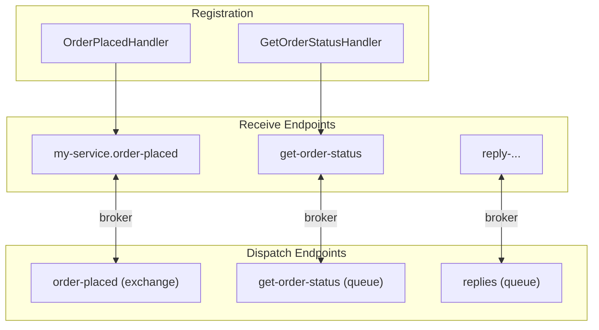

An endpoint is the combination of a transport address (a queue or exchange) and a pipeline that processes messages. Mocha distinguishes between receive endpoints (which consume) and dispatch endpoints (which produce). Every handler you register becomes a receive endpoint; every message you publish or send is dispatched through a dispatch endpoint. By default, Mocha creates endpoints automatically from your handler and message types using naming conventions. Most applications never touch routing configuration directly - but you can configure the topology yourself completely when the defaults don't fit.

This page explains what those conventions do, how to verify they produce the topology you expect, and how to override them when the defaults don't fit.

# The endpoint model

When you register handlers and pick a transport, Mocha wires up both sides of the messaging connection automatically:

```csharp
builder.Services
    .AddMessageBus()
    .AddEventHandler<OrderPlacedHandler>()
    .AddRequestHandler<GetOrderStatusHandler>()
    .AddRabbitMQ();
```

<TopologyVisualization data='{"services":[{"host":{"serviceName":"MyService","assemblyName":"MyService.dll","instanceId":"my-svc-1"},"messageTypes":[{"identity":"msg:OrderPlacedEvent","runtimeType":"OrderPlacedEvent","runtimeTypeFullName":"MyApp.Messages.OrderPlacedEvent","isInterface":false,"isInternal":false},{"identity":"msg:GetOrderStatusRequest","runtimeType":"GetOrderStatusRequest","runtimeTypeFullName":"MyApp.Messages.GetOrderStatusRequest","isInterface":false,"isInternal":false}],"consumers":[{"name":"OrderPlacedHandler","identityType":"OrderPlacedHandler","identityTypeFullName":"MyApp.Handlers.OrderPlacedHandler"},{"name":"GetOrderStatusHandler","identityType":"GetOrderStatusHandler","identityTypeFullName":"MyApp.Handlers.GetOrderStatusHandler"}],"routes":{"inbound":[{"kind":"subscribe","messageTypeIdentity":"msg:OrderPlacedEvent","consumerName":"OrderPlacedHandler","endpoint":{"name":"my-service.order-placed","address":"rabbitmq://localhost/my-service.order-placed","transportName":"RabbitMQ"}},{"kind":"request","messageTypeIdentity":"msg:GetOrderStatusRequest","consumerName":"GetOrderStatusHandler","endpoint":{"name":"get-order-status","address":"rabbitmq://localhost/get-order-status","transportName":"RabbitMQ"}}],"outbound":[{"kind":"publish","messageTypeIdentity":"msg:OrderPlacedEvent","endpoint":{"name":"order-placed","address":"rabbitmq://localhost/order-placed","transportName":"RabbitMQ"}},{"kind":"send","messageTypeIdentity":"msg:GetOrderStatusRequest","endpoint":{"name":"get-order-status","address":"rabbitmq://localhost/get-order-status","transportName":"RabbitMQ"}}]},"sagas":[]}],"transports":[{"identifier":"rabbitmq://localhost:5672/","name":"RabbitMQ","schema":"rabbitmq","transportType":"RabbitMQMessagingTransport","receiveEndpoints":[{"name":"my-service.order-placed","kind":"default","address":"rabbitmq://localhost/my-service.order-placed","source":{"address":"rabbitmq://localhost:5672/q/my-service.order-placed"}},{"name":"get-order-status","kind":"default","address":"rabbitmq://localhost/get-order-status","source":{"address":"rabbitmq://localhost:5672/q/get-order-status"}}],"dispatchEndpoints":[{"name":"order-placed","kind":"default","address":"rabbitmq://localhost/order-placed","destination":{"address":"rabbitmq://localhost:5672/e/order-placed"}},{"name":"get-order-status","kind":"default","address":"rabbitmq://localhost/get-order-status","destination":{"address":"rabbitmq://localhost:5672/q/get-order-status"}}],"topology":{"address":"rabbitmq://localhost:5672/","entities":[{"kind":"exchange","name":"order-placed","address":"rabbitmq://localhost:5672/e/order-placed","flow":"inbound","properties":{"type":"fanout","durable":true,"autoDelete":false,"autoProvision":true}},{"kind":"exchange","name":"my-service.order-placed","address":"rabbitmq://localhost:5672/e/my-service.order-placed","flow":"inbound","properties":{"type":"fanout","durable":true,"autoDelete":false,"autoProvision":true}},{"kind":"queue","name":"my-service.order-placed","address":"rabbitmq://localhost:5672/q/my-service.order-placed","flow":"outbound","properties":{"durable":true,"exclusive":false,"autoDelete":false,"autoProvision":true}},{"kind":"queue","name":"get-order-status","address":"rabbitmq://localhost:5672/q/get-order-status","flow":"outbound","properties":{"durable":true,"exclusive":false,"autoDelete":false,"autoProvision":true}}],"links":[{"kind":"bind","address":"rabbitmq://localhost:5672/b/e/order-placed/e/my-service.order-placed","source":"rabbitmq://localhost:5672/e/order-placed","target":"rabbitmq://localhost:5672/e/my-service.order-placed","direction":"forward","properties":{"routingKey":null,"autoProvision":true}},{"kind":"bind","address":"rabbitmq://localhost:5672/b/e/my-service.order-placed/q/my-service.order-placed","source":"rabbitmq://localhost:5672/e/my-service.order-placed","target":"rabbitmq://localhost:5672/q/my-service.order-placed","direction":"forward","properties":{"routingKey":null,"autoProvision":true}}]}}]}' />

That registration produces:

- A **receive endpoint** named `my-service.order-placed` (subscribe route, bound to `OrderPlacedHandler`)
- A **receive endpoint** named `get-order-status` (request route, bound to `GetOrderStatusHandler`)
- A **dispatch endpoint** for publishing `OrderPlacedEvent`
- A **dispatch endpoint** for sending `GetOrderStatusRequest`
- A **reply receive endpoint** for inbound responses
- A **reply dispatch endpoint** for outbound responses
- **Error endpoints** (`_error` suffix) for each receive endpoint

All derived from your handler types and message types through naming conventions.



This is the default behavior: you declare what you handle, and the framework derives the endpoints and routes from those declarations. You can configure everything manually when you need to override a convention.

# How routing works

Mocha maintains two kinds of routes that work together to move messages between services.

## Inbound routes

An inbound route connects a message type to a receive endpoint. When you register a handler with `.AddEventHandler<T>()` or `.AddRequestHandler<T>()`, Mocha creates an inbound route that tells the transport which messages to deliver to which consumer.

| Handler interface                           | Route kind | Endpoint type                                 |
| ------------------------------------------- | ---------- | --------------------------------------------- |
| `IEventHandler<T>`, `IBatchEventHandler<T>` | Subscribe  | Queue bound to an exchange or topic (fan-out) |
| `IEventRequestHandler<TRequest>`            | Send       | Dedicated queue (point-to-point)              |
| `IEventRequestHandler<TRequest, TResponse>` | Request    | Dedicated queue (point-to-point)              |

## Outbound routes

An outbound route connects a message type to a dispatch endpoint. When you call `bus.PublishAsync<T>()` or `bus.SendAsync()`, Mocha looks up the outbound route for the message type and dispatches through the corresponding endpoint.

**Routing priority:** Mocha resolves outbound routes in this order:

1. If an explicit route is registered with `AddMessage<T>()`, use it.
2. Otherwise, derive the endpoint name from naming conventions.

When a message goes somewhere unexpected, open the topology visualizer first - it shows you the complete routing picture at a glance. If you need to dig deeper, check for an explicit `AddMessage<T>()` registration, then check what the conventions produce.

## Startup-time topology

Mocha resolves all endpoints and builds broker topology when the bus starts, not when the first message is sent. If your exchange or queue configuration is invalid - a mis-spelled exchange name, an incompatible binding - you will know at startup. Topology errors surface immediately, not silently on the first `SendAsync` call.

This design is reflected in the [Message Endpoint](https://www.enterpriseintegrationpatterns.com/patterns/messaging/MessageEndpoint.html) pattern: an endpoint bridges your application code to the messaging infrastructure, and that bridge is established at initialization time.

# Naming conventions

Mocha derives endpoint names automatically from your handler and message types. PascalCase type names become kebab-case; common suffixes (`Handler`, `Consumer`, `Command`, `Event`, `Message`, `Query`, `Response`) are stripped.

## Set the service name

For subscribe (pub/sub) endpoints, the naming convention prefixes the endpoint name with the service name:

```csharp
builder.Services
    .AddMessageBus()
    .Host(h => h.ServiceName("order-service"))
    .AddEventHandler<OrderPlacedHandler>()
    .AddRabbitMQ();
```

The receive endpoint is named `order-service.order-placed`. Without the `.Host()` call, the service name defaults to the `SERVICE_NAME` or `OTEL_SERVICE_NAME` environment variable, or falls back to the entry assembly name.

> **Why the service prefix?**
>
> Events use fan-out delivery: a single published message is delivered to every subscribing service. For fan-out to work correctly with point-to-point queues, each subscribing service needs its own queue. Without a service-specific prefix, two services consuming the same event would share a single queue and compete for messages - each service would only process half the events.
>
> The service prefix is what makes each service's queue unique. See [Point-to-Point Channel](https://www.enterpriseintegrationpatterns.com/patterns/messaging/PointToPointChannel.html) for the full explanation of why fan-out and point-to-point channels work this way.

## Receive endpoint naming

For **subscribe** routes (event handlers), the endpoint name combines the service name with the handler name:

| Handler type              | Service name | Endpoint name                |
| ------------------------- | ------------ | ---------------------------- |
| `OrderPlacedEventHandler` | `catalog`    | `catalog.order-placed-event` |
| `BillingHandler`          | `billing`    | `billing.billing`            |
| `OrderAuditConsumer`      | `audit`      | `audit.order-audit`          |

The `Handler` and `Consumer` suffixes are stripped. The service name prefix ensures each service gets its own queue for the same event type.

For **send** and **request** routes, the endpoint name comes from the message type directly, without a service prefix:

| Message type              | Endpoint name       |
| ------------------------- | ------------------- |
| `ReserveInventoryCommand` | `reserve-inventory` |
| `ProcessRefundCommand`    | `process-refund`    |
| `GetProductRequest`       | `get-product`       |

Send endpoints are shared across services: any service sending `ReserveInventoryCommand` dispatches to the same `reserve-inventory` queue. There is only one destination for a command - that's the point-to-point guarantee.

## Publish endpoint naming

For publish (fan-out) endpoints, the name includes the message namespace in kebab-case:

| Message type            | Namespace               | Endpoint name                             |
| ----------------------- | ----------------------- | ----------------------------------------- |
| `OrderPlacedEvent`      | `Demo.Contracts.Events` | `demo.contracts.events.order-placed`      |
| `PaymentCompletedEvent` | `Demo.Contracts.Events` | `demo.contracts.events.payment-completed` |

## Special endpoint names

| Purpose       | Name pattern         | Example                                     |
| ------------- | -------------------- | ------------------------------------------- |
| Error queue   | `{endpoint}_error`   | `catalog.order-placed-event_error`          |
| Skipped queue | `{endpoint}_skipped` | `catalog.order-placed-event_skipped`        |
| Reply queue   | `response-{guid:N}`  | `response-3f2504e04f8911d39a0c0305e82c3301` |

Error queues receive messages that failed processing. Skipped queues receive messages that no consumer could handle. Reply queues are temporary, per-instance queues used for request/reply correlation.

# Customize outbound routes

To override where a message is sent or published, use `AddMessage<T>()` with a route configuration:

```csharp
builder.Services
    .AddMessageBus()
    .AddEventHandler<OrderPlacedHandler>()
    .AddMessage<OrderPlacedEvent>(m =>
    {
        m.Publish(r => r.ToExchange("custom-orders-exchange"));
    })
    .AddRabbitMQ();
```

`OrderPlacedEvent` now publishes to `custom-orders-exchange` instead of the convention-derived name. This is an explicit route - it takes priority over naming conventions. The receive endpoint is unaffected; it still subscribes based on the handler's message type.

For send (point-to-point) routes:

```csharp
builder.Services
    .AddMessageBus()
    .AddMessage<ProcessPaymentCommand>(m =>
    {
        m.Send(r => r.ToQueue("payment-processing-queue"));
    })
    .AddRabbitMQ();
```

Use these extension methods to target specific destination types when configuring outbound routes:

| Method             | URI Scheme  | Example                           |
| ------------------ | ----------- | --------------------------------- |
| `ToQueue(name)`    | `queue:`    | `r.ToQueue("payment-queue")`      |
| `ToExchange(name)` | `exchange:` | `r.ToExchange("events-exchange")` |
| `ToTopic(name)`    | `topic:`    | `r.ToTopic("orders.placed")`      |

The URI schemes (`queue:`, `exchange:`, `topic:`) tell Mocha what kind of transport entity to target. `queue:` addresses a point-to-point queue directly. `exchange:` addresses a fan-out exchange (RabbitMQ) or equivalent. `topic:` addresses a topic-based routing entity. The transport interprets these schemes and maps them to its native concepts.

To bypass routing entirely and send to a specific address at call time, pass a `SendOptions`:

```csharp
await bus.SendAsync(new ReserveInventoryCommand
{
    OrderId = orderId,
    ProductId = productId,
    Quantity = 3
},
new SendOptions
{
    Endpoint = new Uri("rabbitmq://custom-inventory-queue")
},
cancellationToken);
```

# Bind consumers to endpoints

## Implicit binding (default)

By default, the transport uses implicit binding. Every registered handler is automatically bound to a receive endpoint named by convention:

```csharp
builder.Services
    .AddMessageBus()
    .AddEventHandler<OrderPlacedHandler>()     // -> receive endpoint: my-service.order-placed
    .AddEventHandler<PaymentReceivedHandler>()  // -> receive endpoint: my-service.payment-received
    .AddRabbitMQ();
```

## Explicit binding

Switch to explicit binding when you need full control over which handlers run on which endpoints. With explicit binding, the transport does not auto-discover endpoints - you must declare each one:

```csharp
builder.Services
    .AddMessageBus()
    .AddEventHandler<OrderPlacedHandler>()
    .AddEventHandler<PaymentReceivedHandler>()
    .AddRabbitMQ(transport =>
    {
        transport.BindHandlersExplicitly();

        // Bind both handlers to the same endpoint
        transport.Endpoint("combined-orders")
            .Handler<OrderPlacedHandler>()
            .Handler<PaymentReceivedHandler>();
    });
```

Both handlers now consume from the same `combined-orders` queue. Without explicit binding, they would each get their own endpoint.

## Configure endpoint settings

Whether you use implicit or explicit binding, you can configure per-endpoint settings through the endpoint descriptor:

```csharp
builder.Services
    .AddMessageBus()
    .AddEventHandler<OrderPlacedHandler>()
    .AddRabbitMQ(rabbit =>
    {
        rabbit.Endpoint("order-processing")
            .Handler<OrderPlacedHandler>()
            .MaxConcurrency(5)
            .FaultEndpoint("order-errors")
            .SkippedEndpoint("order-skipped");
    });
```

For outbound endpoints:

```csharp
builder.Services
    .AddMessageBus()
    .AddRabbitMQ(transport =>
    {
        transport.DispatchEndpoint("custom-dispatch")
            .Publish<OrderPlacedEvent>()
            .Send<ProcessPaymentCommand>();
    });
```

# Scope precedence

Configuration in Mocha follows a three-level scope hierarchy: **bus > transport > endpoint**. The most specific scope wins.

```text
Bus (global defaults)
  -> Transport (transport-specific overrides)
    -> Endpoint (per-endpoint overrides)
```

This applies to middleware pipelines, circuit breakers, concurrency limiters, and any feature that can be configured at multiple levels:

```csharp
builder.Services
    .AddMessageBus()
    .AddConcurrencyLimiter(opts => opts.MaxConcurrency = 20) // bus-level default
    .AddRabbitMQ(transport =>
    {
        transport.AddConcurrencyLimiter(opts => opts.MaxConcurrency = 10); // transport override

        transport.Endpoint("high-throughput")
            .MaxConcurrency(50); // endpoint override
    });
```

The `high-throughput` endpoint processes 50 messages concurrently. All other RabbitMQ endpoints use 10. Endpoints on other transports use the bus default of 20.

The middleware pipeline is compiled per-endpoint from the same three layers: bus middleware runs first, then transport middleware, then endpoint middleware. This means a retry policy registered at the bus level applies everywhere, but you can add an extra circuit breaker only for a specific endpoint. Other pages in this documentation reference this scope hierarchy as the canonical model - it governs middleware, reliability features, and observability configuration uniformly.

# Next steps

Your routing and endpoint configuration is set. From here:

- [**Middleware and Pipelines**](/docs/mocha/v1/middleware-and-pipelines) - Write custom middleware, control pipeline ordering, and understand how the three pipeline stages interact. Want to customize the processing pipeline? That's the next page.
- [**Reliability**](/docs/mocha/v1/reliability) - Configure fault handling, circuit breakers, concurrency limits, and the transactional outbox.
- [**Transports**](/docs/mocha/v1/transports) - Dive into transport-specific configuration for RabbitMQ and InMemory.
