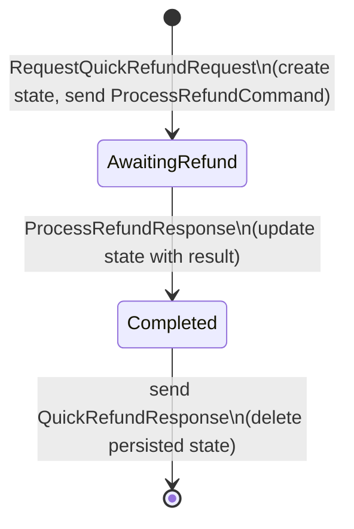

# Sagas

The saga pattern was introduced by Garcia-Molina & Salem in 1987 as a way to manage long-lived transactions without holding distributed locks. In a messaging system, sagas implement the [Process Manager pattern](https://www.enterpriseintegrationpatterns.com/patterns/messaging/ProcessManager.html) from Enterprise Integration Patterns -- they coordinate a sequence of messages, track state across them, and drive a business process to completion. Mocha sagas use orchestration-style coordination: one central state machine issues commands and waits for replies, rather than choreographing services through shared events. See [microservices.io](https://microservices.io/patterns/data/saga.html) and the [Microsoft Azure Architecture: Saga pattern](https://learn.microsoft.com/en-us/azure/architecture/patterns/saga) for broader context on the pattern.

A saga loads or creates state when a message arrives, applies the configured transition, dispatches any side-effects (publish or send), and persists the result. When the saga reaches a final state, its persisted state is deleted and an optional response is sent back to the originator.

# When to use sagas vs. handlers

| Scenario                                     | Use a handler | Use a saga |
| -------------------------------------------- | ------------- | ---------- |
| Single message in, single action out         | Yes           | No         |
| Process completes in one step                | Yes           | No         |
| Process spans multiple messages over time    | No            | Yes        |
| Need to coordinate parallel operations       | No            | Yes        |
| Need persistent state across failures        | No            | Yes        |
| Need to send a response after multiple steps | No            | Yes        |

Handlers are simpler and appropriate when a single message triggers a single action. Sagas add value when the workflow requires multiple steps, waits for replies, or must survive process restarts.

A common mistake is using a saga for work that fits in a handler. If your handler calls `SendAsync` and does not need to wait for a reply before responding, a plain handler is sufficient. Reach for a saga when the process must pause and resume based on future messages.

# State machine diagram

The refund saga built in the tutorial below has three states. Each arrow is labeled with the message that triggers the transition:



This is the shape you will build in the tutorial. Keep this diagram in mind as you work through the steps -- each code block maps to one of these transitions.

> **Warning: messages can arrive out of order.**
>
> In a distributed system, message delivery order is not guaranteed. If your saga handles two message types that could both initiate the process, configure both as initial transitions. Do not assume the first message you define in code is the first message the saga will receive in production.

# Tutorial: Build a refund saga

By the end of this section, you will have a working saga that receives a refund request, sends a command to the billing service, and returns a response when the refund completes.

## Define the saga state

Saga state must extend `SagaStateBase`. This base class provides `Id` (unique saga instance identifier), `State` (current state name), `Errors` (error history), and `Metadata` (custom key-value data).

```csharp
using Mocha.Sagas;

namespace MyApp.Sagas;

public class RefundSagaState : SagaStateBase
{
    // Order information captured when the saga starts
    public required Guid OrderId { get; init; }
    public required decimal Amount { get; init; }
    public required string CustomerId { get; init; }
    public required string Reason { get; init; }

    // Results populated during processing
    public Guid? RefundId { get; set; }
    public decimal? RefundedAmount { get; set; }
    public string? FailureReason { get; set; }

    // Factory method to create state from the initiating request
    public static RefundSagaState FromQuickRefund(RequestQuickRefundRequest request)
        => new()
        {
            OrderId = request.OrderId,
            Amount = request.Amount,
            CustomerId = request.CustomerId,
            Reason = request.Reason
        };

    // Helper to create the command sent to billing
    public ProcessRefundCommand ToProcessRefund()
        => new()
        {
            OrderId = OrderId,
            Amount = Amount,
            Reason = Reason,
            CustomerId = CustomerId
        };
}
```

Properties marked `required` are set when the saga starts. Mutable properties (`set`) are updated as transitions execute. The factory method converts the initiating message into the state object. Helper methods create the commands the saga dispatches to other services.

## Define the message contracts

```csharp
using Mocha;

namespace MyApp.Messages;

// The request that starts the saga (implements IEventRequest for request/reply)
public sealed class RequestQuickRefundRequest : IEventRequest<QuickRefundResponse>
{
    public required Guid OrderId { get; init; }
    public required decimal Amount { get; init; }
    public required string CustomerId { get; init; }
    public required string Reason { get; init; }
}

// The response returned when the saga completes
public sealed class QuickRefundResponse
{
    public required Guid OrderId { get; init; }
    public required bool Success { get; init; }
    public Guid? RefundId { get; init; }
    public decimal? RefundedAmount { get; init; }
    public string? FailureReason { get; init; }
    public required DateTimeOffset CompletedAt { get; init; }
}

// Command sent by the saga to the billing service
public sealed class ProcessRefundCommand : IEventRequest<ProcessRefundResponse>
{
    public required Guid OrderId { get; init; }
    public required decimal Amount { get; init; }
    public required string Reason { get; init; }
    public required string CustomerId { get; init; }
}

// Response from the billing service
public sealed class ProcessRefundResponse
{
    public required Guid RefundId { get; init; }
    public required Guid OrderId { get; init; }
    public required decimal Amount { get; init; }
    public required bool Success { get; init; }
    public string? FailureReason { get; init; }
    public required DateTimeOffset ProcessedAt { get; init; }
}
```

## Define the saga

Subclass `Saga<TState>` and override `Configure` to define the state machine.

```csharp
using Mocha.Sagas;
using MyApp.Messages;

namespace MyApp.Sagas;

public sealed class QuickRefundSaga : Saga<RefundSagaState>
{
    // State name constants
    private const string AwaitingRefund = nameof(AwaitingRefund);
    private const string Completed = nameof(Completed);

    protected override void Configure(ISagaDescriptor<RefundSagaState> descriptor)
    {
        // 1. Initial state: receive the refund request, create state, send command to billing
        descriptor
            .Initially()
            .OnRequest<RequestQuickRefundRequest>()
            .StateFactory(RefundSagaState.FromQuickRefund)
            .Send((_, state) => state.ToProcessRefund())
            .TransitionTo(AwaitingRefund);

        // 2. Awaiting refund: handle the billing service's reply
        descriptor
            .During(AwaitingRefund)
            .OnReply<ProcessRefundResponse>()
            .Then((state, response) =>
            {
                if (response.Success)
                {
                    state.RefundId = response.RefundId;
                    state.RefundedAmount = response.Amount;
                }
                else
                {
                    state.FailureReason = response.FailureReason
                        ?? "Refund processing failed";
                }
            })
            .TransitionTo(Completed);

        // 3. Final state: build and send the response back to the original requester
        descriptor
            .Finally(Completed)
            .Respond(state => new QuickRefundResponse
            {
                OrderId = state.OrderId,
                Success = state.RefundId.HasValue,
                RefundId = state.RefundId,
                RefundedAmount = state.RefundedAmount,
                FailureReason = state.FailureReason,
                CompletedAt = DateTimeOffset.UtcNow
            });
    }
}
```

The state machine has three states:

1. **Initial** -- receives `RequestQuickRefundRequest`, creates `RefundSagaState`, sends `ProcessRefundCommand` to billing, transitions to `AwaitingRefund`.
2. **AwaitingRefund** -- receives `ProcessRefundResponse` from billing, updates state with the result, transitions to `Completed`.
3. **Completed** (final) -- builds `QuickRefundResponse` from state and sends it back to the original caller. The persisted saga state is then deleted.

## Register the saga

```csharp
var builder = WebApplication.CreateBuilder(args);

builder.Services
    .AddMessageBus()
    .AddSaga<QuickRefundSaga>()
    .AddRabbitMQ();

var app = builder.Build();
app.Run();
```

`.AddSaga<T>()` registers the saga with the bus. The saga's consumer is created automatically and listens for the message types defined in the state machine transitions.

## Trigger the saga

From the sender side, use `RequestAsync` to start the saga and await the final response:

```csharp
var response = await bus.RequestAsync(
    new RequestQuickRefundRequest
    {
        OrderId = orderId,
        Amount = 49.99m,
        CustomerId = "customer-42",
        Reason = "Defective product"
    },
    cancellationToken);

Console.WriteLine($"Refund {response.RefundId}: success={response.Success}");
```

Expected output:

```text
info: Mocha.Sagas.Saga[0]
      Created saga state QuickRefundSaga 3f2504e0-4f89-11d3-9a0c-0305e82c3301
info: Mocha.Sagas.Saga[0]
      Entering state QuickRefundSaga Initial
info: Mocha.Sagas.Saga[0]
      Sending event QuickRefundSaga ProcessRefundCommand
info: Mocha.Sagas.Saga[0]
      Transitioning state QuickRefundSaga AwaitingRefund by event ProcessRefundResponse
info: Mocha.Sagas.Saga[0]
      Entering state QuickRefundSaga Completed
info: Mocha.Sagas.Saga[0]
      Replying to saga QuickRefundSaga ... QuickRefundResponse
info: Mocha.Sagas.Saga[0]
      Saga completed QuickRefundSaga 3f2504e0-4f89-11d3-9a0c-0305e82c3301
Refund d4c3b2a1-...: success=True
```

The saga receives the request, sends a command to billing, waits for the reply, builds a response, and completes. The caller's `RequestAsync` resolves with the typed `QuickRefundResponse`.

# How-to guides

## Coordinate parallel operations

When a saga needs to wait for multiple replies before proceeding, model each combination as a separate state. The `ReturnProcessingSaga` demonstrates this pattern -- after inspection, it sends both a refund command and a restock command in parallel, then handles whichever reply arrives first.

```csharp
public sealed class ReturnProcessingSaga : Saga<RefundSagaState>
{
    private const string AwaitingInspection = nameof(AwaitingInspection);
    private const string AwaitingBothReplies = nameof(AwaitingBothReplies);
    private const string RestockDoneAwaitingRefund = nameof(RestockDoneAwaitingRefund);
    private const string RefundDoneAwaitingRestock = nameof(RefundDoneAwaitingRestock);
    private const string Completed = nameof(Completed);

    protected override void Configure(ISagaDescriptor<RefundSagaState> descriptor)
    {
        // Start: package received, send inspection command
        descriptor
            .Initially()
            .OnEvent<ReturnPackageReceivedEvent>()
            .StateFactory(RefundSagaState.FromReturnPackageReceived)
            .Send((_, state) => state.ToInspectReturn())
            .TransitionTo(AwaitingInspection);

        // After inspection: send refund AND restock in parallel
        descriptor
            .During(AwaitingInspection)
            .OnReply<InspectReturnResponse>()
            .Then((state, response) => state.InspectionResult = response.Result)
            .Send((_, state) => state.ToRestockInventory())
            .Send((_, state) => state.ToProcessRefund())
            .TransitionTo(AwaitingBothReplies);

        // Restock arrives first
        descriptor
            .During(AwaitingBothReplies)
            .OnReply<RestockInventoryResponse>()
            .Then((state, response) =>
            {
                state.InventoryRestocked = response.Success;
                state.QuantityRestocked = response.QuantityRestocked;
            })
            .TransitionTo(RestockDoneAwaitingRefund);

        // Refund arrives first
        descriptor
            .During(AwaitingBothReplies)
            .OnReply<ProcessRefundResponse>()
            .Then((state, response) =>
            {
                if (response.Success)
                {
                    state.RefundId = response.RefundId;
                    state.RefundedAmount = response.Amount;
                }
                else
                {
                    state.FailureReason = response.FailureReason;
                }
            })
            .TransitionTo(RefundDoneAwaitingRestock);

        // Second reply arrives: restock after refund
        descriptor
            .During(RefundDoneAwaitingRestock)
            .OnReply<RestockInventoryResponse>()
            .Then((state, response) =>
            {
                state.InventoryRestocked = response.Success;
                state.QuantityRestocked = response.QuantityRestocked;
            })
            .TransitionTo(Completed);

        // Second reply arrives: refund after restock
        descriptor
            .During(RestockDoneAwaitingRefund)
            .OnReply<ProcessRefundResponse>()
            .Then((state, response) =>
            {
                if (response.Success)
                {
                    state.RefundId = response.RefundId;
                    state.RefundedAmount = response.Amount;
                }
                else
                {
                    state.FailureReason = response.FailureReason;
                }
            })
            .TransitionTo(Completed);

        // Done
        descriptor.Finally(Completed);
    }
}
```

The key insight: `AwaitingBothReplies` has two transitions, one for each reply type. Whichever arrives first moves the saga to a "one done, waiting for the other" state. The second reply completes the saga. This avoids race conditions without explicit locking.

## Start a saga from an event

Not all sagas begin with a request/reply. Use `.OnEvent<T>()` instead of `.OnRequest<T>()` when the saga is initiated by a published event.

```csharp
descriptor
    .Initially()
    .OnEvent<ReturnPackageReceivedEvent>()
    .StateFactory(RefundSagaState.FromReturnPackageReceived)
    .Send((_, state) => state.ToInspectReturn())
    .TransitionTo(AwaitingInspection);
```

When using `.OnEvent<T>()`, the saga does not capture a reply address. No response is sent when the saga completes. Use `.OnRequest<T>()` when the caller expects a response via `RequestAsync`.

## Publish events from transitions

To publish an event as a side-effect of a transition, use `.Publish()` on the transition descriptor:

```csharp
descriptor
    .During(AwaitingRefund)
    .OnReply<ProcessRefundResponse>()
    .Then((state, response) =>
    {
        state.RefundId = response.RefundId;
        state.RefundedAmount = response.Amount;
    })
    .Publish((_, state) => new RefundCompletedEvent
    {
        OrderId = state.OrderId,
        RefundId = state.RefundId!.Value,
        Amount = state.RefundedAmount!.Value
    })
    .TransitionTo(Completed);
```

`.Publish()` dispatches the event after the transition action runs. The saga automatically adds the `saga-id` header to published messages so downstream consumers can correlate them back to the saga instance.

## Publish or send on state entry

To dispatch messages when entering a state (not tied to a specific transition), use `.OnEntry()` on the state descriptor:

```csharp
descriptor
    .During(AwaitingInspection)
    .OnEntry()
    .Publish(state => new InspectionStartedEvent
    {
        OrderId = state.OrderId,
        ReturnId = state.ReturnId!.Value
    });
```

On-entry actions run every time the saga enters that state, regardless of which transition caused it.

## Handle faults and compensation

### Compensating transactions

When a service-spanning process fails partway through, you cannot roll back completed steps the way a database transaction would. Instead, you issue compensating transactions -- commands that logically undo the work already done. For example, if a refund succeeds but restocking fails, you may need to reverse the refund.

This is a fundamental property of distributed systems: without distributed ACID isolation, partial failure is always possible. The [Microsoft Azure Architecture documentation](https://learn.microsoft.com/en-us/azure/architecture/patterns/saga) classifies transactions in a saga as compensable (can be undone), pivot (the point of no return), or retryable (will eventually succeed). Design your `OnFault()` handlers with this taxonomy in mind.

### Implement fault handling

When a command sent by a saga fails, the receiving service sends a `NotAcknowledgedEvent` back instead of the expected reply. Use `OnFault()` to define a transition that handles this case and runs compensation logic.

```csharp
descriptor
    .During(AwaitingRefund)
    .OnFault()
    .Then((state, fault) =>
    {
        state.FailureReason = fault.ErrorMessage;
        state.FailureStage = "Refund";
    })
    .Send((_, state) => new ReverseChargeCommand
    {
        OrderId = state.OrderId,
        Amount = state.Amount
    })
    .TransitionTo("Compensating");
```

`OnFault()` is an extension method on `ISagaStateDescriptor<TState>` that registers a transition for `NotAcknowledgedEvent`. The fault record carries `ErrorCode`, `ErrorMessage`, `CorrelationId`, and `MessageId` so your compensation logic can identify what failed.

For sagas that send multiple commands in parallel, add `OnFault()` transitions in each waiting state. This ensures you can compensate regardless of which step failed.

## Handle timeouts

Long-running sagas may need to protect against the case where an expected reply never arrives. Use `OnTimeout()` to define what happens when the saga has been waiting too long.

### Schedule a timeout when entering a waiting state

Register the timeout as an on-entry action on the state that needs a deadline:

```csharp
descriptor
    .During(AwaitingRefund)
    .OnEntry()
    .ScheduleTimeout(TimeSpan.FromMinutes(5));  // fire SagaTimedOutEvent after 5 minutes

descriptor
    .During(AwaitingRefund)
    .OnTimeout()
    .Then((state, _) =>
    {
        state.FailureReason = "Refund timed out after waiting 5 minutes";
    })
    .Send((_, state) => new ReverseChargeCommand
    {
        OrderId = state.OrderId,
        Amount = state.Amount
    })
    .TransitionTo("TimedOut");

descriptor.Finally("TimedOut")
    .Respond(state => new QuickRefundResponse
    {
        OrderId = state.OrderId,
        Success = false,
        FailureReason = state.FailureReason,
        CompletedAt = DateTimeOffset.UtcNow
    });
```

When the saga transitions out of `AwaitingRefund` via a normal reply, the scheduled timeout is cancelled automatically. If the timeout fires first, `OnTimeout()` runs the configured transition -- in this case, dispatching compensation and moving to `TimedOut`.

### What to do when a timeout fires

A fired timeout means the downstream service did not reply within the expected window. Common responses:

- Transition to a compensation state and issue undo commands for completed steps.
- Transition to a final state and send a failure response back to the original caller.
- Transition to a retry state and re-send the original command (only if idempotent).

Do not leave the saga in the same waiting state after a timeout. The saga must advance so it does not wait forever.

## Configure saga persistence with Postgres

By default, saga state is stored in memory and lost on restart. For production, use a persistent store. Mocha provides a Postgres-backed saga store via Entity Framework Core.

**1. Add the EF Core entity to your `DbContext`.**

```csharp
using Microsoft.EntityFrameworkCore;
using Mocha.Sagas.EfCore;

public class CatalogDbContext : DbContext
{
    public DbSet<SagaState> SagaStates => Set<SagaState>();

    protected override void OnModelCreating(ModelBuilder modelBuilder)
    {
        // Configure the saga state table
        modelBuilder.AddPostgresSagas();
    }
}
```

**2. Register the Postgres saga store with the bus.**

```csharp
builder.Services
    .AddMessageBus()
    .AddSaga<QuickRefundSaga>()
    .AddSaga<ReturnProcessingSaga>()
    .AddEntityFramework<CatalogDbContext>(p =>
    {
        p.AddPostgresSagas();
    })
    .AddRabbitMQ();
```

**3. Create an EF Core migration.**

```bash
dotnet ef migrations add Sagas
dotnet ef database update
```

## Create a saga with the fluent API

For simple sagas that do not need a dedicated class, use `Saga.Create<TState>()`:

```csharp
var saga = Saga.Create<RefundSagaState>(descriptor =>
{
    descriptor
        .Initially()
        .OnRequest<RequestQuickRefundRequest>()
        .StateFactory(RefundSagaState.FromQuickRefund)
        .Send((_, state) => state.ToProcessRefund())
        .TransitionTo("AwaitingRefund");

    descriptor
        .During("AwaitingRefund")
        .OnReply<ProcessRefundResponse>()
        .Then((state, response) =>
        {
            state.RefundId = response.RefundId;
            state.RefundedAmount = response.Amount;
        })
        .TransitionTo("Completed");

    descriptor
        .Finally("Completed")
        .Respond(state => new QuickRefundResponse
        {
            OrderId = state.OrderId,
            Success = state.RefundId.HasValue,
            RefundId = state.RefundId,
            RefundedAmount = state.RefundedAmount,
            FailureReason = state.FailureReason,
            CompletedAt = DateTimeOffset.UtcNow
        });
});
```

This produces the same state machine as the class-based approach. The fluent API is useful for tests and prototyping.

# Concurrency

If two messages for the same saga instance arrive simultaneously -- for example, two parallel replies landing within milliseconds of each other -- one succeeds and the other retries. The Postgres saga store uses optimistic concurrency with a version column. The second writer detects the version mismatch, reloads the latest state, and retries the transition.

This retry is automatic and transparent. You do not need to handle it in your saga code. However, if a saga endpoint processes a very high volume of concurrent messages for the same instance, retry contention can add latency. In that case, consider hosting high-concurrency sagas on dedicated endpoints with constrained parallelism.

# How saga correlation works

When a saga sends a command, Mocha attaches a `saga-id` header to the outgoing message. When the reply arrives, the saga runtime reads this header to find the existing saga instance and load its persisted state.

For event-initiated sagas, correlation uses the `ICorrelatable` interface:

```csharp
using Mocha.Sagas;

public sealed record SagaTimedOutEvent(Guid SagaId) : ICorrelatable
{
    public Guid? CorrelationId => SagaId;
}
```

Messages that implement `ICorrelatable` are matched to saga instances by their `CorrelationId`. This is how sagas handle events that are not direct replies to commands the saga sent.

The correlation lookup order is:

1. Check if the message implements `ICorrelatable` and has a non-null `CorrelationId`.
2. Check the message headers for a `saga-id` header.
3. If neither is found, treat the message as an initiating event and create a new saga instance.

# Next steps

Learn how to test all of this in [Testing](/docs/mocha/v1/testing).
