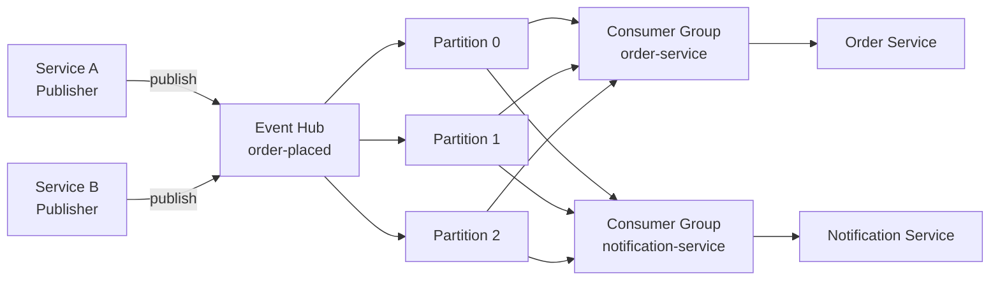

# Azure Event Hubs transport

The Azure Event Hubs transport connects Mocha to [Azure Event Hubs](https://learn.microsoft.com/en-us/azure/event-hubs/event-hubs-about) for high-throughput, partition-based messaging. It manages connections, batches outbound messages, checkpoints consumer progress, and supports request/reply with a dedicated reply hub. When you need streaming-scale event processing with ordered delivery within partitions, this is the transport to use.

```csharp
using Mocha;
using Mocha.Transport.AzureEventHub;

builder.Services
    .AddMessageBus()
    .AddEventHandler<OrderPlacedEventHandler>()
    .AddEventHub(t => t.ConnectionString(connectionString));
```

# When to choose Event Hubs

| Criterion         | RabbitMQ                                     | Azure Event Hubs                                                                                  |
| ----------------- | -------------------------------------------- | ------------------------------------------------------------------------------------------------- |
| Message model     | Queue-based, message consumed once per queue | Append-only log, multiple consumer groups read independently                                      |
| Ordering          | Per-queue FIFO                               | Per-partition ordering with partition keys                                                        |
| Throughput        | High (single digits MB/s per queue)          | Very high (1 MB/s ingress per partition, scales with partition count)                             |
| Retention         | Until consumed                               | Time-based retention (1 hour to 90 days depending on tier)                                        |
| Replay            | Not supported without re-publishing          | Consumer groups can rewind to any checkpoint                                                      |
| Infrastructure    | Self-hosted or managed broker                | Fully managed Azure service                                                                       |
| Local development | Docker container                             | [Azure Event Hubs emulator](https://learn.microsoft.com/en-us/azure/event-hubs/overview-emulator) |

Choose Event Hubs when you need partition-based parallelism, event replay, or native Azure integration. Choose RabbitMQ when you need traditional message queue semantics with per-message acknowledgement.

# Key concepts

If you have worked with Apache Kafka, Event Hubs will feel familiar. Here are the concepts that matter for configuring the transport.

**[Partitions](https://learn.microsoft.com/en-us/azure/event-hubs/event-hubs-features#partitions)** are ordered sequences of events within a hub. Each partition is an independent append-only log. Events with the same partition key always land on the same partition, which guarantees ordering for that key. The number of partitions determines your maximum parallelism per consumer group.

**[Consumer groups](https://learn.microsoft.com/en-us/azure/event-hubs/event-hubs-features#consumer-groups)** provide independent views of the event stream. Each consumer group tracks its own read position. Multiple services can subscribe to the same hub through different consumer groups without interfering with each other. The `$Default` consumer group exists on every hub.

**[Checkpointing](https://learn.microsoft.com/en-us/azure/event-hubs/event-processor-balance-partition-load#checkpointing)** is how consumers save their progress. After processing a batch of events, the consumer records the sequence number of the last processed event. On restart, the consumer resumes from the checkpoint rather than re-reading the entire stream.



The transport uses **shared hubs** with **service-specific consumer groups**. When multiple services subscribe to the same event, each service gets its own consumer group on the shared hub. This means every service receives every event independently.

# Set up the Azure Event Hubs transport

By the end of this section, you will have a Mocha bus connected to Azure Event Hubs with automatic topology discovery.

## Install the package

```bash
dotnet add package Mocha.Transport.AzureEventHub
```

## Register with a connection string

The quickest way to get started is with a connection string:

```csharp
using Mocha;
using Mocha.Transport.AzureEventHub;

var builder = WebApplication.CreateBuilder(args);

var connectionString = builder.Configuration.GetConnectionString("eventhubs")
    ?? throw new InvalidOperationException("Missing eventhubs connection string");

builder.Services
    .AddMessageBus()
    .AddEventHandler<OrderPlacedEventHandler>()
    .AddEventHub(t => t.ConnectionString(connectionString));

var app = builder.Build();
app.Run();
```

`.AddEventHub()` registers the transport, applies default conventions, and wires up the dispatch and receive pipelines. Default conventions automatically create receive endpoints for your registered handlers and dispatch endpoints for the message types they consume.

## Register with Azure Identity

For production workloads, use [DefaultAzureCredential](https://learn.microsoft.com/en-us/dotnet/api/azure.identity.defaultazurecredential) instead of connection strings:

```csharp
builder.Services
    .AddMessageBus()
    .AddEventHandler<OrderPlacedEventHandler>()
    .AddEventHub(t => t.Namespace("mynamespace.servicebus.windows.net"));
```

The `.Namespace()` method configures the transport to authenticate with `DefaultAzureCredential`. This supports managed identity, Azure CLI credentials, environment variables, and other identity providers in the [Azure Identity chain](https://learn.microsoft.com/en-us/dotnet/azure/sdk/authentication/credential-chains#defaultazurecredential-overview).

## Use a custom connection provider

For full control over how the transport connects to Event Hubs, provide a custom `IEventHubConnectionProvider`:

```csharp
builder.Services
    .AddMessageBus()
    .AddEventHub(t =>
    {
        t.ConnectionProvider(sp =>
        {
            return sp.GetRequiredService<MyCustomConnectionProvider>();
        });
    });
```

The `IEventHubConnectionProvider` interface exposes `FullyQualifiedNamespace`, `ConnectionString`, `Credential`, and a `CreateProducer(string eventHubName)` method. When no custom provider is registered, the transport builds one from the configured connection string or namespace.

## Verify it works

Add an endpoint that publishes through the bus and verify the handler executes:

```csharp
app.MapPost("/orders", async (IMessageBus bus) =>
{
    await bus.PublishAsync(new OrderPlacedEvent
    {
        OrderId = Guid.NewGuid(),
        ProductName = "Widget",
        Quantity = 1,
        TotalAmount = 29.99m,
        CustomerEmail = "customer@example.com",
        PlacedAt = DateTimeOffset.UtcNow
    }, CancellationToken.None);

    return Results.Ok();
});
```

Send a POST request to `/orders` and check your application logs. If everything worked, you should see your handler process the event.

# Aspire integration

The Azure Event Hubs transport integrates with [.NET Aspire](https://learn.microsoft.com/en-us/dotnet/aspire/get-started/aspire-overview) for local development using the Event Hubs emulator.

## Set up the AppHost

The Aspire AppHost declares the Event Hub topology and starts the emulator:

```csharp
var builder = DistributedApplication.CreateBuilder(args);

// Create Event Hubs resource with emulator for local dev
var eventHubs = builder
    .AddAzureEventHubs("eventhubs")
    .RunAsEmulator();

// Declare hubs and consumer groups
var orderPlacedHub = eventHubs.AddHub("order-placed-hub",
    hubName: "my-app.events.order-placed");
orderPlacedHub.AddConsumerGroup("order-placed-orders",
    groupName: "order-service");
orderPlacedHub.AddConsumerGroup("order-placed-notifications",
    groupName: "notification-service");

// Reply and error hubs (required for request/reply and fault routing)
eventHubs.AddHub("replies");
eventHubs.AddHub("error");
eventHubs.AddHub("skipped");

// Wire services to Event Hubs
builder
    .AddProject<Projects.OrderService>("order-service")
    .WithReference(eventHubs)
    .WaitFor(eventHubs);

builder
    .AddProject<Projects.NotificationService>("notification-service")
    .WithReference(eventHubs)
    .WaitFor(eventHubs);

builder.Build().Run();
```

:::warning
**Emulator requires pre-declared topology.** The Event Hubs emulator does not support dynamic hub or consumer group creation. You must declare all hubs and consumer groups in the AppHost before services start. If a service tries to consume from an undeclared hub or consumer group, it will fail at startup.
:::

## Configure services for Aspire

Each service reads the connection string injected by Aspire:

```csharp
var connectionString = builder.Configuration.GetConnectionString("eventhubs")
    ?? throw new InvalidOperationException("Missing eventhubs connection string");

builder.Services
    .AddMessageBus()
    .AddInstrumentation()
    .AddEventHandler<OrderPlacedEventHandler>()
    .AddEventHub(t => t.ConnectionString(connectionString));
```

Aspire injects the connection string for the Event Hubs emulator automatically. In production, the same `GetConnectionString("eventhubs")` resolves to your Azure Event Hubs namespace connection string.

The emulator connection string looks like this:

```
Endpoint=sb://localhost;SharedAccessKeyName=RootManageSharedAccessKey;SharedAccessKey=SAS_KEY_VALUE;UseDevelopmentEmulator=true
```

# Configuration reference

## Transport options

| Option               | Type                                                   | Default     | Description                                                                                            |
| -------------------- | ------------------------------------------------------ | ----------- | ------------------------------------------------------------------------------------------------------ |
| `ConnectionString`   | `string?`                                              | `null`      | Event Hubs namespace connection string. Mutually exclusive with `Namespace`.                           |
| `Namespace`          | `string?`                                              | `null`      | Fully qualified namespace (e.g., `mynamespace.servicebus.windows.net`). Uses `DefaultAzureCredential`. |
| `ConnectionProvider` | `Func<IServiceProvider, IEventHubConnectionProvider>?` | `null`      | Factory for a custom connection provider. Overrides `ConnectionString` and `Namespace`.                |
| `AutoProvision`      | `bool`                                                 | `true`      | Whether to auto-provision hubs and consumer groups via ARM at startup.                                 |
| `ReplyHubName`       | `string`                                               | `"replies"` | Hub name used for request/reply correlation.                                                           |

## Bus-level defaults

Configure defaults that apply to all auto-provisioned hubs and endpoints:

```csharp
builder.Services
    .AddMessageBus()
    .AddEventHub(t =>
    {
        t.ConfigureDefaults(defaults =>
        {
            defaults.Topic.PartitionCount = 4;
            defaults.DefaultBatchMode = EventHubBatchMode.Batch;
        });
    });
```

| Option                 | Type                | Default                    | Description                                                                                                                             |
| ---------------------- | ------------------- | -------------------------- | --------------------------------------------------------------------------------------------------------------------------------------- |
| `Topic.PartitionCount` | `int?`              | `null` (namespace default) | Default partition count for auto-provisioned hubs.                                                                                      |
| `DefaultBatchMode`     | `EventHubBatchMode` | `Single`                   | Default batch mode for dispatch endpoints. `Single` sends each message immediately. `Batch` accumulates messages for higher throughput. |

## Receive endpoint options

| Option               | Type     | Default         | Description                                                                                     |
| -------------------- | -------- | --------------- | ----------------------------------------------------------------------------------------------- |
| `Hub`                | `string` | Required        | Event Hub name to consume from.                                                                 |
| `ConsumerGroup`      | `string` | Service-derived | Consumer group for this endpoint.                                                               |
| `CheckpointInterval` | `int`    | `100`           | Number of events processed between checkpoints. Lower values mean faster recovery but more I/O. |
| `MaxConcurrency`     | `int`    | —               | Maximum concurrent message processing for this endpoint.                                        |

## Dispatch endpoint options

| Option        | Type                | Default              | Description                                                                         |
| ------------- | ------------------- | -------------------- | ----------------------------------------------------------------------------------- |
| `ToHub`       | `string`            | Required             | Target Event Hub name for outbound messages.                                        |
| `PartitionId` | `string?`           | `null`               | Static partition ID. All messages from this endpoint go to the specified partition. |
| `BatchMode`   | `EventHubBatchMode` | Inherits bus default | Batch mode for this endpoint.                                                       |

## Provisioning options

| Option              | Type      | Default | Description                                                                              |
| ------------------- | --------- | ------- | ---------------------------------------------------------------------------------------- |
| `SubscriptionId`    | `string?` | `null`  | Azure subscription ID. Required for ARM-based provisioning.                              |
| `ResourceGroupName` | `string?` | `null`  | Resource group containing the Event Hubs namespace. Required for ARM-based provisioning. |
| `NamespaceName`     | `string?` | `null`  | Event Hubs namespace name. Required for ARM-based provisioning.                          |

# Producing messages

## Publish and send

Both `PublishAsync` and `SendAsync` dispatch messages to Event Hubs. The transport resolves the target hub from the message type's configured dispatch endpoint.

```csharp
// Publish an event — all subscribers receive it
await messageBus.PublishAsync(new OrderPlacedEvent
{
    OrderId = orderId,
    ProductName = "Widget"
}, cancellationToken);

// Send a command — delivered to the configured handler
await messageBus.SendAsync(new ProcessPaymentCommand
{
    OrderId = orderId,
    Amount = 99.99m
}, cancellationToken);
```

Both publish and send route to the same shared hub (named after the message type). The difference is in how consumers are organized: events use separate consumer groups per service for fan-out, while commands are handled by a single consumer group.

## Batching

The transport supports two batch modes for outbound messages:

**Single mode** (default) sends each message immediately as its own call to the Event Hubs SDK. This gives the lowest latency per message.

**Batch mode** accumulates messages through an internal channel and flushes them as `EventDataBatch` instances. A background loop drains the channel and groups messages by partition target. Partial batches are flushed after 100ms to prevent messages from sitting in the buffer.

```csharp
// Enable batch mode globally
t.ConfigureDefaults(defaults =>
{
    defaults.DefaultBatchMode = EventHubBatchMode.Batch;
});

// Or per dispatch endpoint
t.DispatchEndpoint("high-throughput")
    .ToHub("click-events")
    .BatchMode(EventHubBatchMode.Batch)
    .Publish<ClickEvent>();
```

Batch mode is best for high-throughput scenarios where you publish many messages in quick succession. The transport never mixes messages targeting different partitions in the same batch.

## Partition key routing

Use partition keys to guarantee ordering for related messages:

```csharp
// All events for the same order go to the same partition
await messageBus.PublishAsync(
    new OrderUpdatedEvent { OrderId = orderId },
    new PublishOptions
    {
        Headers = new() { ["x-partition-key"] = $"order-{orderId}" }
    },
    cancellationToken);
```

The transport reads the `x-partition-key` header and hashes it to determine the target partition. All messages with the same key land on the same partition, which preserves ordering for that key.

For static partition targeting on a dispatch endpoint:

```csharp
t.DispatchEndpoint("audit-events")
    .ToHub("audit")
    .PartitionId("0")  // All messages go to partition 0
    .Publish<AuditEvent>();
```

# Consuming messages

## How receive endpoints work

Each receive endpoint maps to one Event Hub and one consumer group. When you register event handlers, the transport creates receive endpoints automatically based on naming conventions.

```csharp
builder.Services
    .AddMessageBus()
    .AddEventHandler<OrderPlacedEventHandler>()
    .AddEventHandler<OrderShippedEventHandler>()
    .AddEventHub(t => t.ConnectionString(connectionString));
```

The transport derives hub names from the message type's full name (namespace + class, kebab-cased). Consumer group names are derived from the service name. Multiple handlers that consume different events get separate endpoints on separate hubs.

## Explicit endpoint configuration

For full control over hub and consumer group assignment:

```csharp
builder.Services
    .AddMessageBus()
    .AddEventHub(t =>
    {
        t.BindHandlersExplicitly();

        t.Endpoint("order-processing")
            .Hub("orders")
            .ConsumerGroup("order-service")
            .CheckpointInterval(50)
            .Handler<OrderPlacedEventHandler>()
            .Handler<OrderUpdatedEventHandler>();
    });
```

Multiple handlers on the same hub and consumer group share one endpoint. The endpoint name is used for deduplication — if two handlers specify the same hub, they are merged into one receive endpoint.

## Consumer group isolation

Multiple services subscribe to the same hub through different consumer groups. Each consumer group maintains its own read position:

```csharp
// Order Service — has its own consumer group
builder.Services
    .AddMessageBus()
    .AddEventHandler<OrderPlacedEventHandler>()
    .AddEventHub(t => t.ConnectionString(connectionString));

// Notification Service — independent consumer group, same hub
builder.Services
    .AddMessageBus()
    .AddEventHandler<OrderPlacedNotificationHandler>()
    .AddEventHub(t => t.ConnectionString(connectionString));
```

Both services receive every event published to the hub. They checkpoint independently, so one service falling behind does not affect the other. This is the fundamental difference from queue-based transports where a message is consumed once.

# Checkpointing and storage

Checkpointing records the last processed sequence number per partition. On restart, the processor resumes from the checkpoint instead of re-reading the entire stream.

## InMemory checkpoint store

The default. Checkpoints are stored in process memory:

```csharp
// This is the default — no configuration needed
builder.Services
    .AddMessageBus()
    .AddEventHub(t => t.ConnectionString(connectionString));
```

Checkpoints are lost when the process restarts. On restart, the consumer resumes from the latest event (not from the beginning). This is appropriate for development, testing, and single-instance scenarios where replaying missed events is acceptable.

## Blob Storage checkpoint store

For production workloads, persist checkpoints to Azure Blob Storage:

```csharp
builder.Services
    .AddMessageBus()
    .AddEventHub(t =>
    {
        t.ConnectionString(eventHubConnectionString);
        t.BlobCheckpointStore(
            "DefaultEndpointsProtocol=https;AccountName=mystorageaccount;...",
            "event-hub-checkpoints");  // container name
    });
```

Blob Storage checkpoints survive process restarts and enable multiple instances to coordinate partition ownership. Use the same storage account region as your Event Hubs namespace to minimize latency.

## Checkpoint interval

The checkpoint interval controls how often checkpoints are saved. The default is every 100 events per partition.

```csharp
t.Endpoint("high-volume")
    .Hub("click-events")
    .ConsumerGroup("analytics-service")
    .CheckpointInterval(500)  // Checkpoint every 500 events
    .Handler<ClickEventHandler>();
```

Lower intervals mean faster recovery (fewer events to reprocess after a crash) but more storage writes. Higher intervals reduce write costs but increase replay on restart. For most workloads, the default of 100 is a reasonable starting point.

## Distributed partition ownership

When running multiple instances of the same service, configure a partition ownership store so instances can coordinate which partitions each one processes:

```csharp
builder.Services
    .AddMessageBus()
    .AddEventHub(t =>
    {
        t.ConnectionString(eventHubConnectionString);
        t.BlobCheckpointStore(storageConnectionString, "checkpoints");
        t.BlobOwnershipStore(storageConnectionString, "ownership");
    });
```

Without an ownership store, a single instance claims all partitions. With an ownership store, partitions are distributed across instances automatically. When an instance joins or leaves, partitions rebalance.

# Error handling

## Fault routing

When a handler throws an exception, the message is routed to the configured error endpoint with fault headers attached:

| Header                 | Description             |
| ---------------------- | ----------------------- |
| `fault-exception-type` | Exception class name    |
| `fault-message`        | Exception message text  |
| `fault-stack-trace`    | Full stack trace        |
| `fault-timestamp`      | When the fault occurred |

Configure error and skipped endpoints:

```csharp
t.Endpoint("order-processing")
    .Hub("orders")
    .ConsumerGroup("order-service")
    .Handler<OrderPlacedEventHandler>()
    .FaultEndpoint("error")      // Failed messages go here
    .SkippedEndpoint("skipped"); // Unhandled message types go here
```

## At-least-once delivery

The transport provides at-least-once delivery semantics. If a message fails processing and the event is not checkpointed, it will be redelivered when the processor restarts or rebalances. Your handlers should be [idempotent](https://microservices.io/patterns/communication-style/idempotent-consumer.html) — processing the same message twice should produce the same result.

## Request/reply error propagation

When a handler throws during request/reply processing, the exception is serialized and sent back to the caller as a `RemoteErrorException`. The caller's `RequestAsync` call throws with the remote exception details.

# Health checks

The transport includes a health check that monitors the status of all Event Hub processors.

```csharp
builder.Services
    .AddHealthChecks()
    .AddEventHub(transport, "ready");
```

| Status        | Condition                                            |
| ------------- | ---------------------------------------------------- |
| **Healthy**   | All configured processors are running                |
| **Degraded**  | Some processors are running, some are stopped        |
| **Unhealthy** | No processors are running or no endpoints configured |

When degraded or unhealthy, the health check data includes `running` count, `stopped` count, and a list of `stoppedEndpoints` for diagnostics.

# Auto-provisioning

The transport can provision Event Hub entities and consumer groups at startup using the Azure Resource Manager API.

## Configure ARM-based provisioning

```csharp
builder.Services
    .AddMessageBus()
    .AddEventHub(t =>
    {
        t.Namespace("mynamespace.servicebus.windows.net");
        t.ResourceGroup("your-subscription-id", "your-resource-group", "your-namespace");
        t.AutoProvision();

        t.ConfigureDefaults(defaults =>
        {
            defaults.Topic.PartitionCount = 4;
        });
    });
```

Provisioning requires:

- `TokenCredential` authentication (not connection string)
- Azure subscription ID, resource group name, and namespace name
- The identity must have the `Azure Event Hubs Data Owner` role or equivalent ARM permissions

:::note
Connection string authentication cannot provision resources. If you use a connection string and enable auto-provisioning, provisioning will be skipped unless ARM coordinates are also configured.
:::

## What gets provisioned

| Resource         | When                                           | Notes                                       |
| ---------------- | ---------------------------------------------- | ------------------------------------------- |
| Event Hub entity | When a topic has `AutoProvision = true`        | Idempotent — existing hubs are not modified |
| Consumer group   | When a subscription has `AutoProvision = true` | `$Default` is skipped (always exists)       |

## Declare topology explicitly

You can declare hubs and consumer groups with specific configuration:

```csharp
t.DeclareTopic("orders")
    .PartitionCount(8)
    .AutoProvision();

t.DeclareSubscription("orders", "order-service")
    .AutoProvision();

t.DeclareSubscription("orders", "notification-service")
    .AutoProvision();
```

## Disable auto-provisioning

When infrastructure is managed externally (Terraform, Bicep, Aspire AppHost), disable auto-provisioning:

```csharp
t.AutoProvision(false);
```

With auto-provisioning disabled, all hubs and consumer groups must exist before the transport starts.

# Troubleshooting

## "Event Hub not found" at startup

The hub does not exist on the namespace. If using the Aspire emulator, ensure all hubs are declared in the AppHost with `AddHub()`. If using Azure, verify the hub exists in the namespace or enable auto-provisioning.

```csharp
// AppHost — declare the hub
var hub = eventHubs.AddHub("my-hub", hubName: "my-app.events.order-placed");
```

## "Consumer group not found"

The consumer group does not exist on the hub. With the Aspire emulator, consumer groups must be declared with `AddConsumerGroup()`. In Azure, either create the consumer group manually, or enable auto-provisioning with ARM credentials.

```csharp
// AppHost — declare the consumer group
hub.AddConsumerGroup("my-consumer", groupName: "my-service");
```

## Hub name mismatch between services

The transport derives hub names from message type names (namespace + class, kebab-cased, with common suffixes removed). All services must reference the same message type from a shared contracts assembly. If hub names do not match, services will publish and consume from different hubs.

Verify the resolved hub name by checking the startup logs or using explicit endpoint configuration.

## Checkpoint store connection failures

If the Blob Storage checkpoint store cannot connect at startup, the transport will fail to start. Verify:

- The storage account connection string is correct
- The blob container exists (the transport does not create it)
- Network access rules allow the connection

## Messages are reprocessed after restart

This is expected behavior with at-least-once delivery. Events processed between the last checkpoint and the process exit will be redelivered. To reduce the replay window, lower the `CheckpointInterval`. To handle duplicates, make your handlers idempotent.

## Batch dispatch messages appear delayed

In batch mode, messages are held for up to 100ms while the transport accumulates a batch. If you need lower latency, switch to single mode:

```csharp
t.ConfigureDefaults(defaults =>
{
    defaults.DefaultBatchMode = EventHubBatchMode.Single;
});
```

# Next steps

- [Routing and endpoints](/docs/mocha/v1/routing-and-endpoints) — Understand how messages are routed to handlers.
- [Sagas](/docs/mocha/v1/sagas) — Orchestrate multi-step workflows across services.
- [Middleware and pipelines](/docs/mocha/v1/middleware-and-pipelines) — Customize dispatch and receive behavior.
- [Observability](/docs/mocha/v1/observability) — Traces, metrics, and diagnostics for your message bus.

> **Runnable example:** [AzureEventHubTransport](https://github.com/ChilliCream/graphql-platform/tree/main/src/Mocha/examples/AzureEventHubTransport)
>
> The example implements a complete order fulfillment workflow with three services (Order, Shipping, Notification), saga orchestration, request/reply, and the Event Hubs emulator via Aspire.
