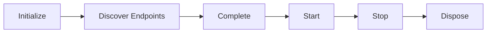

# Transports

A transport is the infrastructure layer that connects Mocha to a message broker. It manages connections, provisions topology (exchanges, queues, bindings), and handles the low-level details of dispatching and receiving messages. You write handlers and publish messages. The transport handles the rest.

The transport abstraction means your handlers, patterns, and pipeline are identical regardless of which broker you use. Only the infrastructure changes. Swap `.AddInMemory()` for `.AddRabbitMQ()` and your application code stays unchanged. This portability is the core value of the [Message Channel](https://www.enterpriseintegrationpatterns.com/patterns/messaging/MessageChannel.html) pattern: the sender and receiver are decoupled from the physical infrastructure that carries the message.

Mocha ships with two transports:

| Transport    | Package                    | Use case                                                     |
| ------------ | -------------------------- | ------------------------------------------------------------ |
| **InMemory** | `Mocha.Transport.InMemory` | Development, testing, single-process scenarios               |
| **RabbitMQ** | `Mocha.Transport.RabbitMQ` | Production, distributed systems, multi-service architectures |

# Add a transport

Every transport implements the same `MessagingTransport` base class. The transport is always the last call in the builder chain:

```csharp
// InMemory — zero configuration
builder.Services
    .AddMessageBus()
    .AddEventHandler<OrderPlacedEventHandler>()
    .AddInMemory();
```

```csharp
// RabbitMQ — production-ready
builder.Services
    .AddMessageBus()
    .AddEventHandler<OrderPlacedEventHandler>()
    .AddRabbitMQ();
```

Each `Add{Transport}()` method registers a transport instance, applies default conventions, and wires up the middleware pipelines.

# Choose a transport

Use this decision matrix to pick the right transport. Both columns include trade-offs — choose the one whose trade-offs you can accept:

| Criterion          | InMemory                          | RabbitMQ                                    |
| ------------------ | --------------------------------- | ------------------------------------------- |
| Setup effort       | None — zero dependencies          | Requires a running broker                   |
| Message durability | **Messages lost on process exit** | Messages survive broker restarts            |
| Multi-process      | **Single process only**           | Multiple services, multiple instances       |
| Request/reply      | Supported                         | Supported                                   |
| Operational cost   | None                              | Broker infrastructure, monitoring, upgrades |
| Network latency    | None — in-process                 | Real network round-trip                     |
| Integration tests  | Recommended                       | Use when testing broker-specific behavior   |

**Development workflow:** Start with InMemory during local development. Switch to RabbitMQ when you deploy or when you need to test cross-service communication.

**InMemory limitations:** Because all messages live in process memory, the InMemory transport cannot model multi-service fan-out, cannot survive process restarts, and does not exercise RabbitMQ-specific behavior like connection recovery, acknowledgement semantics, or topology conflicts.

**RabbitMQ operational cost:** RabbitMQ requires expertise to operate in production — cluster management, disk and memory alarms, queue type selection, and monitoring. Use a managed broker (CloudAMQP, Amazon MQ) if you want to reduce operational burden.

# Two connections per broker transport

Mocha opens two connections to the broker for RabbitMQ: one for consuming and one for dispatching.

This design prevents back-pressure from slow consumers from blocking outbound message publishing. When a consumer processes messages slowly, the RabbitMQ client applies back-pressure on that connection. Without separation, a slow consumer could prevent your application from publishing new messages entirely. With separate connections, each direction operates independently.

# Understand the transport lifecycle

Every transport goes through a defined sequence of phases during startup:



| Phase                  | What happens                                                                                                                                                                                                              |
| ---------------------- | ------------------------------------------------------------------------------------------------------------------------------------------------------------------------------------------------------------------------- |
| **Initialize**         | The transport reads its configuration, registers conventions, merges middleware from the bus and transport scopes, and creates any explicitly declared endpoints.                                                         |
| **Discover Endpoints** | The transport discovers receive and dispatch endpoints from inbound/outbound routes. Reply endpoints are created automatically. Handlers are bound to receive endpoints based on the binding mode (implicit or explicit). |
| **Complete**           | All receive and dispatch endpoints finalize their configuration. Middleware pipelines are compiled. Topology resources (exchanges, queues, bindings) are resolved.                                                        |
| **Start**              | The transport establishes connections and activates all receive endpoints. Messages begin flowing. For RabbitMQ, this opens the two connections described above and provisions topology on the broker.                    |
| **Stop**               | Receive endpoints are deactivated. Connections are drained gracefully.                                                                                                                                                    |
| **Dispose**            | Connections and channels are released.                                                                                                                                                                                    |

For InMemory, the Initialize through Complete phases build an in-process topology of topics and queues. No network connections are involved. For RabbitMQ, Start provisions the topology on the broker before any messages flow.

# Scope and middleware

Mocha uses a three-level feature scope: **bus**, **transport**, and **endpoint**. Features set at the bus level apply to all transports. Features set at the transport level override bus-level defaults for that transport. Features set at the endpoint level override both.

```
Bus scope (global defaults)
  └── Transport scope (transport-specific overrides)
       └── Endpoint scope (endpoint-specific overrides)
```

To add middleware at the transport level:

```csharp
builder.Services
    .AddMessageBus()
    .AddRabbitMQ(transport =>
    {
        // Add dispatch middleware scoped to this transport
        transport.UseDispatch(myDispatchMiddleware);

        // Add receive middleware scoped to this transport
        transport.UseReceive(myReceiveMiddleware);

        // Insert middleware relative to existing ones
        transport.AppendReceive("ConcurrencyLimiter", myMiddleware);
        transport.PrependDispatch("Serialization", myMiddleware);
    });
```

This scoping model lets you run different middleware configurations per transport without affecting other transports in a multi-transport setup.

# Control handler binding

By default, transports bind handlers to endpoints implicitly using naming conventions:

```csharp
// Implicit binding (default) — handlers are auto-discovered
builder.Services
    .AddMessageBus()
    .AddEventHandler<OrderPlacedEventHandler>()
    .AddRabbitMQ(transport =>
    {
        transport.BindHandlersImplicitly(); // This is the default
    });
```

To take full control over which handlers go to which endpoints:

```csharp
// Explicit binding — you declare every endpoint
builder.Services
    .AddMessageBus()
    .AddEventHandler<OrderPlacedEventHandler>()
    .AddRabbitMQ(transport =>
    {
        transport.BindHandlersExplicitly();

        transport.Endpoint("order-events")
            .Handler<OrderPlacedEventHandler>();
    });
```

Explicit binding is useful when you need multiple handlers on the same queue, custom queue names, or fine-grained control over endpoint topology.

# Next steps

- [InMemory Transport](/docs/mocha/v1/transports/in-memory) — Set up the InMemory transport for development and testing.
- [RabbitMQ Transport](/docs/mocha/v1/transports/rabbitmq) — Configure the RabbitMQ transport for production deployments.
