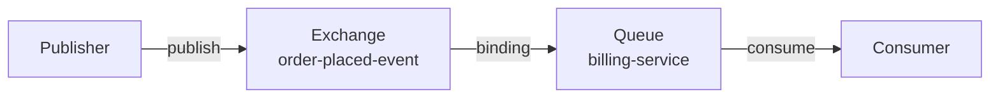

# RabbitMQ transport

The RabbitMQ transport connects Mocha to a RabbitMQ broker for production messaging. It manages connections, provisions exchanges and queues automatically, handles message acknowledgement, and supports request/reply with dedicated reply endpoints. When you need durable, distributed messaging across multiple services, this is the transport to use.

# Set up the RabbitMQ transport

By the end of this section, you will have a Mocha bus connected to RabbitMQ with automatic topology provisioning.

## Install the package

```bash
dotnet add package Mocha.Transport.RabbitMQ
```

## Register with .NET Aspire

The most common setup uses the Aspire RabbitMQ component for connection management:

```bash
dotnet add package Aspire.RabbitMQ.Client
```

```csharp
using Mocha;
using Mocha.Transport.RabbitMQ;

var builder = WebApplication.CreateBuilder(args);

// Aspire registers IConnectionFactory from the "rabbitmq" connection resource
builder.AddRabbitMQClient("rabbitmq");

// Register the message bus with RabbitMQ transport
builder.Services
    .AddMessageBus()
    .AddEventHandler<OrderPlacedEventHandler>()
    .AddRabbitMQ();

var app = builder.Build();
app.Run();
```

The Aspire component reads the connection string from configuration (typically `ConnectionStrings:rabbitmq`), handles health checks, and integrates with the Aspire dashboard for observability.

`.AddRabbitMQ()` picks up the `IConnectionFactory` from DI (registered by Aspire) and uses it to establish connections to the broker. Default conventions automatically create exchanges, queues, and bindings for your registered handlers.

## Register with a manual connection string

If you are not using Aspire, register the `IConnectionFactory` directly:

```csharp
using Mocha;
using Mocha.Transport.RabbitMQ;
using RabbitMQ.Client;

var builder = WebApplication.CreateBuilder(args);

// Register IConnectionFactory manually
builder.Services.AddSingleton<IConnectionFactory>(_ =>
    new ConnectionFactory
    {
        HostName = "localhost",
        Port = 5672,
        VirtualHost = "/",
        UserName = "guest",
        Password = "guest"
    });

builder.Services
    .AddMessageBus()
    .AddEventHandler<OrderPlacedEventHandler>()
    .AddRabbitMQ();

var app = builder.Build();
app.Run();
```

To use a connection string from configuration:

```csharp
builder.Services.AddSingleton<IConnectionFactory>(_ =>
{
    var factory = new ConnectionFactory();
    factory.Uri = new Uri(builder.Configuration.GetConnectionString("rabbitmq")!);
    return factory;
});
```

## Use a custom connection provider

For full control over connection lifecycle, provide a custom `IRabbitMQConnectionProvider`:

```csharp
builder.Services
    .AddMessageBus()
    .AddRabbitMQ(transport =>
    {
        transport.ConnectionProvider(sp =>
        {
            return sp.GetRequiredService<MyCustomConnectionProvider>();
        });
    });
```

The `IRabbitMQConnectionProvider` interface exposes `Host`, `Port`, `VirtualHost`, and a `CreateAsync` method. When no custom provider is registered, the transport falls back to resolving `IConnectionFactory` from DI and wrapping it in a default provider.

## Verify it works

Add an endpoint that publishes through the bus and verify the handler executes:

```csharp
app.MapPost("/orders", async (IMessageBus bus) =>
{
    await bus.PublishAsync(new OrderPlacedEvent
    {
        OrderId = Guid.NewGuid(),
        CustomerId = "customer-1",
        TotalAmount = 99.99m
    }, CancellationToken.None);

    return Results.Ok();
});
```

Send a POST request to `/orders` and check your application logs. You should see the handler process the event. You can also inspect the RabbitMQ management UI at `http://localhost:15672` to see the auto-provisioned exchanges and queues.

# Two connections per broker transport

Mocha opens two connections to the broker: one for consuming and one for dispatching.

This design prevents back-pressure from slow consumers from blocking outbound message publishing. When a consumer processes messages slowly, the RabbitMQ client applies back-pressure on that connection. Without separation, a slow consumer could prevent your application from publishing new messages entirely. With separate connections, each direction operates independently.

# How topology works

When the transport starts, it provisions topology on the broker automatically. Here is how message types map to RabbitMQ resources:



**Events (publish/subscribe):** Each event type gets a fanout exchange. Each service that subscribes creates a queue bound to that exchange. Publishing sends the message to the exchange, which fans it out to all bound queues.

**Commands (send):** Each command type gets a direct exchange bound to a single queue. Sending delivers the message to exactly one consumer.

**Request/reply:** The transport creates a temporary reply queue per service instance. The reply address is embedded in the request message so the responder knows where to send the reply.

:::warning
**Message loss warning.** Messages published before the transport completes its Start phase may be lost if no queue is bound to the exchange yet. During deployment, ensure consuming services start before publishing services, or use [publisher confirms](https://www.rabbitmq.com/docs/reliability#publisher-confirms) to detect lost messages.

If a message is published to an exchange with no bound queue - for example, when no consumer has started - that message is dropped. Mocha auto-provisions topology, but the window between exchange creation and queue binding is a real operational risk.
:::

## Publisher confirms

Mocha's RabbitMQ transport uses publisher confirms on dispatch, which means the broker acknowledges each published message before the publish call completes. This provides at-least-once delivery guarantees for outbound messages: if the broker does not confirm, the publish fails with an exception. See the [RabbitMQ Reliability Guide](https://www.rabbitmq.com/docs/reliability) for a full treatment of delivery guarantees.

## Default topology for event handlers

When you register an event handler with `AddEventHandler<T>()`, the RabbitMQ transport creates this topology:

<TopologyVisualization data='{"services":[{"host":{"serviceName":"BillingService","assemblyName":"BillingService.dll","instanceId":"billing-svc-1"},"messageTypes":[{"identity":"msg:OrderPlaced","runtimeType":"OrderPlaced","runtimeTypeFullName":"MyApp.Messages.OrderPlaced","isInterface":false,"isInternal":false}],"consumers":[{"name":"OrderPlacedHandler","identityType":"OrderPlacedHandler","identityTypeFullName":"MyApp.Handlers.OrderPlacedHandler"}],"routes":{"inbound":[{"kind":"subscribe","messageTypeIdentity":"msg:OrderPlaced","consumerName":"OrderPlacedHandler","endpoint":{"name":"billing.order-placed","address":"rabbitmq://localhost/billing.order-placed","transportName":"RabbitMQ"}}],"outbound":[]},"sagas":[]}],"transports":[{"identifier":"rabbitmq://localhost:5672/","name":"RabbitMQ","schema":"rabbitmq","transportType":"RabbitMQMessagingTransport","receiveEndpoints":[{"name":"billing.order-placed","kind":"default","address":"rabbitmq://localhost/billing.order-placed","source":{"address":"rabbitmq://localhost:5672/q/billing.order-placed"}}],"dispatchEndpoints":[],"topology":{"address":"rabbitmq://localhost:5672/","entities":[{"kind":"exchange","name":"order-placed","address":"rabbitmq://localhost:5672/e/order-placed","flow":"inbound","properties":{"type":"fanout","durable":true,"autoDelete":false,"autoProvision":true}},{"kind":"exchange","name":"billing.order-placed","address":"rabbitmq://localhost:5672/e/billing.order-placed","flow":"inbound","properties":{"type":"fanout","durable":true,"autoDelete":false,"autoProvision":true}},{"kind":"queue","name":"billing.order-placed","address":"rabbitmq://localhost:5672/q/billing.order-placed","flow":"outbound","properties":{"durable":true,"exclusive":false,"autoDelete":false,"autoProvision":true}}],"links":[{"kind":"bind","address":"rabbitmq://localhost:5672/b/e/order-placed/e/billing.order-placed","source":"rabbitmq://localhost:5672/e/order-placed","target":"rabbitmq://localhost:5672/e/billing.order-placed","direction":"forward","properties":{"routingKey":null,"autoProvision":true}},{"kind":"bind","address":"rabbitmq://localhost:5672/b/e/billing.order-placed/q/billing.order-placed","source":"rabbitmq://localhost:5672/e/billing.order-placed","target":"rabbitmq://localhost:5672/q/billing.order-placed","direction":"forward","properties":{"routingKey":null,"autoProvision":true}}]}}]}' />

A fanout exchange named after the message type fans out to per-service exchanges, which bind to per-service queues. This allows multiple services to each receive a copy of every published event.

## Default topology for send handlers

When you register a request handler with `AddRequestHandler<T>()` for send (fire-and-forget), the transport creates a single queue:

<TopologyVisualization data='{"services":[{"host":{"serviceName":"InventoryService","assemblyName":"InventoryService.dll","instanceId":"inventory-svc-1"},"messageTypes":[{"identity":"msg:ReserveInventory","runtimeType":"ReserveInventory","runtimeTypeFullName":"MyApp.Messages.ReserveInventory","isInterface":false,"isInternal":false}],"consumers":[{"name":"ReserveInventoryHandler","identityType":"ReserveInventoryHandler","identityTypeFullName":"MyApp.Handlers.ReserveInventoryHandler"}],"routes":{"inbound":[{"kind":"request","messageTypeIdentity":"msg:ReserveInventory","consumerName":"ReserveInventoryHandler","endpoint":{"name":"reserve-inventory","address":"rabbitmq://localhost/reserve-inventory","transportName":"RabbitMQ"}}],"outbound":[]},"sagas":[]}],"transports":[{"identifier":"rabbitmq://localhost:5672/","name":"RabbitMQ","schema":"rabbitmq","transportType":"RabbitMQMessagingTransport","receiveEndpoints":[{"name":"reserve-inventory","kind":"default","address":"rabbitmq://localhost/reserve-inventory","source":{"address":"rabbitmq://localhost:5672/q/reserve-inventory"}}],"dispatchEndpoints":[],"topology":{"address":"rabbitmq://localhost:5672/","entities":[{"kind":"exchange","name":"reserve-inventory","address":"rabbitmq://localhost:5672/e/reserve-inventory","flow":"inbound","properties":{"type":"fanout","durable":true,"autoDelete":false,"autoProvision":true}},{"kind":"queue","name":"reserve-inventory","address":"rabbitmq://localhost:5672/q/reserve-inventory","flow":"outbound","properties":{"durable":true,"exclusive":false,"autoDelete":false,"autoProvision":true}}],"links":[{"kind":"bind","address":"rabbitmq://localhost:5672/b/e/reserve-inventory/q/reserve-inventory","source":"rabbitmq://localhost:5672/e/reserve-inventory","target":"rabbitmq://localhost:5672/q/reserve-inventory","direction":"forward","properties":{"routingKey":null,"autoProvision":true}}]}}]}' />

Send messages go to a dedicated queue. Only one handler processes each message - this is the point-to-point guarantee.

# Configure transport-level defaults

You can set defaults that apply to all auto-provisioned queues and exchanges. This is useful when you want consistent settings across all resources without configuring each one individually.

Use `ConfigureDefaults` to set queue and exchange defaults:

```csharp
builder.Services
    .AddMessageBus()
    .AddRabbitMQ(transport =>
    {
        transport.ConfigureDefaults(defaults =>
        {
            // All queues will be quorum with a delivery limit of 5
            defaults.Queue.QueueType = RabbitMQQueueType.Quorum;
            defaults.Queue.Arguments["x-delivery-limit"] = 5;

            // All exchanges will use topic routing
            defaults.Exchange.Type = RabbitMQExchangeType.Topic;
        });
    });
```

For example, to enable [quorum queues](https://www.rabbitmq.com/docs/quorum-queues) with a specific initial group size:

```csharp
builder.Services
    .AddMessageBus()
    .AddRabbitMQ(transport =>
    {
        transport.ConfigureDefaults(defaults =>
        {
            defaults.Queue.QueueType = RabbitMQQueueType.Quorum;
            defaults.Queue.Arguments["x-quorum-initial-group-size"] = 3;
        });
    });
```

Or to use [stream queues](https://www.rabbitmq.com/docs/streams) for append-only log semantics:

```csharp
builder.Services
    .AddMessageBus()
    .AddRabbitMQ(transport =>
    {
        transport.ConfigureDefaults(defaults =>
        {
            defaults.Queue.QueueType = RabbitMQQueueType.Stream;
        });
    });
```

Available queue defaults:

| Property     | Type                         | Description                                                       |
| ------------ | ---------------------------- | ----------------------------------------------------------------- |
| `QueueType`  | `string`                     | Queue type: `RabbitMQQueueType.Classic`, `.Quorum`, or `.Stream`  |
| `Durable`    | `bool?`                      | Whether queues survive broker restarts (default: `true`)          |
| `AutoDelete` | `bool?`                      | Whether queues are auto-deleted when unused (default: `false`)    |
| `Arguments`  | `Dictionary<string, object>` | Additional arguments (e.g., `x-delivery-limit`, `x-max-priority`) |

Available exchange defaults:

| Property     | Type                         | Description                                                                      |
| ------------ | ---------------------------- | -------------------------------------------------------------------------------- |
| `Type`       | `string`                     | Exchange type: `RabbitMQExchangeType.Fanout`, `.Direct`, `.Topic`, or `.Headers` |
| `Durable`    | `bool?`                      | Whether exchanges survive broker restarts (default: `true`)                      |
| `AutoDelete` | `bool?`                      | Whether exchanges are auto-deleted when unused (default: `false`)                |
| `Arguments`  | `Dictionary<string, object>` | Additional arguments (e.g., `alternate-exchange`)                                |

Defaults never override explicitly configured values. If you declare a queue with a specific queue type, that setting takes precedence over the transport default. You can call `ConfigureDefaults` multiple times - each call accumulates settings on the same defaults object.

# Declare custom topology

Mocha auto-provisions topology by default. To declare additional exchanges, queues, or bindings:

```csharp
builder.Services
    .AddMessageBus()
    .AddRabbitMQ(transport =>
    {
        // Declare an exchange
        transport.DeclareExchange("order-events")
            .Type(RabbitMQExchangeType.Fanout)
            .Durable()
            .AutoProvision();

        // Declare a queue (use quorum type for production)
        transport.DeclareQueue("billing-orders")
            .Durable()
            .AutoProvision()
            .WithArgument("x-queue-type", "quorum");

        // Bind the exchange to the queue
        transport.DeclareBinding("order-events", "billing-orders")
            .AutoProvision();
    });
```

All explicitly declared topology is provisioned when the transport starts, before receive endpoints begin consuming.

# Prefetch and concurrency

Customize queue names, prefetch counts, and handler assignments on receive endpoints:

```csharp
builder.Services
    .AddMessageBus()
    .AddEventHandler<OrderPlacedEventHandler>()
    .AddRabbitMQ(transport =>
    {
        transport.BindHandlersExplicitly();

        transport.Endpoint("order-processing")
            .Queue("orders.processing")
            .MaxPrefetch(50)
            .MaxConcurrency(10)
            .Handler<OrderPlacedEventHandler>();
    });
```

**MaxPrefetch** controls how many unacknowledged messages RabbitMQ delivers to the consumer at once. Default: `100`. Lower values reduce memory pressure under high load. Higher values improve throughput for fast handlers.

**MaxConcurrency** controls how many messages the endpoint processes in parallel. Set this based on your handler's throughput characteristics.

A good starting point: set `MaxPrefetch` equal to or slightly higher than `MaxConcurrency`. For slow handlers (long database operations, external API calls), lower `MaxPrefetch` to `10`–`20` to prevent messages from piling up in the consumer's unacknowledged buffer. For quorum queues specifically, avoid setting `MaxPrefetch` to `1` - a prefetch of `1` starves consumers while acknowledgements flow through the consensus mechanism and significantly reduces throughput.

For prefetch tuning guidance from first principles, see [CloudAMQP Best Practices](https://www.cloudamqp.com/blog/part1-rabbitmq-best-practice.html).

# Auto-provisioned resource naming

| Resource           | Naming convention                                   | Created when                       |
| ------------------ | --------------------------------------------------- | ---------------------------------- |
| Exchange (event)   | Message type name (e.g., `OrderPlacedEvent`)        | First publish or subscribe         |
| Exchange (command) | Message type name (e.g., `ReserveInventoryCommand`) | First send or handler registration |
| Queue              | Endpoint name derived from handler registration     | Handler is bound to the transport  |
| Reply queue        | Instance-specific name                              | Transport starts                   |
| Bindings           | Exchange-to-queue                                   | Endpoint discovery phase           |

All auto-provisioned resources are durable by default and survive broker restarts.

# Next steps

- [Transports Overview](/docs/mocha/v1/transports) - Understand the transport abstraction and lifecycle.
- [Handlers and Consumers](/docs/mocha/v1/handlers-and-consumers) - Learn about handler types and consumer configuration.
- [Reliability](/docs/mocha/v1/reliability) - Configure dead-letter routing, outbox, and fault handling.

> **Runnable example:** [RabbitMQ](https://github.com/ChilliCream/graphql-platform/tree/main/src/Mocha/src/Examples/Transports/RabbitMQ)
>
> **Full demo:** All three Demo services use RabbitMQ in production mode with .NET Aspire. See [Demo.AppHost](https://github.com/ChilliCream/graphql-platform/tree/main/src/Mocha/src/Demo/Demo.AppHost) for the Aspire orchestration and [Demo.Catalog](https://github.com/ChilliCream/graphql-platform/tree/main/src/Mocha/src/Demo/Demo.Catalog) for a complete service using `.AddRabbitMQ()` with outbox, sagas, and multiple handler types.
