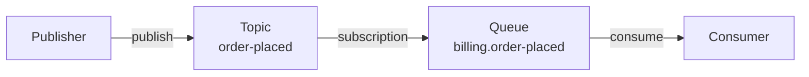

# Azure Service Bus transport

The Azure Service Bus (ASB) transport connects Mocha to a fully managed Azure messaging namespace. It provisions queues, topics, and subscriptions automatically, dispatches publishes through topics and sends through queues, and exposes ASB-specific primitives - native scheduling with cancellation, broker-side dead-lettering with reason codes, and lock-renewal-aware acknowledgement. When you run on Azure and want a managed broker without operating the infrastructure yourself, this is the transport to use.

**When to choose Azure Service Bus over a self-hosted broker:**

- Your workload runs on Azure and you want managed messaging with SLAs, redundancy, and per-message billing.
- You need durable scheduling with the ability to cancel a scheduled message before delivery, and you do not want to deploy a Postgres scheduling store alongside your application.
- You want broker-native dead-lettering with structured reason codes that surface in Azure Monitor and Service Bus Explorer.
- You authenticate with Azure AD and want managed identities instead of shared access keys.

# Set up the Azure Service Bus transport

By the end of this section, you will have a Mocha bus connected to Azure Service Bus with automatic topology provisioning.

## Install the package

```bash
dotnet add package Mocha.Transport.AzureServiceBus
```

## Register with a connection string

The simplest setup passes a Service Bus connection string directly:

```csharp
using Mocha;
using Mocha.Transport.AzureServiceBus;

var builder = WebApplication.CreateBuilder(args);

builder.Services
    .AddMessageBus()
    .AddEventHandler<OrderPlacedEventHandler>()
    .AddAzureServiceBus("Endpoint=sb://<namespace>.servicebus.windows.net/;SharedAccessKeyName=...;SharedAccessKey=...");

var app = builder.Build();
app.Run();
```

`.AddAzureServiceBus(connectionString)` creates a `ServiceBusClient` from the connection string, provisions topics, queues, and subscriptions for your registered handlers, and registers the scheduled-message store so `bus.CancelScheduledMessageAsync(token)` works against the broker.

## Register with a fully qualified namespace and a token credential

Use Azure AD authentication (managed identity, workload identity, or any other `TokenCredential`) instead of a shared access key:

```csharp
using Azure.Identity;
using Mocha;
using Mocha.Transport.AzureServiceBus;

var builder = WebApplication.CreateBuilder(args);

builder.Services
    .AddMessageBus()
    .AddEventHandler<OrderPlacedEventHandler>()
    .AddAzureServiceBus(transport =>
    {
        transport.Namespace(
            "mynamespace.servicebus.windows.net",
            new DefaultAzureCredential());
    });

var app = builder.Build();
app.Run();
```

## Register with .NET Aspire

When using .NET Aspire, define a Service Bus resource in your AppHost and reference it from each service. The Aspire Service Bus emulator is convenient for local development - it requires entities to be pre-declared in `Config.json` because the emulator does not support runtime entity creation through the management API:

```csharp
// AppHost
var serviceBus = builder
    .AddAzureServiceBus("messaging")
    .RunAsEmulator(/* configure entities here */);

builder
    .AddProject<Projects.OrderService>("order-service")
    .WithReference(serviceBus)
    .WaitFor(serviceBus);
```

In each service, read the connection string from Aspire-injected configuration:

```csharp
var connectionString = builder.Configuration.GetConnectionString("messaging")!;

builder.Services
    .AddMessageBus()
    .AddEventHandler<OrderPlacedEventHandler>()
    .AddAzureServiceBus(connectionString);
```

## Verify it works

Add an endpoint that publishes through the bus and verify the handler executes:

```csharp
app.MapPost("/orders", async (IMessageBus bus) =>
{
    await bus.PublishAsync(new OrderPlacedEvent
    {
        OrderId = Guid.NewGuid(),
        CustomerId = "customer-1",
        TotalAmount = 99.99m
    }, CancellationToken.None);

    return Results.Ok();
});
```

Send a POST request to `/orders` and check your application logs. You should see the handler process the event. You can also inspect the auto-provisioned topics, subscriptions, and queues in the Azure portal under your Service Bus namespace.

# How topology works

The transport maps Mocha's routing model onto Azure Service Bus topics and queues:



**Events (publish/subscribe):** Each event type gets a topic. Each subscribing service gets a queue and a forwarding subscription that delivers messages from the topic into the queue. Publishing sends the message to the topic, which fans it out to all forwarded subscriber queues.

**Commands (send):** Each command type gets a queue. Sending delivers the message directly to that queue.

**Request/reply:** The transport creates a temporary reply queue per service instance (`response-{instanceId}`). The reply address is embedded in the request message so the responder knows where to send the reply.

## Default topology for handlers

Each handler-bound receive endpoint provisions three queues by convention - the main queue plus an `_error` queue (handler exceptions) and a `_skipped` queue (no matching consumer):

| Queue                         | Purpose                                                      |
| ----------------------------- | ------------------------------------------------------------ |
| `{service}.{handler}`         | Main inbound queue for the handler                           |
| `{service}.{handler}_error`   | Destination of `ReceiveFaultMiddleware` (handler exceptions) |
| `{service}.{handler}_skipped` | Destination of `ReceiveDeadLetterMiddleware` (unmatched)     |

This naming is identical across transports - see [Routing and Endpoints](/docs/mocha/v16/routing-and-endpoints) for the full convention.

# Configure transport-level defaults

You can set defaults that apply to all auto-provisioned queues, topics, and endpoints:

```csharp
builder.Services
    .AddMessageBus()
    .AddAzureServiceBus(transport =>
    {
        transport.ConnectionString(connectionString);

        transport.ConfigureDefaults(defaults =>
        {
            defaults.Queue.MaxDeliveryCount = 5;
            defaults.Queue.LockDuration = TimeSpan.FromMinutes(1);
            defaults.Queue.DefaultMessageTimeToLive = TimeSpan.FromDays(7);
            defaults.Queue.DeadLetteringOnMessageExpiration = true;
        });
    });
```

Available queue defaults:

| Property                           | Type        | Description                                                                       |
| ---------------------------------- | ----------- | --------------------------------------------------------------------------------- |
| `AutoProvision`                    | `bool?`     | Whether queues are auto-provisioned at startup                                    |
| `AutoDelete`                       | `bool?`     | Whether queues are auto-deleted when idle                                         |
| `AutoDeleteOnIdle`                 | `TimeSpan?` | Idle window before the broker may delete the queue                                |
| `LockDuration`                     | `TimeSpan?` | How long the broker holds a peek-lock on a delivered message                      |
| `MaxDeliveryCount`                 | `int?`      | Attempts before the broker dead-letters the message (`MaxDeliveryCountExceeded`)  |
| `DefaultMessageTimeToLive`         | `TimeSpan?` | TTL applied to messages that do not specify their own                             |
| `MaxSizeInMegabytes`               | `long?`     | Maximum queue size in megabytes                                                   |
| `RequiresSession`                  | `bool?`     | Whether the queue requires sessions (immutable after creation)                    |
| `EnablePartitioning`               | `bool?`     | Whether the queue is partitioned (immutable after creation)                       |
| `ForwardTo`                        | `string?`   | Auto-forward target for incoming messages                                         |
| `ForwardDeadLetteredMessagesTo`    | `string?`   | Auto-forward target for the entity's `$DeadLetterQueue`                           |
| `DeadLetteringOnMessageExpiration` | `bool?`     | Whether expired messages are moved to `$DeadLetterQueue` instead of being dropped |

Defaults never override explicitly configured values. If you call `WithMaxDeliveryCount(...)` on a specific queue, the per-queue value wins.

# Declare custom topology

Mocha auto-provisions topology by default. To declare additional topics, queues, or subscriptions:

```csharp
builder.Services
    .AddMessageBus()
    .AddAzureServiceBus(transport =>
    {
        transport.ConnectionString(connectionString);

        transport.DeclareTopic("order-events");

        transport.DeclareQueue("billing-orders")
            .WithMaxDeliveryCount(5)
            .WithLockDuration(TimeSpan.FromMinutes(1));

        transport.DeclareSubscription("order-events", "billing-orders");
    });
```

To bind handlers explicitly to specific queues:

```csharp
builder.Services
    .AddMessageBus()
    .AddEventHandler<ProcessOrderCommandHandler>()
    .AddAzureServiceBus(transport =>
    {
        transport.ConnectionString(connectionString);
        transport.BindHandlersExplicitly();

        transport.DeclareQueue("process-order");

        transport.Endpoint("process-order-ep")
            .Queue("process-order")
            .Handler<ProcessOrderCommandHandler>();

        transport.DispatchEndpoint("send-demo")
            .ToQueue("process-order")
            .Send<ProcessOrderCommand>();
    });
```

# Control auto-provisioning

When infrastructure is managed externally - for example through Bicep, Terraform, the Azure Service Bus emulator's `Config.json`, or a CI/CD pipeline - disable auto-provisioning so the transport expects entities to already exist:

```csharp
builder.Services
    .AddMessageBus()
    .AddAzureServiceBus(transport =>
    {
        transport.ConnectionString(connectionString);
        transport.AutoProvision(false);
    });
```

With auto-provisioning disabled, the transport will not call the management API to create topics, queues, or subscriptions. All entities must already exist on the namespace before the transport starts. Individual resources can opt back in via `.AutoProvision(true)` when most topology is managed externally but a few entities need to be created dynamically.

# Scheduling

Azure Service Bus schedules messages natively. The dispatch endpoint calls `ServiceBusSender.ScheduleMessageAsync` and the broker holds the message until the scheduled time:

```csharp
var result = await bus.SchedulePublishAsync(
    new PaymentReminderEvent { OrderId = orderId },
    DateTimeOffset.UtcNow.AddHours(24),
    cancellationToken);

if (result.IsCancellable)
{
    // Persist the token alongside the order so we can cancel later
    await orders.SaveReminderTokenAsync(orderId, result.Token!, cancellationToken);
}
```

Cancellation is supported natively - no Postgres store, EF Core model, or background worker is required:

```csharp
await bus.CancelScheduledMessageAsync(reminderToken, cancellationToken);
```

The token encodes the entity path and the broker-assigned sequence number, and `CancelScheduledMessageAsync` revokes the message via `ServiceBusSender.CancelScheduledMessageAsync`. If the message has already been dispatched, the broker returns `MessageNotFound` and Mocha surfaces this as `false`.

ASB is the only transport with both **native scheduling and native cancellation**. See [Scheduling](/docs/mocha/v16/scheduling) for the full scheduling API.

# Dead-lettering

The Azure Service Bus transport offers three dead-letter paths in increasing order of power. Pick the one whose semantics fit the failure you are modeling.

## 1. Handler exception → `_error` queue (default, transport-agnostic)

When your handler throws, the cross-transport `ReceiveFaultMiddleware` catches the exception, attaches `fault-*` headers (exception type, message, stack trace, timestamp), and forwards the original envelope to the convention-named `{queue}_error` queue:

```csharp
public class ProcessInvoiceHandler : IEventHandler<ProcessInvoice>
{
    public ValueTask HandleAsync(ProcessInvoice message, CancellationToken ct)
    {
        // Throwing here forwards the message to {queue}_error
        throw new InvalidOperationException("Downstream service is unavailable.");
    }
}
```

The acknowledgement middleware then completes the lock against the broker so the message does not redeliver. This is the path most applications use - it is consistent across all transports and works without ASB-specific code.

## 2. Broker-managed `$DeadLetterQueue`

Azure Service Bus dead-letters messages itself when broker-side conditions are met:

| Condition               | Reason code                 |
| ----------------------- | --------------------------- |
| Delivery count exceeded | `MaxDeliveryCountExceeded`  |
| Message TTL expired     | `TTLExpiredException`       |
| Filter evaluation error | `FilterEvaluationException` |

These messages land in the entity's `$DeadLetterQueue` sub-entity (`{queue}/$DeadLetterQueue`), separate from Mocha's `_error` queue. To consolidate operations, opt the endpoint's queue into forwarding broker-dead-lettered messages into the Mocha-managed `_error` queue:

```csharp
builder.Services
    .AddMessageBus()
    .AddEventHandler<OrderPlacedEventHandler>()
    .AddAzureServiceBus(transport =>
    {
        transport.ConnectionString(connectionString);

        transport.Handler<OrderPlacedEventHandler>()
            .ConfigureEndpoint(e => e.UseNativeDeadLetterForwarding());
    });
```

`UseNativeDeadLetterForwarding()` sets `ForwardDeadLetteredMessagesTo = "{queueName}_error"` on the underlying queue at provisioning time. Messages dead-lettered by the broker for `MaxDeliveryCountExceeded` or `TTLExpiredException` are forwarded into the same `_error` queue used by handler exceptions, so operators have one place to look.

If you have already configured `WithForwardDeadLetteredMessagesTo("custom-target")` on the same queue, the transport surfaces a configuration conflict at provisioning - it will not silently override your choice.

## 3. Explicit native dead-letter with reason codes

For domain-level failures where you want a structured reason code visible in Azure Monitor and Service Bus Explorer, dead-letter the message yourself through the ASB-specific message context. The context is exposed on the `IConsumeContext` available to any `IConsumer<T>`:

```csharp
public class ProcessInvoiceConsumer : IConsumer<ProcessInvoice>
{
    public async ValueTask ConsumeAsync(IConsumeContext<ProcessInvoice> context)
    {
        var message = context.Message;

        if (string.IsNullOrEmpty(message.CustomerId))
        {
            await context.AzureServiceBus().DeadLetterAsync(
                reason: "InvalidPayload",
                description: "Missing customer id",
                properties: new Dictionary<string, object>
                {
                    ["InvoiceId"] = message.InvoiceId
                },
                context.CancellationToken);

            return;
        }

        // ... normal processing
    }
}
```

If your processing code lives in an `IEventHandler<T>`, resolve the context through whichever scoped accessor you have wired up - or refactor to `IConsumer<T>` when you need direct access to broker primitives like `DeadLetterAsync`.

The message is moved to the entity's `$DeadLetterQueue` with `DeadLetterReason = "InvalidPayload"` and `DeadLetterErrorDescription = "Missing customer id"`. Both fields are first-class columns in Service Bus Explorer and queryable through Azure Monitor.

After `DeadLetterAsync` returns, the acknowledgement middleware skips the redundant `Complete` call - the lock is already released. If a `MessageLockLost` is observed (because, for example, the lock had already expired before the handler called `DeadLetterAsync`), the middleware treats the message as already settled and continues silently.

# `IAzureServiceBusMessageContext`

Resolve the ASB-specific context from any active `IMessageContext` via the `AzureServiceBus()` extension method (or the non-throwing `TryGetAzureServiceBus(out ...)`). `IConsumeContext<T>` derives from `IMessageContext`, so consumer implementations have direct access:

```csharp
public class ReviewCustomerConsumer : IConsumer<ReviewCustomer>
{
    public async ValueTask ConsumeAsync(IConsumeContext<ReviewCustomer> context)
    {
        var asb = context.AzureServiceBus();

        // Inspect broker-managed metadata
        var deliveries = asb.DeliveryCount;
        var lockUntil = asb.LockedUntil;

        // Native dead-letter with structured reason code
        await asb.DeadLetterAsync(
            "BusinessReject",
            "Customer flagged for review",
            cancellationToken: context.CancellationToken);
    }
}
```

The interface exposes:

| Member                                               | Purpose                                                                                    |
| ---------------------------------------------------- | ------------------------------------------------------------------------------------------ |
| `Message` (`ServiceBusReceivedMessage`)              | The raw message as delivered by the broker                                                 |
| `EntityPath`                                         | The queue or subscription the message was received from                                    |
| `DeliveryCount`                                      | The broker-tracked delivery count                                                          |
| `LockedUntil`                                        | The absolute time at which the broker-managed lock expires                                 |
| `DeadLetterAsync(reason, description?, properties?)` | Move the message to `$DeadLetterQueue` with structured reason metadata                     |
| `AbandonAsync(propertiesToModify?)`                  | Return the message to the queue for redelivery, optionally updating application properties |

The context is pooled together with the receive context and is only valid for the duration of the handler invocation. Calling `context.AzureServiceBus()` from a handler running on a different transport throws `InvalidOperationException` - use `TryGetAzureServiceBus` if you write transport-agnostic handlers.

# Best practices

- **Default to `_error`.** Handler exceptions should fall through to the `Fault` middleware. The `_error` queue is consistent across transports and keeps your handlers portable.
- **Enable `UseNativeDeadLetterForwarding()` to consolidate ops.** When you want a single queue to monitor in production, forward broker-dead-lettered messages into `_error` so `MaxDeliveryCountExceeded` and handler exceptions share one operational surface.
- **Use `IAzureServiceBusMessageContext.DeadLetterAsync` for domain-level rejection.** Reach for the native API only when you want a structured reason code visible to operators in Service Bus Explorer or Azure Monitor (`InvalidPayload`, `BusinessReject`, `DuplicateRequest`, etc.). Generic infrastructure failures still belong in the `_error` queue with a stack trace.
- **Tune `MaxDeliveryCount` deliberately.** The default is 10. Combined with retry middleware, a high count can produce many handler invocations before broker dead-lettering kicks in. Lower the count if you would rather see failures in `$DeadLetterQueue` sooner.
- **Avoid building consumer endpoints over `$DeadLetterQueue`.** Treat the broker DLQ as an operations surface, not a normal pipeline destination. The same advice applies in MassTransit and other Service Bus clients - dead-lettered messages are typically inspected, fixed, and resubmitted, not auto-processed.

# Troubleshooting

**Handler called `DeadLetterAsync` but the message is not in the DLQ.**
The receiver must be in `PeekLock` mode (the Mocha default) for native dead-lettering to be supported. The transport configures `PeekLock` automatically; if you have customized the `ServiceBusProcessor` options, make sure you have not switched to `ReceiveAndDelete`.

**The broker DLQ fills up with `MaxDeliveryCountExceeded`.**
Either tune the queue's `MaxDeliveryCount` lower so failures surface sooner, or enable `UseNativeDeadLetterForwarding()` on the endpoint so broker-dead-lettered messages are forwarded into your `_error` queue and aggregated with handler exceptions.

**`UseNativeDeadLetterForwarding()` fails at startup with a forwarding conflict.**
Both `WithForwardDeadLetteredMessagesTo("...")` and `UseNativeDeadLetterForwarding()` are configured on the same queue. The transport refuses to silently override the explicit forwarding target. Pick one.

**`CancelScheduledMessageAsync` returns false.**
The most common causes: the scheduled time has already passed (the broker enqueued the message and returned `MessageNotFound` to the cancel call), `IsCancellable` was `false` on the original `SchedulingResult`, or the token came from a different transport than the one that created the message. The transport's cancel path is idempotent - calling it twice is safe.

**`context.AzureServiceBus()` throws `InvalidOperationException`.**
The current message did not originate from the Azure Service Bus transport. Use `context.TryGetAzureServiceBus(out var asb)` if you write transport-agnostic handlers and want to no-op on other transports.

**Receive endpoint logs `MessageLockLost`.**
The broker reclaimed the lock before the acknowledgement middleware could `Complete` or `Abandon` the message - usually because the handler ran longer than `LockDuration`. The acknowledgement middleware swallows this exception (the broker will redeliver per its own rules), but you should consider either lengthening `LockDuration` on the queue or shortening the handler.

# Next steps

- [Transports Overview](/docs/mocha/v16/transports) - Understand the transport abstraction and lifecycle.
- [Scheduling](/docs/mocha/v16/scheduling) - Schedule messages for future delivery and cancel them natively through Azure Service Bus.
- [Routing and Endpoints](/docs/mocha/v16/routing-and-endpoints) - Understand how `_error` and `_skipped` endpoints fit the receive pipeline.
- [Reliability](/docs/mocha/v16/reliability) - Configure fault handling, retries, the transactional outbox, and the idempotent inbox.
- [Middleware and Pipelines](/docs/mocha/v16/middleware-and-pipelines) - Customize the receive and dispatch pipelines.

> **Runnable example:** [AzureServiceBusTransport](https://github.com/ChilliCream/graphql-platform/tree/main/src/Mocha/examples/AzureServiceBusTransport)
>
> **Multi-service demo:** The AzureServiceBusTransport example runs OrderService, ShippingService, and NotificationService against the local Azure Service Bus emulator orchestrated through .NET Aspire, demonstrating publish/subscribe, send, request/reply, sagas, and batch processing on a managed broker.
