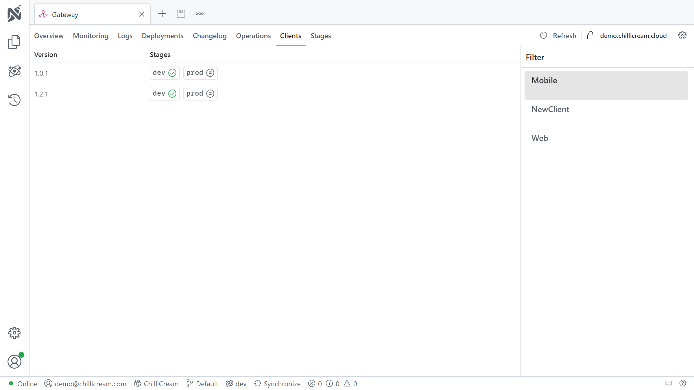
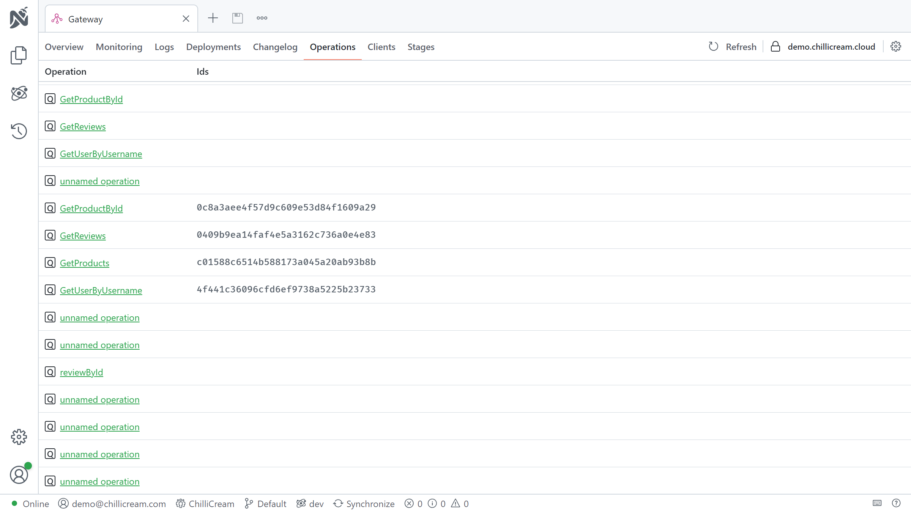

The client registries is an important tool for managing your GraphQL Clients. It provides a centralized location for clients and queries.

You can use the client registry to manage your clients and their queries. It allows you to validate your queries against the schema, ensuring that all the operations defined by a client are compatible with the current schema. This validation step is critical to prevent the execution of invalid queries that might result in runtime errors.

# Understanding Clients

A client, in the context of a GraphQL API, is an entity that interacts with the API by defining and executing GraphQL operations. These operations are stored on the API as persisted operations.

## What is a Persisted Operation?

A persisted operation is a GraphQL operation that has been sent to the server, stored, and assigned an unique identifier (hash). Instead of sending the full text of a GraphQL operation to the server for execution, clients can send the hash of the operation, reducing the amount of data transmitted over the network. This practice is particularly beneficial for mobile clients operating in environments with limited network capacity.

Persisted operations also add an extra layer of security as the server can be configured to only execute operations that have been previously stored, which prevents malicious queries. This is the cheapest and most effective way to secure your GraphQL API from potential attacks.



Persisted operations can be inspected in the `Operations` tab.

## The Role of the Client Registry

The client registry plays a crucial role in managing these persisted operations. It is used to validate the operations against the schema, ensuring that all the operations defined by a client are compatible with the current schema. This validation step is critical to prevent the execution of invalid operations that might result in runtime errors.

Additionally, the client registry is responsible for distributing the operations to the GraphQL server. It maintains a mapping of hashes to operation keys, informing the server which hash corresponds to which operation. This allows the server to efficiently look up and execute the appropriate operation when it receives a request from a client.

## Client Versions

A client can have multiple versions, with each version containing a different set of persisted operations. This versioning system allows for incremental updates and changes to the client's operations without disrupting the existing functionality. As new versions are released, they can be validated and registered with the client registry, ensuring that they are compatible with the current schema and can be executed by the server.

By managing client versions and persisted operations, the client registry helps maintain the integrity and smooth operation of your GraphQL API. It ensures that your clients and API can evolve together without breaking, contributing to a more robust and reliable system.

The number of active client versions can vary depending on the nature of the client. For instance, a website usually has one active client version per stage. However, during deployment, you might temporarily have two active versions as the new version is phased in and the old version is phased out.

On the other hand, for mobile clients, you often have multiple versions active simultaneously. This is because users may be using different versions of the app, and not all users update their apps at the same time.

Once a client version is no longer in use, it reaches its end of life. At this point, you can unpublish the client version from the client registry. This will remove its persisted operations from distribution, and they will no longer be validated against the schema.

## The Operations File

In the context of GraphQL, the operations file is a structured file that holds a collection of persisted operations for a client. This file serves as a reference for the client to manage and execute specific operations against a GraphQL API.

### Understanding the Format and Structure

The operations file typically adopts the JSON format as used by Relay. It comprises key-value pairs, with each pair representing a unique persisted operation. The key corresponds to a hash identifier for the operation, and the value is the GraphQL operation string. Below is an illustrative example of an operations file (`operations.json`):

```json
{
   "913abc361487c481cf6015841c0eca22": "{ me { username } }",
   "0e7cf2125e8eb711b470cc72c73ca77e": "{ me { id } }"
   ...
}
```

### Compatibility with GraphQL Clients

Several GraphQL clients have built-in support for this Relay-style operations file format. This compatibility allows for a standardized way of handling persisted operations across different clients. For more details on how various clients implement and work with persisted operations, consider referring to their respective documentation:

- [StrawberryShake](https://chillicream.com/docs/strawberryshake/v14/performance/persisted-operations)
- [URQL](https://formidable.com/open-source/urql/docs/advanced/persisted-queries/)
- [Relay](https://relay.dev/docs/guides/persisted-queries/)

# Setting Up a Client Registry

To set up a client registry, first, visit `nitro.chillicream.com` and sign up for an account. Next, you'll need to download and install Nitro CLI, the .NET tool used to manage your client registry. You can find more information about Nitro CLI in the [Nitro CLI Documentation](/docs/nitro/cli).

After installing Nitro CLI, create a new API either through the Nitro App or the CLI. In the app, simply right-click the document explorer and select "New API." If you prefer using the CLI, ensure you're logged in with the command `nitro login`, then create a new API with the command `nitro api create`. With these steps complete, you are ready to start using the client registry.

To get the id of your API, use the command `nitro api list`. This command will list all of your APIs, their names, and their ids. You will need the id of your API to perform most operations on the schema registry.

# Using Persisted Operations

To use persisted operations, the server needs to know how to translate the hash into the corresponding GraphQL operation. This is where the client registry comes in. The client registry maintains a mapping of hashes to operation keys, informing the server which hash corresponds to which operation. This allows the server to efficiently look up and execute the appropriate operation when it receives a request from a client.

To connect your HotChocolate server to the client registry, you need the `ChilliCream.Nitro` NuGet package. This package contains the `AddNitro()` extension method, which can be used to configure the client registry.

To install the Nitro services, run the following command in your project's root directory:

```bash
dotnet add package ChilliCream.Nitro
```

After installing the package, you need to configure the services in your startup class. Below is a sample implementation in C#:

```csharp
public void ConfigureServices(IServiceCollection services)
{
    services
        .AddGraphQLServer()
        .AddQueryType<Query>()
        .AddNitro(x => // Connect to the client registry
        {
            x.ApiKey = "<<your-api-key>>";
            x.ApiId = "QXBpCmc5NGYwZTIzNDZhZjQ0NjBmYTljNDNhZDA2ZmRkZDA2Ng==";
            x.Stage = "dev";
        })
        .UsePersistedOperationPipeline(); // Enable the persisted operation pipeline
}
```

> **Tip: Using Environment Variables**
>
> Alternatively, you can set the required values using environment variables. This method allows you to call `AddNitro` without explicitly passing parameters.
>
> - `NITRO_API_KEY` maps to `ApiKey`
> - `NITRO_API_ID` maps to `ApiId`
> - `NITRO_STAGE` maps to `Stage`
>
> ```csharp
> public void ConfigureServices(IServiceCollection services)
> {
>     services
>         .AddGraphQLServer()
>         .AddQueryType<Query>()
>         .AddNitro() // Connect to the client registry
>         .UsePersistedOperationPipeline(); // Enable the persisted operation pipeline
> }
> ```
>
> In this setup, the API key, ID, and stage are set through environment variables.

## Block Ad-Hoc Queries

While you want to allow ad-hoc queries during development, you might want to disable them in production.
This can be done by setting the `PersistedOperations.OnlyAllowPersistedDocuments` option to `true` in the `ModifyRequestOptions` method.

```csharp
public void ConfigureServices(IServiceCollection services)
{
    services
        .AddGraphQLServer()
        .AddQueryType<Query>()
        .AddNitro() // Connect to the client registry
        .ModifyRequestOptions(x => x.PersistedOperations.OnlyAllowPersistedDocuments = true)
        .UsePersistedOperationPipeline(); // Enable the persisted operation pipeline
}
```

You can also customize the error message that is returned when an ad-hoc operation is sent to the server.

```csharp
public void ConfigureServices(IServiceCollection services)
{
    services
        .AddGraphQLServer()
        .AddQueryType<Query>()
        .AddNitro() // Connect to the client registry
        .ModifyRequestOptions(x =>
        {
            x.PersistedOperations.OnlyAllowPersistedDocuments = true;
            x.PersistedOperations.OperationNotAllowedError = ErrorBuilder.New()
                .SetMessage("Only persisted operations are allowed.")
                .Build();
        })
        .UsePersistedOperationPipeline(); // Enable the persisted operation pipeline
}
```

# Setup the cache

You can setup a second level cache for persisted operations for improving your system's resilience and
performance.

Find out more about the cache here [Caching](/docs/nitro/apis/fusion).

# Integrating with Continuous Integration

Integrating the client registry into your Continuous Integration/Continuous Deployment (CI/CD) pipeline maximizes their benefits. It ensures that the clients in your API are always up-to-date and tested against potential breaking changes.

The schema and client registries work hand-in-hand to ensure the smooth functioning of your API. As you make changes to your schema, the schema registry helps manage these changes, preventing inadvertent breaking changes and preserving a history of your schemas. As you validate, upload, and publish new schemas, the client registry ensures that your clients remain compatible with these changes.

As you release new versions of your clients, the client registry helps manage these versions and the operation documents associated with them. By working together, the schema and client registries help maintain the integrity of your API and the services that rely on it, ensuring that they can evolve together without breaking.

## Understanding the Flow

The general flow for the client registry involves three main steps: validating the client, uploading it to the registry, and publishing it.

1. **Validate the Client**: The first step takes place during your Pull Request (PR) build. Here, you validate the client against the API using `nitro client validate` command. This ensures that the client is compatible with the API and will not break existing functionality.

2. **Upload the Client**: The second step takes place during your release build. Here, you upload the client to the registry using the `nitro client upload` command. This command requires the `--tag` and `--api-id` options. The `--tag` option specifies the tag for the client, and the `--api-id` option specifies the ID of the API to which you are uploading. This command create a new version of the client with the specified tag. The tag is a string that can be used to identify the client. It can be any string, but it is recommended to use a version number, such as `v1` or `v2`; or a commit hash, such as `a1b2c3d4e5f6g7h8i9j0k1l2m3n`. The tag is used to identify the client when publishing it.

3. **Publish the Client**: The third step takes place just before the release. Here, you publish the client using the `nitro client publish` commands. This command requires the `--tag` and `--api-id` options. The `--tag` option specifies the tag for the client, and the `--api-id` option specifies the ID of the API to which you are uploading. This command publishes the client with the specified tag, making it the active version for the specified API.
