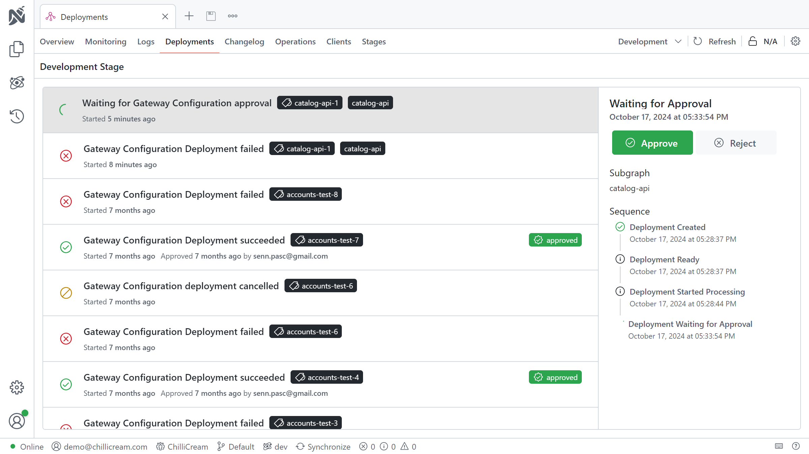
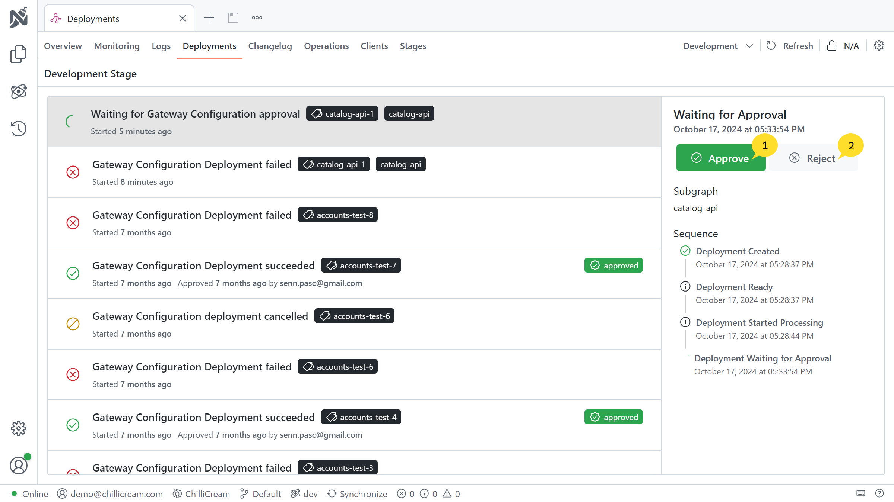

Deploying a service typically involves publishing a client, schema, or fusion configuration to a stage. This process is an integral part of your service's deployment, where artifacts from your CI/CD pipeline are pushed to the platform and then published to a designated stage prior to the actual deployment of your service.

Whenever you initiate a deployment of a client, schema, or fusion configuration through Nitro CLI, it logs an entry in the "Deployments" tab. This tab provides a chronological overview of all deployments executed on the stage, offering visibility into the deployment history and status.

## Setup Approvals

In development environments, it's not uncommon for GraphQL changes to introduce breaking changes. To mitigate the risk of manually pushing such changes to a stage, Nitro CLI offers the `--wait-for-approval` flag. This option can be utilized when publishing a schema, client, or fusion configuration and serves as a time saver by allowing you to review and approve deployments directly from the "Deployments" tab.

Deployments flagged with `--wait-for-approval` are held in a pending state, awaiting approval. They remain in this state until explicitly approved or automatically timed out after 10 minutes. This mechanism allows for a controlled deployment process, where potentially breaking changes can be reviewed and either approved or rejected directly from the "Deployments" tab.

