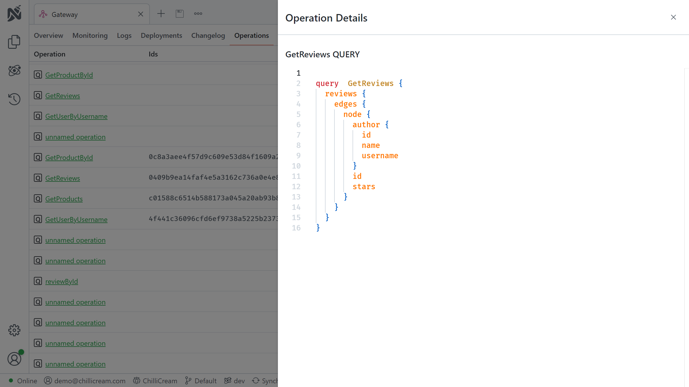
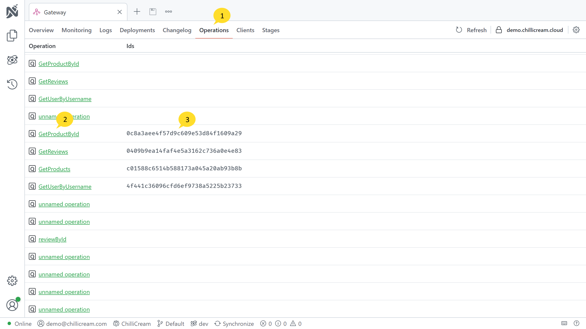

Nitro's Operation Reporting feature provides comprehensive insights into the GraphQL operations executed on your server. This functionality is essential for maintaining visibility over server activities, including both persisted and executed operations. By leveraging Operation Reporting, developers and system administrators can gain a clearer understanding of what operations are executed and available on the server.

# Enabling Operation Reporting

Operation Reporting is an integrated feature in Nitro and is enabled by default when using Nitro services. To integrate these services into your project, the [`ChilliCream.Nitro`](https://www.nuget.org/packages/ChilliCream.Nitro/) NuGet package must be added.

To install the Nitro services, run the following command in your project's root directory:

```bash
dotnet add package ChilliCream.Nitro
```

After installing the package, you need to configure the services in your startup class. Below is a sample implementation in C#:

```csharp
public void ConfigureServices(IServiceCollection services)
{
    services
        .AddGraphQLServer()
        .AddQueryType<Query>()
        .AddNitro(x =>
        {
            x.ApiKey = "<<your-api-key>>";
            x.ApiId = "QXBpCmc5NGYwZTIzNDZhZjQ0NjBmYTljNDNhZDA2ZmRkZDA2Ng==";
            x.Stage = "dev";
        });
}
```

> **Tip: Using Environment Variables**
>
> Alternatively, you can set the required values using environment variables. This method allows you to call `AddNitro` without explicitly passing parameters.
>
> - `NITRO_API_KEY` maps to `ApiKey`
> - `NITRO_API_ID` maps to `ApiId`
> - `NITRO_STAGE` maps to `Stage`
>
> ```csharp
> public void ConfigureServices(IServiceCollection services)
> {
>     services
>         .AddGraphQLServer()
>         .AddQueryType<Query>()
>         .AddNitro()
> }
> ```
>
> In this setup, the API key, ID, and stage are set through environment variables.

# Viewing Reported Operations

Once Operation Reporting is enabled and configured, all GraphQL operations processed by your server will be reported to Nitro. These operations can be viewed and analyzed in the `Operations` tab within the Nitro interface.



1. Click the `Operations` tab in Nitro to view the list of reported operations.
2. The name of the executed operation. Click to view the operation details.
3. The document ID of the persisted operation.
