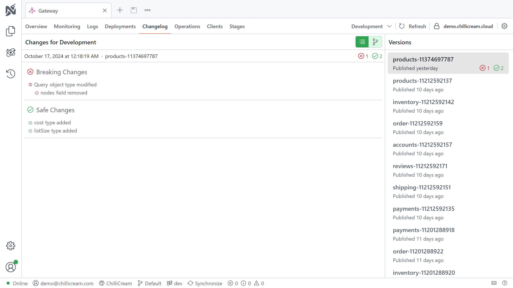
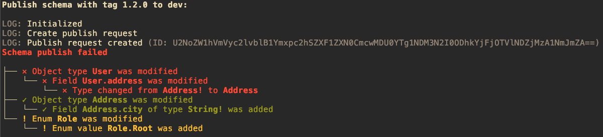
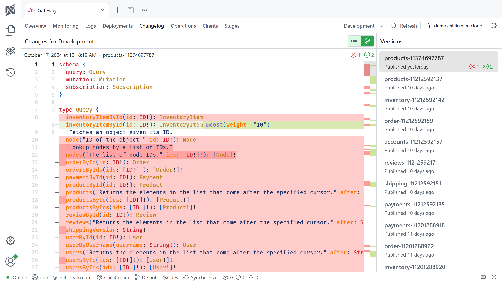

The schema registries is an essential tool for managing your GraphQL APIs. It provides a centralized location for storing, managing, and distributing your GraphQL schema definitions.

With the schema registry, you can upload and store the schema of your API, making it accessible to your development team and other services.


The schema registry enables you to validate your schemas and clients against previous versions, ensuring that changes to your service do not break existing functionality, deeply integrated into your CI/CD pipeline.


They also maintain a version history, allowing you to track changes over time and revert to previous versions if necessary.

Together with the client registry, you can maintain the integrity of your API and the services that rely on it, ensuring that they can evolve together without breaking.

# Understanding Schemas

In the context of GraphQL APIs, a schema is the blueprint that defines the shape of your data and specifies the capabilities of the API. It outlines the types of queries and mutations that can be executed against your API.

A schema is more than just a technical specification; it is a contract between your API and your clients. By understanding and managing schema changes, you can ensure that this contract remains valid and that your API and clients can evolve together without breaking.

Each stage of your API can have one active schema. This active schema is the one against which all requests are validated.

## Schema Changes

Changes to the schema can be categorized into three levels of severity based on their potential impact on the clients: safe, dangerous, and breaking.

1. **Safe**: These changes don't affect the existing functionality. Examples include changes to descriptions or adding a new optional field to a type. Safe changes are generally backward compatible and don't require modifications to existing clients.

Examples are:

- Adding a new field to an object type
- Adding a new optional argument to a field or directive
- Adding a new type

2. **Dangerous**: These changes could potentially break existing functionality, depending on how your consumers interact with your API. An example of a dangerous change is adding a new member to an enum. If the client is not prepared to handle the new member, it might result in unexpected behavior.

Examples are:

- Adding a new member to an enum
- Adding a new implementation to an interface

3. **Breaking**: These changes will break existing functionality if the affected parts of the schema are being used by clients. Examples include changing the type of a field, adding a required field to an input type, removing a field, or adding a new required argument to a field or directive.

Examples are:

- Removing a field from an object type
- Changing the type of a field
- Change a non-null field to a nullable field

Breaking changes need to be managed with care to avoid disruptions to the service. It's important to ensure that all clients can handle these changes before they are introduced. This can be accomplished by versioning your clients and managing the lifecycle of client versions, as described in the section [Understanding Clients](/docs/nitro/apis/client-registry#understanding-clients)].

## Extracting the Schema

Extracting your GraphQL API's schema can be beneficial for various purposes, such as documentation, testing, and version control. Here are some methods to extract the schema:

### Using Schema Export Command

One of the simplest ways to extract the schema is by using the `schema export` command. This command exports your current schema into a specified output file.

```shell
dotnet run -- schema export --output schema.graphql
```

For more details about this command and how to setup the command line extension, please refer to the [Command Line Extension documentation](/docs/hotchocolate/v13/server/command-line).

### Utilizing Snapshot Testing

If you have already established snapshot testing in your workflow, you can use it to extract the schema. Snapshot tests compare the current schema against a previously saved one. If the schemas differ, the test fails, ensuring unintentional schema changes are detected.

Additionally, keeping a snapshot test in the repository aids in visualizing schema changes in pull requests.

Here is a sample snapshot test using [Snapshooter](https://github.com/SwissLife-OSS/snapshooter):

```csharp
[Fact]
public async Task Schema_Should_Not_Change()
{
    // Arrange
    var executor = await new ServiceCollection()
      .AddGraphQL()
      .AddYourSchema()
      .BuildRequestExecutorAsync();

    // Act
    var schema = executor.Schema.Print();

    // Assert
    schema.MatchSnapshot();
}
```

# Setting Up a Schema Registry

To set up a schema registry, first, visit `nitro.chillicream.com` and sign up for an account. Next, you'll need to download and install Nitro CLI, the .NET tool used to manage your schema registry. You can find more information about Nitro CLI in the [Nitro CLI Documentation](/docs/nitro/cli).

After installing Nitro CLI, create a new API either through the Nitro App or the CLI. In the app, simply right-click the document explorer and select "New API." If you prefer using the CLI, ensure you're logged in with the command `nitro login`, then create a new API with the command `nitro api create`. With these steps complete, you are ready to start using the schema registry.

To get the id of your API, use the command `nitro api list`. This command will list all of your APIs, their names, and their ids. You will need the id of your API to perform most operations on the schema registry.

# Integrating with Continuous Integration

Integrating the schema registry and into your Continuous Integration/Continuous Deployment (CI/CD) pipeline maximizes their benefits. It ensures that the schemas in your API are always up-to-date and tested against potential breaking changes.

To interact with the schema registry from the pipeline, you will need a API key. You can generate an api key directly with Nitro CLI using the command `nitro api-key create`. Make sure to copy the key and store it in a secure location. The key will not be displayed again.

You can then use the key to authenticate with the schema registry using the `--api-key` option.

The schema and client registries work hand-in-hand to ensure the smooth functioning of your API. As you make changes to your schema, the schema registry helps manage these changes, preventing inadvertent breaking changes and preserving a history of your schemas. As you validate, upload, and publish new schemas, the client registry ensures that your clients remain compatible with these changes.

## Understanding the Flow

The general flow for the schema registry involves three main steps: validating the schema, uploading it to the registry, and publishing it.

1. **Validate the Schema**: The first step takes place during your Pull Request (PR) build. Here, you validate the schema against the API using the `nitro schema validate` command. This ensures that the schema is compatible with the API and will not break existing functionality.

2. **Upload the Schema**: The second step takes place during your release build. Here, you upload the schema to the registry using the `nitro schema upload` command. This command requires the `--tag` and `--api-id` options. The `--tag` option specifies the tag for the schema, and the `--api-id` option specifies the ID of the API to which you are uploading. This command create a new version of the schema with the specified tag.
   The tag is a string that can be used to identify the schema. It can be any string, but it is recommended to use a version number, such as `v1` or `v2`; or a commit hash, such as `a1b2c3d4e5f6g7h8i9j0k1l2m3n`. The tag is used to identify the schema when publishing it.

3. **Publish the Schema**: The third step takes place just before the release. Here, you publish the schema using the `nitro schema publish` command. This command requires the `--tag` and `--api-id` options. The `--tag` option specifies the tag for the schema, and the `--api-id` option specifies the ID of the API to which you are uploading. This command publishes the schema with the specified tag, making it the active version for the specified API.
