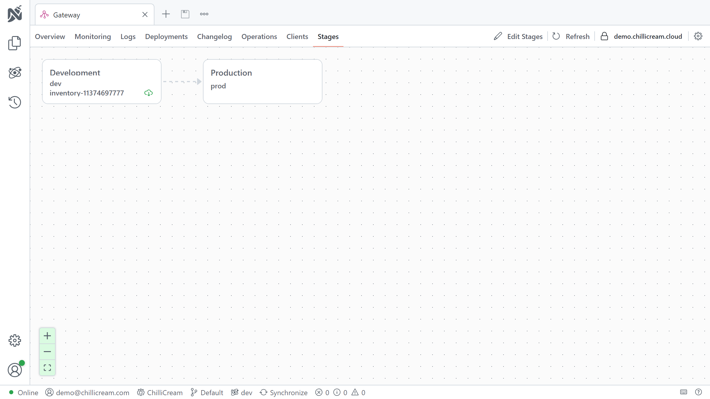
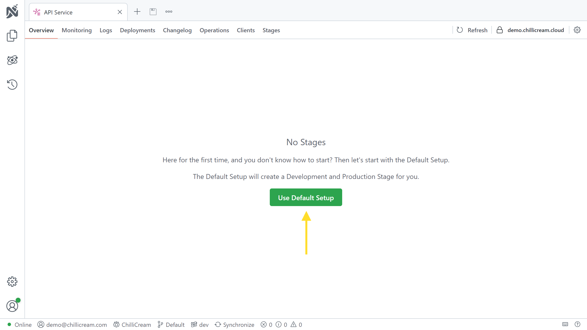
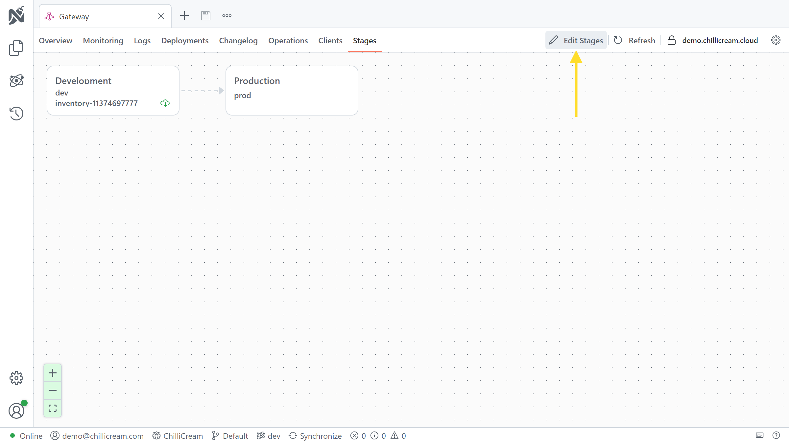
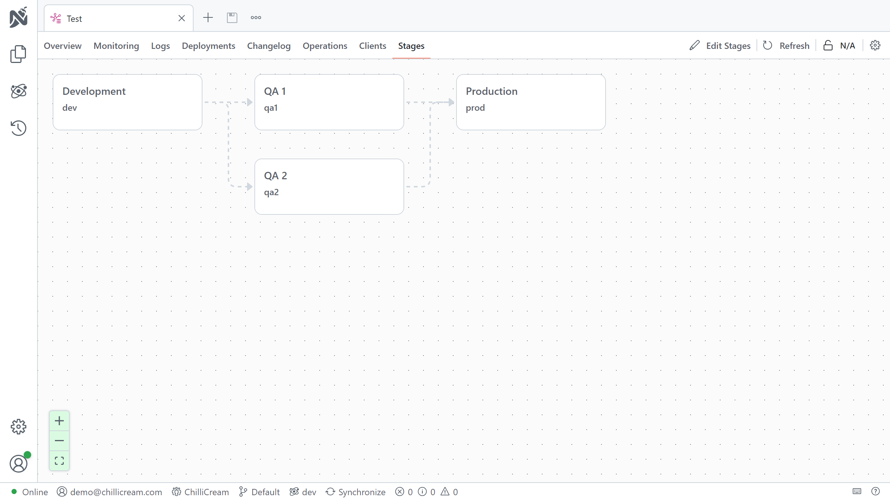

# Working with Stages


A stage represents an environment of your service, such as development, staging, or production. Each stage can have an active schema and multiple active client versions.

Stages are integral to the lifecycle management of your GraphQL APIs. They enable you to manage different environments of your service, such as development, staging, or production. Each stage can have an active schema, multiple active client versions and telemetry reports. The active schema and client versions for a stage represent the current state of your API for that environment.

Stages in your development workflow can be arranged sequentially to represent progression of changes. For instance, in a simple flow like Development (Dev) - Quality Assurance (QA) - Production (Prod), each stage comes "after" the preceding one. This signifies that changes propagate from "Dev" to "QA", and finally to "Prod"

## Managing Stages

If you do not have stages yet, you can go the the `Stages` tab and click on `Use Default Setup`. This will add a stage `Development` and a stage `Production` to your service.


You can always edit these stages or add new ones by clicking the `Edit Stages` button.


The stages dialog allows you to add and edit stages. You can also delete stages, but only if they are not used by any client or schema.

Stages are edited in a yaml editor. The default configuration looks like this:

```yaml
dev: # define a stage by adding the identifier as a root node
  displayName: Development # add a display name to a stage
prod:
  displayName: Production
  conditions:
    - after: dev # this defines the connection to other stages. production comes after development
```

You can easily create more complex stage configurations. For example, if you have two different QA stages, you can define them like this:

```yaml
dev:
  displayName: Development
qa1:
  displayName: QA 1
  conditions:
    - after: dev
qa2:
  displayName: QA 2
  conditions:
    - after: dev
prod:
  displayName: Production
  conditions:
    - after: qa1
    - after: qa2
```

This configuration defines two QA stages, `QA 1` and `QA 2`. Both of them come after the `Development` stage. The `Production` stage comes after both QA stages. It will result in the following stage order:


