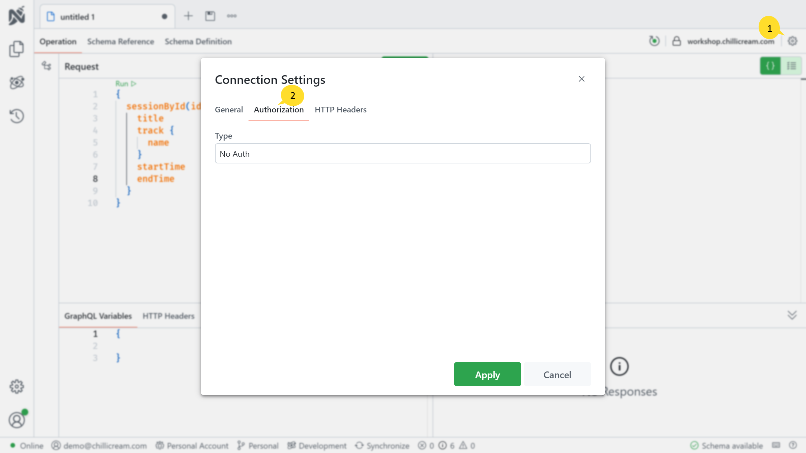
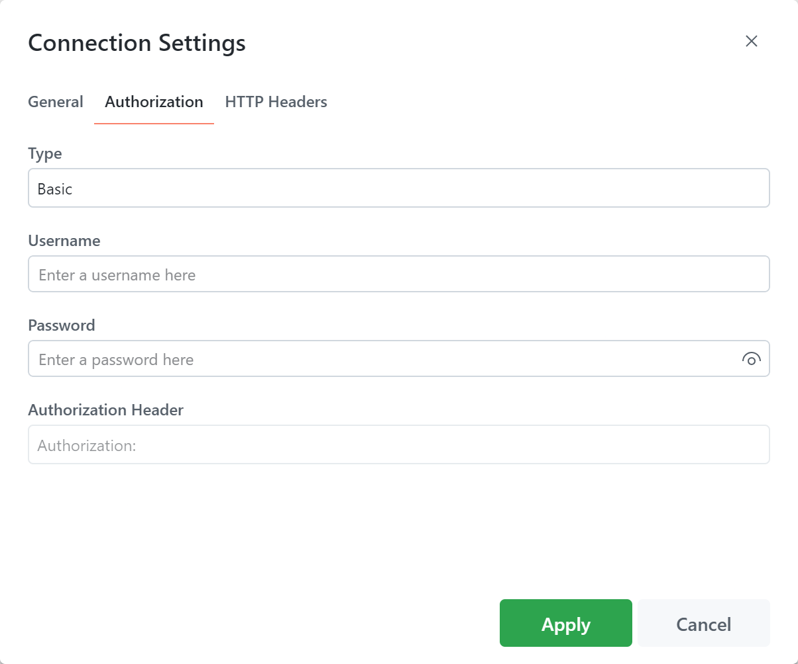
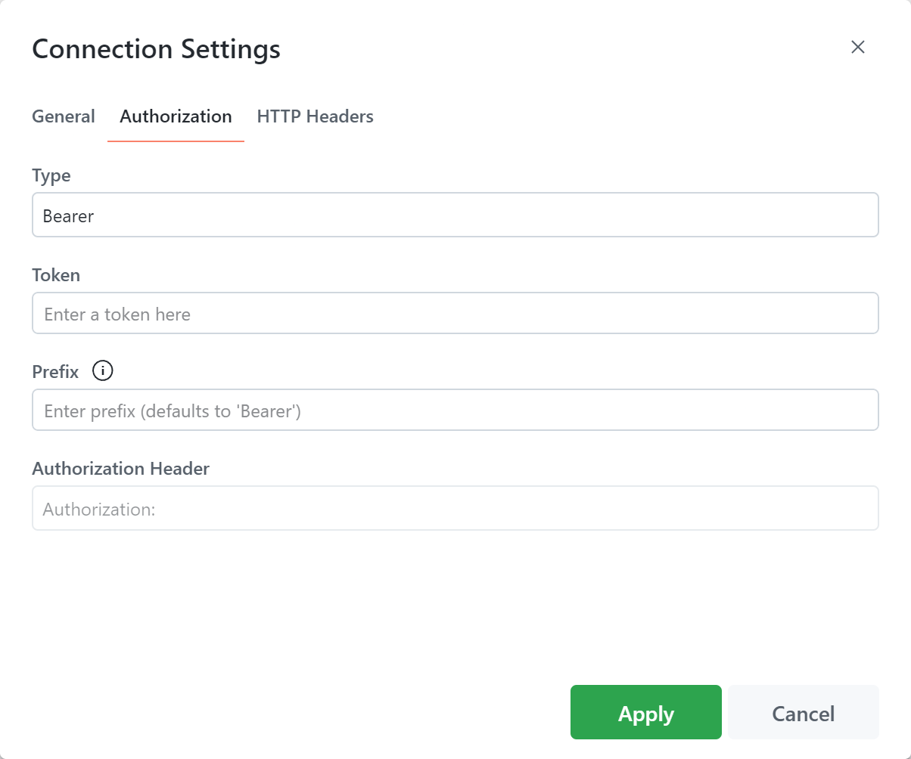
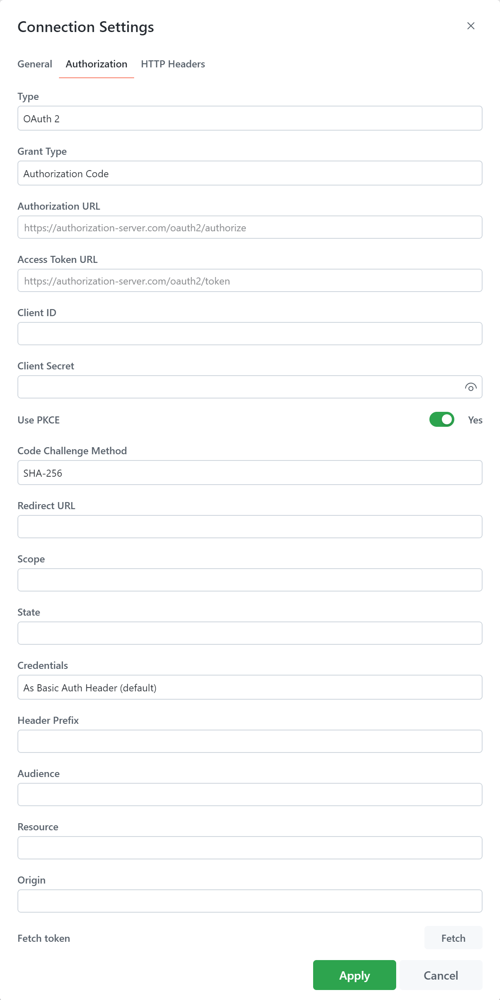
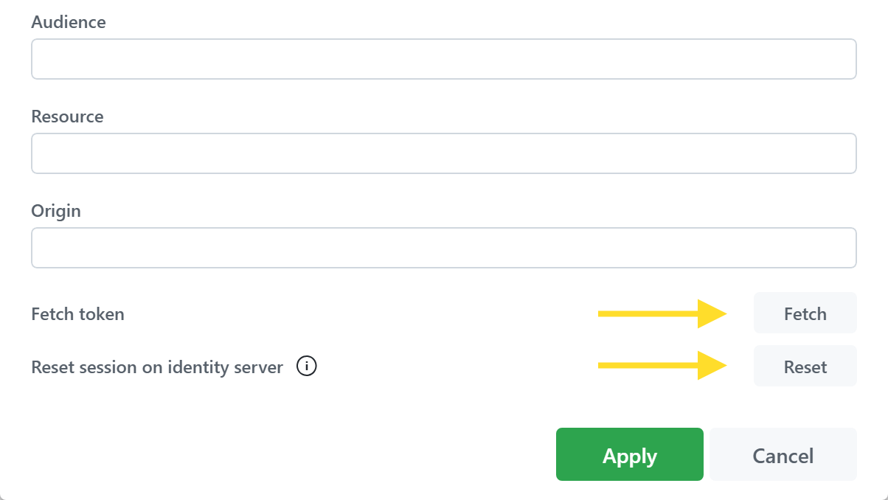
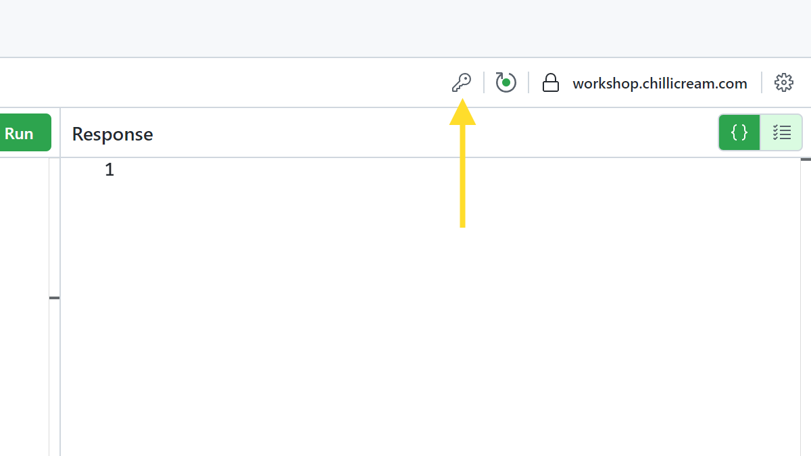

Nitro offers support for various authentication flows. The following guide details how to use these authentication flows to retrieve a token from an identity server and send the Authorization header to the server.

Accessing the authentication settings is straightforward:

1. Locate the cog icon in the navigation bar on the left side of the screen.
2. Click on the icon to open the authentication settings.

Nitro supports three types of authentication flows:

- [Basic Authentication](/docs/nitro/documents/authentication#basic-authentication)
- [Bearer Token](/docs/nitro/documents/authentication#bearer-token)
- [OAuth 2.0](/docs/nitro/documents/authentication#oauth-20)

# Basic Authentication

Basic Authentication is a built-in authentication scheme of the HTTP protocol. It works by sending HTTP requests with an Authorization header. This header includes the word 'Basic' followed by a space and a base64-encoded string of the format 'username:password'.

When setting up Basic Authentication, you will need to provide the following information:

- **Username**: The username required for authentication.
- **Password**: The corresponding password for the provided username.
- **Authorization Header**: This is a preview of the header that will be used for authentication. This field is auto-generated based on the inputted username and password.

Learn more about Basic Authentication [here](https://en.wikipedia.org/wiki/Basic_access_authentication).

# Bearer Token

This method involves a client sending a token within the Authorization header. The token is typically generated by the server when a login request is processed. Subsequent requests to protected resources must include this token in the Authorization header.

You will need to provide at least the token. The following fields are available:

- **Token**: The token that will be used for authentication.
- **Prefix**: The prefix for the token. By default, this is set as 'Bearer'.
- **Authorization Header**: A preview of the header that will be used for authentication. This field is auto-generated based on the provided token and prefix.

Learn more about Bearer Token Authentication [here](https://swagger.io/docs/specification/authentication/bearer-authentication/).

# OAuth 2.0

OAuth 2.0 authentication flow is a industry-standard authorization framework. It allows third-party applications to gain limited access to a web service through a server that supports the OAuth 2.0 protocol. Most major identity providers support OAuth 2.0, including Auth0, Okta, AWS Cognito, Azure AD, and more.

In .NET, OAuth 2.0 is implemented by [Duende IdentityServer](https://duendesoftware.com/products/identityserver) and [OpenIddict](https://documentation.openiddict.com/).

Nitro supports several OAuth 2.0 flows, including:

- [Authorization Code](https://auth0.com/docs/flows/authorization-code-flow)
- [Client Credentials](https://auth0.com/docs/flows/client-credentials-flow)
- [Resource Owner Password Credentials](https://auth0.com/docs/flows/resource-owner-password-flow)
- [Implicit](https://auth0.com/docs/get-started/authentication-and-authorization-flow/implicit-flow-with-form-post)

Depending on the selected OAuth 2.0 flow, the fields you need to fill in will vary.

The following fields are available required:

- **[Grant Type](https://datatracker.ietf.org/doc/html/rfc6749#section-1.3)**: This is the method an application uses to obtain an access token. Common values include 'authorization_code', 'client_credentials', 'password', and 'refresh_token'. Each type serves a different use case, such as a web application, machine-to-machine, mobile apps, etc.

- **Authorization URL**: This is the URL to which your application directs the user in the initial step of the authorization process. It usually looks something like '<https://auth.example.com/authorize>'.

- **Access Token URL**: This is the URL your application uses to obtain the access token from the authorization server. It's typically of the form '<https://auth.example.com/token>'.

- **[Client ID](https://datatracker.ietf.org/doc/html/rfc6749#section-2.2)**: This is a public identifier for your application, issued by the authorization server when you register your application. It's used to identify your application to the user during authorization.

- **[Client Secret](https://datatracker.ietf.org/doc/html/rfc6749#section-2.3.1)**: This is a confidential key held by the client application, used to authenticate to the authorization server when using 'client_credentials' or 'authorization_code' grant types. It should be kept confidential and never exposed publicly.

- **[Use PKCE](https://datatracker.ietf.org/doc/html/rfc7636)**: PKCE (Proof Key for Code Exchange) is a mechanism designed to secure public clients that don't use a client secret. It's highly recommended for mobile and single-page apps. When enabled, it adds an extra step in the authorization process to prevent certain types of attacks.

- **[Scope](https://datatracker.ietf.org/doc/html/rfc6749#section-3.3)**: These are permissions that the application requests. The value is a list of space-delimited strings, such as 'read:messages write:messages'. 'offline_access' can be requested to get a refresh token.

- **[Redirect URL](https://datatracker.ietf.org/doc/html/rfc6749#section-3.1.2)**: This is the URL to which the authorization server will redirect the user's browser after authorization has been granted. It must match one of the redirect URIs registered with the authorization server.

- **[Code Challenge Method](https://datatracker.ietf.org/doc/html/rfc7636#section-4.2)**: This field is relevant if PKCE is used. It defines how the code verifier is transformed. 'PLAIN' or 'S256' (SHA256) are common options, with 'S256' being more secure.

- **[State](https://datatracker.ietf.org/doc/html/rfc6749#section-4.1.1)**: This is an opaque value that is used to maintain state between the request and the callback, mitigating CSRF attacks. It's a good practice to use a unique value for each authorization request.

- **[Credentials](https://datatracker.ietf.org/doc/html/rfc6749#section-2.3)**: Defines how client credentials are sent to the server. They can be sent as a Basic Auth Header or in the Request Body.

- **Header Prefix**: This is the prefix that appears before the token in the Authorization header. The default is 'Bearer', as described in [RFC 6750](https://datatracker.ietf.org/doc/html/rfc6750), but it could also be 'Token' or other custom strings.

- **Audience**: This is the intended audience of the token, typically the identifier of the resource server that should accept the token.

- **Resource**: The target resource that the application wants to access.

- **Origin**: This is used in browser-based applications to indicate the origin of the request and mitigate CSRF attacks.

- **Username**: Required for the 'password' grant type. This is the resource owner's username.

- **Password**: Also required for the 'password' grant type. This is the resource owner's password.

- **[Response Type](https://datatracker.ietf.org/doc/html/rfc6749#section-3.1.1)**: Indicates what should be returned from the initial request. For 'authorization_code' grant type, this should be 'code'. For the implicit grant type, this would typically be 'token'.

This comprehensive set of options allows for fine-tuned control of OAuth 2.0 authentication flows in your application.

Learn more about OAuth 2.0 [here](https://oauth.net/2/).

## Request a token

In Nitro, you can fetch the authentication token using two different methods:

1. **Fetch Button in Authentication Settings**:

   Located at the bottom of the authentication settings is a button labeled `Fetch`. Clicking this will retrieve the authentication token. Once the token is fetched, you also have options to `Clear` it or `Refresh` it (if a refresh token was requested).

   In the desktop application, there's an additional feature to `Reset the session on identity server`. This is particularly useful because your authentication session on your identity server is persisted in the browser, meaning you don't need to sign in repeatedly. If you wish to log in as a different user, you can reset your session by clicking this button.

   

2. **Key Icon in Operations Pane**:

   At the top right of the operations pane, you'll notice a key icon. Clicking this icon initiates the authentication flow.

   

These two methods allow you to conveniently manage and initiate your authentication flows, providing you with flexibility to cater to different use-case scenarios.

## Redirect URL

In the context of Nitro, the Redirect URL plays a crucial role, particularly when you're using Nitro within a web browser rather than the desktop application.

The Redirect URL is where your browser is directed to after the authentication process. It must be configured to point back to the URL where Nitro is hosted. This is essential because Nitro needs to retrieve the authorization code from this URL to exchange it for a token.
