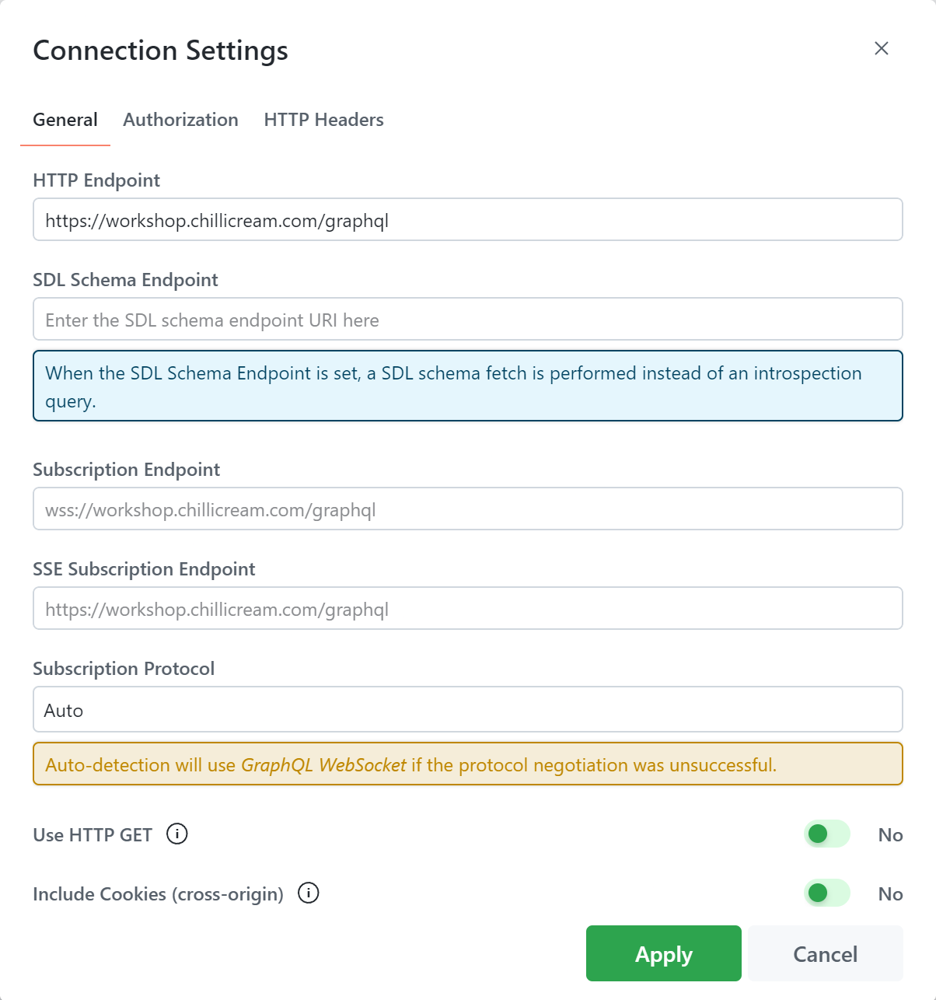

The Connection Settings in Nitro allow you to configure various options related to connecting and communicating with your GraphQL server. This section describes the different settings available and their functionalities.

# HTTP Endpoint

The HTTP Endpoint refers to the URL of your GraphQL server. It is the endpoint used to send queries and mutations. Configure this setting with the appropriate URL to establish a connection with your GraphQL server.

# Subscription Endpoint

The Subscription Endpoint represents the URL used to send subscriptions to the GraphQL server. By default, it is inferred from the Schema Endpoint. Specify the subscription URL if it differs from the Schema Endpoint.

# SSE Subscription Endpoint

If you utilize SSE (Server-Sent Events) subscriptions, the SSE Subscription Endpoint should be provided. This URL specifies the endpoint for SSE subscriptions. By default, it is inferred from the Schema Endpoint.

# Subscription Protocol

The Subscription Protocol setting allows you to choose the protocol for handling subscriptions. Nitro supports the following options:

- **Auto**: Nitro negotiates the protocol with the server automatically based on server capabilities.
- **GraphQL Websocket**: Nitro uses the [graphql-ws](https://github.com/enisdenjo/graphql-ws) protocol for handling subscriptions.
- **GraphQL SSE**: Nitro uses the [graphql-sse](https://github.com/enisdenjo/graphql-sse) protocol for handling subscriptions.
- **Apollo Websocket**: Nitro uses the deprecated [subscriptions-transport-ws](https://github.com/apollographql/subscriptions-transport-ws) protocol from Apollo.

# Use HTTP GET

By enabling the Use HTTP GET option, Nitro will use HTTP GET instead of HTTP POST for executing queries and mutations. This can be useful in certain scenarios or for compatibility with specific GraphQL servers.

# Include Cookies (cross-origin)

Enabling the Include Cookies (cross-origin) option ensures that cookies are included when sending queries and mutations to the GraphQL server. This is particularly relevant in cross-origin situations where cookies are required for authentication or session management.

The Connection Settings provide you with the flexibility to customize the connection parameters and communication behavior with your GraphQL server. Configure these settings according to your server's requirements and the desired functionality of your application.
