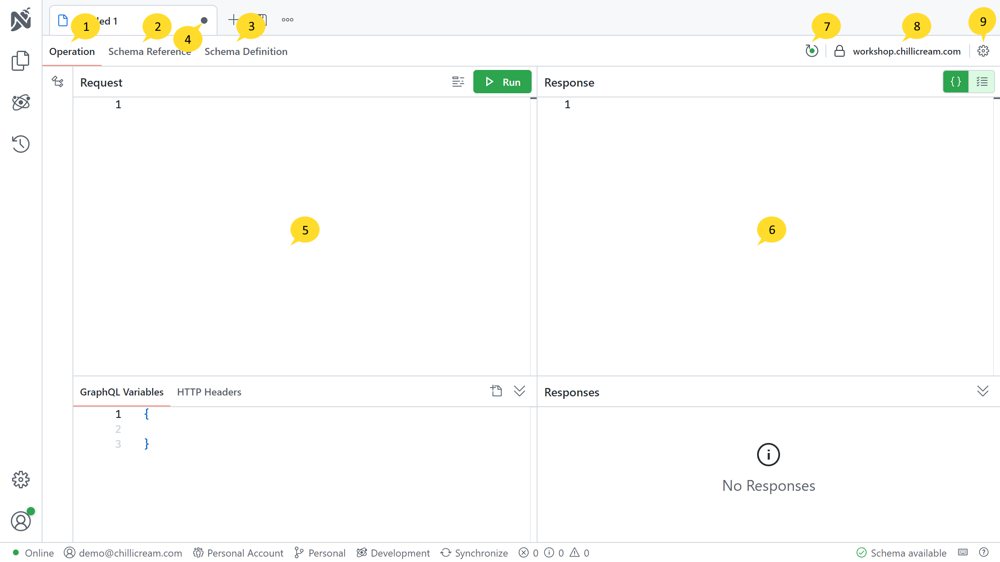

The Document View is a feature that allows users to work with documents and API documents within the application. It provides functionality for executing queries, mutations, and subscriptions. This section describes the various components and functionalities available in the Document View.

# 1. Operation

The Operation section is where you can write and execute your queries, mutations, and subscriptions. It provides a convenient interface for interacting with the GraphQL API.

# 2. Schema Reference

The Schema Reference section allows you to explore the schema in a tree view or the explorer view. It provides detailed information about the available schema and its components. For more information on using the Schema Reference, refer to the [Schema Reference](/docs/nitro/documents/schema-reference) guide.

# 3. Schema Definition

The Schema Definition section displays the schema definition in SDL (Schema Definition Language) format. It allows you to inspect the schema structure and understand its various types and fields. Refer to the [Schema Definition](/docs/nitro/documents/schema-definition) guide for further details.

# 4. Document Status Indicator

The Document Status Indicator visually represents whether the current document is saved or not. A white dot indicates that the document is not saved, while a different icon may indicate a saved or modified state.

# 5. Query Editor

The Query Editor provides a dedicated space for writing your queries, mutations, and subscriptions. It offers features such as syntax highlighting, auto-completion, and error checking to assist in query composition. Learn more about using the query editor in the [Operations](/docs/nitro/documents/operations) guide.

# 6. Response Pane

The Response Pane displays the response of your queries, mutations, and subscriptions. It shows the data returned by the API and provides a structured view for easier analysis. Refer to the [Response Pane](/docs/nitro/documents/response) guide for additional information.

# 7. Schema Indicator

The Schema Indicator is a visual cue that indicates the connection status with the GraphQL server and the successful retrieval of the schema. A green circle represents a connected state.

# 8. Connected Schema Endpoint

This section displays the currently connected schema endpoint, providing information about the GraphQL server being accessed.

# 9. Settings

The Document Settings section allows you to configure various settings specific to the document. Refer to the [Connection Settings](/docs/nitro/documents/connection-settings) guide for detailed information about it. You can also configure the authentication settings for the document. Refer to the [Authentication Settings](/docs/nitro/documents/authentication) guide for more details.
