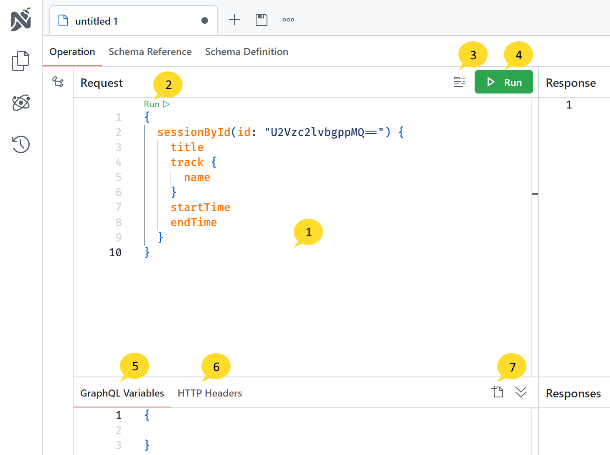

The Operation Pane provides a comprehensive interface for writing GraphQL queries, mutations, and subscriptions. It offers several features to enhance your development experience.

# **1. Request Editor**

The Request Editor is a text editor within the Operation Pane where you can write your GraphQL queries, mutations, and subscriptions. It provides syntax highlighting, intellisense, and validation to assist you in writing accurate queries.

# **2. Inline Run Button**

The Inline Run Button allows you to execute your query directly from the Request Editor. By clicking this button, your query will be sent to the GraphQL server, and the response will be displayed in the Response Pane.

# **3. Format Button**

The Format Button helps you maintain proper query formatting according to common formatting rules. When clicked, it automatically formats your query and updates the content in the Request Editor.

# **4. Run Button**

The Run Button enables you to execute your query with a single click. Similar to the Inline Run Button, clicking this button will send your query to the GraphQL server, and the response will be shown in the Response Pane.

# **5. Variables Panel**

The Variables Panel allows you to define variables for your query. You can specify the variable name, type, and default value. These variables can then be utilized within your query, making it more dynamic and reusable.

# **6. Headers Panel**

The Headers Panel enables you to define headers for your query. You can specify the header name and value, which will be included when sending the query to the GraphQL server. This feature is useful for including authentication tokens or other custom headers required by your API. For authentication, you can also use the Authentication Settings feature, which is described in the [Authentication Settings](/docs/nitro/documents/authentication) section.

# **7. File Upload Panel**

The File Upload Panel provides functionality for uploading files to the GraphQL server. You can specify the file name and contents within this panel. This feature works in conjunction with the `Upload` scalar type, a special type in GraphQL that facilitates file uploads. It follows the multipart form request specification to send files to the GraphQL server. For more details, refer to the [documentation](/docs/hotchocolate/v13/server/files) on file uploads in GraphQL.
