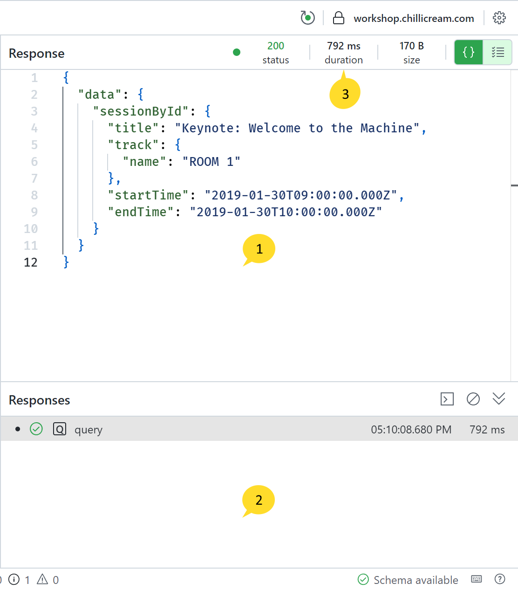
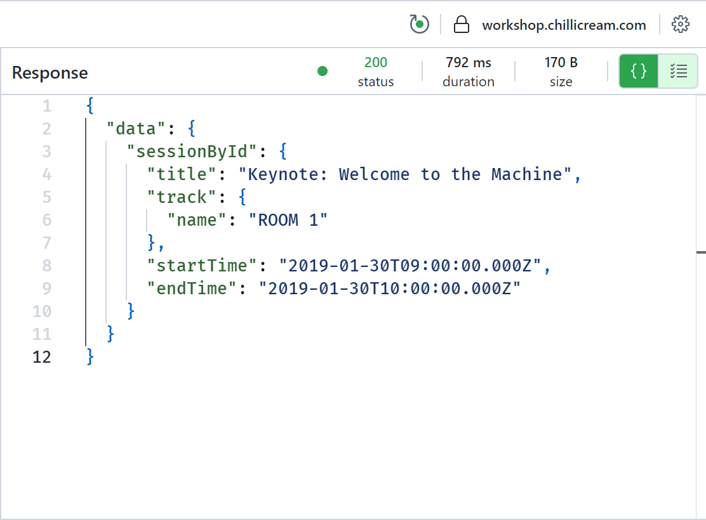
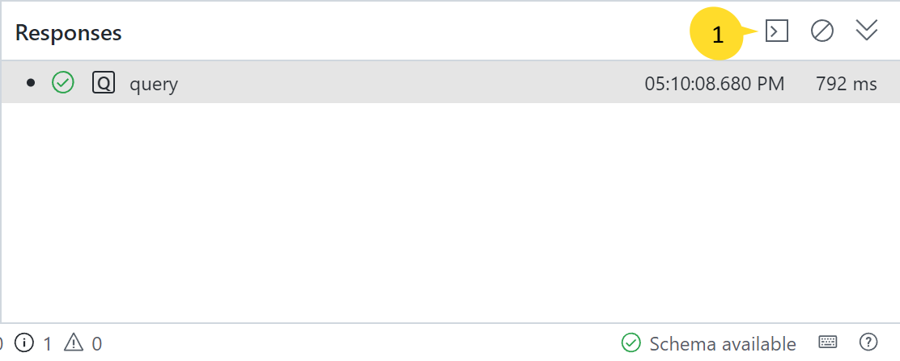
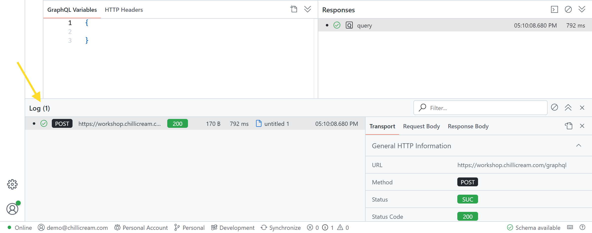

The Response Pane is a central feature that is located to the right of the request editor. Its primary function is to display the response of a query that has been executed, but it offers a range of additional features that help in analyzing these responses.

The pane is divided into two sections:

1. The upper section displays the JSON response.
2. The lower section maintains a record of all executed queries related to the current document.
3. Additionally, you can get a brief overview of the response status code, the duration, and the size of the last executed request on the top right of the pane.

# Response Section

This part of the pane displays the JSON response of the executed query. In case you have deferred results, this view amalgamates all results into one JSON object. For those using subscriptions, this view will display the most recent result of the subscription.

# Responses Section

The Responses section keeps track of all the queries that have been executed in the current document. Clicking on a history entry will load the corresponding query into the editor, allowing you to review the response.

Clicking the button labelled `1` above will open the corresponding log entry:

