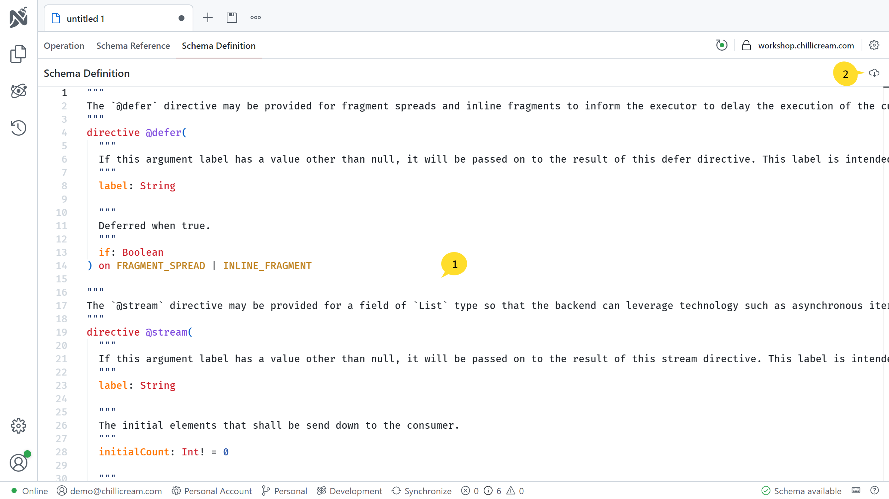

The Schema Definition feature in Nitro provides you with access to the raw Schema Definition Language (SDL) of your GraphQL server. This section explains how to view and download the SDL using Nitro.

1. SDL Editor
   The SDL Editor allows you to explore and examine the SDL of your GraphQL server. You can view the SDL code directly in the editor and analyze the schema structure, types, and fields.

2. Download SDL
   To download the SDL, locate the download icon in the top right-hand corner of the "Schema Definition" area. Clicking on the download icon will initiate the download process, allowing you to save the SDL file locally on your device.
