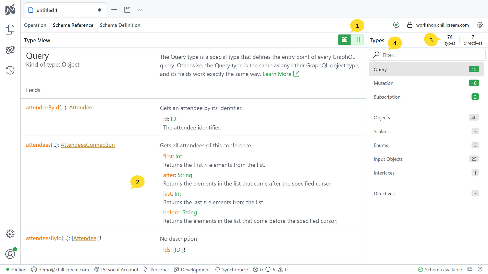
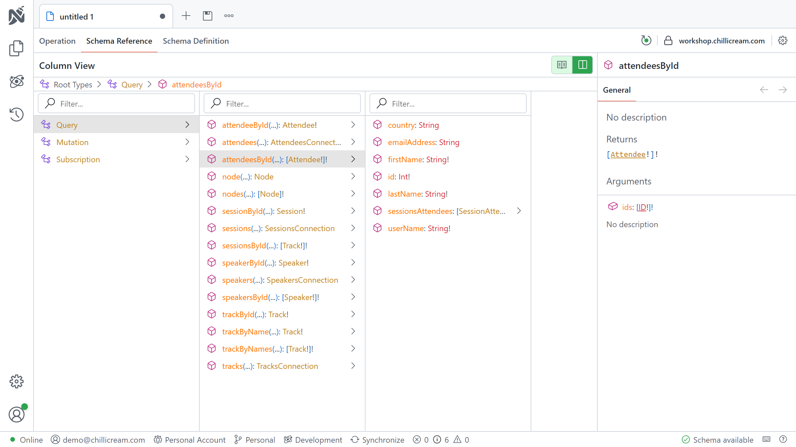

The Schema Reference feature allows you to inspect and explore the schema of your GraphQL server. It provides valuable information about the available types, fields, and directives within the schema. This section describes the components and functionalities of the Schema Reference.

# Explorer View

## 1. View Switcher

The View Switcher allows you to toggle between two different views: the Tree View and the Explorer View. Each view provides a unique way to navigate and explore the schema. You are currently viewing the Explorer View.

## 2. Selected Type Details

This section displays detailed information about the currently selected type, including its fields and arguments. It offers insights into the structure and properties of the selected type.

## 3. Summary Information

The Summary Information provides quick statistics about the number of types and directives present in the schema. It offers a high-level overview of the schema's composition.

## 4. Filter Bar

The Filter Bar allows you to search for specific types and fields within the schema. You can enter keywords or names to quickly locate relevant components.

# Column View

In the Column View, you start with the root types of the schema, such as Query, Mutation, and Subscription. Clicking on a root type expands it to reveal the available fields associated with that type. By clicking on any field, you can further explore the schema and its nested components. The right side of the interface provides detailed information about the selected field.
