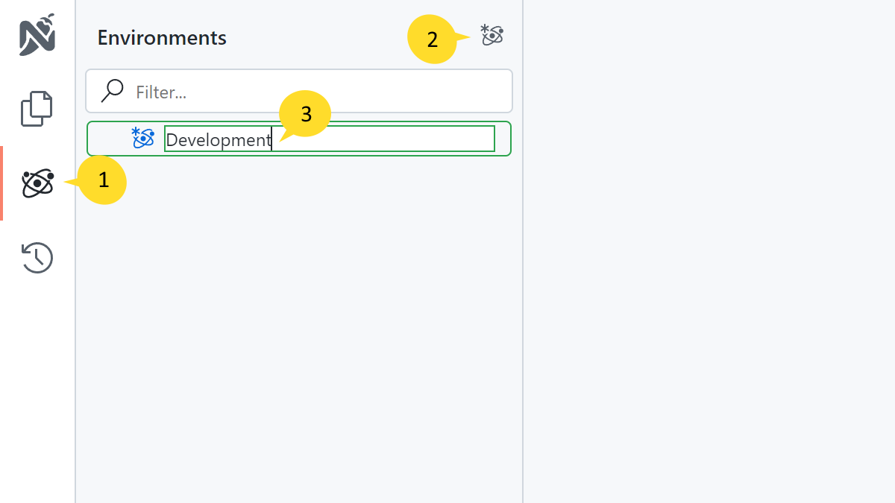
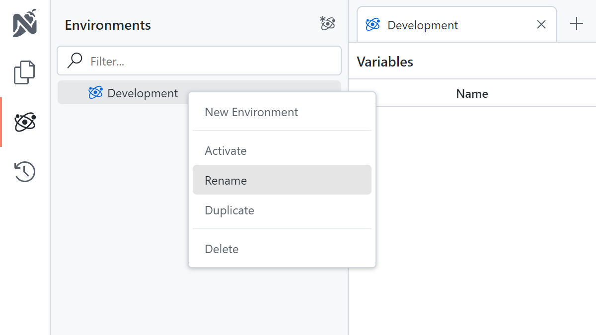
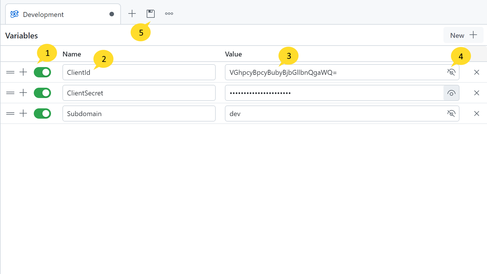
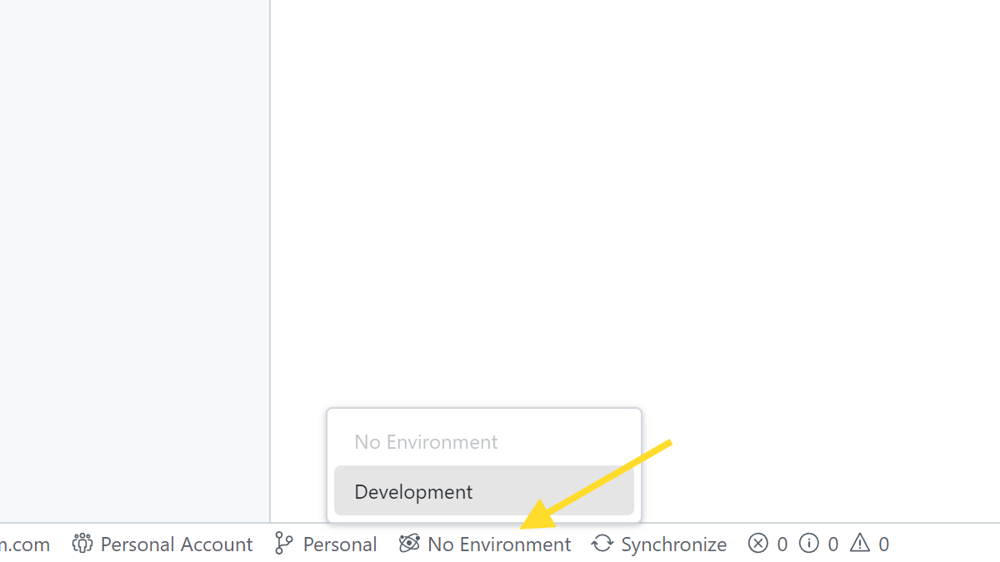
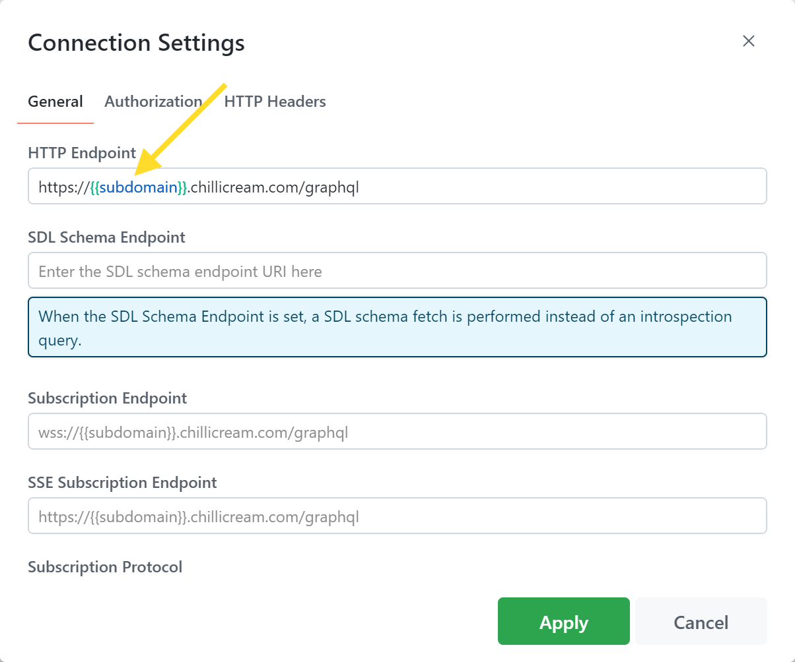

Environment variable provide a mechanism for reusing specific values across multiple documents. These variables are defined as key-value pairs.

Frequently used data, like URLs, tokens, and credentials, are commonly centrally managed as environment variable.
By doing so, these values can be referenced in your documents and changed in a single location for all you documents. You can also quickly switch between different values for different environments.

For instance, you might store your API key as an environment variable, allowing it to be used universally in all your documents.
If the API key changes, you can just update the environment variable without having to manually alter each document.

You can define multiple environments for a single workspace corresponding to various contexts or project stages (e.g., development, testing, production). The environments can be switched in the status bar.

When you have different project stages such as such as development (`https://serivce1.dev.company.com`), testing (`https://serivce1.test.company.com`), and production (`https://serivce1.prod.company.com`), you can for example set up the dynamic part of the url as a variable URL and incorporate it in all your urls (`https://serivce1.{{subdomain}}.company.com`).
By switching the active environment in Nitro, the base URL will update automatically, streamlining your workflow.
Similarly, identifiers such as client ID and client secret can be defined as environment variable, which make it convenient to work with.

# Creating Environments

To create a new environment, follow these steps:

1. Click on the environment icon on the left side of your screen.
2. Click the Plus icon to create a new environment.
3. Enter a name for the environment.

# Rename Environments

You can rename by right-clicking on the environment and selecting the 'Rename' option.

# Specifying Variables

To open the environment variable editor, click on the environment you would like to edit.

1. **Enabled**: If an environment variable is disabled, it will not be used in requests. This state is not synchronized with the server and is only local to the client. This way you can temporarily disable an environment variable without other users being affected.
2. **Name**: The name of the environment variable. This name will be used to reference the variable in your documents. e.g. `{{ClientId}}`, `{{ClientSecret}}` `{{Subdomain}}`
3. **Value**: The value of the environment variable. This value will be substituted in your documents when the environment variable is referenced.
4. **Secret**: If an environment variable is marked as secret, it will be shown as a password field within the Nitro interface. This feature is designed to help prevent accidental exposure of the value. Please note that marking a value as secret does not mean it is encrypted; it is simply visually obscured in the user interface.
5. **Save Tab**: Clicking the 'Save Tab' button will save the environment variables.

# Switching Environments

To switch environments, click on the environment name in the status bar. A dropdown menu will appear, listing all available environments.
After selecting an environment, the environment variables of the selected environment will be active and applied to all documents.

# Using Variables

Once you have defined an environment variable, you can reference it in your documents by using the following syntax: `{{variable_name}}`.
Environment variable can be employed in a variety of places within Nitro, such as URLs, GraphQL Variables, and Connection Settings. When a request is executed, any referenced environment variable will be substituted with their respective values.
