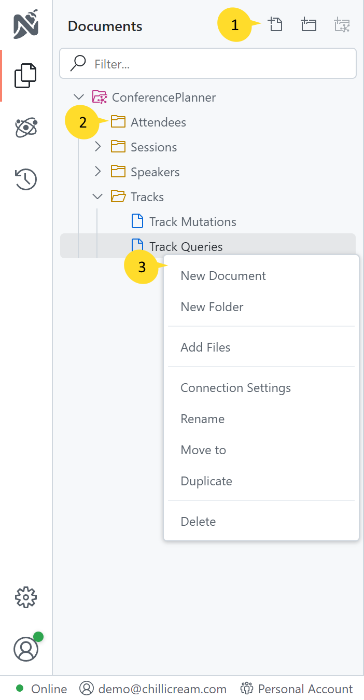

The Explorer is a versatile component utilized in various parts of the application. It serves as a navigation tool for traversing the workspace tree, enabling you to efficiently browse and manage their project's structure. Additionally, the Explorer uses icons to visually represent the type of each item within the workspace.

### 1. Quick Actions

The Explorer offers a set of quick actions that allow users to perform common tasks swiftly. In the provided example, the quick actions enable the creation of a document, folder, or API with just a few clicks.

### 2. Folder Node

Folder nodes within the Explorer can be expanded or collapsed by clicking on the arrow associated with them. The icon accompanying each folder node indicates its item type, aiding in quick identification and differentiation.

### 3. Context Menu

Right-clicking on an item within the Explorer opens the context menu, which presents a list of actions that can be performed on the selected item. The context menu provides a convenient way to access item-specific operations and functions relevant to the current workspace context.
