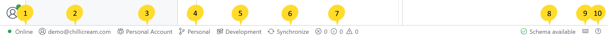
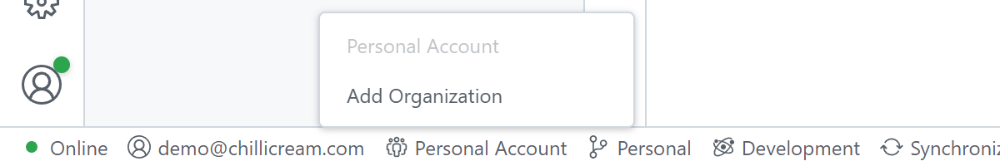
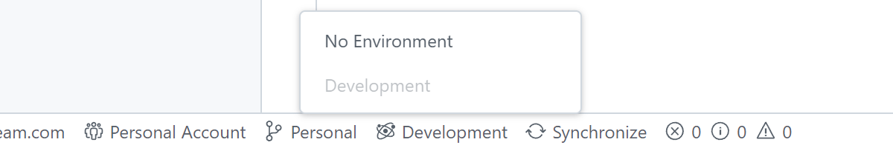
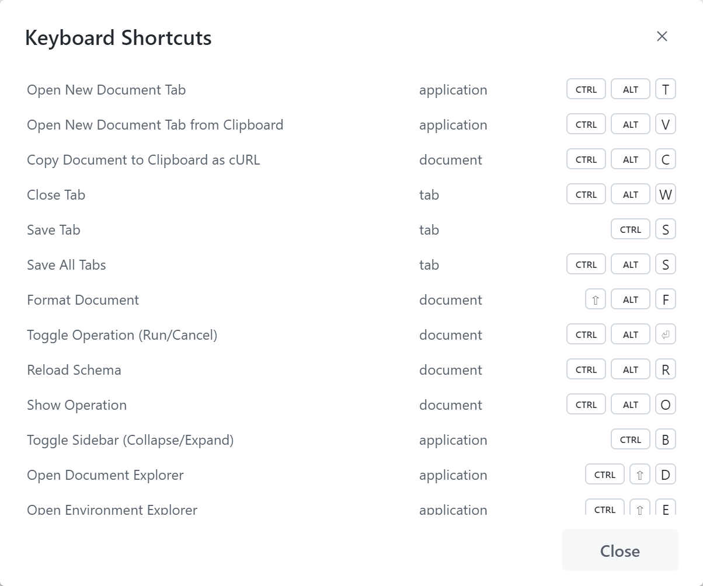
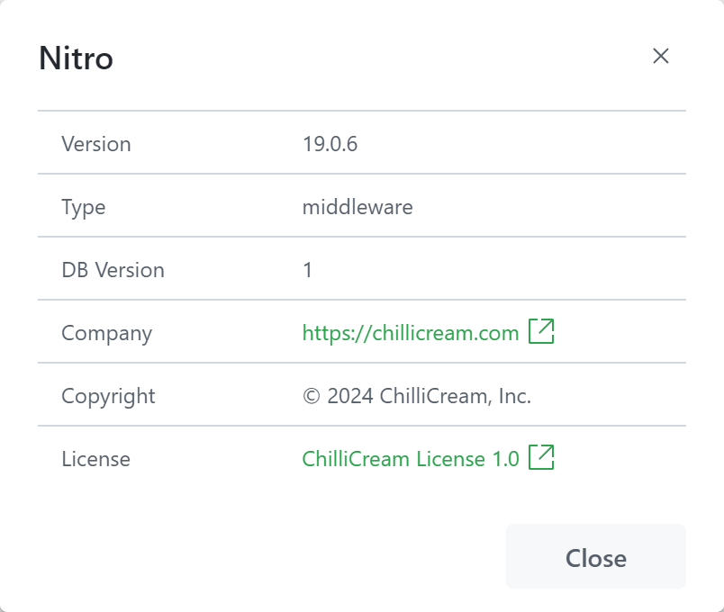

The status bar is a visual component located at the bottom of the application interface. It is divided into several sections, each providing valuable information to the user.

1. **Connection Status:** This section indicates whether you are currently connected to the internet or not. When online, it means that any changes you make are being synchronized with the cloud.

2. **User Info:** The section displays the email of the user who is currently signed in to the application. It helps you identify the user account associated with the active session.

3. **Selected Organization:** In this section, you can see the name of the organization that is currently selected. Clicking on this section allows you to change the organization or add a new one.
   

4. **Selected Workspace:** This section shows the currently selected workspace within the chosen organization. By clicking here, you can easily switch to a different workspace, providing seamless navigation between different project environments.

5. **Environment:** This section displays the name of the currently selected environment. Clicking on this section allows you to switch to a different environment or create a new one.
   

6. **Workspace Synchronization Indicator:** The indicator in this section informs you whether the workspace is currently synchronizing. If synchronization is required or you want to manually trigger the process, you can click here to initiate synchronization.

7. **Schema Available:** This section provides an indicator to show whether the schema, which defines the structure and organization of data within the application, is available.

8. **Log:** This section indicates the number of log entries for each severity (error, information, warning). Clicking on this section will open the `Log` panel.

9. **Keyboard Shortcuts Overlay:** By clicking on this section, you can display an overlay that shows a list of available keyboard shortcuts for efficient navigation and interaction with the application.
   

10. **Version Information:** This section displays relevant information about the version of the application you are currently using. It helps you identify the installed version and keep track of updates or changes that may be available.
   
