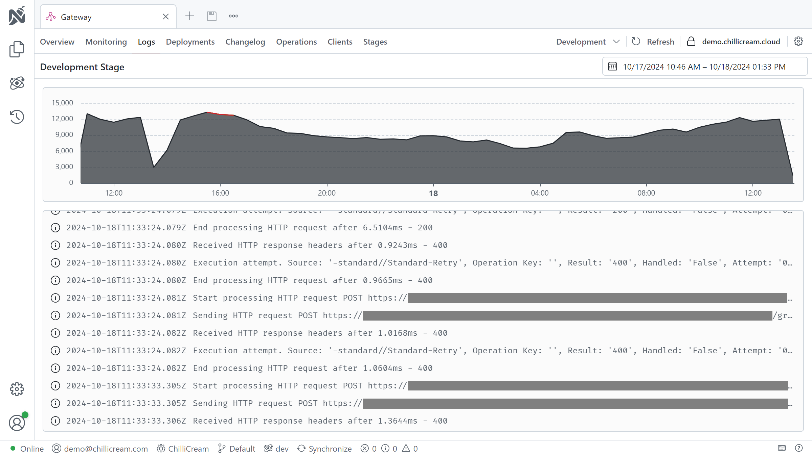
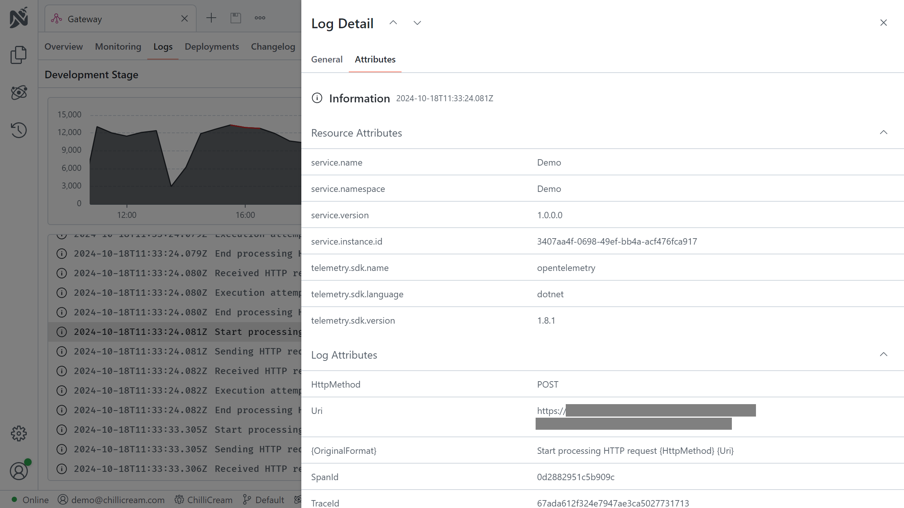
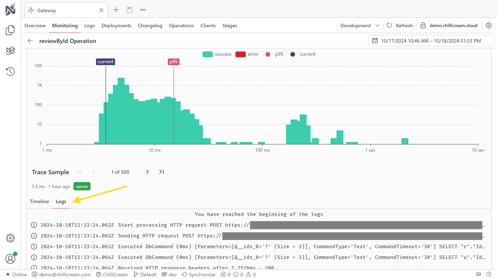

Nitro includes Open Telemetry logging, allowing seamless log collection and analysis directly within the app.
This documentation provides guidance on setting up and utilizing logging features in Nitro for enhanced monitoring, debugging, and performance analysis of your APIs.

## API Logs


Each API in Nitro features a **Logs** tab, providing a centralized interface for viewing and managing logs associated with your API.
This unified log view offers insights into your system’s activities, enabling you to monitor and troubleshoot in real-time.

### Detailed Log Inspection



Within the Logs tab, individual log entries can be expanded to reveal additional details such as timestamps, log levels, and message content.

## Trace Logs



Logs can also be inspected within individual traces, providing detailed insights into the correlation between specific traces and their corresponding logs.

## Log Retention

Log retention in Nitro is configured as follows:

- **Shared Clusters:** Logs are retained for 1 day to allow for recent log review.
- **Dedicated Clusters:** Dynamic log retention times can be configured to meet specific needs, offering flexibility in log management.

## Connect your service

All the logging is done on a per API basis.
An api represents one of your deployments.
To monitor you services you need to create an API in Nitro.
The api needs to be from type "Api Service" or "Api Gateway".

To install the Nitro services, run the following commands in your project's root directory:

```bash
dotnet add package ChilliCream.Nitro
dotnet add package OpenTelemetry.Extensions.Hosting
dotnet add package OpenTelemetry.Instrumentation.AspNetCore
```

After installing the package, you need to configure the services in your startup class.
Below is a sample implementation in C#:

```csharp
public void ConfigureServices(IServiceCollection services)
{
    services
        .AddGraphQLServer()
        .AddQueryType<Query>()
        .AddNitro(x =>
        {
            x.ApiKey = "<<your-api-key>>";
            x.ApiId = "QXBpCmc5NGYwZTIzNDZhZjQ0NjBmYTljNDNhZDA2ZmRkZDA2Ng==";
            x.Stage = "dev";
        })
        .AddInstrumentation();

    services
        .AddLogging(x => x
            .AddNitroExporter()
            .AddOpenTelemetry(options =>
            {
                options.IncludeFormattedMessage = true;
                options.IncludeScopes = true;
            }));
}
```

> **Tip: Using Environment Variables**
>
> Alternatively, you can set the required values using environment variables. This method allows you to call `AddNitro` without explicitly passing parameters.
>
> - `NITRO_API_KEY` maps to `ApiKey`
> - `NITRO_API_ID` maps to `ApiId`
> - `NITRO_STAGE` maps to `Stage`
>
> ```csharp
> public void ConfigureServices(IServiceCollection services)
> {
>     services
>         .AddGraphQLServer()
>         .AddQueryType<Query>()
>         .AddNitro()
>         .AddInstrumentation(); // Enable the graphql telemetry
>
>     services
>         .AddLogging(x => x
>              .AddNitroExporter()
>              .AddOpenTelemetry(options =>
>              {
>                  options.IncludeFormattedMessage = true;
>                  options.IncludeScopes = true;
>              }));
> }
> ```
>
> In this setup, the API key, ID, and stage are set through environment variables.

## Full Example

For a complete implementation example, visit the [example repository](https://link.chillicream.com/docs/logging-example).
