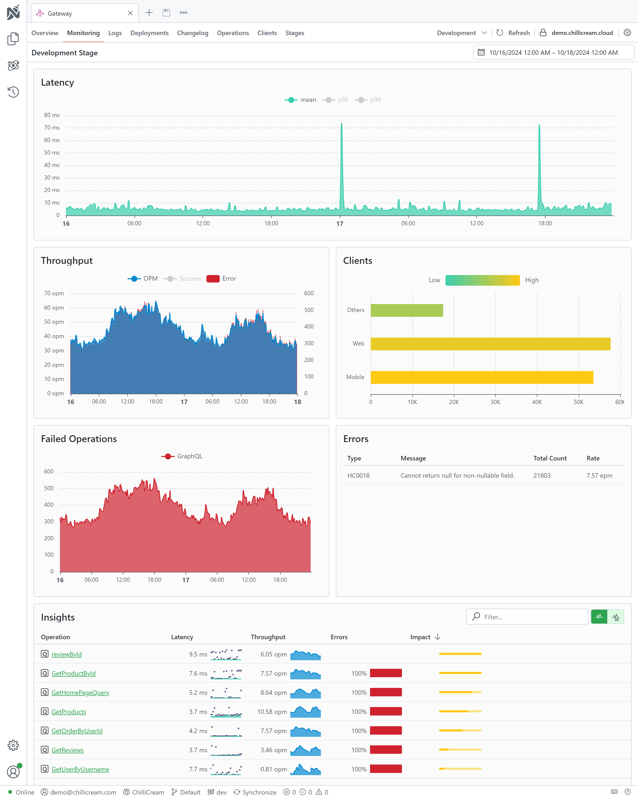

Nitro can collect your [Open Telemetry](https://opentelemetry.io/) data and visualize your traces in the app.
With telemetry you can get a better understanding of how your application is performing and where you can improve it.


It helps you to understand which resolver is impacting your system the most, which queries are slow and which are fast and deeply analyze each trace to your system.

## Connect your service to the telemetry system

All the reporting is done on a per API basis. An api represents one of your deployments. To monitor you services you need to create an API in Nitro.
The api needs to be from type "Api Service" or "Api Gateway".

To install the Nitro services, run the following commands in your project's root directory:

```bash
dotnet add package ChilliCream.Nitro
dotnet add package OpenTelemetry.Extensions.Hosting
dotnet add package OpenTelemetry.Instrumentation.AspNetCore
```

After installing the package, you need to configure the services in your startup class. Below is a sample implementation in C#:

```csharp
public void ConfigureServices(IServiceCollection services)
{
    services
        .AddGraphQLServer()
        .AddQueryType<Query>()
        .AddNitro(x =>
        {
            x.ApiKey = "<<your-api-key>>";
            x.ApiId = "QXBpCmc5NGYwZTIzNDZhZjQ0NjBmYTljNDNhZDA2ZmRkZDA2Ng==";
            x.Stage = "dev";
        })
        .AddInstrumentation(); // Enable the graphql telemetry

    services
        .AddOpenTelemetry()
        .WithTracing(x =>
        {
            x.AddAspNetCoreInstrumentation();
            x.AddNitroExporter();
        });
}
```

> **Tip: Using Environment Variables**
>
> Alternatively, you can set the required values using environment variables. This method allows you to call `AddNitro` without explicitly passing parameters.
>
> - `NITRO_API_KEY` maps to `ApiKey`
> - `NITRO_API_ID` maps to `ApiId`
> - `NITRO_STAGE` maps to `Stage`
>
> ```csharp
> public void ConfigureServices(IServiceCollection services)
> {
>     services
>         .AddGraphQLServer()
>         .AddQueryType<Query>()
>         .AddNitro()
>         .AddInstrumentation(); // Enable the graphql telemetry
>
>     services
>         .AddOpenTelemetry()
>         .WithTracing(x =>
>         {
>             x.AddAspNetCoreInstrumentation();
>             x.AddNitroExporter();
>         });
> }
> ```
>
> In this setup, the API key, ID, and stage are set through environment variables.

# Monitoring Dashboard

The monitoring dashboard in Nitro offers various metrics and visualizations to understand your service's performance better.

## Changing the time range


You can change the time range of the dashboard by clicking on the time range selector in the top right corner of the dashboard.
You can either customize the time range or select one of the predefined ranges.

## Latency


The latency graph shows the average latency of your service over time. You can also see the 95th and the 99th percentile of the latency.

## Throughput


The throughput graph shows you the operations per minute over time. You can see how many operations are executed on your service and how many of them failed.

## Clients


You can track how many requests are done by each client. This helps you to understand which client is impacting your system the most.
To track this, your clients need to send two headers with each request:

- `GraphQL-Client-Id` - The ID of the client. You can get the ID from the client by executing `nitro client list` in your terminal.
- `GraphQL-Client-Version` - The version of the client.

## Failed Operations


Shows you the number of failed operations over time.

## Errors


Shows error details.

## Insights


Insights shows you a list of executed operations. You can see the latency, the throughput and also how many percent of the operations had errors. You also have a column impact, which will help you to understand which operations are impacting your system the most. You can sort the columns by clicking on the column header.

By clicking on an operation, you can see the telemetry information about the operation and its traces.


On the top right corner you can change from the operation insights to the resolver insights view.

# Operation Dashboard


You can drill down into the telemetry information of a single operation by clicking on it in the insights view.

## Latency, Throughput, and Errors

Theses graphs show you the latency, throughput, and error rate of the selected operation over time similar to the graphs on the monitoring dashboard.

## Latency Distribution


This graph shows you the distribution of different traces of the selected operation. This way you can quickly see outliers and understand how the operation is performing.


You can also select a time range in the graph. This selection will impact which traces are shown in the trace table. You can for example select the slow operations on the right and inspect why they are slow.

## Traces


On the very bottom of the page you see sample traces of the selected operation with all of the spans.

If you click on a trace, the sidebar will show additional information about the trace, including all of its attributes.


