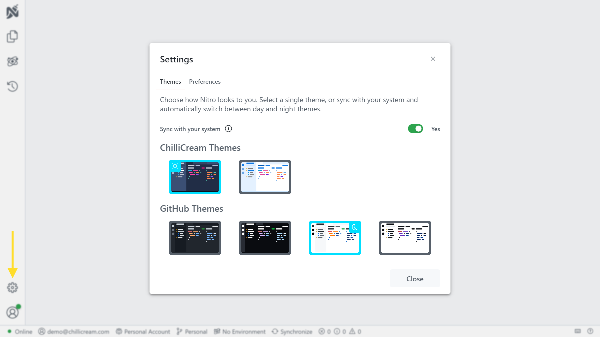

The Settings section provides users with various customization options. To access the settings, click on the cog icon located in the navigation bar on the left.

Currently, the most significant setting available is the [Themes](/docs/nitro/settings/themes) feature. This allows users to personalize the appearance and visual style of the application.

Please note that organization settings are exclusively accessible through the management portal. For more information about organization settings, refer to the [Organizations](/docs/nitro/organizations) documentation.
