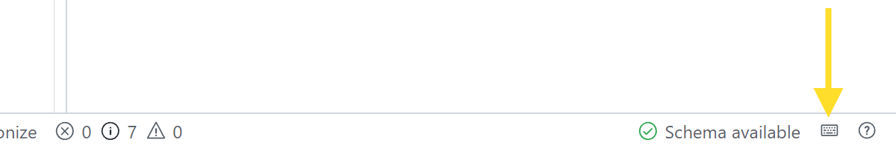

This document provides a list of useful keyboard shortcuts for performing various actions in the application.

A full list of all available keyboard shortcuts can be found by clicking on the 'Keyboard Shortcuts' button in the status bar.

# Mac

## Application Shortcuts

- Open New Document Tab: ⌘ + ⌥ + T
- Open New Document Tab from Clipboard: ⌘ + ⌥ + V
- Toggle Sidebar (Collapse/Expand): ⌘ + B
- Open Document Explorer: ⌘ + ⇧ + D
- Open History Explorer: ⌘ + ⇧ + H
- Open Settings: ⌘ + ,
- Open Keyboard Shortcuts: ⌘ + K S

## Document Shortcuts

- Copy Document to Clipboard as cURL: ⌘ + ⌥ + C
- Close Document: ⌘ + ⌥ + W
- Save Document: ⌘ + S
- Save All Documents: ⌘ + ⌥ + S
- Format Document: ⇧ + ⌥ + F
- Toggle Operation (Run/Cancel): ⌘ + ⌥ + ⏎
- Reload Schema: ⌘ + ⌥ + R
- Show Operation: ⌘ + ⇧ + O
- Show Schema: ⌘ + ⇧ + S

# Windows

## Application Shortcuts

- Open New Document Tab: CTRL + ALT + T
- Open New Document Tab from Clipboard: Application Key + W (Windows key + W)
- Toggle Sidebar (Collapse/Expand): Application Key + B (Windows key + B)
- Open Document Explorer: CTRL + SHIFT + D
- Open History Explorer: CTRL + SHIFT + H
- Open Settings: Application Key + , (Windows key + comma)
- Open Keyboard Shortcuts: CTRL + K S

## Document Shortcuts

- Copy Document to Clipboard as cURL: CTRL + ALT + C
- Close Document: CTRL + ALT + W
- Save Document: CTRL + S
- Save All Documents: CTRL + ALT + S
- Format Document: SHIFT + ALT + F
- Toggle Operation (Run/Cancel): CTRL + ALT + Enter
- Reload Schema: CTRL + ALT + R
- Show Operation: CTRL + SHIFT + O
- Show Schema: CTRL + SHIFT + S
