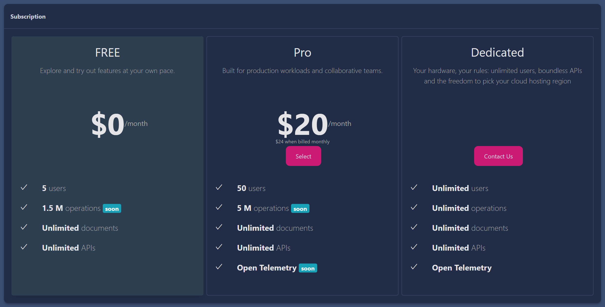
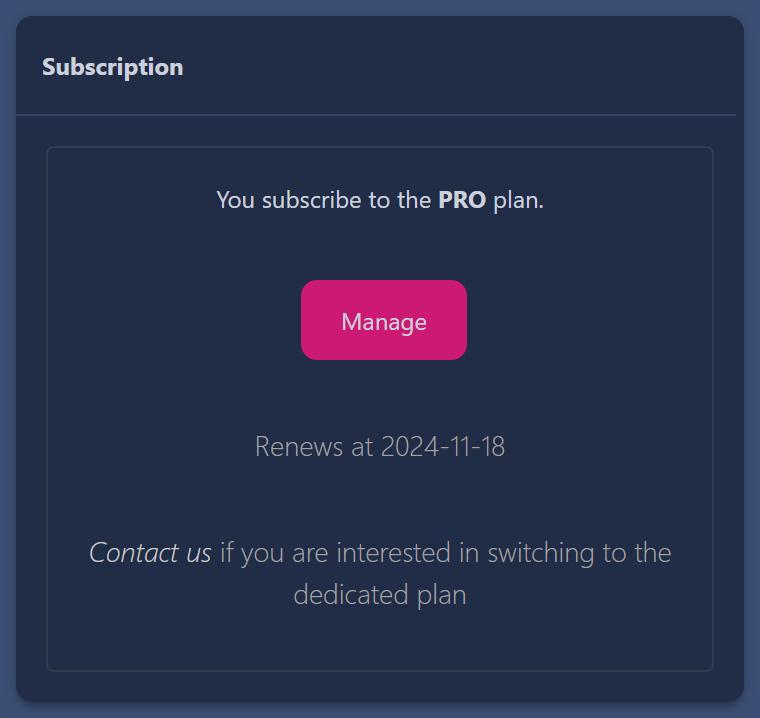
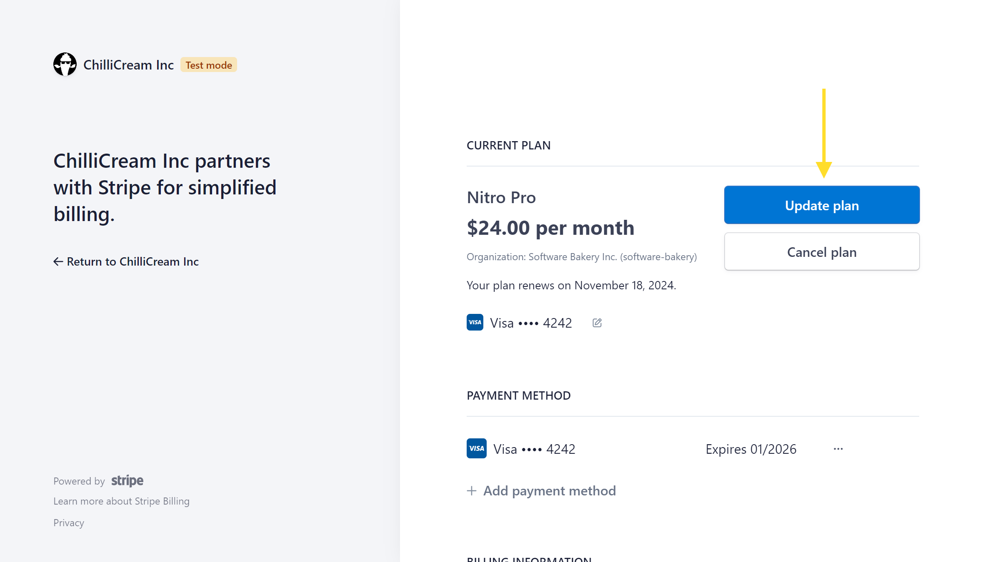
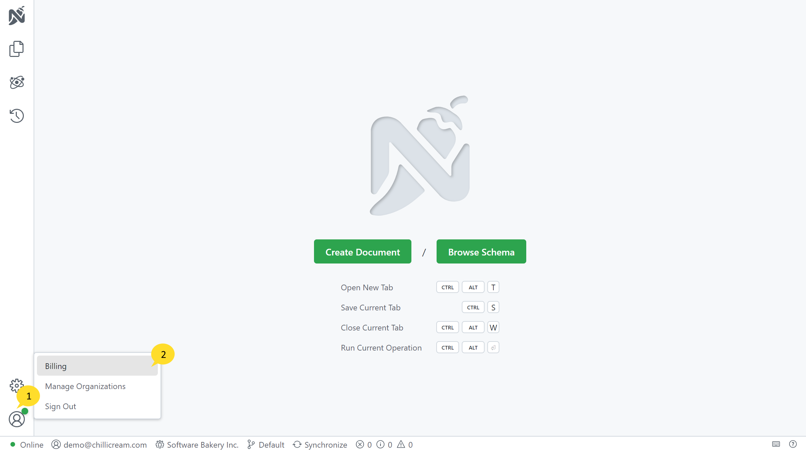

You can manage your subscriptions directly from the web portal, accessible from [here](https://identity.chillicream.com/Organization), or through Manage Organizations on the client.

# Creating a Subscription

When you do not have a subscription yet, you can create one in the 'Subscription' section of the management portal. Open the organization in the context of an owner or admin to see this section.

To create a Pro subscription, click the 'Select' button. You will be redirected to the billing portal to complete the payment process. Enter your payment details and click on the 'Subscribe' button to complete the payment process.

You have the option to pay monthly or annually. Annual payments are discounted.

You can cancel your subscription at any time. The subscription will remain active until the end of the current billing period. You can also change your subscription plan at any time. Check out the [Changing a Subscription](#changing-a-subscription) section for more information.

# Changing a Subscription

To change your subscription plan, follow these steps:

1. **Access the Management Portal:** Open the management portal by clicking ['Manage Organizations' -> 'Manage'](/docs/nitro/organizations#managing-organizations) option in the context menu of Nitro or by navigating to [here](https://identity.chillicream.com/Organizations).

2. **Navigate to Subscription:** Within the management portal, click on 'Manage' in the subscription section.
  

3. **Update plan:** Here, you can update your subscription plan. Changing this value will affect the number of users who can join your organization.
  

# Expiry and Seats

Nitro's subscription model allows a certain number of users (seats) to join an organization based on your chosen subscription plan.

If your subscription expires, all users except the organization owner will be deactivated a few days after the expiration. The deactivated users will regain access once the subscription is renewed.

If your organization reaches its maximum seat limit, no new users will be able to join the organization. You can manage this by either upgrading your subscription to allow for more seats or by removing existing users from the organization to free up seats.

# Billing

In the client app you can directly access the billing portal by clicking 'Billing' and managing your running subscriptions:

The billing of an organization is currently on a per-user basis. All billing-related aspects, including subscription management and payment processing, are handled securely through Stripe, which you can directly manage from the management portal.

> Please note that the pricing model and subscription terms are subject to change, and users are advised to stay updated by regularly checking our website or contacting our customer support team.
