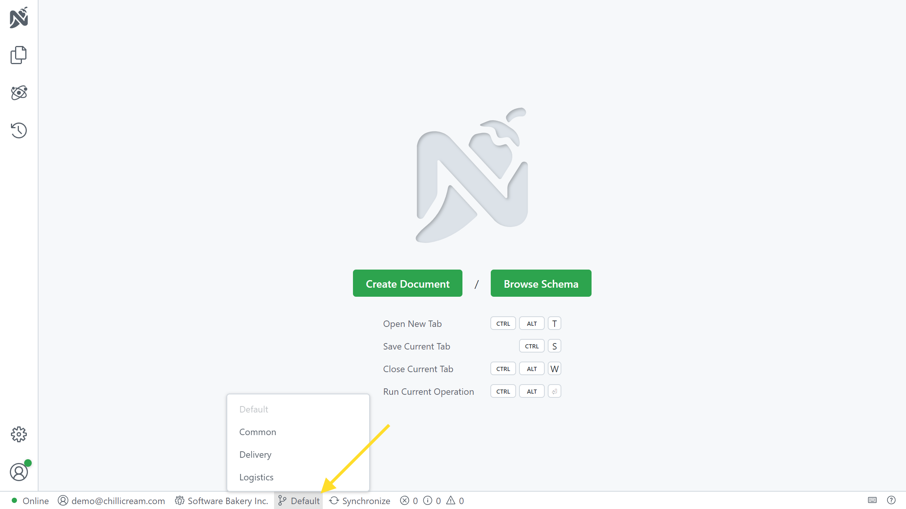

Workspaces are logical groups within an organization. A workspace could represent a team, a department, or a group of APIs that are related to each other.

Each workspace has its own APIs, documents, API documents, environments, and more. You cannot share resources between workspaces.

All members of an organization have default access to all workspaces and can edit the documents within them. In the future we will add more granular permissions to workspaces.

In Nitro, you can switch between workspaces using the status bar.

At the moment, workspaces can only be created with the Nitro CLI. To create a new workspace, use the `nitro workspace create` command.
You can find out more about Nitro CLI [here](/docs/nitro/cli).
