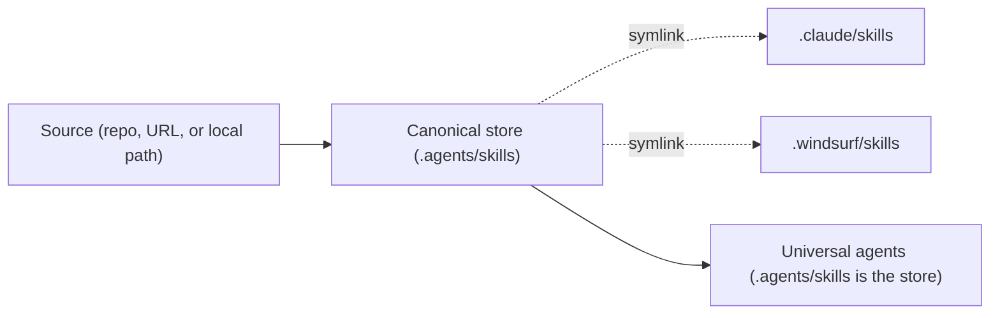

`dnx skillz add` installs skills from a source into the AI coding agents you already have. Point it at a GitHub repository and skillz discovers every `SKILL.md`, detects your agents, and wires the skill into each one.

```bash
dnx skillz add anthropics/skills
```

That single command fetches [Anthropic's reference skills](https://github.com/anthropics/skills), then either prompts you to choose which skills and agents you want or, when it is running inside an agent, installs non-interactively. This page walks the full lifecycle: choosing a source, narrowing to specific skills and agents, picking a scope, keeping skills current, and removing them.

If you have not installed the CLI yet, start with [Getting Started](/docs/skillz/getting-started).

<Warning>

**Skills run with your agent's full permissions.** A skill is executable instructions plus optional scripts that your agent runs on your machine. Install only from sources you trust, and review a skill before you use it. After every successful install, skillz reminds you: `Review skills before use; they run with full agent permissions.`

</Warning>

# Choose a source

The `source` argument tells skillz where to fetch skills from. skillz infers the kind of source from the string, so you pass one positional value and nothing else.

The most common form is a GitHub `owner/repo` shorthand:

```bash
dnx skillz add anthropics/skills
```

Every source form below is accepted. The first matching rule wins, and clones are always shallow (skillz fetches only the latest commit, not the full history).

| Source form            | Example                                                              | What it does                                                              |
| ---------------------- | -------------------------------------------------------------------- | ------------------------------------------------------------------------- |
| GitHub `owner/repo`    | `dnx skillz add anthropics/skills`                                   | Installs from the repository root. The default shorthand.                 |
| GitHub subpath         | `dnx skillz add anthropics/skills/document-skills/pdf`               | Installs only the skill at that path in the repo.                         |
| GitHub branch or tag   | `dnx skillz add owner/repo#main`                                     | Installs from a specific ref (`#branch` or `#tag`).                       |
| GitHub skill filter    | `dnx skillz add owner/repo@my-skill`                                 | Installs only the skill named `my-skill` from the repo.                   |
| GitHub URL             | `dnx skillz add https://github.com/owner/repo`                       | Full URL, with or without a trailing `.git`.                              |
| GitHub `tree` URL      | `dnx skillz add https://github.com/owner/repo/tree/main/skills/foo`  | A `/tree/<ref>/<path>` URL pins the ref and subpath.                      |
| GitLab shorthand       | `dnx skillz add gitlab:group/project`                                | Installs from GitLab. Subgroups are supported (`group/subgroup/project`). |
| GitLab URL             | `dnx skillz add https://gitlab.com/group/project/-/tree/main/skills` | GitLab uses `/-/tree/` (note the `-` segment).                            |
| Generic git or SSH     | `dnx skillz add git@github.com:owner/repo.git`                       | Any `https`, `ssh://`, `git://`, or scp-style git transport.              |
| Local directory        | `dnx skillz add ./my-skills`                                         | A local path: `./`, `../`, an absolute path, or a Windows drive path.     |
| Well-known HTTP(S) URL | `dnx skillz add https://example.com/skills`                          | A non-git site that serves skills via `.well-known` discovery.            |

A few notes that save time:

- A bare name like `my-skills` (no `./` prefix) is treated as `owner/repo` shorthand, not a local path. Use `./my-skills` when you mean a local directory.
- You can combine a ref and a skill filter: `owner/repo#main@my-skill`.
- Any credentials embedded in a URL are stripped before they appear in output or in the lock file. The `Source:` line that skillz prints shows `https://<redacted>@host/...`.

> A well-known HTTP source fetches a `.well-known/agent-skills/index.json` (or `.well-known/skills/index.json`) discovery document from the site and downloads the listed skills. Every fetch is pinned to the same origin as the index, and indexes verify a SHA-256 digest per skill.

# Choose which skills to install

A source can contain many skills. By default, when you do not pass any filter, skillz lists what it found and lets you select interactively. To narrow the set up front, use the options below.

To preview the available skills without installing anything, pass `--list` (or `-l`):

```bash
dnx skillz add anthropics/skills --list
```

```text
Source: https://github.com/anthropics/skills.git
Found 2 skill(s)

Available Skills
  alpha
    the alpha skill
  beta
    the beta skill

Use --skill <name> to install specific skills
```

To install one or more specific skills by name, pass `--skill` (or `-s`). The option is repeatable:

```bash
dnx skillz add anthropics/skills --skill pdf --skill docx
```

You can also embed a single skill filter in the source string with `@name`:

```bash
dnx skillz add anthropics/skills@pdf
```

To install every skill from the source into every detected agent, non-interactively, pass `--all`:

```bash
dnx skillz add anthropics/skills --all
```

A successful run prints the `Installation Summary` and `Installed N skill(s)` panels followed by the safety reminder, the same shape shown under [How skills reach each agent](#how-skills-reach-each-agent).

`--all` is a shortcut: it selects all skills, targets all agents, and skips every prompt.

If a `--skill` filter matches nothing, skillz lists what was available so you can correct the name, and exits with a non-zero code:

```text
Source: /home/you/my-skills
Found 2 skill(s)
No matching skills found for: nope
Available skills:
  alpha
  beta
```

A skill is any folder that contains a `SKILL.md` with both a `name` and a `description`. If the source contains no valid skills, skillz reports `No valid skills found. Skills require a SKILL.md with name and description.` and exits non-zero. See [Authoring Skills](/docs/skillz/authoring-skills) for the format.

# Choose which agents

By default skillz detects which agents are installed on your machine and targets them. To choose explicitly, pass `--agent` (or `-a`). The option is repeatable and accepts multiple values per token, and `*` means every supported agent:

```bash
# repeated flags
dnx skillz add anthropics/skills --agent claude-code --agent cursor

# space-separated values in one token
dnx skillz add anthropics/skills --agent claude-code cursor

# every supported agent
dnx skillz add anthropics/skills --agent "*"
```

A valid `--agent` run prints the `Installation Summary` and `Installed N skill(s)` panels shown under [How skills reach each agent](#how-skills-reach-each-agent), naming each agent that was linked or copied.

skillz resolves the target agents like this:

- **Running inside an agent.** When skillz runs inside an agent (for example, when your agent invokes it for you), it goes non-interactive and targets that agent plus the shared store.
- **Run from your shell, one agent installed.** skillz auto-selects that agent plus the shared store.
- **Run from your shell, several agents installed.** skillz prompts you to choose, pre-selecting your last-used agents (or the common defaults `claude-code`, `codex`, `opencode` on a first run).
- **`--agent` passed.** skillz uses exactly what you specify, after validation.

These are the headline agent identifiers. Names are case-sensitive.

| Agent          | `--agent` identifier |
| -------------- | -------------------- |
| Claude Code    | `claude-code`        |
| Cursor         | `cursor`             |
| GitHub Copilot | `github-copilot`     |
| Codex          | `codex`              |
| Continue       | `continue`           |
| Gemini CLI     | `gemini-cli`         |
| Windsurf       | `windsurf`           |

skillz supports more than 50 agents in total. For the complete list, plus the exact directory each agent installs into, see the [Reference](/docs/skillz/reference).

Because identifiers are case-sensitive, `copilot` and `Claude-Code` are not valid. An invalid value fails fast and lists every valid name so you can copy the right one:

```text
┌─Invalid agents───────────────────────────────────────────────────────────────┐
│ Invalid agents: bogus                                                        │
│                                                                              │
│ Valid agents: adal, aider-desk, amp, antigravity, augment, bob, claude-code, │
│ cline, codearts-agent, codebuddy, codemaker, codestudio, codex,              │
│ command-code, continue, cortex, crush, cursor, deepagents, devin, dexto,     │
│ droid, firebender, forgecode, gemini-cli, github-copilot, goose,             │
│ hermes-agent, iflow-cli, junie, kilo, kimi-cli, kiro-cli, kode, mcpjam,      │
│ mistral-vibe, mux, neovate, openclaw, opencode, openhands, pi, pochi, qoder, │
│ qwen-code, replit, roo, rovodev, tabnine-cli, trae, trae-cn, universal,      │
│ warp, windsurf, zencoder                                                     │
└──────────────────────────────────────────────────────────────────────────────┘
```

# Project and global scope

skillz installs into one of two scopes. Understanding the difference tells you where skills live and who shares them.

**Project scope is the default.** skillz records the installed skills in a `skills-lock.json` file in your working directory and materializes the skill folders under `./.agents/skills`. Commit `skills-lock.json` so everyone who clones the repository shares the same skill set. This is the right scope for skills your whole team should use on a given project.

**Global scope (`--global` or `-g`) installs skills for your user account**, across every project.

```bash
dnx skillz add anthropics/skills --global
```

In global scope the lock file lives at `~/.local/share/skillz/.skill-lock.json` (honoring `XDG_DATA_HOME` if you set it), and the skill folders are materialized under `~/.agents/skills`.

In both scopes skillz materializes each skill once in a canonical store, then makes each targeted agent point at it.

# How skills reach each agent

By default, skillz writes each skill once into the canonical store and creates a symlink from every targeted agent's directory back to it. Editing the one canonical copy updates the skill for every agent at once, so you maintain a single source of truth.



Some agents read directly from the shared `.agents/skills` store, so their skills directory _is_ that store and no symlink is needed. The [Reference](/docs/skillz/reference) lists which agents read from the shared store and the directory each agent installs into.

To copy files instead of symlinking, pass `--copy`. Use it for sandboxed agents that cannot follow symlinks (for example, agents running in containers where symlinks across mounts break):

```bash
dnx skillz add anthropics/skills --copy --agent claude-code --agent windsurf
```

skillz also copies automatically in two cases, so you rarely need `--copy` by hand:

- When a symlink cannot be created (for example, on Windows without the symlink privilege), skillz falls back to copying for that agent.
- When every targeted agent shares one skills directory, skillz copies, because symlinking only makes sense across distinct directories.

A successful install reports which agents were linked or copied and where each skill landed:

```text
Source: https://github.com/owner/skills.git
Found 1 skill(s)

┌─Installation Summary─────────────────────────────────────────────────────────┐
│ Canonical: /your-project/.agents/skills/alpha                                │
│ Symlinked:  Claude Code, Windsurf                                            │
└──────────────────────────────────────────────────────────────────────────────┘
┌─Installed 1 skill(s)─────────────────────────────────────────────────────────┐
│ ✓ alpha                                                                      │
│   → /your-project/.claude/skills/alpha                                       │
└──────────────────────────────────────────────────────────────────────────────┘

Done!  Review skills before use; they run with full agent permissions.
```

If everything worked, you should see the `Installation Summary` panel followed by an `Installed N skill(s)` panel and the safety reminder. To confirm later, run `dnx skillz list` (see the [Reference](/docs/skillz/reference)).

# Scan nested skills with --full-depth

By default skillz installs the skill at the source root if one exists there. If the root is not itself a skill, skillz discovers every nested skill instead. That fast path covers most repositories.

To find skills in nested and curated directories that the default scan does not reach, pass `--full-depth`:

```bash
dnx skillz add owner/curated-skills --full-depth
```

The install reports the same `Installation Summary` and `Installed N skill(s)` panels shown under [How skills reach each agent](#how-skills-reach-each-agent); only the set of discovered skills differs.

`--full-depth` widens _discovery_: it scans nested directories and curated locations (such as `skills/.curated`) so skillz finds skills the default scan would skip. It does not change clone depth. Clones are always shallow regardless of this flag.

# Install from a private repository

skillz never manages or prompts for credentials. It shells out to `git`, which uses your own setup: SSH agent keys, a git credential helper, `gh` authentication, or `~/.netrc`. To avoid hanging on a missing credential, skillz sets `GIT_TERMINAL_PROMPT=0`, so an unauthenticated clone fails fast with a clear error instead of waiting at a prompt.

To install from a private repository, make sure your normal git auth already works, then run `add` as usual:

```bash
dnx skillz add owner/private-skills --agent claude-code
```

This prints the same `Installation Summary` and `Installed N skill(s)` panels shown under [How skills reach each agent](#how-skills-reach-each-agent), once the clone authenticates.

Before you install, verify your access with one of:

```bash
ssh -T git@github.com   # confirm your SSH key reaches GitHub
gh auth login           # or authenticate the GitHub CLI
```

A working SSH key prints the well-known success line (GitHub closes the connection because it does not provide shell access):

```text
Hi <user>! You've successfully authenticated, but GitHub does not provide shell access.
```

If a clone fails with an authentication error, skillz prints guidance pointing you back to your git credentials. See [Troubleshooting](/docs/skillz/troubleshooting) for the full list of clone and auth failures.

# Keep skills up to date

`dnx skillz update` checks your installed skills for newer versions. It has the aliases `upgrade` and `check`.

```bash
dnx skillz update -g
```

```text
Checking for skill updates...

Checking global skill 1/1: my-skill
Found 1 global update(s)

Update available: my-skill
  Run: skillz add owner/repo/skills/my-skill -g -y

Updates available for 1 skill(s); no updates were applied.
```

**`update` only reports; it never applies changes.** It prints the exact `skillz add ... -y` command to run for each skill that has an update (prefix it with `dnx` when you run through `dnx`). Copy that command and run it yourself to apply the update. The output is explicit: `no updates were applied.`

Scope the check the same way you scope an install:

- `-g` (or `--global`) checks global skills only.
- `-p` (or `--project`) checks project skills only.
- Pass both, or name specific skills, to check both scopes.
- With no scope flag in an interactive shell, skillz prompts you to choose. Non-interactively (for example with `-y`), it checks both scopes.

When there is nothing to update, you get a clean report:

```text
Checking for skill updates...

Checking global skill 1/1: my-skill
All global skills are up to date
```

The update check calls the GitHub API. If you hit a rate limit, set a `GITHUB_TOKEN` or `GH_TOKEN` environment variable (or sign in with `gh auth login`) and skillz uses it for the check. See [Troubleshooting](/docs/skillz/troubleshooting) for rate-limit and timeout details.

# Remove skills

`dnx skillz remove` uninstalls skills. It unlinks each agent's copy and removes the canonical store entry once no remaining agent references it, then updates the lock file.

To remove specific skills by name, list them:

```bash
dnx skillz remove alpha --yes
```

```text
Successfully removed 1 skill(s)
```

To remove everything, pass `--all`:

```bash
dnx skillz remove --all
```

```text
Successfully removed 1 skill(s)
```

To limit removal to specific agents, add `--agent`. To target your user-level skills, add `--global`.

Run `dnx skillz remove` with no names to remove interactively: skillz shows a multi-select prompt, then a confirmation that defaults to **no**. Declining cancels and removes nothing:

```text
$ dnx skillz remove alpha

Removal cancelled
```

If a named skill is not installed, skillz tells you and exits cleanly without changing anything:

```text
No matching skills found for: nope
```

# Next steps

- [Authoring Skills](/docs/skillz/authoring-skills): write and publish your own `SKILL.md` with `dnx skillz init`.
- [Reference](/docs/skillz/reference): every command, flag, the full list of 55+ agents, and per-agent install directories.
- [Troubleshooting](/docs/skillz/troubleshooting): clone failures, authentication errors, rate limits, and symlink fallbacks.
