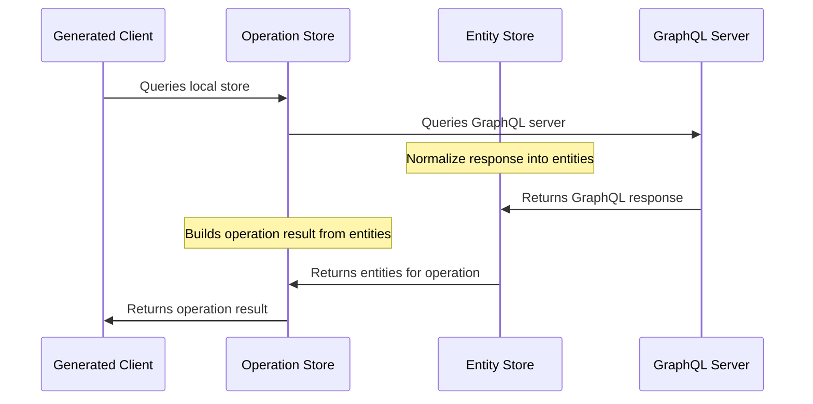

StrawberryShake stores the result of GraphQL requests in a normalized entity store. The entity store allows your client to execute GraphQL requests with various strategies to reduce the need for network requests. Moreover, the normalized entities are updated by every request the client does, which means that you can build fully reactive components that change as the state in the store changes.

