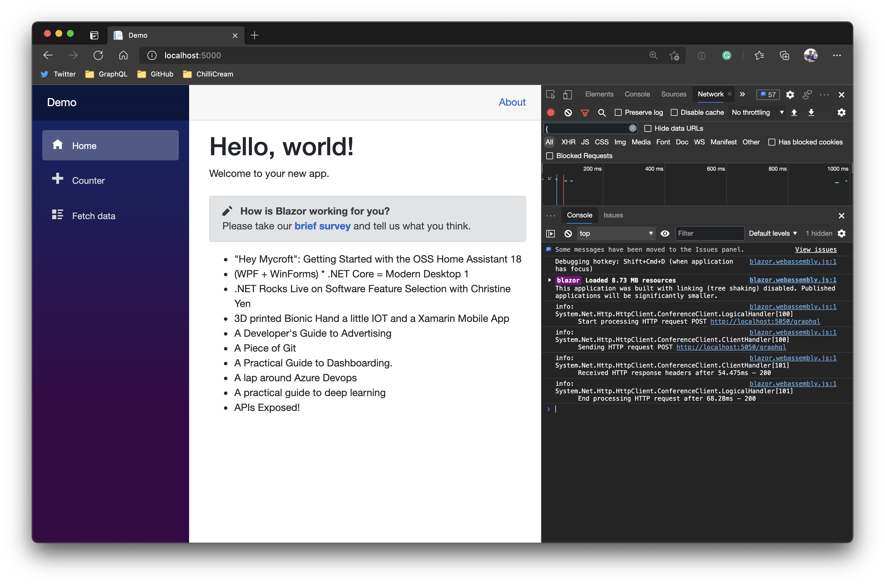
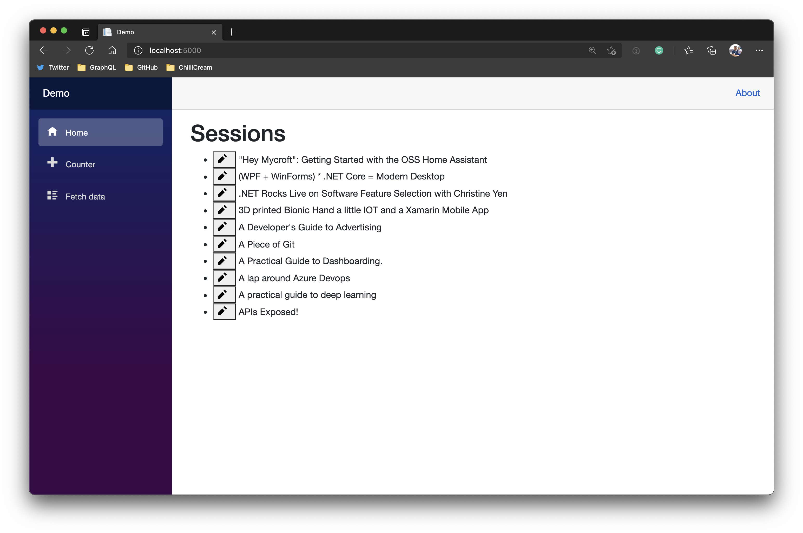
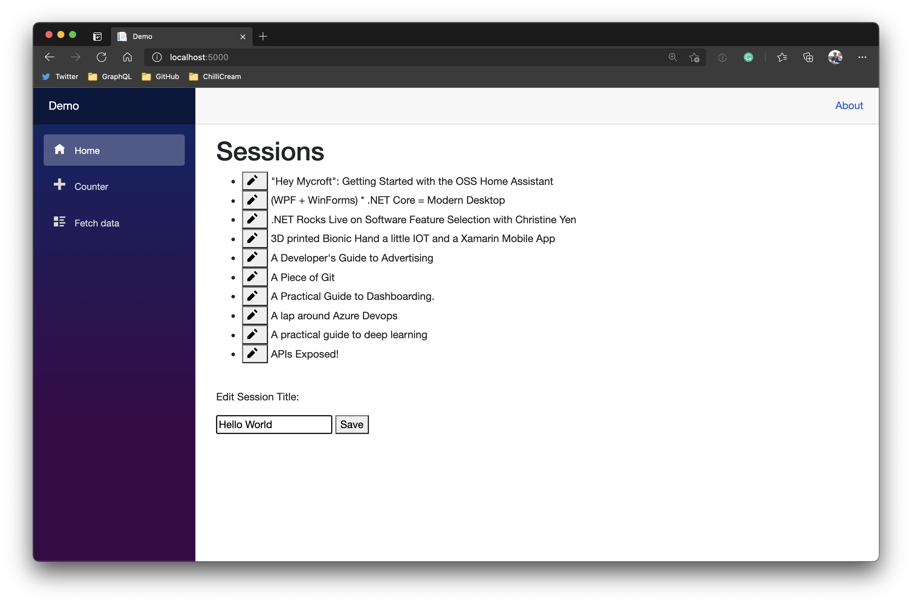

In this tutorial we will walk you through the basics of adding a Strawberry Shake GraphQL client to a Blazor for WebAssembly project. For this example we will create a Blazor for WebAssembly application and fetch some simple data from our demo backend.

Strawberry Shake is not limited to Blazor and can be used with any .NET standard compliant library.

In this tutorial, we will teach you:

- How to add the Strawberry Shake CLI tools.
- How to generate source code from .graphql files, that contain operations.
- How to use the generated client in a classical or reactive way.

# Step 1: Add the Strawberry Shake CLI tools

The Strawberry Shake tool will help you to setup your project to create a GraphQL client.

Open your preferred terminal and select a directory where you want to add the code of this tutorial.

1. Create a dotnet tool-manifest.

```bash
dotnet new tool-manifest
```

2. Install the Strawberry Shake tools.

```bash
dotnet tool install StrawberryShake.Tools --local
```

# Step 2: Create a Blazor WebAssembly project

Next, we will create our Blazor project so that we have a little playground.

1. First, a new solution called `Demo.sln`.

```bash
dotnet new sln -n Demo
```

2. Create a new Blazor for WebAssembly application.

```bash
dotnet new wasm -n Demo
```

3. Add the project to the solution `Demo.sln`.

```bash
dotnet sln add ./Demo
```

# Step 3: Install the required packages

Strawberry Shake supports multiple GraphQL transport protocols. In this example we will use the standard GraphQL over HTTP protocol to interact with our GraphQL server.

1. Add the `StrawberryShake.Transport.Http` package to your project.

```bash
dotnet add Demo package StrawberryShake.Transport.Http
```

2. Add the `StrawberryShake.CodeGeneration.CSharp.Analyzers` package to your project in order to add our code generation.

```bash
dotnet add Demo package StrawberryShake.CodeGeneration.CSharp.Analyzers
```

When using the HTTP protocol we also need the HttpClientFactory and the Microsoft dependency injection.

3. Add the `Microsoft.Extensions.DependencyInjection` package to your project in order to add our code generation.

```bash
dotnet add Demo package Microsoft.Extensions.DependencyInjection
```

3. Add the `Microsoft.Extensions.Http` package to your project in order to add our code generation.

```bash
dotnet add Demo package Microsoft.Extensions.Http
```

# Step 4: Add a GraphQL client to your project using the CLI tools

To add a client to your project, you need to run the `dotnet graphql init {{ServerUrl}} -n {{ClientName}}`.

In this tutorial we will use our GraphQL workshop to create a list of sessions that we will add to our Blazor application.

> If you want to have a look at our GraphQL workshop head over [here](https://github.com/ChilliCream/graphql-workshop).

1. Add the conference client to your Blazor application.

```bash
dotnet graphql init https://hc-conference-app.azurewebsites.net/graphql/ -n ConferenceClient -p ./Demo
```

2. Customize the namespace of the generated client to be `Demo.GraphQL`. For this head over to the `.graphqlrc.json` and insert a namespace property to the `StrawberryShake` section.

```json
{
  "schema": "schema.graphql",
  "documents": "**/*.graphql",
  "extensions": {
    "strawberryShake": {
      "name": "ConferenceClient",
      "namespace": "Demo.GraphQL",
      "url": "https://hc-conference-app.azurewebsites.net/graphql/",
      "dependencyInjection": true
    }
  }
}
```

Now that everything is in place let us write our first query to ask for a list of session titles of the conference API.

3. Choose your favorite IDE and the solution. If your are using VSCode do the following:

```bash
code ./Demo
```

4. Create new query document `GetSessions.graphql` with the following content:

```graphql
query GetSessions {
  sessions(order: { title: ASC }) {
    nodes {
      title
    }
  }
}
```

5. Compile your project.

```bash
dotnet build
```

With the project compiled you now should see a directory `Generated`. The generated code is just there for the IDE, the actual code was injected directly into roslyn through source generators.


6. Head over to the `Program.cs` and add the new `ConferenceClient` to the dependency injection.

> In some IDEs it is still necessary to reload the project after the code was generated to update the IntelliSense. So, if you have any issues in the next step with IntelliSense just reload the project and everything should be fine.

```csharp
public class Program
{
    public static async Task Main(string[] args)
    {
        var builder = WebAssemblyHostBuilder.CreateDefault(args);
        builder.RootComponents.Add<App>("#app");

        builder.Services.AddScoped(sp => new HttpClient { BaseAddress = new Uri(builder.HostEnvironment.BaseAddress) });

        builder.Services
            .AddConferenceClient()
            .ConfigureHttpClient(client => client.BaseAddress = new Uri("https://hc-conference-app.azurewebsites.net/graphql"));

        await builder.Build().RunAsync();
    }
}
```

7. Go to `_Imports.razor` and add `Demo.GraphQL` to the common imports

```csharp
@using System.Net.Http
@using System.Net.Http.Json
@using Microsoft.AspNetCore.Components.Forms
@using Microsoft.AspNetCore.Components.Routing
@using Microsoft.AspNetCore.Components.Web
@using Microsoft.AspNetCore.Components.Web.Virtualization
@using Microsoft.AspNetCore.Components.WebAssembly.Http
@using Microsoft.JSInterop
@using Demo
@using Demo.Shared
@using Demo.GraphQL
```

# Step 5: Use the ConferenceClient to perform a simple fetch

In this section we will perform a simple fetch with our `ConferenceClient`. We will not yet look at state or other things that come with our client but just perform a simple fetch.

1. Head over to `Pages/Index.razor`.

2. Add inject the `ConferenceClient` beneath the `@pages` directive.

```csharp
@page "/" @inject ConferenceClient ConferenceClient;
```

3. Introduce a code directive at the bottom of the file.

```csharp
@page "/" @inject ConferenceClient ConferenceClient;

<h1>Hello, world!</h1>

Welcome to your new app.

<SurveyPrompt Title="How is Blazor working for you?" />

@code { }
```

4. Now lets fetch the titles with our client.

```csharp
@page "/" @inject ConferenceClient ConferenceClient;

<h1>Hello, world!</h1>

Welcome to your new app.

<SurveyPrompt Title="How is Blazor working for you?" />

@code { private string[] titles = Array.Empty<string
  >(); protected override async Task OnInitializedAsync() { // Execute our
  GetSessions query var result = await
  ConferenceClient.GetSessions.ExecuteAsync(); // aggregate the titles from the
  result titles = result.Data.Sessions.Nodes.Select(t => t.Title).ToArray(); //
  signal the components that the state has changed. StateHasChanged(); }
  }</string
>
```

5. Last, lets render the titles on our page as a list.

```csharp
@page "/" @inject ConferenceClient ConferenceClient;

<h1>Hello, world!</h1>

Welcome to your new app.

<SurveyPrompt Title="How is Blazor working for you?" />

<ul>
  @foreach (string title in titles) {
  <li>@title</li>
  }
</ul>

@code { private string[] titles = Array.Empty<string
  >(); protected override async Task OnInitializedAsync() { // Execute our
  GetSessions query var result = await
  ConferenceClient.GetSessions.ExecuteAsync(); // aggregate the titles from the
  result titles = result.Data.Sessions.Nodes.Select(t => t.Title).ToArray(); //
  signal the components that the state has changed. StateHasChanged(); }
  }</string
>
```

5. Start the Blazor application with `dotnet run --project ./Demo` and see if your code works.


# Step 6: Using the built-in store with reactive APIs.

The simple fetch of our data works. But every time we visit the index page it will fetch the data again although the data does not change often. Strawberry Shake also comes with state management where you can control the entity store and update it when you need to. In order to best interact with the store we will use `System.Reactive` from Microsoft. Lets get started :)

1. Install the package `System.Reactive`.

```bash
dotnet add Demo package System.Reactive
```

2. Next, let us update the `_Imports.razor` with some more imports, namely `System`, `System.Reactive.Linq`, `System.Linq` and `StrawberryShake`.

```csharp
@using System
@using System.Reactive.Linq
@using System.Linq
@using System.Net.Http
@using System.Net.Http.Json
@using Microsoft.AspNetCore.Components.Forms
@using Microsoft.AspNetCore.Components.Routing
@using Microsoft.AspNetCore.Components.Web
@using Microsoft.AspNetCore.Components.Web.Virtualization
@using Microsoft.AspNetCore.Components.WebAssembly.Http
@using Microsoft.JSInterop
@using Demo
@using Demo.Shared
@using Demo.GraphQL
@using StrawberryShake
```

3. Head back to `Pages/Index.razor` and replace the code section with the following code:

```csharp
private string[] titles = Array.Empty<string>();
private IDisposable storeSession;

protected override void OnInitialized()
{
    storeSession =
        ConferenceClient
            .GetSessions
            .Watch(StrawberryShake.ExecutionStrategy.CacheFirst)
            .Where(t => !t.Errors.Any())
            .Select(t => t.Data.Sessions.Nodes.Select(t => t.Title).ToArray())
            .Subscribe(result =>
            {
                titles = result;
                StateHasChanged();
            });
}
```

Instead of fetching the data we watch the data for our request. Every time entities of our results are updated in the entity store our subscribe method will be triggered.

Also we specified on our watch method that we want to first look at the store and only of there is nothing in the store we want to fetch the data from the network.

Last, note that we are storing a disposable on our component state called `storeSession`. This represents our session with the store. We need to dispose the session when we no longer display our component.

4. Implement `IDisposable` and handle the `storeSession` dispose.

```csharp
@page "/"
@inject ConferenceClient ConferenceClient;
@implements IDisposable

<h1>Hello, world!</h1>

Welcome to your new app.

<SurveyPrompt Title="How is Blazor working for you?" />

<ul>
@foreach (var title in titles)
{
    <li>@title</li>
}
</ul>

@code {
    private string[] titles = Array.Empty<string>();
    private IDisposable storeSession;

    protected override void OnInitialized()
    {
        storeSession =
            ConferenceClient
                .GetSessions
                .Watch(StrawberryShake.ExecutionStrategy.CacheFirst)
                .Where(t => !t.Errors.Any())
                .Select(t => t.Data.Sessions.Nodes.Select(t => t.Title).ToArray())
                .Subscribe(result =>
                {
                    titles = result;
                    StateHasChanged();
                });
    }

    public void Dispose()
    {
        storeSession?.Dispose();
    }
}
```

Every time we move away from our index page Blazor will dispose our page which consequently will dispose our store session.

5. Start the Blazor application with `dotnet run --project ./Demo` and see if your code works.


The page will look unchanged.

6. Next, open the developer tools of your browser and switch to the developer tools console. Refresh the site so that we get a fresh output.



7. Switch between the `Index` and the `Counter` page (back and forth) and watch the console output.

The Blazor application just fetched a single time from the network and now only gets the data from the store.

# Step 7: Using GraphQL mutations

In this step we will introduce a mutation that will allow us to rename a session. For this we need to change our Blazor page a bit.

1. We need to get the session id for our session so that we can call the `renameSession` mutation. For this we will rewrite our `GetSessions` operation.

```graphql
query GetSessions {
  sessions(order: { title: ASC }) {
    nodes {
      ...SessionInfo
    }
  }
}

fragment SessionInfo on Session {
  id
  title
}
```

2. Next we need to restructure the `Index.razor` page. We will get rid of the Blazor default content and rework our list to use our fragment `SessionInfo`. Further, we will introduce a button to our list so that we have a hook to start editing items from our list.

```csharp
@page "/"
@inject ConferenceClient ConferenceClient;
@implements IDisposable

<h1>Sessions</h1>

<ul>
@foreach (ISessionInfo session in sessions)
{
    <li><button @onclick="() => OnClickSession(session)"><span class="oi oi-pencil mr-2" aria-hidden="true"></span></button> @session.Title</li>
}
</ul>

@code {
    private IReadOnlyList<ISessionInfo> sessions = Array.Empty<ISessionInfo>();
    private IDisposable storeSession;

    protected override void OnInitialized()
    {
        storeSession =
            ConferenceClient
                .GetSessions
                .Watch(ExecutionStrategy.CacheFirst)
                .Where(t => !t.Errors.Any())
                .Select(t => t.Data!.Sessions!.Nodes)
                .Subscribe(result =>
                {
                    sessions = result;
                    StateHasChanged();
                });
    }

    private void OnClickSession(ISessionInfo session)
    {

    }

    public void Dispose()
    {
        storeSession?.Dispose();
    }
}
```

3. Next, we will define the GraphQL mutation by adding a new GraphQL document `RenameSession.graphql`.

```graphql
mutation RenameSession($sessionId: ID!, $title: String!) {
  renameSession(input: { sessionId: $sessionId, title: $title }) {
    session {
      ...SessionInfo
    }
  }
}
```

4. Rebuild, the project so that the source generator will create all our new types.

5. Go back to the `Index.razor` page and lets add some state for our edit controls.

```csharp
private ISessionInfo selectedSession;
private string title;
```

The page should now look like the following:

```csharp
@page "/"
@inject ConferenceClient ConferenceClient;
@implements IDisposable

<h1>Sessions</h1>

<ul>
@foreach (ISessionInfo session in sessions)
{
    <li><button @onclick="() => OnClickSession(session)"><span class="oi oi-pencil mr-2" aria-hidden="true"></span></button> @session.Title</li>
}
</ul>

@code {
    private IReadOnlyList<ISessionInfo> sessions = Array.Empty<ISessionInfo>();
    private IDisposable storeSession;
    private ISessionInfo selectedSession;
    private string title;

    protected override void OnInitialized()
    {
        storeSession =
            ConferenceClient
                .GetSessions
                .Watch(ExecutionStrategy.CacheFirst)
                .Where(t => !t.Errors.Any())
                .Select(t => t.Data!.Sessions!.Nodes)
                .Subscribe(result =>
                {
                    sessions = result;
                    StateHasChanged();
                });
    }

    private void OnClickSession(ISessionInfo session)
    {

    }

    public void Dispose()
    {
        storeSession?.Dispose();
    }
}
```

6. Now, lets put some controls in to let the user edit the title of one of our sessions.

```csharp
@if (selectedSession is not null)
{
    <br />
    <p>Edit Session Title:</p>
    <input @bind-value="@title" />
    <button @onclick="OnSaveTitle">Save</button>
}
```

The page should now look like the following:

```csharp
@page "/"
@inject ConferenceClient ConferenceClient;
@implements IDisposable

<h1>Sessions</h1>

<ul>
@foreach (ISessionInfo session in sessions)
{
    <li><button @onclick="() => OnClickSession(session)"><span class="oi oi-pencil mr-2" aria-hidden="true"></span></button> @session.Title</li>
}
</ul>

@if (selectedSession is not null)
{
    <br />
    <p>Edit Session Title:</p>
    <input @bind-value="@title" />
    <button @onclick="OnSaveTitle">Save</button>
}

@code {
    private IReadOnlyList<ISessionInfo> sessions = Array.Empty<ISessionInfo>();
    private IDisposable storeSession;
    private ISessionInfo selectedSession;
    private string title;

    protected override void OnInitialized()
    {
        storeSession =
            ConferenceClient
                .GetSessions
                .Watch(ExecutionStrategy.CacheFirst)
                .Where(t => !t.Errors.Any())
                .Select(t => t.Data!.Sessions!.Nodes)
                .Subscribe(result =>
                {
                    sessions = result;
                    StateHasChanged();
                });
    }

    private void OnClickSession(ISessionInfo session)
    {

    }

    public void Dispose()
    {
        storeSession?.Dispose();
    }
}
```

7. Next, we want to wire the controls up with the click. For that replace the `OnClickSession` method with the following code:

```csharp
private void OnClickSession(ISessionInfo session)
{
    selectedSession = session;
    title = session.Title;
    StateHasChanged();
}
```

8. Add, a new method that now executes our new mutation `RenameSession`.

```csharp
private async Task OnSaveTitle()
{
    await ConferenceClient.RenameSession.ExecuteAsync(selectedSession.Id, title);
    selectedSession = null;
    title = null;
    StateHasChanged();
}
```

The page should now look like the following:

```csharp
@page "/"
@inject ConferenceClient ConferenceClient;
@implements IDisposable

<h1>Sessions</h1>

<ul>
@foreach (ISessionInfo session in sessions)
{
    <li><button @onclick="() => OnClickSession(session)"><span class="oi oi-pencil mr-2" aria-hidden="true"></span></button> @session.Title</li>
}
</ul>

@if (selectedSession is not null)
{
    <br />
    <p>Edit Session Title:</p>
    <input @bind-value="@title" />
    <button @onclick="OnSaveTitle">Save</button>
}

@code {
    private IReadOnlyList<ISessionInfo> sessions = Array.Empty<ISessionInfo>();
    private IDisposable storeSession;
    private ISessionInfo selectedSession;
    private string title;

    protected override void OnInitialized()
    {
        storeSession =
            ConferenceClient
                .GetSessions
                .Watch(ExecutionStrategy.CacheFirst)
                .Where(t => !t.Errors.Any())
                .Select(t => t.Data!.Sessions!.Nodes)
                .Subscribe(result =>
                {
                    sessions = result;
                    StateHasChanged();
                });
    }

    private void OnClickSession(ISessionInfo session)
    {
        selectedSession = session;
        title = session.Title;
        StateHasChanged();
    }

    private async Task OnSaveTitle()
    {
        await ConferenceClient.RenameSession.ExecuteAsync(selectedSession.Id, title);
        selectedSession = null;
        title = null;
        StateHasChanged();
    }

    public void Dispose()
    {
        storeSession?.Dispose();
    }
}
```

9. Start the Blazor application with `dotnet run --project ./Demo` and see if your code works.



10. Click on the edit button of one of the sessions.


11. Change the title of the session and click save.



11. The item is now changed in the list although we have not explicitly written any code to update the item in our list component.


Strawberry Shake knows about your entities and how the connect. Whenever one request updates the state, all components referring to data of that component are updated.
