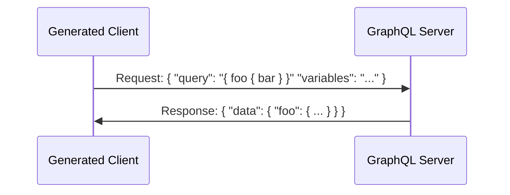
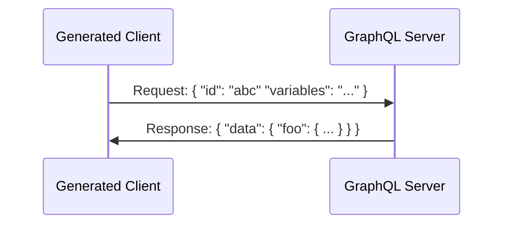

> We are still working on the documentation for Strawberry Shake so help us by finding typos, missing things or write some additional docs with us.

This guide will walk you through how persisted queries work and how you can set them up with Strawberry Shake.

# How it works

Persisted queries is a feature that Facebook uses internally for a long time to improve the performance of Facebook with their relay client.

During development you can write and edit the queries in your application. When you start and debug your application it will use these queries to interact with the GraphQL server.

Once you package your client application however the GraphQL queries are compiled, removed from the client code and exported into a query directory.

The query directory can then be uploaded to your GraphQL server. Whenever the client wants to send a GraphQL request to the server it will insert into that request the hash of the extracted GraphQL query instead of the GraphQL query itself.

# Setup

In the following tutorial, we will walk you through creating a Strawberry Shake GraphQL client and configuring it to support persisted queries.

## Step 1: Create a console project
