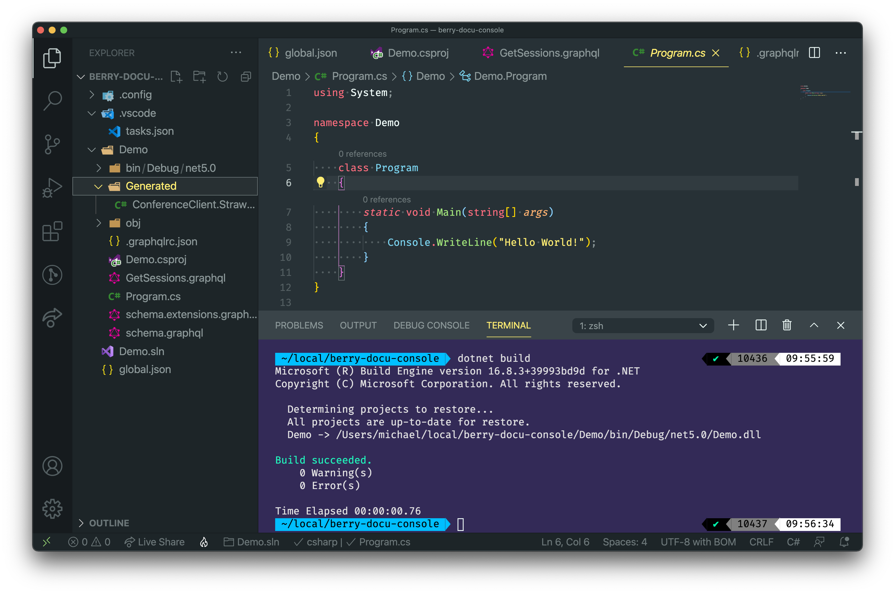
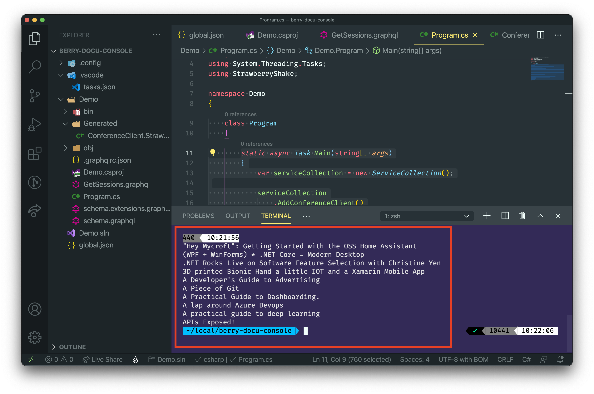

In this tutorial we will walk you through the basics of adding a Strawberry Shake GraphQL client to a console project. For this example we will create a simple console application and fetch some simple data from our demo backend.

Strawberry Shake is not limited to console application and can be used with any .NET standard compliant library.

In this tutorial, we will teach you:

- How to add the Strawberry Shake CLI tools.
- How to generate source code from .graphql files, that contain operations.
- How to use the generated client in a classical or reactive way.
- How to disable state management for ASP.NET core use-cases.

## Step 1: Add the Strawberry Shake CLI tools

The Strawberry Shake tool will help you to set up your project to create a GraphQL client.

Open your preferred terminal and select a directory where you want to add the code of this tutorial.

1. Create a dotnet tool-manifest.

```bash
dotnet new tool-manifest
```

2. Install the Strawberry Shake tools.

```bash
dotnet tool install StrawberryShake.Tools --local
```

## Step 2: Create a console project

Next, we will create our console project so that we have a little playground.

1. First, a new solution called `Demo.sln`.

```bash
dotnet new sln -n Demo
```

2. Create a new console application.

```bash
dotnet new console -n Demo
```

3. Add the project to the solution `Demo.sln`.

```bash
dotnet sln add ./Demo
```

## Step 3: Install the required packages

Strawberry Shake supports multiple GraphQL transport protocols. In this example we will use the standard GraphQL over HTTP protocol to interact with our GraphQL server.

1. Add the `StrawberryShake.Transport.Http` package to your project.

```bash
dotnet add Demo package StrawberryShake.Transport.Http
```

2. Add the `StrawberryShake.CodeGeneration.CSharp.Analyzers` package to your project in order to add our code generation.

```bash
dotnet add Demo package StrawberryShake.CodeGeneration.CSharp.Analyzers
```

When using the HTTP protocol we also need the HttpClientFactory and the Microsoft dependency injection.

3. Add the `Microsoft.Extensions.DependencyInjection` package to your project in order to add our code generation.

```bash
dotnet add Demo package Microsoft.Extensions.DependencyInjection
```

4. Add the `Microsoft.Extensions.Http` package to your project in order to add our code generation.

```bash
dotnet add Demo package Microsoft.Extensions.Http
```

## Step 4: Add a GraphQL client to your project using the CLI tools

To add a client to your project, you need to run `dotnet graphql init {{ServerUrl}} -n {{ClientName}}`.

In this tutorial we will use our GraphQL workshop to create a list of sessions that we will add to our console application.

> If you want to have a look at our GraphQL workshop head over [here](https://github.com/ChilliCream/graphql-workshop).

1. Add the conference client to your console application.

```bash
dotnet graphql init https://workshop.chillicream.com/graphql/ -n ConferenceClient -p ./Demo
```

2. Customize the namespace of the generated client to be `Demo.GraphQL`. For this head over to the `.graphqlrc.json` and insert a namespace property to the `StrawberryShake` section.

```json
{
  "schema": "schema.graphql",
  "documents": "**/*.graphql",
  "extensions": {
    "strawberryShake": {
      "name": "ConferenceClient",
      "namespace": "Demo.GraphQL",
      "url": "https://workshop.chillicream.com/graphql/",
      "dependencyInjection": true
    }
  }
}
```

Now that everything is in place let us write our first query to ask for a list of session titles of the conference API.

3. Choose your favorite IDE and the solution. If your are using VSCode do the following:

```bash
code ./Demo
```

4. Create new query document `GetSessions.graphql` with the following content:

```graphql
query GetSessions {
  sessions(order: { title: ASC }) {
    nodes {
      title
    }
  }
}
```

5. Compile your project.

```bash
dotnet build
```

With the project compiled you now should see a directory `Generated`. The generated code is just there for the IDE, the actual code was injected directly into roslyn through source generators.



1. Head over to the `Program.cs` and add the new `ConferenceClient` to the dependency injection.

> In some IDEs it is still necessary to reload the project after the code was generated to update the IntelliSense. So, if you have any issues in the next step with IntelliSense just reload the project and everything should be fine.

```csharp
using System;
using Microsoft.Extensions.DependencyInjection;
using Demo.GraphQL;

namespace Demo
{
    class Program
    {
        static void Main(string[] args)
        {
            var serviceCollection = new ServiceCollection();

            serviceCollection
                .AddConferenceClient()
                .ConfigureHttpClient(client => client.BaseAddress = new Uri("https://workshop.chillicream.com/graphql"));

            IServiceProvider services = serviceCollection.BuildServiceProvider();

            IConferenceClient client = services.GetRequiredService<IConferenceClient>();
        }
    }
}
```

## Step 5: Use the ConferenceClient to perform a simple fetch

In this section we will perform a simple fetch with our `ConferenceClient` and output the result to the console.

1. Head over to `Program.cs`.

2. Add the following code to your main method to execute the `GetSessions` query.

```csharp
static async Task Main(string[] args)
{
    var serviceCollection = new ServiceCollection();

    serviceCollection
        .AddConferenceClient()
        .ConfigureHttpClient(client => client.BaseAddress = new Uri("https://workshop.chillicream.com/graphql"));

    IServiceProvider services = serviceCollection.BuildServiceProvider();

    IConferenceClient client = services.GetRequiredService<IConferenceClient>();

    var result = await client.GetSessions.ExecuteAsync();
    result.EnsureNoErrors();

    foreach (var session in result.Data.Sessions.Nodes)
    {
        Console.WriteLine(session.Title);
    }
}
```

3. Start the console application with `dotnet run --project ./Demo` and see if your code works.


