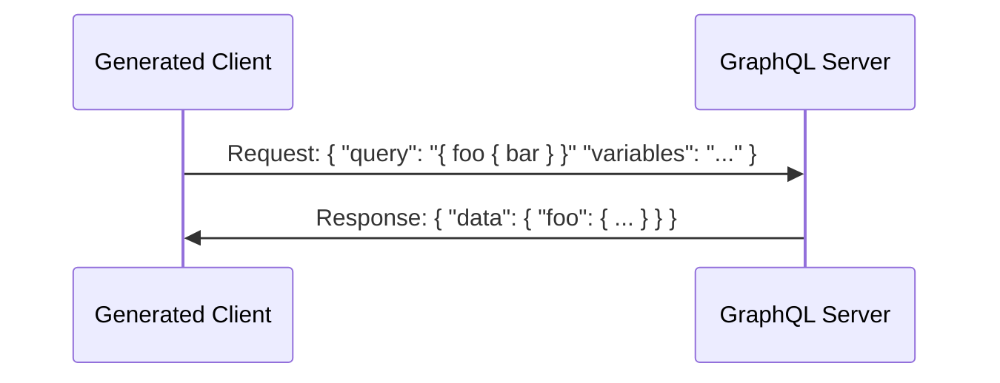
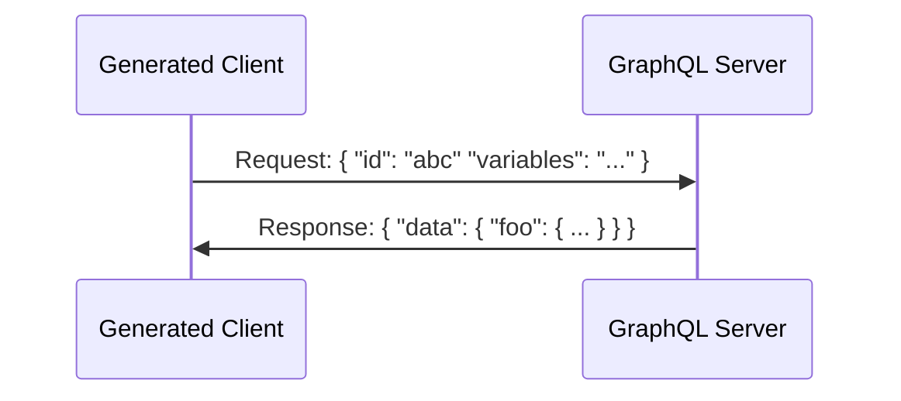

Persisted queries allow you to improve the performance of your GraphQL requests and the security of your GraphQL server.

Normally, when working with GraphQL, your client sends the **full** query to your GraphQL server:



These queries can get quite big and it doesn't make much sense to always send the full query document to your server. If your client is developed in close collaboration with your GraphQL server and your GraphQL endpoint isn't public, it also doesn't make sense to allow clients to send _any_ GraphQL query they desire.

With persisted queries you extract the GraphQL operations out of your client and export them to your server. During that process each operation is assigned a unique Id. Your client can now simply send such an Id to your server to request a specific operation. You no longer need to send the full query document:



You can learn more about the benefits of persisted queries and how you can setup them up in your Hot Chocolate GraphQL server [here](/docs/hotchocolate/v13/performance/persisted-queries#benefits).

# Usage

To enable persisted queries, specify a `GraphQLPersistedQueryOutput` property in a MSBuild `PropertyGroup` in the `.csproj` of your Strawberry Shake application:

```xml
<PropertyGroup>
    <GraphQLPersistedQueryOutput>./persisted-queries</GraphQLPersistedQueryOutput>
</PropertyGroup>
```

The value in `GraphQLPersistedQueryOutput` should be the path to a directory relative to the project root directory. An empty value disables the feature and is also the default.

If you now re-build your application, the directory specified by `GraphQLPersistedQueryOutput` should be created and contain all of your persisted queries.

You can now make these persisted queries available to your GraphQL server, by for example uploading the directory.

During development you likely want the freedom to work with dynamic queries, so you can also [conditionally export](#conditional-export) your persisted queries.

## Output formats

Per default we create a file in the format of `<hash>.graphql` in the directory specified by the `GraphQLPersistedQueryFormat` property, for each GraphQL operation in your project.

Where the content of the file is the actual GraphQL operation and the `<hash>` is the computed hash of that operation, based on the selected [hashing algorithm](#hashing-algorithms).

Alternatively we offer the `relay` output format, where we create a single `queries.json` file in the output directory. It contains a JSON object, mapping a hash value to a GraphQL operation.

```json
{
  "<hash1>": "query GetAssets { ... }",
  "<hash2>": "query GetPrices { ... }"
}
```

The hash (the key) is again calculated from the GraphQL operation (the value), based on the selected [hashing algorithm](#hashing-algorithms).

You can specify the format you'd like using the `GraphQLPersistedQueryFormat` property:

```xml
<PropertyGroup>
    <GraphQLPersistedQueryFormat>relay</GraphQLPersistedQueryFormat>
</PropertyGroup>
```

Possible values are `default` and `relay`.

## Hashing algorithms

Per default query hashes are calculated using the MD5 hashing algorithm, but you can also use other hashing formats:

```xml
<PropertyGroup>
    <GraphQLRequestHash>sha256</GraphQLRequestHash>
</PropertyGroup>
```

Possible values are `md5`, `sha1` and `sha256`.

## Conditional export

Since `GraphQLPersistedQueryFormat` and the other settings are MSBuild properties, you can easily apply conditions to them:

```xml
<GraphQLPersistedQueryFormat Condition="'$(Configuration)' == 'Release' ">
```

In the above example, persisted queries would only be exported if you are building your application in the `Release` configuration.
