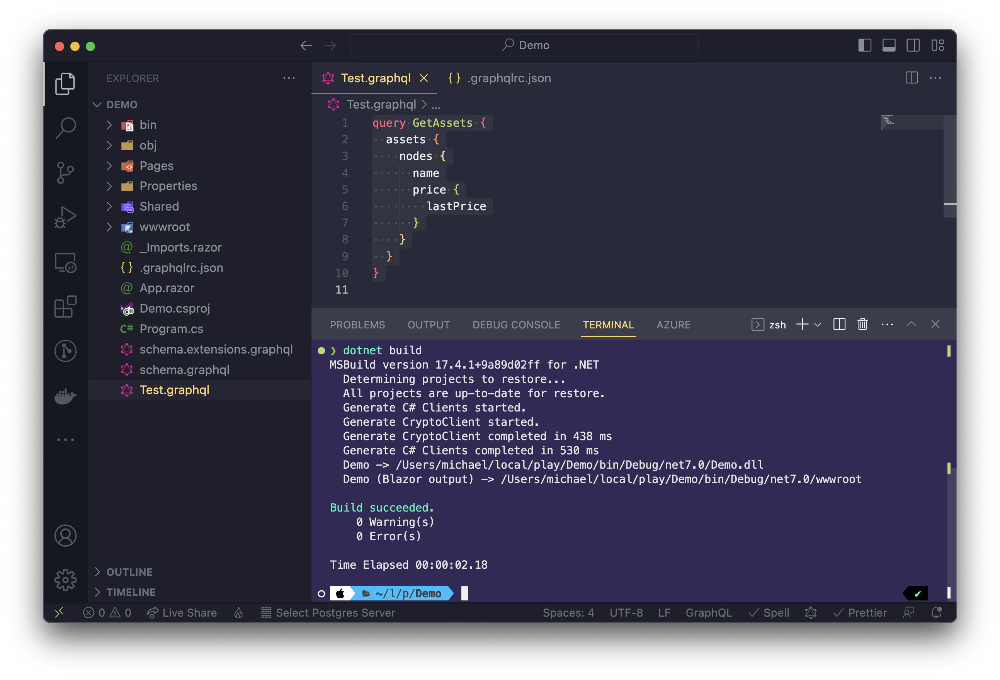
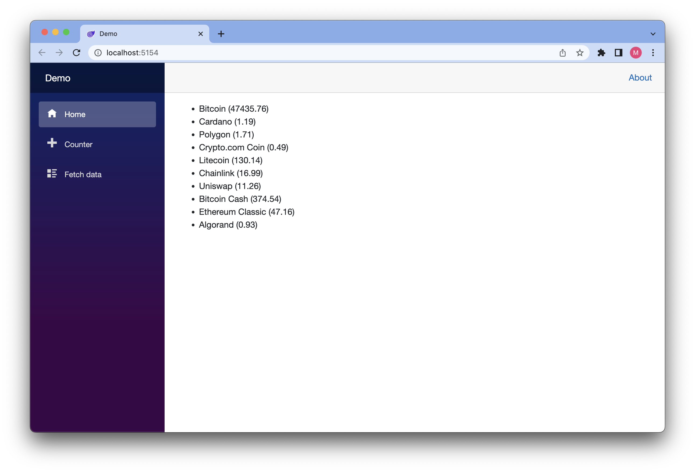

In this tutorial we will walk you through the basics of adding a Strawberry Shake GraphQL client to a Blazor for WebAssembly project. For this example we will create a Blazor for WebAssembly application and fetch some simple data from our demo backend.

<Video videoId="-oq7YEciouM" />

> Strawberry Shake is not limited to Blazor and can be used with any .NET standard compliant library.

In this tutorial, we will teach you:

- How to add the Strawberry Shake CLI tools.
- How to generate source code from .graphql files, that contain operations.
- How to use the generated client to query data.

# Step 1: Add the Strawberry Shake CLI tools

The Strawberry Shake tool will help you to set up your project to create a GraphQL client.

Open your preferred terminal and select a directory where you want to add the code of this tutorial.

1. Create a dotnet tool-manifest.

```bash
dotnet new tool-manifest
```

2. Install the Strawberry Shake tools.

```bash
dotnet tool install StrawberryShake.Tools
```

# Step 2: Create a Blazor WebAssembly project

Next, we will create our Blazor project so that we have a little playground.

1. First, a new solution called `Demo.sln`.

```bash
dotnet new sln -n Demo
```

2. Create a new Blazor for WebAssembly application.

```bash
dotnet new blazorwasm -n Demo
```

3. Add the project to the solution `Demo.sln`.

```bash
dotnet sln add ./Demo
```

# Step 3: Install the required package

Strawberry Shake supports multiple GraphQL transport protocols. In this example we will use the standard GraphQL over HTTP protocol to interact with our GraphQL server. All of this functionality comes packaged with the `StrawberryShake.Blazor` meta package.

1. Add the `StrawberryShake.Blazor` package to your project.

```bash
dotnet add Demo package StrawberryShake.Blazor
```

# Step 4: Add a GraphQL client to your project using the CLI tools

To add a client to your project, you need to run `dotnet graphql init {{ServerUrl}} -n {{ClientName}}`.

In this tutorial we will use our ChilliCream demo project to create a list of crypto currencies that we will add to our Blazor application.

> If you want to have a look at our demo GraphQL server head over [here](https://demo.chillicream.com/graphql).

1. Add the crypto client to your Blazor application.

```bash
dotnet graphql init https://demo.chillicream.com/graphql/ -n CryptoClient -p ./Demo
```

2. Customize the namespace of the generated client to be `Demo.GraphQL`. For this head over to the `.graphqlrc.json` and insert a namespace property to the `StrawberryShake` section.

```json
{
  "schema": "schema.graphql",
  "documents": "**/*.graphql",
  "extensions": {
    "strawberryShake": {
      "name": "CryptoClient",
      "namespace": "Demo.GraphQL",
      "url": "https://demo.chillicream.com/graphql/",
      "records": {
        "inputs": false,
        "entities": false
      },
      "transportProfiles": [
        {
          "default": "Http",
          "subscription": "WebSocket"
        }
      ]
    }
  }
}
```

Now that everything is in place let us write our first query to ask for a list of session titles of the conference API.

3. Choose your favorite IDE and the solution. If your are using VSCode do the following:

```bash
code ./Demo
```

4. Create new query document `GetSessions.graphql` with the following content:

```graphql
query GetAssets {
  assets {
    nodes {
      name
      price {
        lastPrice
      }
    }
  }
}
```

> If you are working with Visual Studio on Windows edit the properties of GetSessions.graphql and set the build action for the GraphQL file to GraphQL compiler.

5. Compile your project.

```bash
dotnet build
```

With the project compiled the strawberry shake generator produced a client but also components that we can use in Blazor.



1. Head over to the `Program.cs` and add the new `CryptoClient` to the dependency injection.

> In some IDEs it is still necessary to reload the project after the code was generated to update the IntelliSense. So, if you have any issues in the next step with IntelliSense just reload the project and everything should be fine.

```csharp
using Microsoft.AspNetCore.Components.Web;
using Microsoft.AspNetCore.Components.WebAssembly.Hosting;
using Demo;

var builder = WebAssemblyHostBuilder.CreateDefault(args);
builder.RootComponents.Add<App>("#app");
builder.RootComponents.Add<HeadOutlet>("head::after");

builder.Services.AddScoped(sp => new HttpClient { BaseAddress = new Uri(builder.HostEnvironment.BaseAddress) });

builder.Services
    .AddCryptoClient()
    .ConfigureHttpClient(client => client.BaseAddress = new Uri("https://demo.chillicream.com/graphql"));

await builder.Build().RunAsync();
```

7. Go to `_Imports.razor` and add `Demo.GraphQL` to the common imports

```csharp
@using System.Net.Http
@using System.Net.Http.Json
@using Microsoft.AspNetCore.Components.Forms
@using Microsoft.AspNetCore.Components.Routing
@using Microsoft.AspNetCore.Components.Web
@using Microsoft.AspNetCore.Components.Web.Virtualization
@using Microsoft.AspNetCore.Components.WebAssembly.Http
@using Microsoft.JSInterop
@using Demo
@using Demo.Shared // (from .NET 8, `Demo.Layout`)
@using Demo.GraphQL
@using Demo.GraphQL.Components
@using StrawberryShake
```

# Step 5: Use the generated Razor component to display the data

In this section we will integrate the Razor component and print a simple list on our index page to display the crypto currencies.

1. Head over to `Pages/Index.razor` (from .NET 8, `Home.razor`).

2. Remove everything from your page but the `@page "/"`

```csharp
@page "/"
```

3. Add the `UseGetAssets` component to your page.

```csharp
@page "/"

<UseGetAssets Context="result">
    <ChildContent>

    </ChildContent>
    <ErrorContent>
        Something went wrong ...<br />
        @result.First().Message
    </ErrorContent>
    <LoadingContent>
        Loading ...
    </LoadingContent>
</UseGetAssets>
```

> The query component allows you to handle the loading and the error state when fetching data. Both states can be handled but do not have to be.

4. With that done let's render the actual content.

```csharp
@page "/"

<UseGetAssets Context="result">
    <ChildContent>
        <ul>
        @foreach (var item in result.Assets!.Nodes!)
        {
            <li>@item.Name (@item.Price.LastPrice)</li>
        }
        </ul>
    </ChildContent>
    <ErrorContent>
        Something went wrong ...<br />
        @result.First().Message
    </ErrorContent>
    <LoadingContent>
        Loading ...
    </LoadingContent>
</UseGetAssets>
```

5. Start the Blazor application with `dotnet watch --project ./Demo` and see if your code works.



Awesome! You have created your first application with Blazor and GraphQL.
