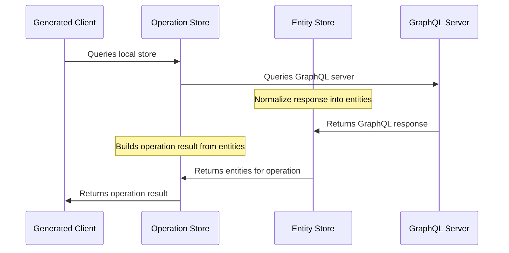

> We are still working on the documentation for Strawberry Shake, so help us by finding typos, missing things, or write some additional docs with us.

StrawberryShake stores the result of GraphQL requests in a normalized entity store. The entity store allows your client to execute GraphQL requests with various strategies to reduce the need for network requests. Moreover, the normalized entities are updated by every request the client does, which means that you can build fully reactive components that change as the state in the store changes.



# Strategies

We support three basic strategies to interact with the store and fetch data.

## Network Only

Network only is the simplest strategy and will fetch from the network and only then update the store. This means that our initial call will always get fresh data and at the same time update other request results watching the same entities.

If we use the reactive APIs in combination with network only we will still get updates whenever other requests fetch data for the entities we are watching.

## Cache First

Cache first is essentially the opposite of network only since it will first fetch from the store, and if the store has the data needed, it will not make any network requests. If the store does not have the data needed, it will go to the network and try to get the data and update the store.

## Cache and Network

The last strategy is a combination of the first two. The client will first try to get the data from the store. This gives us fast data response time if the store already has the data. After that the store will update that data for this request with data from the network which in consequence will trigger our subscription and serve us new data.

## Configuration

The global strategy default can be set on our dependency injection setup method.

```csharp
builder.Services
    .AddConferenceClient(ExecutionStrategy.CacheFirst) // <----
    .ConfigureHttpClient(client => client.BaseAddress = new Uri("http://localhost:5050/graphql"))
    .ConfigureWebSocketClient(client => client.Uri = new Uri("ws://localhost:5050/graphql"));
```

The global strategy default can then be overwritten by any `Watch` method for a particular request.

```csharp
storeSession =
    ConferenceClient
        .GetSessions
        .Watch(ExecutionStrategy.CacheFirst) // <----
        .Where(t => !t.Errors.Any())
        .Select(t => t.Data!.Sessions!.Nodes)
        .Subscribe(result =>
        {
            sessions = result;
            StateHasChanged();
        });
```
